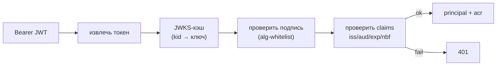
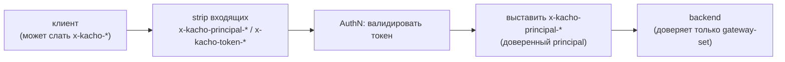

# Аутентификация

Эта страница описывает, как гейтвей устанавливает **кто** шлёт запрос (AuthN), прежде чем решать
**что** ему разрешено ([Авторизация](/architecture/authz)). Аутентификация выполняется на каждом
запросе обоих транспортов (REST и gRPC); результат — доверенный `principal`, проброшенный в
backend. Ключи конфигурации — [Конфигурация](/install/configuration).

## Принцип

AuthN — первый гейт периметра. Гейтвей принимает несколько типов удостоверений, но правило одно:
удостоверение либо валидно (и даёт конкретного principal), либо запрос отклоняется. **Невалидный
токен никогда не понижается до anonymous** — это `401`. В `production-strict` анонимный доступ
запрещён полностью.

## Способы аутентификации

<table>
  <thead><tr><th>Способ</th><th>Кто применяет</th><th>Как проверяется</th></tr></thead>
  <tbody>
    <tr><td><strong>Bearer-JWT (Hydra)</strong></td><td>Программные клиенты, SDK</td><td>Подпись RS256 / ES256 / EdDSA по <strong>JWKS</strong> Ory Hydra (alg-whitelist, ротация по <code>kid</code>); проверка <code>iss</code> / <code>aud</code> / <code>exp</code> / <code>nbf</code></td></tr>
    <tr><td><strong>DPoP-bound JWT</strong></td><td>Sender-constrained клиенты (RFC 9449)</td><td>JWT + DPoP-proof: сверка <code>jkt</code>-thumbprint c <code>cnf</code>, <code>htm</code> / <code>htu</code> (метод+URL), <code>iat</code>-freshness, anti-replay по <code>jti</code></td></tr>
    <tr><td><strong>mTLS-bound JWT</strong></td><td>Клиенты с client-cert</td><td>Токен привязан к сертификату через <code>cnf.x5t#S256</code> (thumbprint предъявленного cert)</td></tr>
    <tr><td><strong>Session-cookie (Kratos)</strong></td><td>SPA (kacho-ui)</td><td>Валидация сессии Ory Kratos через whoami; истёкшая сессия → <code>401</code></td></tr>
    <tr><td><strong>HMAC-JWT (dev)</strong></td><td>Локальная разработка / probe</td><td>Подпись HMAC dev-секретом (<code>AUTHN&#95;DEV&#95;SECRET</code>); только в режиме <code>dev</code></td></tr>
  </tbody>
</table>

## Проверка JWT (Hydra + JWKS)

Bearer-JWT проверяется по публичным ключам issuer'а (Ory Hydra):

1. **Извлечение** токена из `Authorization: Bearer <jwt>`.
2. **JWKS** — публичные ключи тянутся с `KACHO_HYDRA_JWKS_URL` и кэшируются (TTL
   `KACHO_JWKS_CACHE_TTL_SECONDS`, дефолт 300 с); ключ выбирается по `kid`, поддерживается
   ротация.
3. **Подпись** проверяется только против **whitelist алгоритмов** (RS256 / ES256 / EdDSA) —
   `alg: none` и симметричные подделки отвергаются.
4. **Claims**: `iss` (== `KACHO_HYDRA_ISSUER`), `aud`, `exp`, `nbf` — просроченный / not-yet-valid
   → `401`.
5. Опциональная **интроспекция** (`KACHO_HYDRA_INTROSPECTION_URL`) — для проверки отзыва; результат
   кэшируется коротким TTL (дефолт 5 с).

## DPoP — sender-constrained токены

DPoP (RFC 9449) привязывает токен к ключу клиента: помимо `Authorization: Bearer` клиент шлёт
заголовок `DPoP` с подписанным proof. Гейтвей проверяет:

- **`jkt`-thumbprint** proof-ключа совпадает с `cnf.jkt` в токене (владение ключом);
- **`htm` / `htu`** в proof — HTTP-метод и URL текущего запроса;
- **`iat`-freshness** — proof выпущен в допустимом окне (`KACHO_DPOP_IAT_FRESHNESS_SECONDS`,
  дефолт 60 с);
- **anti-replay** — `jti` proof не встречался ранее (LRU-кэш `KACHO_DPOP_REPLAY_CACHE_SIZE` с TTL
  `KACHO_DPOP_REPLAY_CACHE_TTL_SECONDS` ≥ 2× окна свежести).

mTLS-bound вариант привязывает токен к клиентскому сертификату через `cnf.x5t#S256`. DPoP
включается флагом `KACHO_API_GATEWAY_AUTHN_ENABLE_DPOP`.

:::note Парсер proof — под fuzzing
Разбор DPoP-proof и REST-роутинг покрыты continuous-fuzzing (ночной CI) — это парсеры на границе
доверия, поэтому устойчивость к некорректному вводу проверяется отдельно.
:::

## Проброс identity — anti-spoofing

После валидной аутентификации гейтвей выставляет заголовки `x-kacho-principal-*` и прокидывает их
в backend (REST → gRPC-metadata). **Любые клиентские** `x-kacho-principal-*` / `x-kacho-token-*`
на входе **стрипаются** до аутентификации — клиент не может подделать identity, подставив
заголовок. Backend доверяет только тем `x-kacho-*`, что выставил гейтвей.

## Режимы AuthN

<table>
  <thead><tr><th><code>KACHO&#95;API&#95;GATEWAY&#95;AUTHN&#95;MODE</code></th><th>Поведение</th></tr></thead>
  <tbody>
    <tr><td><code>dev</code></td><td>Back-compat: принимает HMAC-JWT (dev-секрет); отсутствие Bearer → anonymous. Только для локальных стендов</td></tr>
    <tr><td><code>production</code></td><td>Полная проверка Hydra-JWT / DPoP / Kratos-сессии; невалидный токен → 401</td></tr>
    <tr><td><code>production-strict</code></td><td>То же + анонимный доступ запрещён полностью (fail-closed на отсутствие удостоверения)</td></tr>
  </tbody>
</table>

В production-окружении (`KACHO_APP_ENV=production`) неproduction-режим AuthN — причина отказа
старта (secure-by-default). Дальше принятый principal идёт в [авторизацию](/architecture/authz),
где вычисляется решение allow/deny и, при необходимости, step-up по `acr`.
