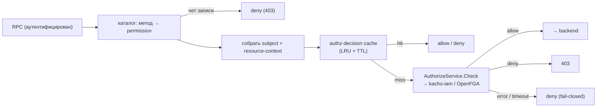

# Авторизация

Эта страница описывает, как гейтвей решает **что** аутентифицированному principal разрешено
(AuthZ), после того как [аутентификация](/architecture/authn) установила **кто** он. Авторизация —
per-RPC, deny-by-default, fail-closed: каждый вызов проверяется в `kacho-iam` (OpenFGA / ReBAC)
против встроенного permission-каталога. Ключи конфигурации — [Конфигурация](/install/configuration).

## Принцип

Гейтвей — единый пункт применения политики (PEP): он не хранит правила, а спрашивает решение у
`kacho-iam` (PDP), который держит ReBAC-модель в OpenFGA. Для каждого RPC гейтвей знает, **какое
разрешение** требуется (из permission-каталога), формирует subject + контекст ресурса и зовёт
`AuthorizeService.Check`. Нет записи в каталоге → deny. Ошибка/недоступность IAM → deny
(fail-closed). Разрешение приходит только на явный `allow`.

## Permission-каталог

Каждому публичному RPC сопоставлено требуемое разрешение. Каталог **встроен** в гейтвей и
**генерируется из proto**: каждый метод в `kacho-proto` несёт аннотацию
`kacho.iam.authz.v1.permission`, а генератор `cmd/protoc-gen-kacho-permissions` собирает из них
таблицу «метод → permission». Так контракт авторизации не расходится с контрактом API: добавили
RPC с аннотацией — он попал в каталог; забыли аннотацию — метод не авторизуется и отклоняется
(deny-by-default), а не «проскакивает».

<table>
  <thead><tr><th>Значение аннотации</th><th>Смысл</th></tr></thead>
  <tbody>
    <tr><td><code>&lt;permission&gt;</code></td><td>Требуемое разрешение (напр. на чтение/мутацию ресурса); проверяется через <code>Check</code></td></tr>
    <tr><td><code>&lt;exempt&gt;</code></td><td>Метод освобождён от per-request authz (напр. cluster-internal сервис на mTLS-listener, где subject-level authz неприменим)</td></tr>
  </tbody>
</table>

:::warning Промах по каталогу = deny
Если для маршрутизируемого метода нет записи в каталоге, гейтвей **отклоняет** запрос, а не
пропускает его. Каталог — allowlist разрешений: неизвестное не авторизуется.
:::

## Путь проверки

1. **Каталог** даёт требуемое разрешение для метода (нет записи → deny).
2. **Subject + контекст** — principal из AuthN + идентификаторы ресурса (project/id) из запроса.
3. **Кэш решений** (`AUTHZ_CACHE_TTL_SECONDS`, `AUTHZ_CACHE_MAX_ENTRIES`) — hit возвращается без
   похода в IAM; miss → `Check`.
4. **Check** зовёт `kacho-iam` (таймаут `AUTHZ_CHECK_TIMEOUT_MS`, дефолт 200 мс). `allow` →
   backend; `deny` → `403`; ошибка/таймаут → **deny** (fail-closed).

## Step-up: уровень аутентификации (acr)

Чувствительные операции требуют повышенного уровня аутентификации. AuthN проставляет `acr`
(authentication context class) в principal; step-up-гейт сверяет фактический `acr` с требуемым для
операции. Недостаточный уровень → отказ с указанием необходимого шага (клиент должен пере-
аутентифицироваться сильнее). Это ортогонально ReBAC-решению: даже при наличии права операция
блокируется, пока не выполнен нужный `acr`.

## Fail-closed и fail-open

По умолчанию авторизация **fail-closed**: ошибка каталога, ошибка `Check` или недоступность IAM →
deny. Флаг `KACHO_API_GATEWAY_AUTHZ_FAIL_OPEN` существует только для узких dev-сценариев и
**запрещён в production**: при `KACHO_APP_ENV=production` fail-open (как и полностью выключенный
`AUTHZ_ENABLED=false`) — причина отказа старта (secure-by-default, стартовый гейт).

<table>
  <thead><tr><th>Ключ</th><th>Дефолт</th><th>Назначение</th></tr></thead>
  <tbody>
    <tr><td><code>KACHO&#95;API&#95;GATEWAY&#95;AUTHZ&#95;ENABLED</code></td><td><code>false</code></td><td>Per-RPC authz-middleware (в production обязан быть <code>true</code>)</td></tr>
    <tr><td><code>KACHO&#95;API&#95;GATEWAY&#95;AUTHZ&#95;FAIL&#95;OPEN</code></td><td><code>false</code></td><td>Разрешать при ошибке Check (запрещён в production)</td></tr>
    <tr><td><code>KACHO&#95;API&#95;GATEWAY&#95;AUTHZ&#95;CACHE&#95;TTL&#95;SECONDS</code></td><td><code>5</code></td><td>TTL кэша решений</td></tr>
    <tr><td><code>KACHO&#95;API&#95;GATEWAY&#95;AUTHZ&#95;CACHE&#95;MAX&#95;ENTRIES</code></td><td><code>10000</code></td><td>Размер кэша решений (LRU)</td></tr>
    <tr><td><code>KACHO&#95;API&#95;GATEWAY&#95;AUTHZ&#95;CHECK&#95;TIMEOUT&#95;MS</code></td><td><code>200</code></td><td>Таймаут вызова <code>Check</code> (истёк → deny)</td></tr>
  </tbody>
</table>

## Инвалидация кэша решений

Решения `Check` кэшируются, поэтому отзыв прав должен быстро сходиться. Кэш инвалидируется двумя
путями:

- **push (быстрый)** — `kacho-iam` при отзыве зовёт `InternalAuthzCacheService.InvalidateSubject`
  на cluster-internal listener гейтвея; ≥ 1 реплика сходится `< 1 с`. См.
  [Internal Authz Cache](/architecture/internal-cache).
- **poll-watcher (safety-net)** — фоновый цикл (`KACHO_API_GATEWAY_SUBJECT_CHANGE_POLL_INTERVAL`)
  дотягивает все HA-реплики `≤ 30 с`.
- **TTL-backstop** — записи всё равно истекают по TTL.

## Клиентский XFF-контекст

Для контекстных политик гейтвей может доверять `X-Forwarded-For`
(`KACHO_API_GATEWAY_AUTHZ_TRUSTED_XFF`, дефолт `true`) с ограничением на число доверенных прокси
(`KACHO_API_GATEWAY_AUTHZ_TRUSTED_PROXY_COUNT`, дефолт 1) — чтобы клиент не подменил исходный IP
лишними заголовками. Итоговое решение — на [странице маршрутизации](/architecture/routing)
запрос уже отфильтрован по public-vs-internal, а здесь — по праву subject на конкретный метод и
ресурс.
