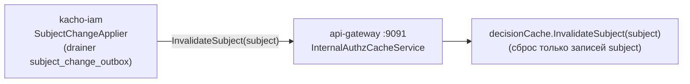

# Internal Authz Cache — push-инвалидация решений

Эта страница описывает единственный **native** gRPC-сервис гейтвея — `InternalAuthzCacheService`
на cluster-internal listener (`:9091`), — и его модель доверия. Он существует, чтобы отзыв прав
сходился быстро (`< 1 с`) вместо ожидания poll-цикла (`~30 с`). Контракт RPC — на странице
[Internal Authz Cache (API)](/api/internal-authz-cache).

## Зачем он нужен

Гейтвей кэширует решения `AuthorizeService.Check` (LRU + TTL), чтобы не ходить в IAM на каждый
запрос. Обратная сторона — при **отзыве** прав закэшированный `allow` живёт до истечения TTL.
Push-инвалидация закрывает это окно: как только `kacho-iam` применяет изменение subject (отзыв
binding, удаление из группы, revoke JIT/breakglass), он **точечно** сбрасывает записи кэша именно
этого subject.

- **Caller** — `kacho-iam` `SubjectChangeApplier` (applier push-drainer'а таблицы
  `subject_change_outbox`), по одному вызову на дренированную строку.
- **Callee** — гейтвей на internal mTLS-listener `:9091` (не на внешнем endpoint).
- **Эффект** — сброс только записей, привязанных к изменившемуся subject (не whole-cache flush).
  Poll-цикл остаётся safety-net'ом на `≤ 30 с`.

## Обещание по сходимости

<table>
  <thead><tr><th>Путь</th><th>Сходимость</th></tr></thead>
  <tbody>
    <tr><td>Push (этот RPC), ≥ 1 реплика</td><td><code>&lt; 1 с</code> на commit отзыва</td></tr>
    <tr><td>Poll-watcher (safety-net), все HA-реплики</td><td><code>≤ 30 с</code></td></tr>
    <tr><td>TTL-backstop</td><td>по истечении TTL записи</td></tr>
  </tbody>
</table>

Fanout push'а на **все** реплики за `< 1 с` — вне области: гарантируется хотя бы одна реплика
быстро, остальные — poll-циклом.

## Модель доверия — by-design с сетевой митигацией

Listener `:9091` **не** несёт mTLS/authz-интерсепторов и полагается на сетевую изоляцию
(`ClusterIP`-Service + NetworkPolicy: dial только от pod'а `kacho-iam`). Это осознанный trade-off,
а не упущение:

- **Blast radius — fail-safe.** Единственный экспонированный RPC только *сбрасывает* записи
  positive-кэша. Он не читает и не меняет tenant-данные и не может повысить привилегии: следующий
  запрос всё равно перепроверяется в IAM.
- **Худшее злоупотребление** при латеральном доступе к `:9091` — повторный сброс кэша (нагрузка на
  IAM-проверки), то есть локальный DoS, а не утечка или эскалация.

:::warning Остаточный риск и путь усиления
Defense-in-depth-инвариант платформы требует mTLS + authz на каждом listener'е; здесь он закрыт
сетевым уровнем, но не транспортным. Усиление — mTLS `RequireAndVerifyClientCert` на `:9091` +
предъявление клиентского сертификата drainer'ом iam — это кросс-сервисное изменение (planned
hardening). Включение mTLS без согласованного обновления iam сломает путь push-инвалидации
(останется корректный, но более медленный poll-fallback).
:::

## Конфигурация listener'а

<table>
  <thead><tr><th>Переменная</th><th>Дефолт</th><th>Назначение</th></tr></thead>
  <tbody>
    <tr><td><code>KACHO&#95;API&#95;GATEWAY&#95;INTERNAL&#95;GRPC&#95;ADDR</code></td><td><code>:9091</code></td><td>Адрес internal gRPC-listener'а</td></tr>
    <tr><td><code>KACHO&#95;API&#95;GATEWAY&#95;INTERNAL&#95;GRPC&#95;MTLS&#95;ENABLE</code></td><td><code>false</code></td><td>Включить mTLS на internal listener (планируемое усиление)</td></tr>
    <tr><td><code>KACHO&#95;API&#95;GATEWAY&#95;INTERNAL&#95;GRPC&#95;ALLOWED&#95;SPIFFE</code></td><td><em>(пусто)</em></td><td>Allowlist SPIFFE-SAN клиентских сертификатов (при включённом mTLS)</td></tr>
    <tr><td><code>KACHO&#95;API&#95;GATEWAY&#95;INTERNAL&#95;GRPC&#95;REFLECTION</code></td><td><code>false</code></td><td>gRPC reflection на internal listener (только для incident-debug)</td></tr>
  </tbody>
</table>

## Идемпотентность

`InvalidateSubject` идемпотентен: subject без записей в кэше возвращает `NotFound`, который
drainer в iam маппит в «уже применено» — строка outbox помечается отправленной и не ретраится.
Число затронутых записей отдаётся не в ответе (он пустой — `google.protobuf.Empty`), а метрикой
`apigw.authz.cache.invalidate.entries`. Полный контракт запроса — на странице
[Internal Authz Cache (API)](/api/internal-authz-cache).
