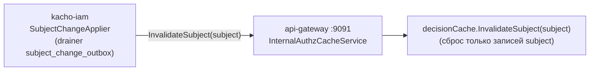

# Internal Authz Cache — push-инвалидация решений

Эта страница описывает единственный **native** gRPC-сервис гейтвея — `InternalAuthzCacheService`
на cluster-internal listener (`:9091`), — и его модель доверия. Он существует, чтобы отзыв прав
сходился быстро (`< 1 с`) вместо ожидания poll-цикла (`~30 с`). Контракт RPC — на странице
[Internal Authz Cache (API)](/api/internal-authz-cache).

## Зачем он нужен

Гейтвей кэширует решения `AuthorizeService.Check` (LRU + TTL), чтобы не ходить в IAM на каждый
запрос. Обратная сторона — при **отзыве** прав закэшированный `allow` живёт до истечения TTL.
Push-инвалидация закрывает это окно: как только `kacho-iam` применяет изменение subject (отзыв
binding, удаление из группы, revoke JIT/breakglass), он **точечно** сбрасывает записи кэша именно
этого subject.

```mermaid
flowchart LR
  iam["kacho-iam<br/>SubjectChangeApplier<br/>(drainer subject_change_outbox)"] -->|"InvalidateSubject(subject)"| agw["api-gateway :9091<br/>InternalAuthzCacheService"]
  agw --> cache["decisionCache.InvalidateSubject(subject)<br/>(сброс только записей subject)"]
```

- **Caller** — `kacho-iam` `SubjectChangeApplier` (applier push-drainer'а таблицы
  `subject_change_outbox`), по одному вызову на дренированную строку.
- **Callee** — гейтвей на internal mTLS-listener `:9091` (не на внешнем endpoint).
- **Эффект** — сброс только записей, привязанных к изменившемуся subject (не whole-cache flush).
  Poll-цикл остаётся safety-net'ом на `≤ 30 с`.

## Обещание по сходимости

<table>
  <thead><tr><th>Путь</th><th>Сходимость</th></tr></thead>
  <tbody>
    <tr><td>Push (этот RPC), ≥ 1 реплика</td><td><code>&lt; 1 с</code> на commit отзыва</td></tr>
    <tr><td>Poll-watcher (safety-net), все HA-реплики</td><td><code>≤ 30 с</code></td></tr>
    <tr><td>TTL-backstop</td><td>по истечении TTL записи</td></tr>
  </tbody>
</table>

Fanout push'а на **все** реплики за `< 1 с` — вне области: гарантируется хотя бы одна реплика
быстро, остальные — poll-циклом.

## Модель доверия — mTLS плюс allow-list вызывающих

Внутренний периметр **не считается доверенным**: инвариант платформы требует AuthN и AuthZ на
каждом listener'е, и `:9091` не освобождён. Посадка собирается из двух слоёв:

- **Транспорт (AuthN)** — mTLS `RequireAndVerifyClientCert` против внутреннего CA. Пир без
  сертификата, выписанного этим CA, до RPC не доходит.
- **Решение (AuthZ)** — per-RPC интерсептор сверяет **SPIFFE-SAN проверенного клиентского
  сертификата** с allow-list законных вызывающих (идентичность push-drainer'а `kacho-iam`).
  Проверенный, но не входящий в список модуль отвергается — защита от confused deputy.

Оба слоя обязательны вместе. mTLS доказывает лишь, что пир предъявил *какой-то* сертификат нашего
CA; сужение до конкретных отправителей делает именно allow-list, поэтому **пустой список
недопустим**: он означал бы «не сужаем», а не «запрещаем».

Сборка посадки **fail-fast**: включённый listener без серверного сертификата/ключа, без CA или с
пустым allow-list прерывает старт — процесс не поднимается «наполовину защищённым». Небезопасная
посадка (mTLS выключен) остаётся только для локальной разработки, и **production boot-guard
отказывает в старте**, если её увидел в production-классе окружения.

:::note Server-reflection следует посадке, а не отдельной ручке
Схема сервисов (`grpcurl` и подобное) отдаётся **только** на этом listener'е и **только** при
включённом mTLS: тогда и стрим reflection проходит через тот же allow-list. Внешний сервер
reflection не регистрирует вовсе. Отдельной ручки нет намеренно — переключатель, чьё безопасное
значение всегда совпадает с посадкой, либо избыточен, либо однажды будет выставлен так, что
откроет перечисление схемы на порту, который никого не авторизует.
:::

**Blast radius.** Единственный RPC только *сбрасывает* записи positive-кэша: он не читает и не
меняет tenant-данные и не повышает привилегии — следующий запрос всё равно перепроверяется в IAM.
Это ограничивает последствия, но не заменяет гейт: сетевые политики есть не везде, а TLS-слой имён
не сверяет.

## Конфигурация listener'а

<table>
  <thead><tr><th>Переменная</th><th>Дефолт</th><th>Назначение</th></tr></thead>
  <tbody>
    <tr><td><code>KACHO&#95;API&#95;GATEWAY&#95;INTERNAL&#95;GRPC&#95;ADDR</code></td><td><code>:9091</code></td><td>Адрес internal gRPC-listener'а</td></tr>
    <tr><td><code>KACHO&#95;API&#95;GATEWAY&#95;INTERNAL&#95;GRPC&#95;MTLS&#95;ENABLE</code></td><td><code>false</code></td><td>mTLS + allow-list на internal listener. Дефолт рассчитан на локальную разработку; в production boot-guard требует <code>true</code> и отказывает в старте иначе</td></tr>
    <tr><td><code>KACHO&#95;API&#95;GATEWAY&#95;INTERNAL&#95;GRPC&#95;TLS&#95;CERT&#95;FILE</code> / <code>&#95;KEY&#95;FILE</code></td><td><em>(пусто)</em></td><td>Серверный сертификат и ключ listener'а. При включённом mTLS обязательны — иначе старт прерывается</td></tr>
    <tr><td><code>KACHO&#95;API&#95;GATEWAY&#95;MTLS&#95;CA&#95;FILE</code></td><td><em>(пусто)</em></td><td>Внутренний CA, которым проверяются клиентские сертификаты</td></tr>
    <tr><td><code>KACHO&#95;API&#95;GATEWAY&#95;INTERNAL&#95;GRPC&#95;ALLOWED&#95;SPIFFE</code></td><td><em>(пусто)</em></td><td>Allow-list SPIFFE-SAN законных вызывающих (обычно единственная идентичность push-drainer'а iam). При включённом mTLS <strong>непустой обязателен</strong> — пустой список не сужает никого</td></tr>
  </tbody>
</table>

Отдельной переменной для server-reflection **нет**: она следует
`INTERNAL&#95;GRPC&#95;MTLS&#95;ENABLE` напрямую (см. выше).

## Идемпотентность

`InvalidateSubject` идемпотентен: subject без записей в кэше возвращает `NotFound`, который
drainer в iam маппит в «уже применено» — строка outbox помечается отправленной и не ретраится.
Число затронутых записей отдаётся не в ответе (он пустой — `google.protobuf.Empty`), а метрикой
`apigw.authz.cache.invalidate.entries`. Полный контракт запроса — на странице
[Internal Authz Cache (API)](/api/internal-authz-cache).
