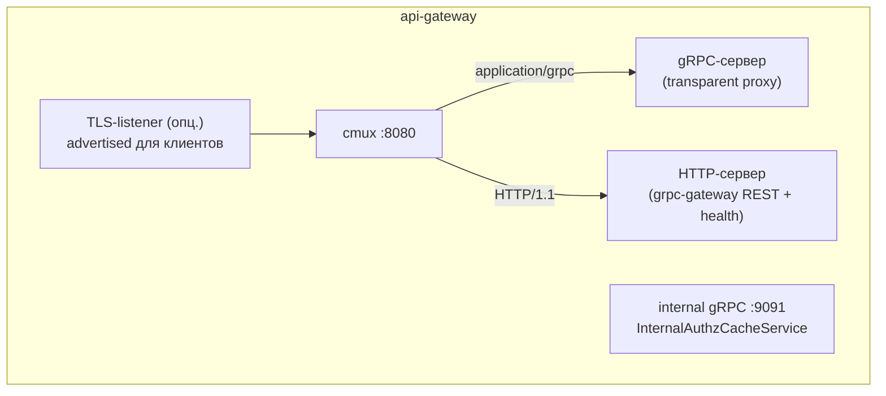
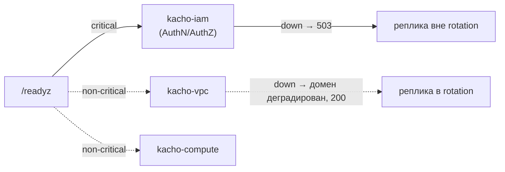

# Архитектура

Эта страница описывает внутреннее устройство Kachō API Gateway: два (опц. три) listener'а и
`cmux`-мультиплексирование, цепочку middleware, транспарентное проксирование в домены,
ограниченные кэши безопасности и модель readiness. Отдельные аспекты вынесены на страницы
[Аутентификация](/architecture/authn), [Авторизация](/architecture/authz),
[Маршрутизация](/architecture/routing) и [Internal Authz Cache](/architecture/internal-cache).
Внешний контракт — на [страницах API](/api/overview).

## Слои и composition root

Гейтвей следует чистой архитектуре: транспорт (listeners, mux, middleware) отделён от прокси-логики
и клиентов к доменам, единственное место wiring — composition root `cmd/api-gateway`.

<table>
  <thead><tr><th>Пакет</th><th>Ответственность</th></tr></thead>
  <tbody>
    <tr><td><code>cmd/api-gateway</code></td><td>Composition root: поднятие всех listener'ов и сборка middleware-цепочки</td></tr>
    <tr><td><code>internal/middleware</code></td><td>AuthN (JWT / DPoP / mTLS / Kratos), AuthZ, кэши, OIDC, idempotency</td></tr>
    <tr><td><code>internal/proxy</code></td><td>gRPC transparent-proxy: <code>Resolver</code> + allowlist-routing</td></tr>
    <tr><td><code>internal/restmux</code></td><td>grpc-gateway REST (split-mux: public + internal)</td></tr>
    <tr><td><code>internal/opsproxy</code></td><td><code>OperationService</code> fan-out по prefix id</td></tr>
    <tr><td><code>internal/allowlist</code></td><td>Deny-by-default список публичных RPC</td></tr>
    <tr><td><code>internal/clients</code></td><td>gRPC-клиенты к kacho-iam (authorize / subject / revocations)</td></tr>
    <tr><td><code>internal/&#123;health,watcher,cache,config,listenerorigin,handler&#125;</code></td><td>Health/readiness, poll-watcher инвалидации, LRU-кэши, конфиг, метка origin listener'а</td></tr>
  </tbody>
</table>

Переиспользуемое (gRPC-клиент, config, observability, ids) приходит из `kacho-corelib` — не
дублируется в сервисе.

## Listener'ы и мультиплексирование

На основном порту (`:8080`) работает `cmux`: соединения с `Content-Type: application/grpc` уходят
на gRPC-сервер, остальные — на HTTP-сервер (grpc-gateway REST + `/healthz` / `/readyz`).
Опционально поднимается внешний **TLS-listener** (advertised для клиентов) — за ним тот же
`cmux`-раскол. Отдельный **cluster-internal gRPC-listener** (`:9091`) обслуживает
`InternalAuthzCacheService` (см. [Internal Authz Cache](/architecture/internal-cache)).



Тот же `http.Server` обслуживает и cluster-internal, и внешний TLS-listener; соединения,
принятые на внешнем listener'е, помечаются (`listenerorigin`), чтобы REST-диспетчер и authz-слой
могли отклонять `Internal*`-пути, пришедшие с периметра.

## Цепочка middleware

REST-запрос проходит цепочку интерсепторов (снаружи внутрь):

```
RequestID → Recovery → AuthN(dev-HMAC / Kratos) → DPoP/JWT(Hydra) →
AuthZ(per-RPC Check) → AccessLog → Idempotency → REST-mux → backend
```

- **AuthN** валидирует токен/сессию и выставляет `x-kacho-principal-*`. Любые клиентские
  `x-kacho-principal-*` / `x-kacho-token-*` на входе **стрипаются** — identity нельзя подделать
  заголовком. Невалидный токен → `401` (никогда не понижается до anonymous).
- **DPoP** проверяет sender-constrained токены (jkt-thumbprint, htm/htu, iat-freshness,
  jti-replay с ограниченным LRU) и mTLS-bound (`cnf.x5t#S256`), затем step-up по `acr`.
- **AuthZ** строит subject + context и зовёт `AuthorizeService.Check` (OpenFGA) по встроенному
  permission-каталогу. Промах по каталогу → deny; ошибка IAM → deny (fail-closed).

gRPC-путь применяет аналогичные интерсепторы; identity прокидывается в backend через
gRPC-metadata. Подробнее — [Аутентификация](/architecture/authn) и
[Авторизация](/architecture/authz).

## Маршрутизация и public-vs-internal

gRPC-трафик идёт через transparent-proxy: `Resolver` парсит `kacho.cloud.<domain>.v1.*`,
сверяется с allowlist и возвращает нужный backend. Deny-by-default: неизвестный метод и любой
`*InternalService.*` (по `HasInternalSuffix`) не маршрутизируются — выглядят как несуществующие.
REST построен на split-mux: один набор handler'ов на двух grpc-gateway `ServeMux` (различие
только в JSON-маршалинге public-vs-internal); диспетчер по пути выбирает mux и `404`-ит
`Internal*`-пути, пришедшие на внешний listener. Детали — [Маршрутизация](/architecture/routing).

## Operations

Мутации доменов асинхронны и возвращают `Operation`. `OperationService.Get/Cancel` обслуживается
in-process (`internal/opsproxy`): по 3-символьному prefix id операция направляется во владеющий
backend. Watch-RPC нет — клиент поллит. Подробнее — [Operations](/api/operations).

## Кэши безопасности

Все security-кэши ограничены по размеру (LRU) и TTL — это исключает рост памяти и делает
stale-доступ ограниченным во времени.

<table>
  <thead><tr><th>Кэш</th><th>Что кэширует</th><th>Ограничение</th></tr></thead>
  <tbody>
    <tr><td>JWKS</td><td>Публичные ключи Hydra для проверки подписи JWT</td><td>TTL (<code>KACHO&#95;JWKS&#95;CACHE&#95;TTL&#95;SECONDS</code>, дефолт 300 с)</td></tr>
    <tr><td>Introspection</td><td>Результат OAuth2-интроспекции токена</td><td>TTL + размер (дефолт 5 с / 10000)</td></tr>
    <tr><td>DPoP-replay</td><td><code>jti</code> уже виденных proof (anti-replay)</td><td>LRU + TTL ≥ 2× окна свежести proof</td></tr>
    <tr><td>Authz-decision</td><td>Решения <code>Check</code> (allow/deny)</td><td>TTL + размер + инвалидация по subject (push + poll-watcher)</td></tr>
    <tr><td>Subject-cache</td><td>Резолв subject/identity</td><td>Ограничен по размеру</td></tr>
    <tr><td>Idempotency-store</td><td>Ответы по idempotency-key</td><td>Ограничен; ключ привязан к principal + метод + путь</td></tr>
  </tbody>
</table>

Authz-decision-кэш инвалидируется двумя путями: push (per-subject через
[Internal Authz Cache](/architecture/internal-cache), сходимость `< 1 с`) и poll-watcher
(safety-net `≤ 30 с`) — плюс TTL-backstop.

## Готовность (readiness)

`/healthz` — liveness, всегда `200`. `/readyz` опрашивает backends и возвращает `503` **только**
при недоступности **критичного** backend (`iam` — он фронтит AuthN/AuthZ на каждом запросе).
Недоступность некритичного backend (vpc / compute / geo / nlb / registry) деградирует один домен,
но не выводит всю реплику из rotation — так одно-доменный сбой не амплифицируется в полный отказ
edge.



## Secure-by-default

В production-окружении (`KACHO_APP_ENV=production`) гейтвей **отказывается стартовать** при
authz-disabled / fail-open / неproduction-режиме authN, а также при незащищённом internal
listener без mTLS. Это стартовый гейт (CWE-1188): безопасная конфигурация — условие запуска, а не
опция. Ключи — [Конфигурация](/install/configuration).
