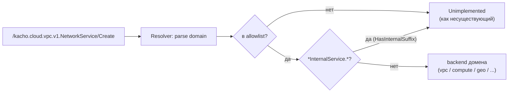
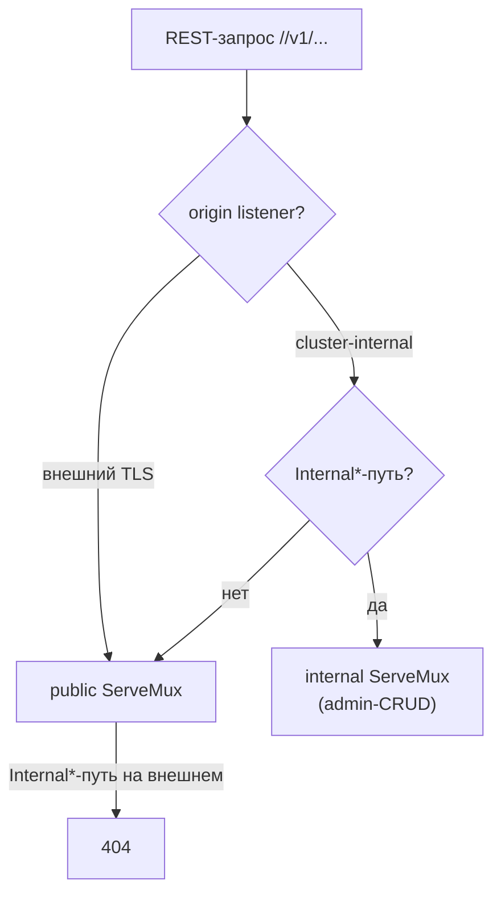

# Маршрутизация и public-vs-internal

Эта страница описывает, как гейтвей направляет аутентифицированный и авторизованный запрос в
нужный доменный backend и как он изолирует admin-поверхность (`Internal*`) от внешнего периметра.
Маршрутизация — deny-by-default: маршрутизируется только то, что явно в allowlist.

## gRPC transparent-proxy

Гейтвей не знает про конкретные ресурсы доменов — он транслирует gRPC прозрачно. `Resolver`
(`internal/proxy`) разбирает полный метод `/kacho.cloud.<domain>.v1.<Service>/<Method>`, извлекает
domain, сверяется с allowlist и возвращает адрес backend этого домена.

<table>
  <thead><tr><th>Правило</th><th>Поведение</th></tr></thead>
  <tbody>
    <tr><td>Метод в <code>internal/allowlist</code></td><td>Маршрутизируется в backend домена</td></tr>
    <tr><td>Метод не в allowlist</td><td>Не маршрутизируется — выглядит как несуществующий (deny-by-default)</td></tr>
    <tr><td>Метод <code>&#42;InternalService.&#42;</code> (<code>HasInternalSuffix</code>)</td><td><strong>Никогда</strong> не попадает в allowlist; блокируется явно</td></tr>
  </tbody>
</table>

Allowlist активен для доменов: `iam`, `vpc`, `compute`, `geo`, `loadbalancer`, `registry` и
`operation`. Каждый публичный RPC добавляется в него явно — это единственный источник истины по
публичной gRPC-поверхности (`internal/allowlist/list.go`).

## REST split-mux

REST построен на grpc-gateway с **двумя** `ServeMux`: public и internal. Один набор handler'ов
регистрируется в оба mux (различие — только в JSON-маршалинге). Диспетчер по пути выбирает mux, а
`Internal*`-пути, пришедшие на внешний listener, отдаёт `404`.

Соединения помечаются `listenerorigin` при приёме: REST-диспетчер и authz-слой знают, пришёл ли
запрос с внешнего периметра, и на этом основании отклоняют admin-пути.

## Public vs cluster-internal — граница

Разделение поверхностей — ключевой security-инвариант платформы (ban #6). Admin-функции
(`Internal*`-сервисы) недоступны с внешнего endpoint ни по gRPC, ни по REST.

<table>
  <thead><tr><th>Поверхность</th><th>Где</th><th>Что доступно</th></tr></thead>
  <tbody>
    <tr><td><strong>Public</strong></td><td>Внешний TLS-listener (advertised)</td><td>Публичные RPC доменов из allowlist; REST public-mux</td></tr>
    <tr><td><strong>Cluster-internal</strong></td><td>Internal listener (UI / admin-tooling / port-forward)</td><td>Публичные RPC + <code>Internal&#42;</code>-сервисы (admin-CRUD Region/Zone, AddressPool, internal-проекции)</td></tr>
  </tbody>
</table>

:::note Регистрация admin-RPC
Новый admin-RPC, которого нет в публичном API ресурса, регистрируется **только** в
`Internal*`-сервисе (backend на :9091) и в internal-блоке `internal/restmux/mux.go` — так он не
попадает в allowlist и не светится на внешнем endpoint. Публичные сервисы под admin-нужды не
расширяются.
:::

## Backend-адреса доменов

Каждый домен имеет **два** адреса: публичный (`:9090`) и internal (`:9091`). Публичные вызовы идут
на первый, admin-CRUD — на второй. Адреса задаются переменными
`KACHO_API_GATEWAY_<DOMAIN>_GRPC` / `_<DOMAIN>_INTERNAL_GRPC` (см.
[Конфигурация](/install/configuration)).

<table>
  <thead><tr><th>Домен</th><th>Public backend (env)</th><th>Internal backend (env)</th></tr></thead>
  <tbody>
    <tr><td>iam</td><td><code>IAM&#95;GRPC</code></td><td><code>IAM&#95;INTERNAL&#95;GRPC</code></td></tr>
    <tr><td>vpc</td><td><code>VPC&#95;GRPC</code></td><td><code>VPC&#95;INTERNAL&#95;GRPC</code></td></tr>
    <tr><td>compute</td><td><code>COMPUTE&#95;GRPC</code></td><td><code>COMPUTE&#95;INTERNAL&#95;GRPC</code></td></tr>
    <tr><td>geo</td><td><code>GEO&#95;GRPC</code></td><td><code>GEO&#95;INTERNAL&#95;GRPC</code></td></tr>
    <tr><td>nlb (loadbalancer)</td><td><code>NLB&#95;GRPC</code></td><td><code>NLB&#95;INTERNAL&#95;GRPC</code></td></tr>
    <tr><td>registry</td><td><code>REGISTRY&#95;GRPC</code></td><td><code>REGISTRY&#95;INTERNAL&#95;GRPC</code></td></tr>
  </tbody>
</table>

## Operations — отдельный fan-out

`OperationService` — не проксируется в один домен, а обслуживается in-process: операция
принадлежит домену, который её создал, и определяется по prefix её id. Это отдельный слой
маршрутизации — см. [Operations](/api/operations).

## Endpoint discovery

Внешним клиентам нужно знать advertised-адрес периметра (`api.kacho.local:443` по умолчанию,
`KACHO_API_GATEWAY_ADVERTISED_ENDPOINT`). Через reflection на публичной gRPC-поверхности видны
native-сервисы гейтвея (`OperationService`, health); остальные RPC — транслируемые в домены.
