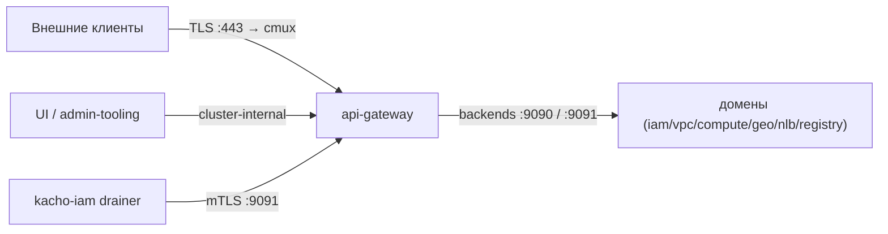

import CodeBlock from '@theme/CodeBlock'
import dedent from 'ts-dedent'

# Развёртывание

Эта страница описывает сборку Kachō API Gateway, его listener'ы, контейнерный образ и
permission-каталог. Ключи конфигурации (ENV `KACHO_API_GATEWAY_*`) — на странице
[Конфигурация](/install/configuration).

## Сборка

Гейтвей — единственный бинарь (composition root `cmd/api-gateway`), без миграций (у edge нет
собственной БД).

<CodeBlock language="bash">
  {dedent`
    make build          # бинарь → bin/api-gateway
    make test           # go test ./... -race -cover
    make vet            # go vet ./...
    make lint           # golangci-lint
  `}
</CodeBlock>

## Permission-каталог

Каталог «RPC → требуемое разрешение» генерируется из proto-аннотаций доменов генератором
`cmd/protoc-gen-kacho-permissions` и встраивается в гейтвей. Каталог — источник истины
авторизации: метод без записи в нём отклоняется (deny-by-default).

<CodeBlock language="bash">
  {dedent`
    make permission-catalog          # сгенерировать каталог из proto
    make permission-catalog-check    # проверить, что встроенный каталог не разошёлся с proto
  `}
</CodeBlock>

:::warning Каталог должен совпадать с proto
`permission-catalog-check` — CI-гейт: если публичный RPC добавили/сменили аннотацию, а каталог не
перегенерировали, проверка падает. Так авторизация не отстаёт от контракта API.
:::

## Listener'ы

Гейтвей поднимает несколько listener'ов:

<table>
  <thead><tr><th>Listener</th><th>ENV / дефолт</th><th>Поверхность</th></tr></thead>
  <tbody>
    <tr><td>cmux (gRPC + REST)</td><td><code>LISTEN&#95;ADDR</code> · <code>:8080</code></td><td>Публичный вход: gRPC-proxy + REST-mux + health</td></tr>
    <tr><td>внешний TLS</td><td><code>TLS&#95;LISTEN&#95;ADDR</code> · <em>(пусто = выкл.)</em></td><td>Advertised TLS-периметр (тот же cmux-раскол)</td></tr>
    <tr><td>internal REST</td><td><code>INTERNAL&#95;REST&#95;ADDR</code> · <code>:8081</code></td><td>Cluster-internal REST-mux (<code>Internal&#42;</code>-проекции)</td></tr>
    <tr><td>internal gRPC</td><td><code>INTERNAL&#95;GRPC&#95;ADDR</code> · <code>:9091</code></td><td><code>InternalAuthzCacheService</code> (mTLS, push-инвалидация)</td></tr>
  </tbody>
</table>

<CodeBlock language="bash">
  {dedent`
    KACHO_API_GATEWAY_AUTHN_MODE=dev bin/api-gateway
  `}
</CodeBlock>

## Контейнерный образ

Образ собирается как **single-repo**: зависимости (`kacho-corelib` + proto-stubs доменов) тянутся
versioned-модулями из GitHub (`go.mod` без `replace`), build-context — сам репозиторий.

<CodeBlock language="bash">
  {dedent`
    make docker          # образ kacho-api-gateway:dev
  `}
</CodeBlock>

Образ — distroless-подобный (alpine + ca-certificates), запускается непривилегированным
пользователем (`USER 65532`). Helm-чарт репозитория:

<CodeBlock language="bash">
  {dedent`
    make helm-lint       # helm lint deploy/
  `}
</CodeBlock>

## Проверка развёрнутого гейтвея

<CodeBlock language="bash">
  {dedent`
    curl http://<gateway>/healthz    # liveness — 200, если процесс запущен
    curl http://<gateway>/readyz     # readiness — 200, если доступен kacho-iam
  `}
</CodeBlock>

`/readyz` возвращает `503` только при недоступности критичного backend (`iam`); деградация
некритичного домена реплику из rotation не выводит.

:::tip Secure-by-default
В production-окружении (`KACHO_APP_ENV=production`) гейтвей **откажется стартовать** при
authz-disabled / fail-open / неproduction-режиме AuthN и при незащищённом internal listener без
mTLS. Полный список ключей и режимов — [Конфигурация](/install/configuration).
:::
