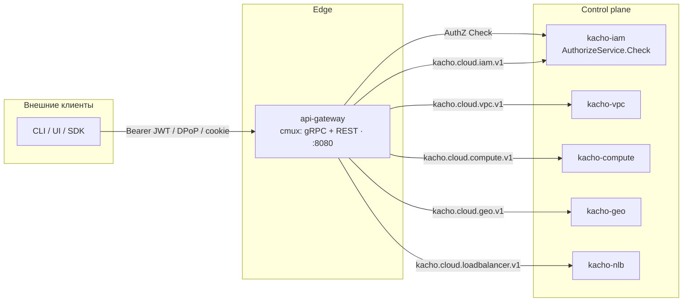

import hero from '@site/src/css/hero.module.css'

<header className={hero.hero}>
   Control-plane · Edge

  <h1 className={hero.title}>
    Единый вход платформы 
    Kachō
  </h1>

  

    Edge-прокси контрол-плейна: один порт для <strong>gRPC</strong> и <strong>REST</strong>,
    аутентификация и авторизация каждого запроса, прозрачная маршрутизация в доменные
    сервисы и изоляция admin-поверхности от внешнего периметра.
  

  

    <a className={hero.btnPrimary} href="/getting-started">Быстрый старт →</a>
    <a className={hero.btnGhost} href="/api/overview">Обзор API</a>
    <a className={hero.btnGhost} href="/architecture/overview">Архитектура</a>
    <a className={hero.btnGhost} href="https://github.com/PRO-Robotech/kacho-api-gateway">GitHub</a>
  

</header>

## Что это и зачем

**Kachō API Gateway** — единственная точка входа (edge) контрол-плейна платформы Kachō. Он
принимает клиентские вызовы (gRPC и REST на одном порту), проверяет **кто** их шлёт (AuthN) и
**что** ему разрешено (AuthZ), и только после этого прозрачно проксирует запрос во внутренний
доменный backend. За гейтвеем сервисы доменов (`kacho-iam`, `kacho-vpc`, `kacho-compute`,
`kacho-geo`, `kacho-nlb`, `kacho-registry`) общаются только по внутренней сети.

Бизнес-ценность в том, что **периметр платформы вынесен в один слой**. Клиенту не нужно знать,
какой сервис владеет ресурсом: он обращается к единому REST/gRPC-эндпоинту, а гейтвей
маршрутизирует запрос по domain-prefix. AuthN, AuthZ, изоляция public-vs-internal, проброс
identity и разбор async-операций — всё централизовано здесь, а не размазано по доменам. Один
периметр, единые правила безопасности, deny-by-default.

:::info Control-plane edge, не data plane
Гейтвей маршрутизирует **control-plane API** (описание ресурсов, их создание/изменение). Это не
data-plane прокси прикладного трафика. За физическое размещение и обслуживание нагрузок отвечают
другие слои платформы. Эта документация описывает edge control-plane API.
:::

:::tip С чего начать
Новому читателю — [**Быстрый старт**](/getting-started): от токена и первого REST-запроса до
разбора async-`Operation` через поллинг. Готовы к деталям — [Обзор API](/api/overview),
[Аутентификация](/architecture/authn), [Авторизация](/architecture/authz) и
[Архитектура](/architecture/overview).
:::

## Что делает гейтвей

<table>
  <thead><tr><th>Функция</th><th>Кратко</th></tr></thead>
  <tbody>
    <tr><td><strong>AuthN</strong></td><td>Bearer-JWT (Ory Hydra, проверка по JWKS), sender-constrained <strong>DPoP</strong> и mTLS-bound токены, session-cookie Ory Kratos для SPA, HMAC-токены для локальной разработки. Невалидный токен → <code>401</code>, никогда не понижается до anonymous</td></tr>
    <tr><td><strong>AuthZ</strong></td><td>Per-RPC <code>AuthorizeService.Check</code> → OpenFGA по встроенному permission-каталогу; deny-by-default, fail-closed; step-up-гейт по уровню аутентификации (<code>acr</code>)</td></tr>
    <tr><td><strong>Identity propagation</strong></td><td>Клиентские заголовки <code>x-kacho-principal-&#42;</code> стрипаются на входе и заново выставляются гейтвеем только после валидной аутентификации — подделать identity нельзя</td></tr>
    <tr><td><strong>Routing + isolation</strong></td><td>Маршрутизация по domain-prefix <code>kacho.cloud.&lt;domain&gt;.v1.&#42;</code> через allowlist (deny-by-default). <code>Internal&#42;</code>-сервисы видны только на cluster-internal listener</td></tr>
    <tr><td><strong>Operations</strong></td><td><code>OperationService.Get/Cancel</code> обслуживается in-process: по prefix id операция направляется во владеющий backend</td></tr>
  </tbody>
</table>

## Домены за гейтвеем

Гейтвей — периметр перед доменными сервисами. Каждый домен владеет своими ресурсами; гейтвей
знает только их публичный RPC-набор (allowlist) и адрес backend.

<table>
  <thead><tr><th>Домен</th><th>Backend</th><th>Ресурсы (публично)</th></tr></thead>
  <tbody>
    <tr><td><strong>IAM</strong></td><td><code>kacho-iam</code></td><td>Account / Project / User / ServiceAccount / Group / Role / AccessBinding</td></tr>
    <tr><td><strong>VPC</strong></td><td><code>kacho-vpc</code></td><td>Network / Subnet / SecurityGroup / RouteTable / Address / Gateway / NetworkInterface</td></tr>
    <tr><td><strong>Compute</strong></td><td><code>kacho-compute</code></td><td>Instance / Disk / Image / Snapshot / DiskType</td></tr>
    <tr><td><strong>Geography</strong></td><td><code>kacho-geo</code></td><td>Region / Zone</td></tr>
    <tr><td><strong>Load Balancer</strong></td><td><code>kacho-nlb</code></td><td>NetworkLoadBalancer / Listener / TargetGroup</td></tr>
    <tr><td><strong>Registry</strong></td><td><code>kacho-registry</code></td><td>RegistryService (control-plane)</td></tr>
  </tbody>
</table>

:::note Собственный gRPC-контракт гейтвея — минимален
Гейтвей — прокси: почти весь его RPC-набор транслируется в домены. Собственные встроенные
сервисы на его gRPC-поверхности — только `OperationService` (fan-out по prefix, см.
[Operations](/api/operations)) и health. Единственный **native** proto гейтвея —
`InternalAuthzCacheService` на cluster-internal listener (см.
[Internal Authz Cache](/api/internal-authz-cache)).
:::

## Модель API

Гейтвей не меняет модель ресурсов доменов, а транслирует её:

- **Ресурсы — плоские** (domain-поля на верхнем уровне; без `spec`/`status`/`metadata`-envelope).
- **Чтение синхронно** (`Get` / `List`), **мутации асинхронны** и возвращают `Operation`;
  клиент поллит `OperationService.Get(id)` до `done=true`. Watch-RPC нет.
- **REST** (grpc-gateway): путь `/<service>/v1/<resource>`, доп. действия — суффикс `:verb`;
  JSON — camelCase.

Подробнее о конвенциях, портах и формате ошибок — [Обзор API](/api/overview).

## Как устроен путь запроса

Клиент шлёт запрос на единый порт `:8080`; `cmux` различает gRPC (`Content-Type:
application/grpc`) и REST по одному соединению. Гейтвей аутентифицирует запрос, авторизует его
per-RPC через `kacho-iam`, затем маршрутизирует в нужный домен по `kacho.cloud.<domain>.v1.*`.
Подробнее — [Маршрутизация](/architecture/routing).

## Ключевые возможности

  

    ⇄
    gRPC + REST на одном порту
    <code>cmux</code> мультиплексирует HTTP/2-gRPC и HTTP/1.1-REST (grpc-gateway) на одном listener.
  

  

    🔐
    AuthN на каждом запросе
    JWT (Hydra/JWKS), DPoP и mTLS-bound токены, Kratos-сессии. Невалидный токен → 401, не anonymous.
  

  

    🛡
    Per-RPC AuthZ, fail-closed
    Каждый вызов проходит <code>Check</code> → OpenFGA по permission-каталогу; deny-by-default, fail-open запрещён в production.
  

  

    ◫
    Public vs internal
    <code>Internal&#42;</code>-сервисы видны только на cluster-internal listener; на внешнем endpoint — как несуществующие (404).
  

  

    ⟳
    Operations fan-out
    <code>OperationService.Get/Cancel</code> in-process: по 3-символьному prefix id операция уходит во владеющий backend.
  

  

    ◷
    Ограниченные кэши
    JWKS, introspection, DPoP-replay, authz-decision — все LRU + TTL, с push-инвалидацией по subject.
  

## Технологический стек

<table>
  <thead><tr><th>Технология</th><th>Применение</th></tr></thead>
  <tbody>
    <tr><td>Go</td><td>Язык реализации (чистая архитектура; composition root — <code>cmd/api-gateway</code>)</td></tr>
    <tr><td>cmux</td><td>Мультиплексирование gRPC / REST на одном порту</td></tr>
    <tr><td>grpc-gateway</td><td>REST-проекция gRPC (split-mux public / internal)</td></tr>
    <tr><td>Protocol Buffers / Buf</td><td>Контракт доменов (<code>kacho-proto</code>) + native <code>kacho.cloud.apigateway.v1</code></td></tr>
    <tr><td>Ory Hydra / Kratos</td><td>OAuth2/OIDC (JWT-issuer + JWKS) и session-management SPA</td></tr>
    <tr><td>OpenFGA (ReBAC)</td><td>Авторизация — per-RPC <code>Check</code> через kacho-iam</td></tr>
    <tr><td>DPoP (RFC 9449)</td><td>Sender-constrained токены (proof-of-possession)</td></tr>
  </tbody>
</table>

## Структура репозиториев

<table>
  <thead><tr><th>Репозиторий</th><th>Назначение</th></tr></thead>
  <tbody>
    <tr><td><strong>kacho-api-gateway</strong></td><td>Этот сервис: edge контрол-плейна (AuthN/AuthZ + routing)</td></tr>
    <tr><td><strong>kacho-proto</strong></td><td>Центральные <code>.proto</code> всех доменов + сгенерированные Go-stubs</td></tr>
    <tr><td><strong>kacho-corelib</strong></td><td>Общие пакеты (grpcclient, config, observability, ids, ...)</td></tr>
    <tr><td><strong>kacho-iam</strong></td><td>AuthN/AuthZ backend: <code>AuthorizeService.Check</code>, subject/revocations</td></tr>
    <tr><td><strong>kacho-vpc / -compute / -geo / -nlb / -registry</strong></td><td>Доменные backend-сервисы за гейтвеем</td></tr>
  </tbody>
</table>
