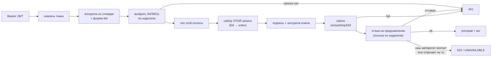
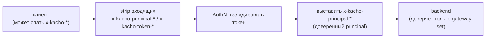

# Аутентификация

Эта страница описывает, как гейтвей устанавливает **кто** шлёт запрос (AuthN), прежде чем решать
**что** ему разрешено ([Авторизация](/architecture/authz)). Аутентификация выполняется на каждом
запросе обоих транспортов (REST и gRPC); результат — доверенный `principal`, проброшенный в
backend. Ключи конфигурации — [Конфигурация](/install/configuration).

## Принцип

AuthN — первый гейт периметра. Гейтвей принимает несколько типов удостоверений, но правило одно:
удостоверение либо валидно (и даёт конкретного principal), либо запрос отклоняется. **Невалидный
токен никогда не понижается до anonymous** — это `401`. В `production-strict` анонимный доступ
запрещён полностью.

## Способы аутентификации

<table>
  <thead><tr><th>Способ</th><th>Кто применяет</th><th>Как проверяется</th></tr></thead>
  <tbody>
    <tr><td><strong>Bearer-JWT (Hydra)</strong></td><td>Программные клиенты, SDK</td><td>Подпись RS256 / ES256 / EdDSA по <strong>JWKS</strong> Ory Hydra (alg-whitelist, ротация по <code>kid</code>); проверка <code>iss</code> / <code>aud</code> / <code>exp</code> / <code>nbf</code></td></tr>
    <tr><td><strong>DPoP-bound JWT</strong></td><td>Sender-constrained клиенты (RFC 9449)</td><td>JWT + DPoP-proof: сверка <code>jkt</code>-thumbprint c <code>cnf</code>, <code>htm</code> / <code>htu</code> (метод+URL), <code>iat</code>-freshness, anti-replay по <code>jti</code></td></tr>
    <tr><td><strong>mTLS-bound JWT</strong></td><td>Клиенты с client-cert</td><td>Токен привязан к сертификату через <code>cnf.x5t#S256</code> (thumbprint предъявленного cert)</td></tr>
    <tr><td><strong>Session-cookie (Kratos)</strong></td><td>SPA (kacho-ui)</td><td>Валидация сессии Ory Kratos через whoami; истёкшая сессия → <code>401</code>. Плюс <strong>наш</strong> отзыв: сессия, аутентифицировавшаяся не позже отсечки субъекта, отвергается, и край гасит носитель</td></tr>
    <tr><td><strong>HMAC-JWT (dev)</strong></td><td>Локальная разработка / probe</td><td>Подпись HMAC dev-секретом (<code>AUTHN&#95;DEV&#95;SECRET</code>); только в режиме <code>dev</code></td></tr>
  </tbody>
</table>

## Проверка JWT: издатель — множество, у каждого свой набор ключей

Платформа чеканит свои токены сама, а прежний издатель на переходе остаётся,
поэтому принимаемых издателей **несколько**, и у каждого — **своя объявленная
запись** источника проверочных ключей: свой адрес, свой снимок, свой срок
годности.

Объединить наборы в один было бы дешевле и уничтожило бы ровно ту защиту, ради
которой развязка делается: ключ одного издателя проверял бы токен, объявляющий
другого. Адрес записи **объявляется** перечнем (`_TOKEN_ISSUER_KEYSETS`) и
никогда не выводится из издателя — издатель приходит от предъявителя, то есть
это недоверенный вход, а производный адрес получался бы у **всякого** издателя,
и состояние «записи нет» не наступало бы никогда.

Порядок проверок:

1. **Извлечение** токена из `Authorization: Bearer <jwt>`.
2. **Алгоритм** — только из закрытого словаря платформы (RS256 / ES256 / EdDSA);
   `alg: none` и симметричные подделки отвергаются **до** разрешения ключа.
3. **Идентификатор ключа** — форма ограничивается **до** обращения к источнику:
   значение приходит от предъявителя.
4. **Издатель** выбирает запись. Издатель, записи не имеющий, даёт **отказ** —
   никогда перебор записей подряд.
5. **Тип токена** сверяется с закрытым набором **этой** полосы. На нашей полосе
   тип обязателен: производитель типа — мы сами.
6. **Ключ** берётся из набора **выбранной** записи; алгоритм, закреплённый за
   ключом, сверяется с заголовком — заголовок алгоритм не выбирает.
7. **Claims**: `iss`, `aud`, `exp` (**обязателен**), `nbf`, `iat` с объявленным
   допуском на расхождение часов.
8. **Отзыв на предъявлении.** Для токенов **нашего** издателя вопрос идёт
   **нашему** авторитету (`_PLATFORM_TOKEN_REVOCATION_URL`): прежний провайдер о
   наших токенах не знает by construction. На этой полосе недоступность
   авторитета даёт **отказ**; на полосе прежнего издателя сохраняется прежний
   мягкий проход, потому что его авторитет — третья сторона.

   **Отозванное удостоверение и молчащий авторитет отвечают РАЗНЫМИ кодами, и
   это не косметика.** Отозванный токен — отказ **удостоверению**: `401`, и
   клиенту следует пройти вход заново. Молчащий либо неверно настроенный
   авторитет — неисправность **этой посадки**, а не удостоверения: `503`
   (`UNAVAILABLE` на нативной поверхности), и клиенту следует повторить, а не
   переаутентифицироваться. Ответить `401` на нашу собственную неисправность
   значило бы послать арендатора чинить то, что у него исправно.

   **Исключение объявлено, а не умолчано:** на REST-поверхности вопрос об отзыве
   не задаётся на **предварительно разрешённых** путях — проверки живости, вход и
   выход. Ни один из них не действует властью удостоверения (выход как раз его и
   сдаёт), и требовать там живого токена значило бы запереть браузер с сессией,
   которую он не может отдать. На нативной gRPC-поверхности таких путей нет, и
   исключения тоже нет.

### Отзыв читается на ОБЕИХ полосах, и это сверяется сравнением

Полос личности человека здесь две — сессия развёрнутого провайдера (cookie) и
подписанный предъявитель. Свойство «наш отзыв действует на предъявлении» обязано
держаться на обеих, и проверяется оно **сравнением полос**, а не по каждой
отдельно: проба по каждой требует знать, каким свойство должно быть, — а
сравнение спрашивает другое, «решал ли кто-нибудь, что они различаются».

| полоса | чем удостоверяется | что спрашивается про отзыв |
|---|---|---|
| предъявитель | подпись издателя | по идентификатору удостоверения — у авторитета той полосы, чья запись выбрана |
| cookie | сессия провайдера | по паре (субъект, момент аутентификации) — у нашего авторитета |

У браузерной сессии нет ни идентификатора удостоверения, ни подписи, которую край
мог бы прочитать, поэтому вопрос к ней ставится единственным возможным способом —
по субъекту и моменту. Отсечка действует **вперёд**: вошедший заново работает.

**Отказ заканчивает носитель.** Порознь отказ даёт стоящее состояние: сессия
жива, её момент прежний, и повторной аутентификации ничто не запросит. Прежде
обратимость покупалась вызовом к административному API поставщика; теперь её
делает край своим действием — гасит cookie, и следующее обращение приходит без
сессии.

**Два неопределённых исхода различаются:** «отозван» — носитель заканчиваем;
«наш авторитет не ответил» — отказ **без** окончания носителя, потому что
заминка своего же соседа не повод выкидывать тех, кого никто не отзывал.

Пока `_TOKEN_ISSUERS` не объявлен, край строит **одну** запись из прежних
`KACHO_HYDRA_ISSUER` / `KACHO_HYDRA_JWKS_URL` — ровно прежнее поведение.
Объявить оба способа сразу нельзя: это два места об одном предмете, и край
**отказывается стартовать**, называя обе настройки.

## DPoP — sender-constrained токены

DPoP (RFC 9449) привязывает токен к ключу клиента: помимо `Authorization: Bearer` клиент шлёт
заголовок `DPoP` с подписанным proof. Гейтвей проверяет:

- **`jkt`-thumbprint** proof-ключа совпадает с `cnf.jkt` в токене (владение ключом);
- **`htm` / `htu`** в proof — HTTP-метод и URL текущего запроса;
- **`iat`-freshness** — proof выпущен в допустимом окне (`KACHO_DPOP_IAT_FRESHNESS_SECONDS`,
  дефолт 60 с);
- **anti-replay** — `jti` proof не встречался ранее (LRU-кэш `KACHO_DPOP_REPLAY_CACHE_SIZE` с TTL
  `KACHO_DPOP_REPLAY_CACHE_TTL_SECONDS` ≥ 2× окна свежести).

mTLS-bound вариант привязывает токен к клиентскому сертификату через `cnf.x5t#S256`. DPoP
включается флагом `KACHO_API_GATEWAY_AUTHN_ENABLE_DPOP`.

:::note Парсер proof — под fuzzing
Разбор DPoP-proof и REST-роутинг покрыты continuous-fuzzing (ночной CI) — это парсеры на границе
доверия, поэтому устойчивость к некорректному вводу проверяется отдельно.
:::

## Проброс identity — anti-spoofing

После валидной аутентификации гейтвей выставляет заголовки `x-kacho-principal-*` и прокидывает их
в backend (REST → gRPC-metadata). **Любые клиентские** `x-kacho-principal-*` / `x-kacho-token-*`
на входе **стрипаются** до аутентификации — клиент не может подделать identity, подставив
заголовок. Backend доверяет только тем `x-kacho-*`, что выставил гейтвей.

## Режимы AuthN

<table>
  <thead><tr><th><code>KACHO&#95;API&#95;GATEWAY&#95;AUTHN&#95;MODE</code></th><th>Поведение</th></tr></thead>
  <tbody>
    <tr><td><code>dev</code></td><td>Back-compat: принимает HMAC-JWT (dev-секрет); отсутствие Bearer → anonymous. Только для локальных стендов</td></tr>
    <tr><td><code>production</code></td><td>Полная проверка Hydra-JWT / DPoP / Kratos-сессии; невалидный токен → 401</td></tr>
    <tr><td><code>production-strict</code></td><td>То же + анонимный доступ запрещён полностью (fail-closed на отсутствие удостоверения)</td></tr>
  </tbody>
</table>

В production-окружении (`KACHO_APP_ENV=production`) неproduction-режим AuthN — причина отказа
старта (secure-by-default). Дальше принятый principal идёт в [авторизацию](/architecture/authz),
где вычисляется решение allow/deny и, при необходимости, step-up по `acr`.
