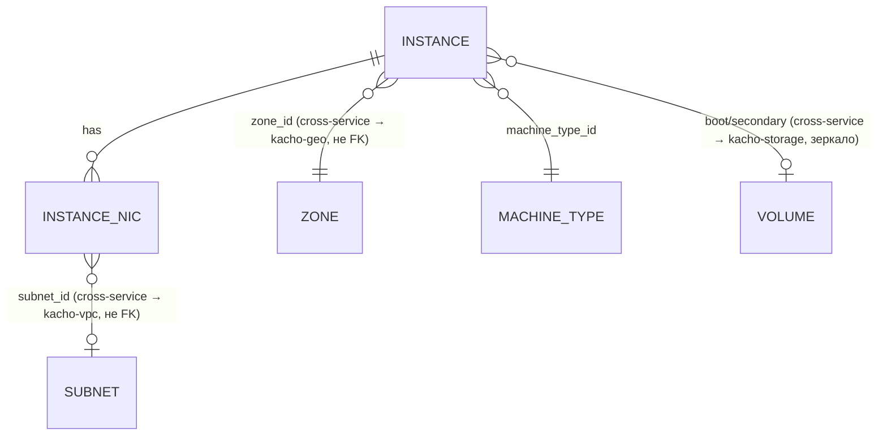

# 01 — Resources

Детально по каждому ресурсу: proto-поля, ID-префикс, status-enum, **полный**
список RPC (из `*_service.proto`) с пометкой реализован / `blocked:*` /
`Unimplemented`, ключевые инварианты, cross-resource links.

## Иерархия и связи



Текстовая модель:

```
Instance (1) ───┬─ machine_type_id ──→ MachineType (sizing-каталог, cluster-level)
   │            ├─ boot_volume / secondary_volumes ──→ Volume (kacho-storage)
   │            │     read-only зеркало: привязка живёт в `volume_attachments`
   │            │     у владельца, compute local attach-state НЕ держит
   ├─ network_interfaces[] (N): subnet_id, primary_v4_address,
   │     {one_to_one_nat: address}, security_group_ids[]
   └─ status: state-машина (см. 03-instance-lifecycle.md)

MachineType — cluster-level read-only справочник sizing (id `mt-…`)
Volume/Image/Snapshot/DiskType — блочное хранение, owner = kacho-storage (`/storage/v1`)
Region/Zone — публичный read-only справочник Geography (owner = kacho-geo)
```

Мутируемый ресурс компьюта один — Instance, он **project-level**
(`project_id` обязателен в Create). Все таблицы **flat** (без K8s envelope
`resource_version`/`generation`/`deletion_timestamp`/`finalizers`/`spec`/`status`
как JSONB). `cloud_id`/`organization_id` в схеме отсутствуют — фильтрация только
по `project_id` (как в VPC). Колонки `id` — `TEXT` (не UUID).

## Resource ID format

ID получают через `kacho-corelib/ids.NewID(<prefix>)` — 3 символа + 17-char
crockford-base32 (всего 20). Источник истины — `kacho-corelib/ids/ids.go`:

| Ресурс           | Prefix const                                              | Значение | Пример              |
|------------------|-----------------------------------------------------------|----------|---------------------|
| Instance         | `ids.PrefixInstance`                                      | `epd`    | `epd + 17 base32`   |
| MachineType      | `ids.PrefixMachineType`                                   | `mt-`    | `mt- + …` (hyphen)  |
| Operation (CMP)  | `ids.PrefixOperationCompute` (== `ids.PrefixInstance`)    | `epd`    | `epd + ...`         |
| Zone             | литерал-строка (`ru-central1-a` и т.п.)                   | —        | не prefix-id        |

**Все compute-операции** независимо от ресурса получают prefix `epd`
(`PrefixOperationCompute == PrefixInstance`) — api-gateway opsproxy маршрутизирует
`OperationService.Get(id)` по первым 3 символам, поэтому все операции домена
должны идти в один backend. `InternalMachineTypeService.Create` вернёт operation с
id `epd...`, внутри которого `response` = MachineType с id `mt-...` (как в VPC
`SubnetService.Create` → op `enp...`, внутри Subnet `e9b...`).

**Не валидировать id-формат sync** на входе RPC (`(length) = "<=50"` из proto —
max-длина, не format): well-formed-но-несуществующий id даёт
async `NotFound`, а malformed/wrong-prefix id → sync `InvalidArgument "invalid
<res> id '<X>'"` (probe 2026-05-11), у нас пока ловится на DB-уровне → `NotFound`
— расхождение, см. [`07-known-divergences.md`](07-known-divergences.md) §1.

---

## Instance

Виртуальная машина. Project-level (`project_id`), zone-level (`zone_id`), привязан
к платформе (`platform_id`), имеет boot-disk + secondary-disks (через
`attached_disks`), N сетевых интерфейсов (через `instance_network_interfaces`),
state-машину статуса. Таблица `instances` + дочерние `instance_network_interfaces`
(CASCADE) + `attached_disks`.

### proto-поля (`instance.proto`, message `Instance`)

| Поле | Тип | Замечания |
|---|---|---|
| `id` | string | prefix `epd` |
| `project_id` | string | partial UNIQUE `(project_id, name) WHERE name <> ''` |
| `created_at` | Timestamp | truncate до секунд |
| `name`, `description`, `labels` | | project-scoped label, `name` — partial UNIQUE |
| `zone_id` | string | required; existence через `ZoneRegistry` (локальная таблица `zones`, эпик `KAC-15`); immutable (меняется через Relocate) |
| `platform_id` | string | required (`standard-v1/v2/v3`, `highfreq-v3`, `gpu-*` — таблица в `internal/service/platforms.go`) |
| `resources` | Resources{memory, cores, core_fraction, gpus} | в схеме: `cores`, `memory`, `core_fraction`, `gpus`. proto `ResourcesSpec`: `memory ≤ 274877906944`, `cores ∈ {2,4,...,80}`, `core_fraction ∈ {0,5,20,50,100}`, `gpus ∈ {0,1,2,4}` + per-platform валидация |
| `status` | Instance.Status enum | `STATUS_UNSPECIFIED=0, PROVISIONING=1, RUNNING=2, STOPPING=3, STOPPED=4, STARTING=5, RESTARTING=6, UPDATING=7, ERROR=8, CRASHED=9, DELETING=10`. Подробно — [`03-instance-lifecycle.md`](03-instance-lifecycle.md) |
| `metadata` | map<string,string> | суммарно ≤ 256 KiB (proto: "less than 512 KB" суммарно ключей+значений, каждое значение ≤ 256 KB); меняется только через `UpdateMetadata` RPC. **Омитится из ответа List** (часть контракта) |
| `metadata_options` | MetadataOptions | nullable |
| `boot_disk` | AttachedDisk{mode, device_name, auto_delete, disk_id} | derived: строка в `attached_disks` с `is_boot=true`; immutable |
| `secondary_disks` | repeated AttachedDisk | derived из `attached_disks` `is_boot=false`; до 3 при Create (proto `(size) = "<=3"`) |
| `local_disks` | repeated AttachedLocalDisk | proto-поле есть; реализация отложена |
| `filesystems` | repeated AttachedFilesystem | `blocked:kacho-filesystem` |
| `network_interfaces` | repeated NetworkInterface{index, mac_address, subnet_id, primary_v4_address{address, one_to_one_nat{address, ip_version, dns_records}, dns_records}, security_group_ids[], `nic_id`} | строки `instance_network_interfaces`. `nic_id` (proto field 7) — id ресурса **kacho-vpc `NetworkInterface`**, бэкующего этот интерфейс; он source of truth (адрес, SG, data-plane), а `subnet_id`/`primary_v4_address` — read-only denorm-зеркало (epic KAC-9, см. ниже «Instance ↔ kacho-vpc NetworkInterface») |
| `serial_port_settings` | SerialPortSettings{ssh_authorization} | nullable |
| `gpu_settings` | GpuSettings{gpu_cluster_id} | `gpu_cluster_id` хранится; реального GpuCluster нет |
| `fqdn` | string | output-only; вычисляется при Create: `<hostname>.<region_id>.internal` или `<id>.auto.internal` (если hostname не задан) |
| `scheduling_policy` | SchedulingPolicy{preemptible} | в схеме: `scheduling_preemptible` |
| `service_account_id` | string | хранится; реального IAM нет |
| `network_settings` | NetworkSettings{type: STANDARD\|SOFTWARE_ACCELERATED\|HARDWARE_ACCELERATED} | в схеме: `network_settings_type` (default `STANDARD`) |
| `placement_policy` | PlacementPolicy{placement_group_id, host_affinity_rules[], placement_group_partition} | хранится; реального placement-group нет |
| `host_group_id` / `host_id` | string | хранятся; реальных host-group/host нет |
| `maintenance_policy` | MaintenancePolicy{RESTART\|MIGRATE} | в схеме: `maintenance_policy` (имя enum-значения) |
| `maintenance_grace_period` | Duration | в схеме: `maintenance_grace_period_seconds`; proto `(value) = "1s-24h"` в Create/Update |
| `hardware_generation` | HardwareGeneration | inherited от boot-image/disk; nullable |
| `reserved_instance_pool_id` | string | хранится; реального ReservedInstancePool нет |
| `application` | Application{container_solution, cloudbackup} | хранится; не интерпретируется |

(`hostname` из `CreateInstanceRequest` хранится в `instances.hostname` для
вычисления `fqdn` и не возвращается отдельным полем в `Instance`.)

### RPC (`instance_service.proto`, service `InstanceService`)

| RPC | sync/async | статус | примечание |
|---|---|---|---|
| `Get` | sync | ✅ | `GET /compute/v1/instances/{instance_id}?view=` (BASIC/FULL — FULL включает metadata) |
| `List` | sync | ✅ | `GET /compute/v1/instances?projectId=`. metadata всегда омитится (часть контракта). filter: `id/name/created_at/status/zone_id/platform_id/host_id` (whitelist; текущая фаза — `name=`) |
| `Create` | async | ✅ | required `zone_id`/`platform_id`/`resources_spec`/`boot_disk_spec`. metadata `CreateInstanceMetadata{instance_id}`, response `Instance`. boot/secondary disk: `exactly_one` of {`disk_id`, `disk_spec`}. ⚠️ **без авто-NIC** — auto-NIC материализация `materializeNICs` удалена в `KAC-266`: инстанс создаётся **без сетевых интерфейсов** (`instance_network_interfaces` пуст), NIC не создаётся/привязывается на Create; правильная сетевая модель (явная привязка NIC) — будущая переделка. end status `RUNNING`. `filesystem_specs[]` / `local_disk_specs[]` — вместе с ещё четырьмя легаси-полями (`network_settings`, `maintenance_policy`, `maintenance_grace_period`, `serial_port_settings`) **отвергаются** синхронным `INVALID_ARGUMENT` первым стейтментом `Create`, см. `07-known-divergences.md` §7.1 |
| `Update` | async | ✅ | metadata `UpdateInstanceMetadata`, response `Instance`. mutable: `name`/`description`/`labels`/`service_account_id`/`network_settings`/`placement_policy`/`scheduling_policy`/`maintenance_policy`/`maintenance_grace_period`/`serial_port_settings`. `resources_spec`/`platform_id` — только при `STOPPED` (`FailedPrecondition "Instance must be stopped"`). `metadata` — через `UpdateMetadata`. immutable: `zone_id`/`boot_disk` |
| `Delete` | async | ✅ | metadata `DeleteInstanceMetadata`, response `Empty`. worker: обрабатывает attached disks по `auto_delete` (true → DELETE disk; false → строка `attached_disks` чистится CASCADE при DELETE instance), для каждого NIC с непустым `nic_id` — delete kacho-vpc `NetworkInterface` (release его Address-ресурсов; best-effort vpcClient), DELETE instance (CASCADE чистит NIC-строки + attached_disks), освобождает one_to_one_nat addresses (best-effort vpcClient) |
| `UpdateMetadata` | async | ✅ | `POST /compute/v1/instances/{instance_id}/updateMetadata` body `{delete:[], upsert:{}}`. metadata `UpdateInstanceMetadataMetadata`, response `Instance`. status unchanged |
| `GetSerialPortOutput` | **sync** | ✅ (синтетика) | `GET /compute/v1/instances/{instance_id}:serialPortOutput?port=1..4`. response `GetInstanceSerialPortOutputResponse{contents}` — синтетический текст (НЕ операция) |
| `Stop` | async | ✅ | `POST /compute/v1/instances/{instance_id}:stop`. precondition `status ∈ {RUNNING}` → end `STOPPED`. metadata `StopInstanceMetadata`, response `Empty` |
| `Start` | async | ✅ | precondition `status ∈ {STOPPED}` → end `RUNNING`. metadata `StartInstanceMetadata`, response `Instance` |
| `Restart` | async | ✅ | precondition `status ∈ {RUNNING}` → end `RUNNING`. metadata `RestartInstanceMetadata`, response `Empty` |
| `AttachDisk` | async | ✅ | `POST :attachDisk` body `{attached_disk_spec}`. precondition `status ∈ {RUNNING, STOPPED}`; disk READY & same zone & not attached. metadata `AttachInstanceDiskMetadata{instance_id, disk_id}`, response `Instance`. status unchanged |
| `DetachDisk` | async | ✅ | `POST :detachDisk` body `oneof {disk_id, device_name}` (`exactly_one`). precondition `status ∈ {RUNNING, STOPPED}`; disk attached & not boot. metadata `DetachInstanceDiskMetadata`, response `Instance` |
| `AddOneToOneNat` | async | ✅ | `POST /addOneToOneNat` body `{network_interface_index, internal_address?, one_to_one_nat_spec?}`. precondition `status ∈ {RUNNING, STOPPED}`; NIC index valid. metadata `AddInstanceOneToOneNatMetadata`, response `Instance` |
| `RemoveOneToOneNat` | async | ✅ | `POST /removeOneToOneNat` body `{network_interface_index, internal_address?}`. precondition как у Add. metadata `RemoveInstanceOneToOneNatMetadata`, response `Instance` |
| `UpdateNetworkInterface` | async | ✅ | `PATCH /updateNetworkInterface` body `{network_interface_index, update_mask, subnet_id?, primary_v4_address_spec?, primary_v6_address_spec?, security_group_ids?}`. metadata `UpdateInstanceNetworkInterfaceMetadata`, response `Instance`. OCC через `xmin` (read-modify-write). Precondition-семантика ещё не закреплена |
| `AttachNetworkInterface` | async | ✅ | `POST :attachNetworkInterface` body `{network_interface_index, subnet_id, primary_v4_address_spec?, security_group_ids[]}`. proto: instance должен быть `STOPPED`. metadata `AttachInstanceNetworkInterfaceMetadata`, response `Instance` |
| `DetachNetworkInterface` | async | ✅ | `POST :detachNetworkInterface` body `{network_interface_index}`. proto: instance `STOPPED`. metadata `DetachInstanceNetworkInterfaceMetadata`, response `Instance` |
| `ListOperations` | sync | ✅ | `GET /compute/v1/instances/{instance_id}/operations` |
| `Relocate` | async | 🚫 blocked | `POST :relocate` body `{destination_zone_id, network_interface_specs[1], boot_disk_placement?, secondary_disk_placements[]}`. metadata `RelocateInstanceMetadata`, response `Instance`. Нужен cross-zone disk move + restart-семантика → `Unimplemented` / частично |
| `SimulateMaintenanceEvent` | async | ⏭️ no-op | `POST :simulateMaintenanceEvent`. metadata `SimulateInstanceMaintenanceEventMetadata`, response `Empty`. operation сразу done |
| `ListAccessBindings` / `SetAccessBindings` / `UpdateAccessBindings` | — | ⏭️ no-op скелет | |

### Инварианты

- `Create`: ⚠️ **без авто-NIC** — auto-NIC материализация (`materializeNICs`)
  удалена в `KAC-266`: per-NIC валидация (subnet/SG/NAT-address) и создание
  kacho-vpc `NetworkInterface` больше не выполняются, инстанс создаётся без
  сетевых интерфейсов; правильная сетевая модель — будущая переделка. boot
  source — `storage.image` / `registry.image` / том kacho-storage по id;
  inline-создание диска на attach снято с контракта вместе с дублем блочного
  хранения. Insert instance в **одной транзакции** worker'а, затем outbox
  `Instance CREATED`.
- Ровно один boot-disk (`attached_disks_boot_uniq` partial UNIQUE на
  `instance_id WHERE is_boot`). `device_name` уникален в пределах instance
  (`attached_disks_device_uniq` partial UNIQUE на `(instance_id, device_name)
  WHERE device_name <> ''`).
- `resources_spec` валидируется per-platform (`internal/service/platforms.go`):
  `cores` per-platform set, `memory` кратно GB и в range, `core_fraction ∈
  {0,5,20,50,100}`, `gpus` per-platform.
- `status_message` поле — всегда пусто (control-plane).
- State-машина статуса — [`03-instance-lifecycle.md`](03-instance-lifecycle.md).

### Cross-resource links

- `boot_volume` / `secondary_volumes` — **read-only зеркало**: привязка тома к
  инстансу живёт в `volume_attachments` у владельца-storage, compute local
  attach-state не держит (миграция 0013 сняла `attached_disks`).
- `network_interfaces[].nic_id` → VPC `NetworkInterface` (НЕ FK; source of truth
  для интерфейса). ⚠️ `Instance.Create` **больше не создаёт и не привязывает NIC**
  (auto-NIC материализация `materializeNICs` удалена в `KAC-266`; инстанс
  создаётся без сетевых интерфейсов, правильная сетевая модель — будущая
  переделка). На `Instance.Delete` — delete NIC (если `nic_id` непустой).
- `network_interfaces[].subnet_id` → VPC `Subnet` (НЕ FK; в proto-ответе — denorm-зеркало
  kacho-vpc NIC).
- `network_interfaces[].security_group_ids[]` → VPC `SecurityGroup` (НЕ FK; denorm-зеркало).
- `network_interfaces[].primary_v4_address.one_to_one_nat.address` → VPC
  `Address` (НЕ FK; при Remove/Delete освобождается best-effort).
- `instances.project_id` → kacho-iam `Project` (НЕ FK, валидируется gRPC).
- `boot_source` (`storage.image` / `registry.image`) → peer-резолв у владельца
  (kacho-storage / kacho-registry), не локальная таблица.

---

## Region

Read-only публичный справочник регионов. Таблица `regions`. ID — литерал-строка
(`ru-central1`), не prefix-id. **kacho-compute — owner Geography** (эпик `KAC-15`,
перенесено из kacho-vpc; см. workspace `CLAUDE.md` §«Карта владельцев доменов»).

### proto-поля (`region.proto`, message `Region`)

| Поле | Тип | Замечания |
|---|---|---|
| `id` | string | PK, литерал (`ru-central1`) |
| `name` | string | человекочитаемое имя |

### RPC

| RPC | сервис | listener | статус | примечание |
|---|---|---|---|---|
| `Get` | `RegionService` | `:9090` public | ✅ | `GET /compute/v1/regions/{region_id}` |
| `List` | `RegionService` | `:9090` public | ✅ | `GET /compute/v1/regions` |
| `Create` | `InternalRegionService` | `:9091` internal | ✅ kacho-only | `POST /compute/v1/regions` body `{id, name}` |
| `Update` | `InternalRegionService` | `:9091` internal | ✅ kacho-only | `PATCH /compute/v1/regions/{region_id}` body `{name}` |
| `Delete` | `InternalRegionService` | `:9091` internal | ✅ kacho-only | `DELETE /compute/v1/regions/{region_id}` → `DeleteRegionResponse{}`. Блокируется (FK `zones.region_id` RESTRICT) если есть зоны |

Seed (`0003_geography_owner.sql`): `ru-central1` («Russia Central 1»).

---

## Zone

Read-only публичный справочник зон. Таблица `zones`. ID — литерал-строка
(`ru-central1-a` и т.п.), не prefix-id. **kacho-compute — owner** (эпик `KAC-15`).

### proto-поля (`zone.proto`, message `Zone`)

| Поле | Тип | Замечания |
|---|---|---|
| `id` | string | PK, литерал (`ru-central1-a`) |
| `region_id` | string | (`ru-central1`); FK `zones.region_id → regions.id` RESTRICT; индекс `zones_region_idx` |
| `name` | string | человекочитаемое имя (колонка добавлена в `0003_geography_owner.sql`) |
| `status` | Zone.Status enum | `STATUS_UNSPECIFIED=0, UP=1, DOWN=2` (в схеме: `status` TEXT, default `UP`) |

### RPC

| RPC | сервис | listener | статус | примечание |
|---|---|---|---|---|
| `Get` | `ZoneService` | `:9090` public | ✅ | `GET /compute/v1/zones/{zone_id}` |
| `List` | `ZoneService` | `:9090` public | ✅ | `GET /compute/v1/zones` (без regionId) |
| `Create` | `InternalZoneService` | `:9091` internal | ✅ kacho-only | `POST /compute/v1/zones` body `{id, region_id, name, status}` |
| `Update` | `InternalZoneService` | `:9091` internal | ✅ kacho-only | `PATCH /compute/v1/zones/{zone_id}` body `{region_id, name, status}` |
| `Delete` | `InternalZoneService` | `:9091` internal | ✅ kacho-only | `DELETE /compute/v1/zones/{zone_id}` → `DeleteZoneResponse{}`. Проверяет своих dependents (instances/disks/disk_types); кросс-сервисных (vpc-подсети) НЕ проверяет — admin-ответственность |

**Источник данных:** компьют читает зоны/регионы **из своих таблиц** — никакого
proxy в kacho-vpc и `skipPeer`-fallback больше нет (эпик `KAC-15` снёс это).
Тот же источник используется как `ZoneRegistry` для existence-check `zone_id` в
Create Instance. Другие сервисы
(kacho-vpc — `Subnet.zone_id`, `AddressPool.zone_id`, `Address.zone_id`) валидируют
`zone_id` вызовом нашего `ZoneService.Get` (`kacho-vpc → kacho-compute` runtime-edge).
Seed (`0003_geography_owner.sql`): `ru-central1-{a,b,d}`, `region_id = ru-central1`,
`status = UP`.

---

## Что не compute-ресурс, но рядом живёт

- `operations` — per-сервисная таблица long-running operations (схема как у
  corelib `0001_operations.sql`, включена в `0001_initial.sql`). prefix `epd`.
- `compute_outbox` / `compute_watch_cursors` — outbox-таблица событий
  (`resource_kind` ∈ {Instance}, `event_type` ∈
  {CREATED, UPDATED, DELETED}) + триггер `compute_outbox_notify_trg` →
  `pg_notify('compute_outbox', sequence_no::text)`. Подписчик —
  `InternalWatchService.Watch`. См. [`05-database.md`](05-database.md).
