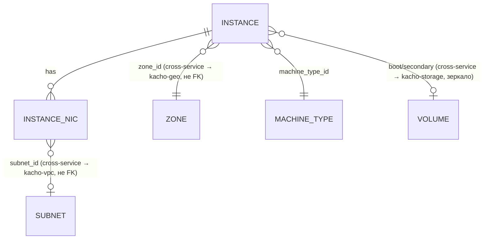

# 01 — Resources

Детально по каждому ресурсу: proto-поля, ID-префикс, status-enum, **полный**
список RPC (из `*_service.proto`) с пометкой реализован / `blocked:*` /
`Unimplemented`, ключевые инварианты, cross-resource links.

## Иерархия и связи



Текстовая модель:

```
Instance (1) ───┬─ machine_type_id ──→ MachineType (sizing-каталог, cluster-level)
   │            ├─ boot_volume / secondary_volumes ──→ Volume (kacho-storage)
   │            │     read-only зеркало: привязка живёт в `volume_attachments`
   │            │     у владельца, compute local attach-state НЕ держит
   ├─ network_interfaces[] (N): subnet_id, primary_v4_address,
   │     {one_to_one_nat: address}, security_group_ids[]
   └─ status: state-машина (см. 03-instance-lifecycle.md)

MachineType — cluster-level read-only справочник sizing (id `mt-…`)
Volume/Image/Snapshot/DiskType — блочное хранение, owner = kacho-storage (`/storage/v1`)
Region/Zone — публичный read-only справочник Geography (owner = kacho-geo)
```

Мутируемый ресурс компьюта один — Instance, он **project-level**
(`project_id` обязателен в Create). Все таблицы **flat** (без K8s envelope
`resource_version`/`generation`/`deletion_timestamp`/`finalizers`/`spec`/`status`
как JSONB). `cloud_id`/`organization_id` в схеме отсутствуют — фильтрация только
по `project_id` (как в VPC). Колонки `id` — `TEXT` (не UUID).

## Resource ID format

ID получают через `kacho-corelib/ids.NewID(<prefix>)` — 3 символа + 17-char
crockford-base32 (всего 20). Источник истины — `kacho-corelib/ids/ids.go`:

| Ресурс           | Prefix const                                              | Значение | Пример              |
|------------------|-----------------------------------------------------------|----------|---------------------|
| Instance         | `ids.PrefixInstance`                                      | `epd`    | `epd + 17 base32`   |
| MachineType      | `ids.PrefixMachineType`                                   | `mt-`    | `mt- + …` (hyphen)  |
| Operation (CMP)  | `ids.PrefixOperationCompute` (== `ids.PrefixInstance`)    | `epd`    | `epd + ...`         |
| Zone             | литерал-строка (`ru-central1-a` и т.п.)                   | —        | не prefix-id        |

**Все compute-операции** независимо от ресурса получают prefix `epd`
(`PrefixOperationCompute == PrefixInstance`) — api-gateway opsproxy маршрутизирует
`OperationService.Get(id)` по первым 3 символам, поэтому все операции домена
должны идти в один backend. `InternalMachineTypeService.Create` вернёт operation с
id `epd...`, внутри которого `response` = MachineType с id `mt-...` (как в VPC
`SubnetService.Create` → op `enp...`, внутри Subnet `e9b...`).

**Не валидировать id-формат sync** на входе RPC (`(length) = "<=50"` из proto —
max-длина, не format): well-formed-но-несуществующий id даёт
async `NotFound`, а malformed/wrong-prefix id → sync `InvalidArgument "invalid
<res> id '<X>'"` (probe 2026-05-11), у нас пока ловится на DB-уровне → `NotFound`
— расхождение, см. [`07-known-divergences.md`](07-known-divergences.md) §1.

---

## Instance

Единственный мутируемый ресурс compute. Project-level (`project_id`), zone-level
(`zone_id`), несёт **дискриминатор рода** (`instance_kind`: VM | CONTAINER) и ссылку на
sizing-каталог (`machine_type_id`), из которого выводится `effective_resources`.
Загрузочный источник — `boot_source` (том/образ/снимок у kacho-storage), блочное
хранение здесь НЕ живёт (владелец — kacho-storage). N сетевых интерфейсов — строки
`instance_network_interfaces`; сами интерфейсы как ресурс живут в kacho-vpc.

### proto-поля (`instance.proto`, message `Instance`)

Состав таблицы сверяется с дескриптором механически —
`services/compute/tools/resources_doc_census_test.go`: строка про поле, которого нет,
и действующее поле без строки одинаково валят гейт. До сверки таблица описывала
ДОРЕДИЗАЙНОВЫЙ ресурс: из 28 строк 10 называли снятые поля (`platform_id`,
`resources`, `metadata_options`, `gpu_settings`, `scheduling_policy`,
`service_account_id`, `placement_policy`, `host_group_id`/`host_id`,
`reserved_instance_pool_id`, `application`), а девять действующих — в том числе
несущие `instance_kind`, `machine_type_id`, `effective_resources`,
`cpu_guarantee_percent`, `vm_spec`/`container_spec` — не упоминались вовсе.

| Поле | № | Тип | Замечания |
|---|---|---|---|
| `id` | 1 | string | hyphen-канон `ins-<crockford-base32>` |
| `project_id` | 2 | string | partial UNIQUE `(project_id, name) WHERE name <> ''` |
| `created_at` | 3 | Timestamp | в ответе truncate до секунд |
| `name` | 4 | string | project-scoped label, mutable |
| `description` | 5 | string | ≤256 |
| `labels` | 6 | map<string,string> | ≤64 записей |
| `zone_id` | 7 | string | required; существование — peer-валидация в kacho-geo; immutable |
| `status` | 10 | Instance.Status | state-машина, см. [`03-instance-lifecycle.md`](03-instance-lifecycle.md) |
| `metadata` | 11 | map<string,string> | меняется только `UpdateMetadata`; **омитится из ответа List** (часть контракта) |
| `boot_disk` | 12 | AttachedDisk | read-only зеркало привязки тома; источник истины — `volume_attachments` у kacho-storage |
| `secondary_disks` | 13 | repeated AttachedDisk | то же зеркало |
| `network_interfaces` | 14 | repeated NetworkInterface | строки `instance_network_interfaces`; `nic_id` — id ресурса kacho-vpc, он источник истины |
| `fqdn` | 16 | string | output-only; `<hostname>.<region_id>.internal` либо `<id>.auto.internal` |
| `network_settings` | 19 | NetworkSettings | на входе Create **отвергается по имени** (ускорение сети сервис не настраивает) |
| `filesystems` | 21 | repeated AttachedFilesystem | домена Filesystem нет; `filesystem_specs` на входе Create **отвергается по имени** |
| `local_disks` | 22 | repeated AttachedLocalDisk | host-local диски не провижнятся; `local_disk_specs` на входе Create **отвергается по имени** |
| `serial_port_settings` | 24 | SerialPortSettings | на входе Create **отвергается по имени** |
| `maintenance_policy` | 29 | MaintenancePolicy | обслуживания хостов сервис не планирует; на входе Create **отвергается по имени** |
| `maintenance_grace_period` | 30 | Duration | то же |
| `hardware_generation` | 31 | HardwareGeneration | наследуется от boot-источника; nullable |
| `cpu_guarantee_percent` | 36 | int32 | доля гарантированного CPU; мутируется только на STOPPED |
| `instance_kind` | 37 | InstanceKind | **сильный первый дискриминатор** (VM \| CONTAINER), required на Create |
| `machine_type_id` | 38 | string | ссылка на MachineType-каталог; required; мутируется только на STOPPED |
| `effective_resources` | 39 | EffectiveResources | output-only, выводится из MachineType |
| `boot_source` | 40 | BootSource | `storage.image` \| `storage.snapshot` \| `storage.volume` — резолв у kacho-storage |
| `placement_group_id` | 41 | string | opaque passthrough-слаг; формат-валидация `plg-`; мутируется только на STOPPED |
| `status_reason` | 42 | string | output-only; причина текущего статуса |
| `service_account` | 43 | reference.Referrer | dependency-handle на служебную учётку (graceful-dangling) |
| `vm_spec` | 44 | VmSpec | ветвь `oneof spec` для `instance_kind = VM` |
| `container_spec` | 45 | ContainerSpec | ветвь `oneof spec` для `instance_kind = CONTAINER` |

(`hostname` из `CreateInstanceRequest` хранится в `instances.hostname` для
вычисления `fqdn` и не возвращается отдельным полем в `Instance`.)

> [!note] «Отвергается по имени» — это ИСХОД, а не пробел
> Поле публичного запроса обязано иметь читателя; сервис, который не смотрит на поле,
> не вправе принимать его молча. Перечисленные выше поля отвергаются синхронно
> (`INVALID_ARGUMENT` + имя поля в `BadRequest.field_violations`) — см.
> `internal/handler/instance_handler.go::RejectUnsupportedCreateFields` и лок
> `instance_create_unsupported_fields_test.go`. То же относится к четырём полям
> ВНУТРИ `network_interface_specs[]` (`primary_v4_address_spec`,
> `primary_v6_address_spec`, `nic_id`, `index`).

### RPC (`instance_service.proto`, service `InstanceService`)

| RPC | sync/async | статус | примечание |
|---|---|---|---|
| `Get` | sync | ✅ | `GET /compute/v1/instances/{instance_id}?view=` (BASIC/FULL — FULL включает metadata) |
| `List` | sync | ✅ | `GET /compute/v1/instances?projectId=`. metadata всегда омитится (часть контракта). filter — whitelist РОВНО `name=` (`instance_repo.go`: `filter.Parse(f.Filter, []string{"name"})`); любое другое имя поля → `INVALID_ARGUMENT` с именем поля. Расширение — COMP-3 вместе с индексом, см. `07-known-divergences.md` §12 |
| `Create` | async | ✅ | required `zone_id`/`instance_kind`/`machine_type_id`/`boot_source` + ветвь `oneof spec` по роду. metadata `CreateInstanceMetadata{instance_id}`, response `Instance`. ⚠️ **без авто-NIC** (`KAC-266`): интерфейсы на Create не материализуются, привязка явная (`AttachNetworkInterface`). Легаси-поля запроса **отвергаются по имени**, синхронно и первым стейтментом: `network_settings`, `filesystem_specs`, `local_disk_specs`, `maintenance_policy`, `maintenance_grace_period`, `serial_port_settings`, `ssh_public_keys` + четыре поля внутри `network_interface_specs[]` (`primary_v4_address_spec`, `primary_v6_address_spec`, `nic_id`, `index`). Снятые редизайном `platform_id`/`resources_spec`/`boot_disk_spec` зарезервированы в proto по номеру И имени — вернуться не могут. end status `RUNNING` |
| `Update` | async | ✅ | metadata `UpdateInstanceMetadata`, response `Instance`. mutable свободно: `name`/`description`/`labels`. Только при `STOPPED` (F10): `machine_type_id`/`cpu_guarantee_percent`/`placement_group_id`, иначе `FailedPrecondition`. `metadata` — только через `UpdateMetadata`. immutable: `zone_id`/`instance_kind`/`boot_source` |
| `Delete` | async | ✅ | metadata `DeleteInstanceMetadata`, response `Empty`. worker: обрабатывает attached disks по `auto_delete` (true → DELETE disk; false → строка `attached_disks` чистится CASCADE при DELETE instance), для каждого NIC с непустым `nic_id` — delete kacho-vpc `NetworkInterface` (release его Address-ресурсов; best-effort vpcClient), DELETE instance (CASCADE чистит NIC-строки + attached_disks), освобождает one_to_one_nat addresses (best-effort vpcClient) |
| `UpdateMetadata` | async | ✅ | `POST /compute/v1/instances/{instance_id}/updateMetadata` body `{delete:[], upsert:{}}`. metadata `UpdateInstanceMetadataMetadata`, response `Instance`. status unchanged |
| `GetSerialPortOutput` | **sync** | ✅ (синтетика) | `GET /compute/v1/instances/{instance_id}:serialPortOutput?port=1..4`. response `GetInstanceSerialPortOutputResponse{contents}` — синтетический текст (НЕ операция) |
| `Stop` | async | ✅ | `POST /compute/v1/instances/{instance_id}:stop`. precondition `status ∈ {RUNNING}` → end `STOPPED`. metadata `StopInstanceMetadata`, response `Empty` |
| `Start` | async | ✅ | precondition `status ∈ {STOPPED}` → end `RUNNING`. metadata `StartInstanceMetadata`, response `Instance` |
| `Restart` | async | ✅ | precondition `status ∈ {RUNNING}` → end `RUNNING`. metadata `RestartInstanceMetadata`, response `Empty` |
| `AttachDisk` | async | ✅ | `POST :attachDisk` body `{attached_disk_spec}`. precondition `status ∈ {RUNNING, STOPPED}`; disk READY & same zone & not attached. metadata `AttachInstanceDiskMetadata{instance_id, disk_id}`, response `Instance`. status unchanged |
| `DetachDisk` | async | ✅ | `POST :detachDisk` body `oneof {disk_id, device_name}` (`exactly_one`). precondition `status ∈ {RUNNING, STOPPED}`; disk attached & not boot. metadata `DetachInstanceDiskMetadata`, response `Instance` |
| `AddOneToOneNat` | async | ✅ | `POST /addOneToOneNat` body `{network_interface_index, internal_address?, one_to_one_nat_spec?}`. precondition `status ∈ {RUNNING, STOPPED}`; NIC index valid. metadata `AddInstanceOneToOneNatMetadata`, response `Instance` |
| `RemoveOneToOneNat` | async | ✅ | `POST /removeOneToOneNat` body `{network_interface_index, internal_address?}`. precondition как у Add. metadata `RemoveInstanceOneToOneNatMetadata`, response `Instance` |
| `UpdateNetworkInterface` | async | ✅ | `PATCH /updateNetworkInterface` body `{network_interface_index, update_mask, subnet_id?, primary_v4_address_spec?, primary_v6_address_spec?, security_group_ids?}`. metadata `UpdateInstanceNetworkInterfaceMetadata`, response `Instance`. OCC через `xmin` (read-modify-write). Precondition-семантика ещё не закреплена |
| `AttachNetworkInterface` | async | ✅ | `POST :attachNetworkInterface` body `{network_interface_index, subnet_id, primary_v4_address_spec?, security_group_ids[]}`. proto: instance должен быть `STOPPED`. metadata `AttachInstanceNetworkInterfaceMetadata`, response `Instance` |
| `DetachNetworkInterface` | async | ✅ | `POST :detachNetworkInterface` body `{network_interface_index}`. proto: instance `STOPPED`. metadata `DetachInstanceNetworkInterfaceMetadata`, response `Instance` |
| `ListOperations` | sync | ✅ | `GET /compute/v1/instances/{instance_id}/operations` |
| `Relocate` | async | 🚫 blocked | `POST :relocate` body `{destination_zone_id, network_interface_specs[1], boot_disk_placement?, secondary_disk_placements[]}`. metadata `RelocateInstanceMetadata`, response `Instance`. Нужен cross-zone disk move + restart-семантика → `Unimplemented` / частично |
| `SimulateMaintenanceEvent` | async | ⏭️ no-op | `POST :simulateMaintenanceEvent`. metadata `SimulateInstanceMaintenanceEventMetadata`, response `Empty`. operation сразу done |
| `ListAccessBindings` | — | ⚠️ объявлен, обработчика НЕТ | тип запроса не принимает ни одна сигнатура прод-кода → RPC отвечает `Unimplemented` (12). Права выдаются kacho-iam (`AccessBindingService`), не здесь |
| `SetAccessBindings` | — | ⚠️ объявлен, обработчика НЕТ | то же: `Unimplemented` (12) |
| `UpdateAccessBindings` | — | ⚠️ объявлен, обработчика НЕТ | то же: `Unimplemented` (12) |

### Инварианты

- `Create`: ⚠️ **без авто-NIC** — auto-NIC материализация (`materializeNICs`)
  удалена в `KAC-266`: per-NIC валидация (subnet/SG/NAT-address) и создание
  kacho-vpc `NetworkInterface` больше не выполняются, инстанс создаётся без
  сетевых интерфейсов; правильная сетевая модель — будущая переделка. boot
  source — `storage.image` / `registry.image` / том kacho-storage по id;
  inline-создание диска на attach снято с контракта вместе с дублем блочного
  хранения. Insert instance в **одной транзакции** worker'а, затем outbox
  `Instance CREATED`.
- Ровно один boot-disk (`attached_disks_boot_uniq` partial UNIQUE на
  `instance_id WHERE is_boot`). `device_name` уникален в пределах instance
  (`attached_disks_device_uniq` partial UNIQUE на `(instance_id, device_name)
  WHERE device_name <> ''`).
- Размер инстанса задаётся ссылкой `machine_type_id` на каталожную запись; валидация —
  резолв ссылки (`internal/apps/kacho/api/instance/instance.go`, `resolveMachineType`)
  против каталога (`internal/apps/kacho/api/machinetype/machine_type.go`), а сами
  величины приезжают output-only зеркалом `EffectiveResources`. Прежняя редакция
  описывала посемейственную валидацию сырого описания ресурсов и ссылалась на
  файл-таблицу платформ: поле снято с контракта (`reserved` в
  `proto/kacho/cloud/compute/v1/instance_service.proto`), файла нет, имя не цитируется.
- `status_message` поле — всегда пусто (control-plane).
- State-машина статуса — [`03-instance-lifecycle.md`](03-instance-lifecycle.md).

### Cross-resource links

- `boot_volume` / `secondary_volumes` — **read-only зеркало**: привязка тома к
  инстансу живёт в `volume_attachments` у владельца-storage, compute local
  attach-state не держит (миграция 0013 сняла `attached_disks`).
- `network_interfaces[].nic_id` → VPC `NetworkInterface` (НЕ FK; source of truth
  для интерфейса). ⚠️ `Instance.Create` **больше не создаёт и не привязывает NIC**
  (auto-NIC материализация `materializeNICs` удалена в `KAC-266`; инстанс
  создаётся без сетевых интерфейсов, правильная сетевая модель — будущая
  переделка). На `Instance.Delete` — delete NIC (если `nic_id` непустой).
- `network_interfaces[].subnet_id` → VPC `Subnet` (НЕ FK; в proto-ответе — denorm-зеркало
  kacho-vpc NIC).
- `network_interfaces[].security_group_ids[]` → VPC `SecurityGroup` (НЕ FK; denorm-зеркало).
- `network_interfaces[].primary_v4_address.one_to_one_nat.address` → VPC
  `Address` (НЕ FK; при Remove/Delete освобождается best-effort).
- `instances.project_id` → kacho-iam `Project` (НЕ FK, валидируется gRPC).
- `boot_source` (`storage.image` / `registry.image`) → peer-резолв у владельца
  (kacho-storage / kacho-registry), не локальная таблица.

---

## Region / Zone — сняты со сервинга (этап S7)

Здесь стояли два раздела с полями и RPC `Region`/`Zone` и утверждение «kacho-compute —
owner Geography». С этапа S7 это неверно: Geography — домен **kacho-geo**
(`/geo/v1/regions`, `/geo/v1/zones`); таблиц `regions`/`zones` у compute нет, а
`Instance.zone_id` проверяется peer-вызовом к geo. Разделы удалены, а не снабжены
оговоркой: описание чужого домена в документе сервиса читается как «это здесь»,
сколько бы оговорок к нему ни приписали.

## Что не compute-ресурс, но рядом живёт

- `operations` — per-сервисная таблица long-running operations (схема как у
  corelib `0001_operations.sql`, включена в `0001_initial.sql`). prefix `epd`.
- `compute_outbox` / `compute_watch_cursors` — outbox-таблица событий
  (`resource_kind` ∈ {Instance}, `event_type` ∈
  {CREATED, UPDATED, DELETED}) + триггер `compute_outbox_notify_trg` →
  `pg_notify('compute_outbox', sequence_no::text)`. Подписчик —
  `InternalWatchService.Watch`. См. [`05-database.md`](05-database.md).
