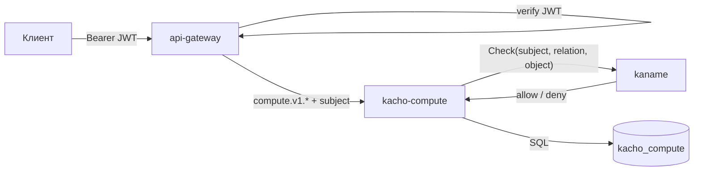

import { Codes } from '@site/src/components/commonBlocks/Codes'
import { Restrictions } from '@site/src/components/commonBlocks/Restrictions'
import { RESTRICTIONS } from '@site/src/constants/restrictions'
import CodeBlock from '@theme/CodeBlock'
import dedent from 'ts-dedent'

# Обзор API

Эта страница описывает **конвенции**, общие для всего публичного API Kachō Compute: REST-пути
и suffix-actions, формат JSON, аутентификацию и авторизацию, асинхронную модель `Operation`,
формат ошибок, дисциплину `update_mask`, пагинацию, фильтрацию, формат идентификаторов и
точность временных меток. Конкретные поля и операции каждого ресурса — на отдельных страницах
раздела (см. [Instance](/api/instance), [MachineType](/api/machine-type)).

:::info Единый контракт — gRPC, REST — проекция
Источник истины — Protocol Buffers в каталоге `proto/`. REST-поверхность строится через
**grpc-gateway**: каждый RPC аннотирован `google.api.http`. Семантика (коды ошибок, валидация,
async) одинакова для gRPC и REST; примеры ниже — в REST-форме (через `api-gateway`).
:::

:::tip Сначала — практика
Если вы только знакомитесь с сервисом, начните со сквозного примера в разделе
[Быстрый старт](/getting-started): он проходит путь от тома до запущенного инстанса. Эта
страница — справочник по конвенциям, общим для всех ресурсов.
:::

## Ресурсы и их назначение

Kachō Compute управляет **одним мутируемым ресурсом** (`Instance`) и одним
**read-only справочником** (`MachineType`). Блочное хранение (Volume / Image /
Snapshot / DiskType) принадлежит **kacho-storage** и живёт под `/storage/v1`.
Все ресурсы — плоские (flat):
domain-поля на верхнем уровне сообщения, без K8s-envelope. Мутируемые ресурсы project-level
(обязательный `projectId`).

<table>
  <thead><tr><th>Ресурс</th><th>Префикс</th><th>Бизнес-назначение</th><th>Поверхность</th></tr></thead>
  <tbody>
    <tr><td><strong>Instance</strong></td><td><code>ins-</code></td><td>Виртуальная машина: тип машины, источник загрузки, сетевые интерфейсы, жизненный цикл</td><td>public</td></tr>
    <tr><td><strong>MachineType</strong></td><td><code>mt-</code></td><td>Каталог типов машин: семейство, действующие ресурсы, доступность</td><td>public (read-only) · admin-CRUD на internal</td></tr>
  </tbody>
</table>

Постраничный справочник: [Instance](/api/instance), [MachineType](/api/machine-type).

## Два порта: public (9090) и internal (9091)

Сервис слушает **два независимых listener'а** с разной поверхностью и доверительной границей:

<table>
  <thead><tr><th>Порт</th><th>Listener</th><th>Кто ходит</th><th>Что доступно</th></tr></thead>
  <tbody>
    <tr><td><code>:9090</code></td><td>public</td><td>Tenant-клиенты через <code>api-gateway</code> (TLS + JWT)</td><td>Публичный <code>InstanceService</code> + read-only <code>MachineTypeService</code></td></tr>
    <tr><td><code>:9091</code></td><td>internal</td><td>Peer-сервисы и admin-UI (cluster-internal, mTLS)</td><td>Admin-CRUD справочника <code>MachineType</code>, outbox-stream <code>InternalMachineTypeService</code></td></tr>
  </tbody>
</table>

`Internal*`-сервисы **не публикуются** на external endpoint — даже их REST-проекция в
`api-gateway` доступна только на cluster-internal mux. Подробнее — [Авторизация и
приватность](/architecture/authz).

## REST-пути и suffix-actions

Ресурсы доступны по шаблону `/compute/v1/<resource>` (top-level camelCase:
`/compute/v1/instances`, `/compute/v1/machineTypes`). Стандартные CRUD-операции мапятся на
HTTP-методы; действия, не укладывающиеся в CRUD (`Start`, `Stop`, `AttachDisk`,
`GetLatestByFamily`, …), оформлены как **suffix-action** через `:verb` либо сегмент пути.

<table>
  <thead><tr><th>Операция</th><th>HTTP-метод</th><th>Шаблон пути</th><th>Тип</th></tr></thead>
  <tbody>
    <tr><td><code>Get</code></td><td><code>GET</code></td><td><code>/compute/v1/instances/&#123;id&#125;</code></td><td>sync</td></tr>
    <tr><td><code>List</code></td><td><code>GET</code></td><td><code>/compute/v1/instances</code></td><td>sync</td></tr>
    <tr><td><code>Create</code></td><td><code>POST</code></td><td><code>/compute/v1/instances</code></td><td><strong>async → Operation</strong></td></tr>
    <tr><td><code>Update</code></td><td><code>PATCH</code></td><td><code>/compute/v1/instances/&#123;id&#125;</code></td><td><strong>async → Operation</strong></td></tr>
    <tr><td><code>Delete</code></td><td><code>DELETE</code></td><td><code>/compute/v1/instances/&#123;id&#125;</code></td><td><strong>async → Operation</strong></td></tr>
    <tr><td>действие</td><td><code>POST</code></td><td><code>/compute/v1/instances/&#123;id&#125;:start</code></td><td><strong>async → Operation</strong></td></tr>
    <tr><td>дочерний список</td><td><code>GET</code></td><td><code>/compute/v1/instances/&#123;id&#125;/operations</code></td><td>sync</td></tr>
  </tbody>
</table>

:::note Формы действий
Часть действий использует `:verb` в конце пути (`:start`, `:attachDisk`, `:relocate`,
`:serialPortOutput`). Формы
зафиксированы в контракте и меняются только осознанно. `OperationService.Get` идёт по пути
`/operations/{id}` — **без** префикса `/compute/v1/`.
:::

## Формат JSON

Тело запроса и ответа — **JSON с camelCase-ключами** (`projectId`, `createdAt`, `zoneId`,
`machineTypeId`, `bootSource`). Это grpc-gateway-проекция proto-полей (в `.proto` —
`snake_case`). Перечисления (`status`) сериализуются как строковые константы (`RUNNING`,
`PROVISIONING`). Временные метки — RFC 3339 (`2026-06-06T14:27:00Z`).

:::caution Незнакомый ключ отбрасывается молча
REST-проекция игнорирует ключи, которых нет в контракте: запрос с полем, снятым в редизайне,
вернёт **успех**, а не ошибку — просто без этого поля. Поэтому опечатка в имени поля или
пример из устаревшего источника проявляются не отказом, а результатом не тем, о котором
просили. Сверяйтесь с таблицами тел запросов на страницах ресурсов.
:::

<CodeBlock language="json">
  {dedent`
    {
      "id": "{instanceId}",
      "projectId": "{projectId}",
      "name": "web-1",
      "zoneId": "region-1-a",
      "status": "RUNNING",
      "createdAt": "2026-06-06T14:27:00Z"
    }
  `}
</CodeBlock>

## Аутентификация

Все внешние запросы проходят через **`api-gateway`**, который проверяет **JWT** в заголовке
`Authorization: Bearer <token>`. Отсутствующий или невалидный токен → `UNAUTHENTICATED` (HTTP
`401`) — до того, как запрос дойдёт до доменного сервиса. Из валидного токена извлекается
субъект (account / service-account), который далее используется для авторизации.

<CodeBlock language="bash">
  {dedent`
    curl http://localhost:18080/compute/v1/instances/{instanceId} \\
      -H 'Authorization: Bearer <JWT>'
  `}
</CodeBlock>

## Авторизация

Авторизация — **per-RPC**, по отношению субъекта к ресурсу или его проекту.
Интерсептор перед выполнением метода проверяет, что субъект имеет нужное отношение (`relation`)
на целевой ресурс или его проект (`viewer` для чтения, `editor` для мутаций). Если отношения
нет → `PERMISSION_DENIED` (HTTP `403`). Проверка идёт к `kaname` (RPC
`InternalIAMService.Check`); вердикт о доступе вычисляет реляционная форма в базе iam по
модели прав. Недоступность peer-сервиса на
request-path — `UNAVAILABLE` (fail-closed для мутаций).

Публичный `List<Resource>` дополнительно **фильтрует** выдачу через listauthz — в списке
видны только те ресурсы, на которые у субъекта есть отношение. Подробнее —
[Авторизация](/architecture/authz).

## Асинхронные операции (Operation)

**Каждая мутация** (`Create` / `Update` / `Delete` и действия `Start` / `Stop` / `Restart` /
`AttachDisk` / `DetachDisk` / …) **синхронно возвращает `Operation`**, а не
сам ресурс. Реальная работа выполняется в worker-горутине; клиент **поллит**
`OperationService.Get(id)` до `done: true`.

<CodeBlock language="json">
  {dedent`
    {
      "id": "{operationId}",
      "description": "Create instance web-1",
      "createdAt": "2026-06-06T14:27:00Z",
      "done": false,
      "metadata": {
        "@type": "type.googleapis.com/kacho.cloud.compute.v1.CreateInstanceMetadata",
        "instanceId": "{instanceId}"
      }
    }
  `}
</CodeBlock>

Когда `done: true`, в `Operation` заполнено ровно одно из полей `oneof result`:

<table>
  <thead><tr><th>Поле</th><th>Тип</th><th>Содержимое</th></tr></thead>
  <tbody>
    <tr><td><code>response</code></td><td><code>google.protobuf.Any</code></td><td>Результат (созданный/изменённый ресурс; для <code>Delete</code>/<code>Stop</code>/<code>Restart</code> — <code>google.protobuf.Empty</code>)</td></tr>
    <tr><td><code>error</code></td><td><code>google.rpc.Status</code></td><td>Ошибка (если операция завершилась неудачей)</td></tr>
  </tbody>
</table>

`metadata` (`google.protobuf.Any`) — отдельное поле вне `oneof result`, заполнено с момента
создания операции. Подробнее о механике LRO — [Операции](/api/operations) и
[Операции (архитектура)](/architecture/operations).

:::tip Опрос результата
Поллите <code>GET /operations/&#123;operationId&#125;</code> с интервалом 2–5 с до <code>done: true</code>.
Префикс id операции маршрутизирует запрос в нужный backend (все Compute-операции — префикс <code>epd</code>).
Подписки на операции нет: исход мутации узнаётся поллом — всегда.
:::

:::tip Изменения машин доступны потоком
Журнал compute — владелец подписки платформы. Край проецирует его наружу одной ручкой
<code>GET /subscription/v1/events?owner=compute&amp;kinds=compute&#95;instance</code> (Server-Sent
Events): события несут род изменения и, у создания и правки, полное состояние машины. Опрос
<code>List</code> при этом остаётся штатным путём и работает всегда.

Вид предмета — <code>compute&#95;instance</code>: это **имя типа в модели прав**, и именно в этом
написании его принимает <code>kinds</code>. Слово, которым владелец записал строку в своём
журнале (<code>Instance</code>), наружу не выходит вовсе и осью не принимается — вид вне словаря
отвечает <code>400</code> с перечнем известных. Адрес, параметры, кадры и возобновление — в
документации api-gateway, страница «Подписка на изменения».
:::

## Формат ошибок

Ошибки возвращаются в формате **`google.rpc.Status`** — `{code, message, details[]}` —
единообразно для gRPC и REST. `code` — числовой gRPC-код (REST мапит его на HTTP-статус),
`message` — текст в стабильной формулировке Kachō (`"<Resource> %s not found"`, `"Instance
must be stopped"`; тексты — часть контракта, меняются только
осознанно через тикет), `details[]` — массив структурированных деталей (обычно пустой).

<CodeBlock language="json">
  {dedent`
    {
      "code": 5,
      "message": "Instance {instanceId} not found",
      "details": []
    }
  `}
</CodeBlock>

Для **синхронных** ошибок (валидация формата, авторизация, неизвестное поле mask, размер диска
вне диапазона) статус приходит сразу в HTTP-ответе мутации. Для **асинхронных** ошибок
(несуществующий project, недоступность peer-сервиса, нарушение precondition state-машины в
worker'е) мутация возвращает `Operation` с HTTP `200`, а ошибка появляется в `operation.error`
после `done: true`.

<Codes codes={['invalidArgument', 'notFound', 'alreadyExists', 'failedPrecondition', 'resourceExhausted', 'unavailable', 'unauthenticated', 'permissionDenied', 'internal']} />

:::note Исчерпание квоты — два разных отказа
Потолок на число ресурсов вида даёт **два** отказа, и они требуют разного действия:
`RESOURCE_EXHAUSTED` / **429** (признак `QUOTA_EXCEEDED`) — предел выбран, его нужно
**поднять**; `FAILED_PRECONDITION` / **400** (признак `QUOTA_NOT_PROVISIONED`) — предел не
назван вовсе, его нужно **завести**. Полосы различаются по `reason` в `details`, а не по
тексту сообщения. Свой предел и потребление — на странице [Квоты](/api/quotas).
:::

## Дисциплина update_mask

Каждый `Update`-RPC принимает `updateMask` (`google.protobuf.FieldMask`) — список изменяемых
полей.

<table>
  <thead><tr><th>Случай</th><th>Поведение</th></tr></thead>
  <tbody>
    <tr><td>mask содержит <strong>известное mutable</strong>-поле</td><td>поле применяется (валидируется по тем же правилам, что и при Create)</td></tr>
    <tr><td>mask содержит <strong>неизвестное</strong> поле</td><td><code>INVALID_ARGUMENT</code></td></tr>
    <tr><td>mask содержит <strong>hard-immutable</strong>-поле</td><td><code>INVALID_ARGUMENT</code> (<code>"&lt;field&gt; is immutable after &lt;Resource&gt;.Create"</code>)</td></tr>
    <tr><td>mask <strong>пустой / отсутствует</strong></td><td>full-PATCH: применяются все mutable-поля; immutable из тела <strong>silently игнорируются</strong></td></tr>
  </tbody>
</table>

Hard-immutable-поля зависят от ресурса: `projectId`, `Instance.zoneId`,
`Instance.instanceKind`. Полный перечень — на странице ресурса.

<Restrictions items={[{ label: 'updateMask', rules: RESTRICTIONS.updateMask }]} />

## Пагинация — cursor-based

`List`-RPC используют **курсорную** пагинацию по `(createdAt, id)` (ASC). Запрос принимает
`pageSize` и `pageToken`; ответ возвращает `nextPageToken` (пустая строка — последняя
страница). `pageToken` — opaque base64 от `{created_at, id}`; передавать его как есть.

<CodeBlock language="bash">
  {dedent`
    # первая страница
    curl 'http://localhost:18080/compute/v1/instances?projectId={projectId}&pageSize=50' \\
      -H 'Authorization: Bearer <JWT>'
    # следующая страница — подставить nextPageToken из ответа
    curl 'http://localhost:18080/compute/v1/instances?projectId={projectId}&pageSize=50&pageToken=<nextPageToken>' \\
      -H 'Authorization: Bearer <JWT>'
  `}
</CodeBlock>

<Restrictions items={[{ label: 'pagination', rules: RESTRICTIONS.pagination }]} />

## Фильтрация

`List`-RPC принимают `filter` в синтаксисе фильтрации Kachō. В текущей фазе поддерживается
единственный предикат — `name="<value>"` (точное совпадение по имени). Значение нужно
URL-кодировать.

<CodeBlock language="bash">
  {dedent`
    curl 'http://localhost:18080/compute/v1/instances?projectId={projectId}&filter=name%3D%22web-1%22' \\
      -H 'Authorization: Bearer <JWT>'
  `}
</CodeBlock>

## Формат идентификаторов

Идентификатор ресурса — `TEXT`, генерируется сервером (output-only) и **неизменяем на всю
жизнь ресурса**: операции смены id не существует. Ресурсы compute адресуются **дефисной**
формой — префикс, дефис и 17 символов crockford-base32. Id операции сохраняет **слитную**
форму: по его первым трём символам край маршрутизирует `OperationService.Get(id)` в нужный
backend.

<table>
  <thead><tr><th>Префикс</th><th>Ресурс</th><th>Пример</th></tr></thead>
  <tbody>
    <tr><td><code>ins-</code></td><td>Instance</td><td><code>ins-7t4w9e2x5h8mz0c3v</code></td></tr>
    <tr><td><code>mt-</code></td><td>MachineType</td><td><code>mt-k3xe746h019hnz182</code></td></tr>
    <tr><td><code>epd</code></td><td>Operation (Compute), слитно</td><td><code>epdk3xe746h019hnz182</code></td></tr>
    <tr><td><code>prj</code></td><td>Project (домен kaname; ссылка), слитно</td><td><code>prj9j6y00msn65vcfdq3</code></td></tr>
  </tbody>
</table>

:::note Обе формы валидны одновременно, и это не двусмысленность
Крокфордово тело дефиса не содержит, поэтому дефис — **однозначный** дискриминатор: старая
слитная форма и новая дефисная различаются по построению, а не по договорённости.

Формат own-owned id проверяется **синхронно, первым стейтментом RPC**: malformed →
`INVALID_ARGUMENT "invalid <res> id '<X>'"`, well-formed, но несуществующий → `NOT_FOUND`.
Разница смысловая: первый ввод валидным не станет никогда, второй мог бы существовать.
:::

<Restrictions items={[{ label: 'resourceId', rules: RESTRICTIONS.resourceId }]} />

## Точность временных меток

Все `createdAt` в proto-ответе **усечены до секунд** (`Truncate(time.Second)`) — это конвенция
Kachō. БД хранит микросекунды, но клиент видит только секундную точность
(`2026-06-06T14:27:00Z`, без долей).

## Публичные сервисы и их RPC

Ниже — карта публичных сервисов Compute и их методов с REST-маппингом. Мутации (выделены
жирным) возвращают `Operation`.

### InstanceService

<table>
  <thead><tr><th>RPC</th><th>REST</th><th>Тип</th></tr></thead>
  <tbody>
    <tr><td><code>Get</code></td><td><code>GET /compute/v1/instances/&#123;id&#125;</code></td><td>sync</td></tr>
    <tr><td><code>List</code></td><td><code>GET /compute/v1/instances</code></td><td>sync</td></tr>
    <tr><td><strong>Create</strong></td><td><code>POST /compute/v1/instances</code></td><td>async</td></tr>
    <tr><td><strong>Update</strong></td><td><code>PATCH /compute/v1/instances/&#123;id&#125;</code></td><td>async</td></tr>
    <tr><td><strong>Delete</strong></td><td><code>DELETE /compute/v1/instances/&#123;id&#125;</code></td><td>async</td></tr>
    <tr><td><strong>Start</strong></td><td><code>POST /compute/v1/instances/&#123;id&#125;:start</code></td><td>async</td></tr>
    <tr><td><strong>Stop</strong></td><td><code>POST /compute/v1/instances/&#123;id&#125;:stop</code></td><td>async</td></tr>
    <tr><td><strong>Restart</strong></td><td><code>POST /compute/v1/instances/&#123;id&#125;:restart</code></td><td>async</td></tr>
    <tr><td><code>GetSerialPortOutput</code></td><td><code>GET /compute/v1/instances/&#123;id&#125;:serialPortOutput</code></td><td>sync</td></tr>
    <tr><td><strong>AttachDisk</strong></td><td><code>POST /compute/v1/instances/&#123;id&#125;:attachDisk</code></td><td>async</td></tr>
    <tr><td><strong>DetachDisk</strong></td><td><code>POST /compute/v1/instances/&#123;id&#125;:detachDisk</code></td><td>async</td></tr>
    <tr><td><strong>AttachNetworkInterface</strong></td><td><code>POST /compute/v1/instances/&#123;id&#125;:attachNetworkInterface</code></td><td>async</td></tr>
    <tr><td><strong>DetachNetworkInterface</strong></td><td><code>POST /compute/v1/instances/&#123;id&#125;:detachNetworkInterface</code></td><td>async</td></tr>
    <tr><td><strong>AddOneToOneNat</strong></td><td><code>POST /compute/v1/instances/&#123;id&#125;/addOneToOneNat</code></td><td><strong>501 UNIMPLEMENTED</strong> (см. «Сетевые интерфейсы и NAT»)</td></tr>
    <tr><td><strong>RemoveOneToOneNat</strong></td><td><code>POST /compute/v1/instances/&#123;id&#125;/removeOneToOneNat</code></td><td><strong>501 UNIMPLEMENTED</strong> (см. «Сетевые интерфейсы и NAT»)</td></tr>
    <tr><td><strong>UpdateNetworkInterface</strong></td><td><code>PATCH /compute/v1/instances/&#123;id&#125;/updateNetworkInterface</code></td><td><strong>501 UNIMPLEMENTED</strong> (см. «Сетевые интерфейсы и NAT»)</td></tr>
    <tr><td><code>ListOperations</code></td><td><code>GET /compute/v1/instances/&#123;id&#125;/operations</code></td><td>sync</td></tr>
  </tbody>
</table>

### OperationService

Кросс-доменный сервис для опроса асинхронных операций. Путь — **без** `/compute`-префикса
(`/operations/...`): api-gateway маршрутизирует по префиксу id операции (Compute-операции —
`epd`).

<table>
  <thead><tr><th>RPC</th><th>REST</th><th>Тип</th></tr></thead>
  <tbody>
    <tr><td><code>Get</code></td><td><code>GET /operations/&#123;id&#125;</code></td><td>sync</td></tr>
    <tr><td><strong>Cancel</strong></td><td><code>POST /operations/&#123;id&#125;:cancel</code></td><td>sync</td></tr>
  </tbody>
</table>

:::tip Дальше
Конкретные поля, тела запросов, примеры и ресурс-специфичные коды ошибок — на страницах
ресурсов: [Instance](/api/instance) и [MachineType](/api/machine-type). Блочное хранение
(Volume / Image / Snapshot / DiskType) документировано на стороне владельца — kacho-storage.
:::
