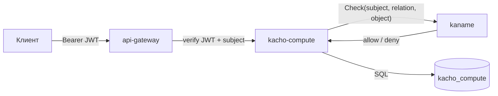

# Авторизация и приватность

Эта страница описывает модель безопасности kacho-compute: аутентификацию, авторизацию per-RPC,
границу public/internal и защиту инфра-чувствительных данных. Инвариант платформы Kachō —
**никаких неаутентифицированных и неавторизованных запросов ни на одном порту**.

## Аутентификация (AuthN)

- **Внешние клиенты** (`user → edge`): TLS + **JWT**. `api-gateway` проверяет
  `Authorization: Bearer <token>`; отсутствующий/невалидный токен → `UNAUTHENTICATED` (401)
  ещё до доменного сервиса. Из токена извлекается субъект (account / service-account).
- **Peer-сервисы** (`service → service`): **mTLS** (verified client-cert). Внутренний listener
  `:9091` не освобождён — mTLS обязателен и там.

Plaintext/insecure-gRPC в проде запрещён. dev-mode «anonymous → full access» допустим только в
локальных unit/integration-фикстурах — в развёрнутом стенде каждый запрос проходит AuthN.

## Авторизация (AuthZ) — per-RPC вердикт о доступе

Каждый RPC (public **и** internal) проходит per-RPC **Check**: kacho-compute вызывает
`InternalIAMService.Check` в kaname, а тот вычисляет вердикт о доступе реляционной формой
в собственной базе по модели прав. Интерсептор проверяет, что субъект имеет нужное отношение
(`relation`) на целевой ресурс или его проект:

- **read** (`Get` / `List`) — отношение `viewer`-tier;
- **мутации** (`Create` / `Update` / `Delete` / lifecycle-действия) — `editor`-tier.

Нет отношения → `PERMISSION_DENIED` (403). Недоступность kaname на request-path →
`UNAVAILABLE` (fail-closed для мутаций).

:::note Исключение ровно одно — и оно авторизует данными, а не отсутствием вопроса
`OperationService.Get` и `Cancel` объявлены в контракте как `<exempt>`: в модели прав нет
типа объекта под операцию, поэтому вопрос «есть ли у вас отношение к этой операции» **не
имеет пути** — он отверг бы даже поллинг тем, кто мутацию и запустил.

Отсутствие подходящего объекта в модели — основание не звать интерсептор, но **не**
основание не принимать решения о доступе. Поэтому доступ здесь решается **данными**:
предикат владельца стоит в самом SQL, запрос без опознанного принципала владельцем не
считается, а не-владелец и несуществующая операция получают **одинаковый** `NOT_FOUND` —
ответ не сообщает, существует ли операция.

Догадаться до чужого `operationId` при этом недостаточно: непрозрачный идентификатор — это
capability, а не право. Его энтропия защищает от перебора и ни от чего больше.
:::

## Регистрация владения ресурсом

При создании ресурса kacho-compute регистрирует владение **через kaname**
(`InternalIAMService.RegisterResource`) — модуль не пишет в модель прав напрямую. Запись
идемпотентна, at-least-once через transactional-outbox (drainer). Так создатель ресурса и
члены проекта получают доступ по модели прав.

## Фильтрация List

Публичный `List` не просто проверяет доступ к вызову, но и **фильтрует выдачу**. Предикат
членства страницы — **то же отношение `v_get`**, которым гейтится одиночный `Get`: строка
попадает в список тогда и только тогда, когда вызывающий вправе её прочитать.

Так сделано потому, что `List` возвращает **то же сообщение ресурса**, что и `Get`: членство в
странице раскрывает содержимое целиком, а не только факт существования, поэтому «видно в
перечне без содержимого» на этой выдаче нереализуемо. Страница читается курсором из своей БД,
затем модель спрашивается про идентификаторы **этой** страницы батчами, под бюджетом запроса.
Вызывающий не назван → `UNAUTHENTICATED` безусловно; ошибка модели → fail-closed.

## Граница public / internal

| Listener | Кто ходит | Что доступно |
|---|---|---|
| `:9090` public | tenant через api-gateway (TLS+JWT) | `InstanceService` + read-only `MachineTypeService` |
| `:9091` internal | peer-сервисы / admin (mTLS) | admin-CRUD каталога (`InternalMachineTypeService`), `InternalMachineTypeService` |

`Internal*`-сервисы **не публикуются** на external TLS endpoint. Их REST-проекция в
api-gateway доступна только на cluster-internal mux. Так admin-функции (управление каталогом
типов машин) не попадают на публичную поверхность — даже скомпрометированный публичный API их
не откроет.

:::note Карта прав сверяется с контрактом вычислением, а не глазами
Одна и та же проверка выполняется дважды: шлюз судит по **сгенерированному каталогу прав**, а
сервис перепроверяет по своей карте. Расхождение между ними означает, что действующее правило —
**пересечение** двух, и оно отвергает ровно тех, кого каталог допускает. Поэтому карта сервиса
сверяется с каталогом **гейтом**, который берёт предмет из контракта, а не из выписанного рукой
списка: новое расхождение роняет сборку, и **снятое** расхождение роняет её тоже — послабление
не может пережить свою причину.
:::

## Инфра-чувствительные данные

Публичная проекция ресурса показывает только tenant-facing «намерение и результат»: id, name,
labels, привязки (project / zone / диски / сеть), статус. Данные, которые помогают
картировать физику и data-plane (на каком хосте лежит инстанс, host-группы), на публичной
поверхности **не раскрываются**.

:::note Placement убран из публичного Instance
Поля привязки инстанса к физическому хосту и host-группе исключены из публичного сообщения
`Instance` (defense-in-depth): раскрытие placement — разведка для lateral movement (tenant не
должен вывести «мой и чужой инстанс на одном железе»). Если такие данные нужны админ-инструментам,
они живут только на internal-проекции за `Internal*` API.
:::
