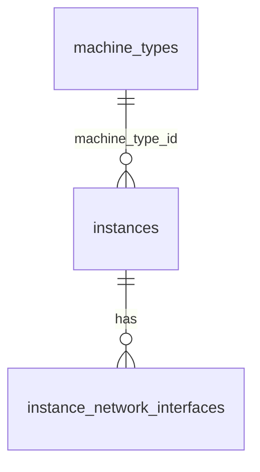

# Модель данных

Эта страница описывает **как данные хранятся и связаны** внутри kacho-compute: таблицы схемы
`kacho_compute`, внешние ключи, статусы и ID-префиксы. Пользовательский контракт (поля, RPC) —
на страницах ресурсов раздела [API](/api/overview); здесь — внутренняя проекция.

## Схема и таблицы

Все данные живут в схеме **`kacho_compute`** одной базы (database-per-service). Таблицы
плоские (без K8s-envelope), id-колонки — `TEXT`. Ключевые таблицы:

| Таблица | Роль |
|---|---|
| `instances` | Инстансы (виртуальные машины) |
| `instance_network_interfaces` | Сетевые интерфейсы инстанса (зеркало NIC из kacho-vpc) |
| `machine_types` | Каталог типов машин (публично read-only, admin-CRUD на internal-порту) |
| `operations` | Записи асинхронных операций (LRO; общая модель corelib) |
| `compute_outbox` | Transactional outbox событий |
| `compute_fga_register_outbox` | Очередь регистрации authz-объектов (owner-tuple) |

:::info Блочного хранения здесь нет
Таблиц `disks` / `images` / `snapshots` / `disk_types` / `attached_disks` в схеме **больше
нет** — они удалены миграциями `0013`, `0021`, `0022`. Владелец блочного хранения —
**kacho-storage**, и связь «инстанс ↔ том» живёт **у него**, а не здесь. На инстансе остаётся
только read-only зеркало присоединённого тома, которое мягко деградирует при исчезновении
источника.
:::

## Связи (ER)

### Внешние ключи (same-DB only)

| Связь | FK | ON DELETE | Смысл |
|---|---|---|---|
| `instances.machine_type_id → machine_types` | да | **RESTRICT** | Тип машины нельзя удалить, пока на нём есть инстансы |
| `instance_network_interfaces.instance_id → instances` | да | **CASCADE** | NIC-строки — same-table children инстанса |

### Ссылки без FK

Через границу сервиса FK невозможен (database-per-service). Эти ссылки — просто `TEXT`,
валидируются на request-path вызовом сервиса-владельца:

| Ссылка | Owner | Валидация |
|---|---|---|
| `instances.project_id` | kaname | `ProjectService.Get` на Create |
| `instances.zone_id` | kacho-geo | `ZoneService.Get` на Create |
| `instances.service_account_id` | kaname | резолв на Create |
| источник загрузки (`boot_source`) и присоединённые тома | kacho-storage | резолв на Create / attach; связь хранится у владельца-storage |
| `instance_network_interfaces.subnet_id` / `security_group_ids` | kacho-vpc | валидация NIC-spec на Create; зона подсети обязана совпадать с зоной инстанса |

:::note Зеркало — не источник истины
Поля чужих доменов на инстансе (имя тома, адрес NIC) — **output-only зеркало**, обновляемое на
чтении. Источник истины — сервис-владелец. Consumer обязан переживать dangling-ref: исчезнувшая
ссылка даёт деградированный статус, а не отказ.
:::

## Статусы ресурсов

| Ресурс | Значения `status` |
|---|---|
| **Instance** | `PROVISIONING`, `RUNNING`, `STOPPING`, `STOPPED`, `STARTING`, `RESTARTING`, `UPDATING`, `ERROR`, `CRASHED`, `DELETING` |
| **MachineType** | `AVAILABLE`, `DEPRECATED`, `RETIRED` |

Instance проходит детерминированную state-машину (см.
[Жизненный цикл Instance](/architecture/instance-lifecycle)). Статус типа машины — про
доступность каталога: `AVAILABLE` бронируется свободно, `DEPRECATED` ещё запускается, но не
рекомендуется, `RETIRED` отвергается на `Instance.Create`.

## ID-префиксы

Идентификаторы обоих ресурсов — **дефисной формы**: префикс, дефис и 17 символов
crockford-base32 (`pkg/ids`).

| Ресурс | Префикс | Пример |
|---|---|---|
| Instance | `ins-` | `ins-7t4w9e2x5h8mz0c3v` |
| MachineType | `mt-` | `mt-k3xe746h019hnz182` |
| Operation (Compute) | `epd` (слитно) | `epdk3xe746h019hnz182` |

:::note Почему у операций префикс другой
Id ресурсов мигрировали на дефисную форму, а compute-`Operation` сохраняют legacy-форму `epd` —
по ней api-gateway маршрутизирует `OperationService.Get` в этот backend. Обе формы валидны:
крокфордово тело дефиса не содержит, поэтому дефис однозначно различает их.

Id **неизменяем на всю жизнь ресурса** — операции смены id не существует. В URL и ссылки
попадает только он; `name` остаётся косметическим project-scoped ярлыком и может меняться.
:::

## Ошибки и маппинг SQLSTATE

Сервисный слой транслирует repo-sentinel'ы и SQLSTATE в gRPC-коды (единая точка —
`internal/apps/kacho/shared/serviceerr/maperr.go`). Тексты — часть контракта (стабильны):

| Условие | SQLSTATE | gRPC | Текст (пример) |
|---|---|---|---|
| Не найдено | — | `NOT_FOUND` | `"<Resource> <id> not found"` |
| Дубль `(project_id, name)` | `23505` | `ALREADY_EXISTS` | — |
| Тип машины не существует | — | `FAILED_PRECONDITION` | `"machine type %s not found"` |
| Тип машины снят с каталога | — | `FAILED_PRECONDITION` | `"machine type %s is retired and cannot be used on Create"` |
| Precondition state-машины | — | `FAILED_PRECONDITION` | `"Instance is not running"` / `"Instance is not running or stopped"` |
| Внутренняя ошибка БД | — | `INTERNAL` | `"internal database error"` (без leak pgx/SQL) |

## Миграции

Схема версионируется goose (`internal/migrations/*.sql`, embed.FS). `0001_initial.sql` —
squashed baseline; дальше схема **сужалась**, а не только росла: Geography ушла в kacho-geo
(`0011`), блочное хранение — в kacho-storage (`0013`, `0021`, `0022`), на смену свободной
паре «платформа + ресурсы» пришёл каталог типов машин (`0015`–`0017`).

Применённые миграции **не редактируются** — только новые. Поэтому `CREATE TABLE` удалённой
таблицы остаётся в истории рядом со своим `DROP TABLE`: это и есть запись о том, что ресурс
был и снят, а не след недоделанной работы. Каждое удаление проходит через манифест
(`internal/migrations/dropguard.json`), который называет таблицу, причину и ожидаемое число
строк — удаление, не совпавшее с заявленным, не проходит.
