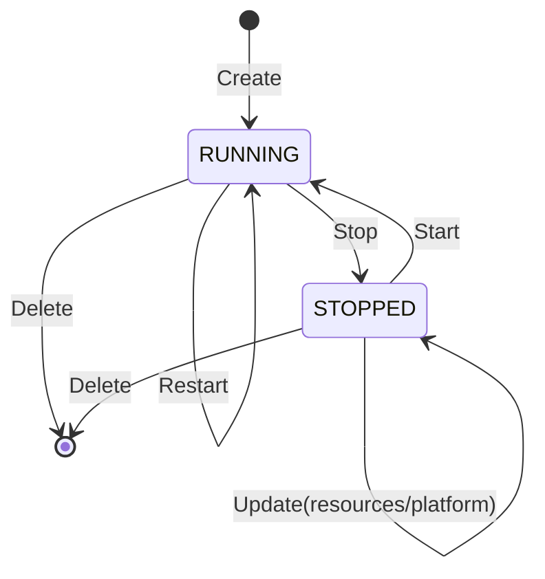
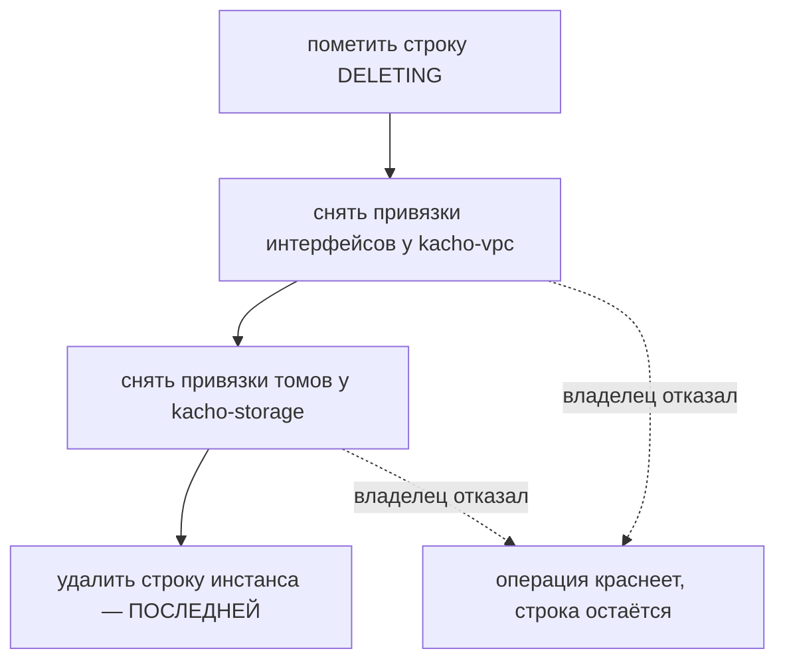

# Жизненный цикл Instance

Инстанс проходит через набор состояний (`status`), а переходы между ними имеют **явные
предусловия**. Эта страница описывает state-машину: какие статусы бывают, какие RPC переводят
инстанс из одного состояния в другое и какие ошибки возвращаются при нарушении предусловий.

:::info Control-plane имитация
Реального гипервизора нет. Статус переводится **детерминированно внутри worker'а операции**:
проверяется предусловие, статус меняется на конечное значение в той же транзакции — без таймеров
и промежуточных «переходных» задержек. Поэтому `Stop` сразу приводит к `STOPPED`, `Start` — к
`RUNNING`. Переходные статусы (`STOPPING`, `STARTING`, …) существуют в модели, но в
control-plane инстанс не задерживается в них наблюдаемо.
:::

## Статусы

| Статус | Значение |
|---|---|
| `PROVISIONING` | Идёт выделение ресурсов (фаза Create) |
| `RUNNING` | Инстанс работает — нормальное рабочее состояние |
| `STOPPING` / `STARTING` / `RESTARTING` | Переходные состояния операций Stop / Start / Restart |
| `STOPPED` | Инстанс остановлен |
| `UPDATING` | Применяются изменения |
| `ERROR` | Ошибочное состояние |
| `CRASHED` | Аварийное завершение |
| `DELETING` | Идёт удаление |

## Диаграмма переходов

## Таблица переходов и предусловий

| RPC | Предусловие (иначе `FAILED_PRECONDITION`) | Конечный статус | `response` |
|---|---|---|---|
| `Create` | — | `PROVISIONING` | Instance |
| `Start` | статус ∈ {`STOPPED`} | `RUNNING` | Instance |
| `Stop` | статус ∈ {`RUNNING`} | `STOPPED` | Empty |
| `Restart` | статус ∈ {`RUNNING`} | `RUNNING` | Empty |
| `Update` (`machineTypeId` / `cpuGuaranteePercent` / `placementGroupId`) | статус ∈ {`STOPPED`} | без изменения | Instance |
| `Update` (name / labels / …) | любой | без изменения | Instance |
| `AttachDisk` | статус ∈ {`RUNNING`, `STOPPED`}; том готов, та же зона, не присоединён | без изменения | Instance |
| `DetachDisk` | статус ∈ {`RUNNING`, `STOPPED`}; том присоединён и не загрузочный | без изменения | Instance |
| `AttachNetworkInterface` · `DetachNetworkInterface` | статус ∈ {`STOPPED`} | без изменения | Instance |
| `AddOneToOneNat` · `RemoveOneToOneNat` · `UpdateNetworkInterface` | статус ∈ {`RUNNING`, `STOPPED`}; корректный индекс интерфейса | без изменения | Instance |
| `GetSerialPortOutput` | любой (синхронный read, не операция) | — | contents |
| `Delete` | любой | (удалён) | Empty |

:::note `Create` закрепляет `PROVISIONING`, а не `RUNNING`
Операция создания считается завершённой, когда строка инстанса **закоммичена** — это и есть
предмет мутации. Запуск машины — отдельный переход (`Start`), а не часть создания.
:::

## Канонические тексты ошибок

Тексты предусловий — **часть контракта Kachō** (стабильны, проверяются регрессионными тестами):

| Ситуация | Текст |
|---|---|
| Изменение размера / размещения не остановленного инстанса | `"instance must be STOPPED to change sizing or placement"` |
| `Start` не остановленного инстанса | `"Instance is not stopped"` |
| `Stop` / `Restart` не работающего инстанса | `"Instance is not running"` |
| Операция над интерфейсом в неподходящем состоянии | `"Instance is not running or stopped"` |
| Попытка отсоединить загрузочный том | `"boot volume cannot be detached"` |
| Тип машины не существует / снят с каталога | `"machine type %s not found"` · `"machine type %s is retired and cannot be used on Create"` |

## Удаление — сага, у которой строка снимается последней

`Instance.Delete` — hard-delete, но не одним стейтментом: интерфейсы и тома принадлежат
**другим сервисам**, и снять привязку у владельца обязан потребитель — владелец сам об этом
не спросит. Порядок шагов выбран под отказ и под крах процесса:

Три свойства этого порядка, каждое намеренное:

- **Строка удаляется последней.** Списки привязок резолвятся у владельцев **по id машины**;
  без её строки не осталось бы ничего, по чему их найти.
- **Отказ владельца не проглатывается.** Операция завершается ошибкой, строка остаётся на
  месте — повторный `Delete` доводит дело до конца. Списки пересчитываются у владельцев на
  каждом прогоне, поэтому повтор идемпотентен: уже снятая привязка возвращается пустым списком.
- **Крах процесса не оставляет машину в `DELETING` навсегда.** Разрешитель осиротевших
  операций рабочую функцию не перезапускает — он лишь приводит статус операции в соответствие
  закоммиченной реальности. Поэтому в сервисе есть отдельный добиватель незавершённых
  удалений: без него занятый том нельзя было бы присоединить к другой машине, а занятый
  интерфейс удерживал бы адрес из ограниченного пула — и при этом ошибки не было бы ни у кого.

:::note Что делает с томом флаг `autoDelete`
Флаг задаётся при присоединении и хранится в записи привязки **у kacho-storage**. Инстанс
удалить том не может: в его клиенте к хранилищу есть только присоединить, отсоединить и
перечислить — операции удаления тома там нет. Прежняя редакция этой страницы рисовала ветку
«`autoDelete = true` → запросить удаление тома»: такого вызова в дереве нет ни на одной
стороне.
:::

Освобождения внешних адресов на этом пути тоже нет: `Instance.Delete` в kacho-vpc снимает
привязку интерфейса, а не адреса.

:::note Все переходы — через Operation
Каждый переход инициируется мутирующим RPC, который возвращает `Operation`. Наблюдаемое
изменение статуса появляется только после `done: true`. Поллите операцию или `Get` инстанса:
подписки на операции нет. Смену статуса самой машины видно и в потоке изменений (событие
`UPDATED` вида `Instance`), но исход операции по нему не восстанавливается — у провалившейся
мутации события нет. Подробнее — [Операции](/architecture/operations).
:::
