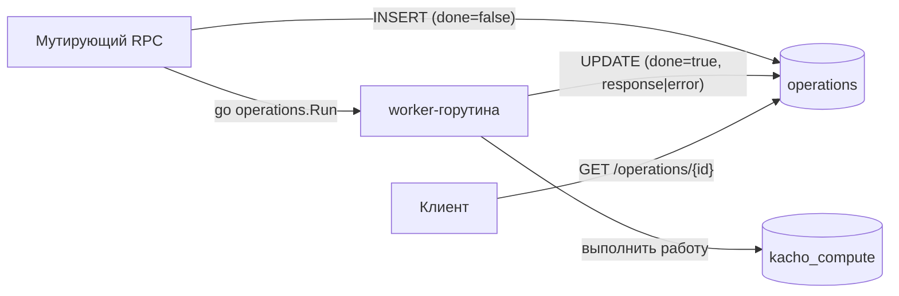
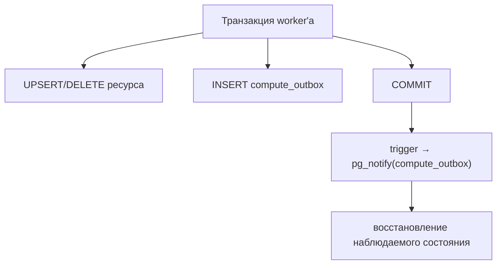

# Операции (внутренняя механика)

Эта страница объясняет, **как реализованы** асинхронные операции (LRO) внутри kacho-compute:
таблица `operations`, worker-модель, transactional outbox и поток событий. Пользовательский
контракт `Operation` (поля, поллинг) — на странице [Operations (LRO)](/api/operations); здесь —
про внутреннее устройство.

## Таблица operations

Каждая мутация фиксируется строкой в таблице `operations` (общая модель из `pkg/operations`).
Строка создаётся синхронно при постановке (`done=false`), обновляется worker'ом при завершении
(`done=true` + `response` либо `error`). Запись durable — переживает рестарт сервиса, поллинг
идемпотентен.

## Синхронная фаза vs worker

| Фаза | Что делает | Ошибки |
|---|---|---|
| **Синхронная** (в RPC) | Быстрая валидация (формат, regex, диапазоны, immutable-mask); INSERT операции | Возвращаются **сразу** как gRPC-ошибка; операция **не создаётся** |
| **Worker** (`operations.Run`) | Peer-валидация (project/zone/vpc), вставка ресурса, переходы статуса, outbox | Фиксируются **в `operation.error`** при `done: true` |

Это разделение определяет, где клиент увидит ошибку: sync-ошибка приходит в HTTP-ответе
мутации, async-ошибка — в теле операции после `done`.

## Principal в worker'е

Worker запускается в отдельном ctx. Чтобы cross-service вызовы (iam / vpc / geo) не уходили
анонимными, инициатор операции (principal) **явно прокидывается** в worker-ctx, а исходящие
gRPC-вызовы прогоняются через propagation исходящей identity. Фоновые циклы (drainer outbox)
работают под системным principal. Без этого peer-Check отверг бы вызовы worker'а — и мутация
откатилась бы с невнятной внутренней ошибкой.

## Transactional outbox

Изменения ресурса и событие о нём пишутся в **одной транзакции**: строка ресурса + строка в
`compute_outbox`. Так событие не «теряется» при сбое и не публикуется, если транзакция не
закоммитилась (dual-write решён transactional-outbox, без брокера).

## Кто читает журнал

Журнал читают двое: **сам сервис** — восстановление наблюдаемого состояния
(`internal/repo/observed_state.go`), — и **подписчик** через общий для платформы
поток `InternalSubscriptionService.Subscribe` на cluster-internal слушателе.

Собственного стрима (`InternalWatchService`) у сервиса больше нет: он снят задачей
#813, потому что подписчика у него не было ни одного дня. Вернулась не его форма,
а одна на всю платформу — объявленная однажды и живущая в фундаменте
(`pkg/subscription`); сервис приносит ей только объявление своего журнала.

Событие несёт вид предмета, его идентификатор, **якорь проекта** и род изменения;
у создания и правки — ещё и полное состояние машины объявленным типом контракта.
У снятия состояния нет: предмета больше не существует, и якорь потому лежит
колонкой журнала, а не в нагрузке.

**Подписка не заменяет опрос операции.** Событие пишется в той же транзакции, что
и ресурсная строка, поэтому при отказе мутации события нет ВОВСЕ, и наблюдатель
ресурсов не отличит «ещё делается» от «упало».

## Маршрутизация OperationService.Get

`OperationService.Get(id)` / `Cancel(id)` доступны по пути `/operations/{id}` — **без**
`/compute/v1/`-префикса. api-gateway маршрутизирует запрос в нужный backend по 3-символьному
префиксу id операции: `epd…` → kacho-compute. Неизвестный префикс → `INVALID_ARGUMENT`.

:::note Cancel — best-effort
В control-plane операции завершаются за доли секунды, поэтому `Cancel` обычно приходит уже к
завершённой операции. Отмену можно применить только к `done: false`; к завершённой — отклоняется.
:::
