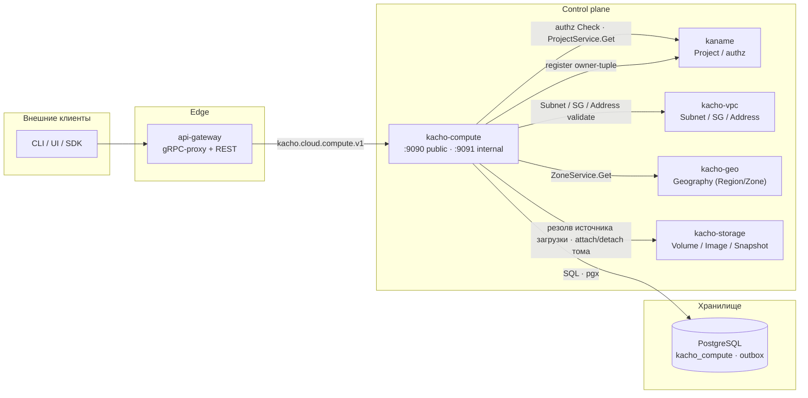
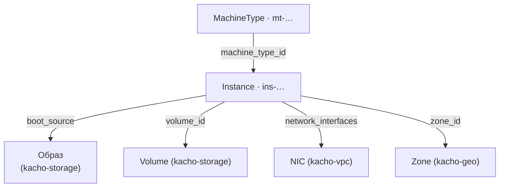

import hero from '@site/src/css/hero.module.css'

<header className={hero.hero}>
   Control-plane · Compute

  <h1 className={hero.title}>
    Вычислительные ресурсы 
    платформы Kachō
  </h1>

  

    gRPC + REST API для виртуальных машин и каталога типов машин — с асинхронной
    моделью <code>Operation</code>, детерминированной state-машиной инстанса и строгой
    проверкой доступа на каждом запросе.
  

  

    <a className={hero.btnPrimary} href="/getting-started">Быстрый старт →</a>
    <a className={hero.btnGhost} href="/api/overview">Обзор API</a>
    <a className={hero.btnGhost} href="/architecture/overview">Архитектура</a>
    <a className={hero.btnGhost} href="https://github.com/PRO-Robotech/kacho/tree/main/services/compute">GitHub</a>
  

</header>

## Что это и зачем

**Kachō Compute** — control-plane сервис, который даёт пользователю вычислительные ресурсы
как самообслуживаемый API: виртуальные машины (`Instance`) и каталог типов машин
(`MachineType`). Вместо ручного администрирования пользователь описывает **намерение**
(«машина такого типа в такой зоне, с таким источником загрузки»), а сервис берёт на себя
учёт состояния ресурса, переходы жизненного цикла, валидацию ссылок на смежные домены
(проект, зона, сеть, том) и изоляцию между проектами.

Бизнес-ценность простая: команды получают вычислительные мощности через единый API — быстро,
воспроизводимо и безопасно. Каждый инстанс принадлежит проекту (`projectId`), доступ
проверяется на каждом запросе, а целостность связей гарантируется на уровне хранилища, а не
«на честном слове» клиента.

:::info Блочное хранение — домен kacho-storage
`Volume` / `Image` / `Snapshot` / `DiskType` принадлежат **kacho-storage** и живут под
`/storage/v1`. Compute их не дублирует: том создаётся в storage и **присоединяется** к
инстансу по `volumeId`. Владелец типа ресурса на платформе ровно один.
:::

API следует **конвенциям Kachō**: плоские (flat) ресурсы, camelCase JSON, асинхронный
`Operation` на каждой мутации, REST-пути `/compute/v1/<resource>`, единый формат ошибок
`{code, message, details[]}`.

:::info Control-plane only
Kachō Compute управляет **намерением и состоянием** вычислительной конфигурации (API,
валидация, жизненный цикл, авторизация). Это control-plane: реального гипервизора нет —
статус ресурса меняется детерминированной state-машиной, содержимое диска не материализуется,
загрузка образа и вывод serial-порта синтетические. Эта документация описывает control-plane API.
:::

:::tip С чего начать
Новому пользователю — [**Быстрый старт**](/getting-started): пошагово от нуля до запущенного
инстанса (том в storage → Instance → Attach / Start / Stop) с реальными `curl`-примерами.
Готовы к деталям — [Обзор API](/api/overview) и [Архитектура](/architecture/overview).
:::

## Ключевые возможности

  

    ⇄
    gRPC + REST API
    Единый контракт на Protocol Buffers (каталог <code>proto/</code>), REST-проекция через grpc-gateway.
  

  

    ⏱
    Async Operations (LRO)
    Все мутации возвращают <code>Operation</code>; клиент поллит <code>OperationService.Get(id)</code> до <code>done=true</code>.
  

  

    ▷
    Жизненный цикл Instance
    Детерминированная state-машина: Start / Stop / Restart / Update с явными preconditions.
  

  

    ▤
    Подключение томов
    Attach/Detach томов <code>kacho-storage</code> по <code>volumeId</code>: инстанс ссылается на том, но не владеет им.
  

  

    ◈
    Многозональность
    Ресурсы привязаны к зонам; <code>zoneId</code> валидируется через домен Geography (kacho-geo).
  

  

    🔑
    Авторизация через kaname
    Per-RPC authz-гейт через kaname: вердикт по отношению субъекта к ресурсу или его проекту.
  

  

    ◉
    Целостность на уровне БД
    FK / partial-UNIQUE / атомарный CAS в PostgreSQL — инварианты не «на честном слове».
  

  

    ▦
    PostgreSQL + outbox
    Хранилище <code>kacho_compute</code>; transactional outbox + LISTEN/NOTIFY для событий.
  

## Архитектура

Kachō Compute — один из доменных сервисов платформы. Tenant-запросы проходят через
`api-gateway`; peer-сервисы (kaname, kacho-vpc, kacho-geo) зовутся напрямую с
request-path для валидации ссылок.

Система построена по принципу **database-per-service**: kacho-compute владеет схемой
`kacho_compute` и общается с другими доменами только по API (никаких cross-service FK).
Подробнее — [Архитектура](/architecture/overview).

## Доменная модель

Kachō Compute управляет **одним мутируемым ресурсом** (`Instance`) и одним **справочником**
(`MachineType` — публично read-only, admin-CRUD на internal-порту). Оба ресурса — «плоские»
(flat): domain-поля на верхнем уровне сообщения, без K8s-envelope.

<table>
  <thead>
    <tr><th>Ресурс</th><th>ID-префикс</th><th>Описание</th></tr>
  </thead>
  <tbody>
    <tr><td><strong>Instance</strong></td><td><code>ins-</code></td><td>Виртуальная машина: тип машины, зона, источник загрузки, сетевые интерфейсы, state-машина</td></tr>
    <tr><td><strong>MachineType</strong></td><td><code>mt-</code></td><td>Каталог типов машин: семейство (STANDARD / COMPUTE / MEMORY / GPU), эффективные ресурсы, статус доступности</td></tr>
  </tbody>
</table>

:::note ID-формат
Идентификаторы обоих ресурсов — **дефисной формы**: префикс, дефис и 17 символов
crockford-base32 (`ins-…`, `mt-…`). Id присваивается на Create и **неизменяем на всю жизнь
ресурса** — именно он попадает в URL и ссылки, а `name` остаётся косметическим и может
меняться свободно.

Compute-`Operation` сохраняют legacy-префикс `epd` — по нему api-gateway маршрутизирует
`OperationService.Get`.
:::

### Связи ресурсов

Все связи, кроме `machine_type_id`, ведут **за границу сервиса**: cross-service FK не бывает
(database-per-service), поэтому ссылки хранятся по id и валидируются вызовом к владельцу на
пути запроса.

:::tip Порядок удаления
Том принадлежит **kacho-storage**, и связь «инстанс ↔ том» живёт у владельца-storage. Чтобы
удалить том, его сначала нужно отсоединить (`:detachDisk`) или удалить инстанс. Инстанс
переживает исчезновение того, на что ссылается: зеркало присоединённого тома — read-only и
мягко деградирует, а не роняет ответ.
:::

## API-операции

Каждый мутируемый ресурс поддерживает базовый набор операций (часть — ресурс-специфична):

<table>
  <thead><tr><th>Операция</th><th>Тип</th><th>Описание</th></tr></thead>
  <tbody>
    <tr><td><code>Get</code></td><td>sync</td><td>Получить ресурс по id</td></tr>
    <tr><td><code>List</code></td><td>sync</td><td>Список проекта с фильтром (<code>name="..."</code>) и cursor-пагинацией</td></tr>
    <tr><td><code>Create</code></td><td><strong>async → Operation</strong></td><td>Создание ресурса</td></tr>
    <tr><td><code>Update</code></td><td><strong>async → Operation</strong></td><td>Изменение (с <code>updateMask</code>)</td></tr>
    <tr><td><code>Delete</code></td><td><strong>async → Operation</strong></td><td>Удаление (hard-delete)</td></tr>
  </tbody>
</table>

`Instance` дополнительно несёт lifecycle- и attach-действия (`Start`, `Stop`, `Restart`,
`AttachDisk`, `DetachDisk`, `AttachNetworkInterface` и др.) —
полный список на [странице Instance](/api/instance). `MachineType` на публичной поверхности
доступен только на чтение (`Get` / `List`); управление каталогом — admin-функция на
internal-порту.

Подробнее о механике LRO — [Операции (Operations)](/architecture/operations). Сквозной
практический пример — [Быстрый старт](/getting-started).

## Технологический стек

<table>
  <thead><tr><th>Технология</th><th>Применение</th></tr></thead>
  <tbody>
    <tr><td>Go</td><td>Язык реализации</td></tr>
    <tr><td>Protocol Buffers / Buf</td><td>Контракт API (каталог <code>proto/</code>), кодогенерация</td></tr>
    <tr><td>PostgreSQL / pgx v5</td><td>Хранилище <code>kacho_compute</code></td></tr>
    <tr><td>Goose</td><td>Версионирование схемы (<code>0001</code> — squashed baseline)</td></tr>
    <tr><td>sqlc + handwritten pgx</td><td>SQL-доступ (без ORM)</td></tr>
    <tr><td>grpc-gateway</td><td>REST-проекция gRPC</td></tr>
  </tbody>
</table>

## Где что лежит

Платформа разрабатывается в **одном** репозитории `PRO-Robotech/kacho`; перечисленное ниже —
каталоги в нём, а не отдельные репозитории. Отдельная база данных у каждого сервиса при этом
остаётся: общий репозиторий не означает общего хранилища.

<table>
  <thead><tr><th>Каталог</th><th>Назначение</th></tr></thead>
  <tbody>
    <tr><td><code>services/compute/</code></td><td>Этот сервис: control-plane Compute</td></tr>
    <tr><td><code>proto/</code></td><td>Единственный дом всех <code>.proto</code>; в каталоге сервиса контрактов нет</td></tr>
    <tr><td><code>pkg/</code></td><td>Общий фундамент: сгенерированные стабы, ids, operations, db, outbox, authz, …</td></tr>
    <tr><td><code>gateway/</code></td><td>Край: gRPC-proxy + REST mux</td></tr>
    <tr><td><code>services/iam/</code></td><td>Account / Project / авторизация (per-RPC Check)</td></tr>
    <tr><td><code>services/vpc/</code></td><td>Subnet / SecurityGroup / Address / NetworkInterface</td></tr>
    <tr><td><code>services/geo/</code></td><td>Region / Zone — валидация <code>zoneId</code></td></tr>
    <tr><td><code>services/storage/</code></td><td>Volume / Image / Snapshot / DiskType — блочное хранение; резолв источника загрузки и attach/detach тома</td></tr>
  </tbody>
</table>
