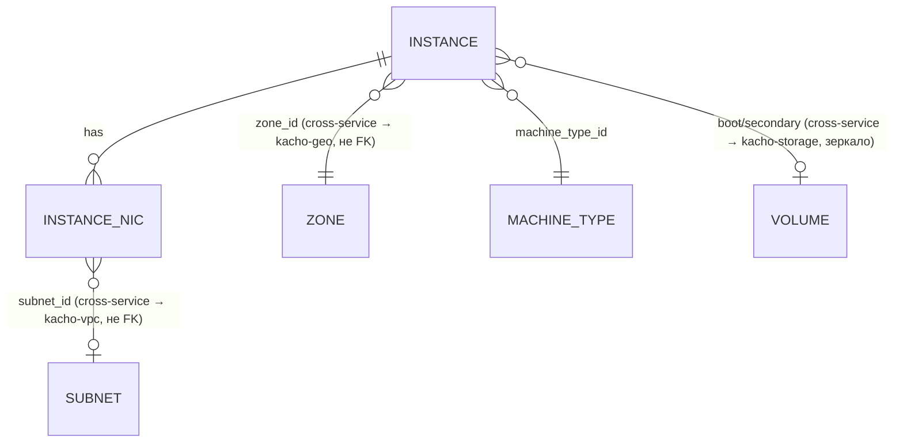

# 01 — Resources

Детально по каждому ресурсу: proto-поля, ID-префикс, status-enum, **полный**
список RPC (из `*_service.proto`) с пометкой реализован / `blocked:*` /
`Unimplemented`, ключевые инварианты, cross-resource links.

## Иерархия и связи



Текстовая модель:

```
Instance (1) ───┬─ machine_type_id ──→ MachineType (sizing-каталог, cluster-level)
   │            ├─ boot_volume / secondary_volumes ──→ Volume (kacho-storage)
   │            │     read-only зеркало: привязка живёт в `volume_attachments`
   │            │     у владельца, compute local attach-state НЕ держит
   ├─ network_interfaces[] (N): subnet_id, primary_v4_address,
   │     {one_to_one_nat: address}, security_group_ids[]
   └─ status: state-машина (см. страницу сайта «Жизненный цикл Instance»)

MachineType — cluster-level read-only справочник sizing (id `mt-…`)
Volume/Image/Snapshot/DiskType — блочное хранение, owner = kacho-storage (`/storage/v1`)
Region/Zone — публичный read-only справочник Geography (owner = kacho-geo)
```

Мутируемый ресурс компьюта один — Instance, он **project-level**
(`project_id` обязателен в Create). Все таблицы **flat** (без K8s envelope
`resource_version`/`generation`/`deletion_timestamp`/`finalizers`/`spec`/`status`
как JSONB). `cloud_id`/`organization_id` в схеме отсутствуют — фильтрация только
по `project_id` (как в VPC). Колонки `id` — `TEXT` (не UUID).

## Resource ID format

Источник истины — `pkg/ids/ids.go` (в прежней полирепо-топологии этот пакет звался
`kacho-corelib`, отсюда старое имя в записках). Id **ресурсов** compute — дефисной
формы: префикс, дефис и 17 символов crockford-base32. Id **операций** сохраняет
слитную форму.

| Ресурс           | Константа префикса               | Значение | Форма                |
|------------------|----------------------------------|----------|----------------------|
| Instance         | `ids.PrefixInstanceHyphen`       | `ins`    | `ins-` + 17 base32   |
| MachineType      | `ids.PrefixMachineTypeHyphen`    | `mt`     | `mt-` + 17 base32    |
| Operation (CMP)  | `ids.PrefixOperationCompute` (== `ids.PrefixInstance`) | `epd` | `epd` + 17 base32 (слитно) |

**Все compute-операции** независимо от ресурса получают prefix `epd`
(`PrefixOperationCompute == PrefixInstance`) — api-gateway opsproxy маршрутизирует
`OperationService.Get(id)` по первым 3 символам, поэтому все операции домена
должны идти в один backend. `InternalMachineTypeService.Create` вернёт operation с
id `epd…`, внутри которого `response` = MachineType с id `mt-…`. Обе формы валидны
одновременно: крокфордово тело дефиса не содержит, поэтому дефис — однозначный
дискриминатор.

**Формат own-owned id проверяется синхронно, первым стейтментом RPC** —
`corevalidate.ResourceID` в `Get`/`Update`/`Delete` обоих ресурсов
(`internal/apps/kacho/api/instance/instance.go`,
`internal/apps/kacho/api/machinetype/machine_type.go`); malformed → `InvalidArgument
"invalid <res> id '<X>'"`, well-formed-но-отсутствующий → `NotFound` через
`repo.Get`. Прежняя редакция объявляла это расхождением и отсылала к записи о
намеренных отступлениях: расхождение закрыто кодом, запись снята вместе с ним.

---

## Instance

Единственный мутируемый ресурс compute. Project-level (`project_id`), zone-level
(`zone_id`), несёт **дискриминатор рода** (`instance_kind`: VM | CONTAINER) и ссылку на
sizing-каталог (`machine_type_id`), из которого выводится `effective_resources`.
Загрузочный источник — `boot_source` (том/образ/снимок у kacho-storage), блочное
хранение здесь НЕ живёт (владелец — kacho-storage). N сетевых интерфейсов — строки
`instance_network_interfaces`; сами интерфейсы как ресурс живут в kacho-vpc.

### proto-поля (`instance.proto`, message `Instance`)

Состав таблицы сверяется с дескриптором механически —
`services/compute/tools/resources_doc_census_test.go`: строка про поле, которого нет,
и действующее поле без строки одинаково валят гейт. До сверки таблица описывала
ДОРЕДИЗАЙНОВЫЙ ресурс: из 28 строк 10 называли снятые поля (`platform_id`,
`resources`, `metadata_options`, `gpu_settings`, `scheduling_policy`,
`service_account_id`, `placement_policy`, `host_group_id`/`host_id`,
`reserved_instance_pool_id`, `application`), а девять действующих — в том числе
несущие `instance_kind`, `machine_type_id`, `effective_resources`,
`cpu_guarantee_percent`, `vm_spec`/`container_spec` — не упоминались вовсе.

| Поле | № | Тип | Замечания |
|---|---|---|---|
| `id` | 1 | string | hyphen-канон `ins-<crockford-base32>` |
| `project_id` | 2 | string | partial UNIQUE `(project_id, name) WHERE name <> ''` |
| `created_at` | 3 | Timestamp | в ответе truncate до секунд |
| `name` | 4 | string | project-scoped label, mutable |
| `description` | 5 | string | ≤256 |
| `labels` | 6 | map<string,string> | ≤64 записей |
| `zone_id` | 7 | string | required; существование — peer-валидация в kacho-geo; immutable |
| `status` | 10 | Instance.Status | state-машина, см. [страницу сайта](../../content/architecture/instance-lifecycle.mdx) |
| `boot_disk` | 12 | AttachedDisk | read-only зеркало привязки тома; источник истины — `volume_attachments` у kacho-storage |
| `secondary_disks` | 13 | repeated AttachedDisk | то же зеркало |
| `network_interfaces` | 14 | repeated NetworkInterface | строки `instance_network_interfaces`; `nic_id` — id ресурса kacho-vpc, он источник истины |
| `fqdn` | 16 | string | output-only; `<hostname>.<region_id>.internal` либо `<id>.auto.internal` |
| `cpu_guarantee_percent` | 36 | int32 | доля гарантированного CPU; мутируется только на STOPPED |
| `instance_kind` | 37 | InstanceKind | **сильный первый дискриминатор** (VM \| CONTAINER), required на Create |
| `machine_type_id` | 38 | string | ссылка на MachineType-каталог; required; мутируется только на STOPPED |
| `effective_resources` | 39 | EffectiveResources | output-only, выводится из MachineType |
| `boot_source` | 40 | BootSource | `storage.image` \| `storage.snapshot` \| `storage.volume` — резолв у kacho-storage |
| `placement_group_id` | 41 | string | ссылка на `PlacementGroup` (FK, `ON DELETE RESTRICT`); когерентность якоря проверяется внутри вставки/правки; мутируется только на STOPPED. Отсутствие ссылки — NULL, а не пустая строка |
| `status_reason` | 42 | string | output-only; причина текущего статуса |
| `service_account` | 43 | reference.Referrer | dependency-handle на служебную учётку (graceful-dangling) |
| `vm_spec` | 44 | VmSpec | ветвь `oneof spec` для `instance_kind = VM` |
| `container_spec` | 45 | ContainerSpec | ветвь `oneof spec` для `instance_kind = CONTAINER` |
| `guest_access_key_ids` | 46 | repeated string | ссылки на `GuestAccessKey` по неизменяемому id; заменяются целиком, ключ обязан быть того же проекта (условие внутри вставки связи) |

(`hostname` из `CreateInstanceRequest` хранится в `instances.hostname` для
вычисления `fqdn` и не возвращается отдельным полем в `Instance`.)

> [!note] «Отвергается по имени» — это ИСХОД, а не пробел
> Поле публичного запроса обязано иметь читателя; сервис, который не смотрит на поле,
> не вправе принимать его молча. Перечисленные выше поля отвергаются синхронно
> (`INVALID_ARGUMENT` + имя поля в `BadRequest.field_violations`) — см.
> `internal/handler/instance_handler.go::RejectUnsupportedCreateFields` и лок
> `instance_create_unsupported_fields_test.go`. То же относится к четырём полям
> ВНУТРИ `network_interface_specs[]` (`primary_v4_address_spec`,
> `primary_v6_address_spec`, `nic_id`, `index`).

### RPC (`instance_service.proto`, service `InstanceService`)

| RPC | sync/async | статус | примечание |
|---|---|---|---|
| `Get` | sync | ✅ | `GET /compute/v1/instances/{instance_id}?view=` (BASIC/FULL — FULL включает metadata) |
| `List` | sync | ✅ | `GET /compute/v1/instances?projectId=`. metadata всегда омитится (часть контракта). filter — whitelist РОВНО `name=` (`instance_repo.go`: `filter.Parse(f.Filter, []string{"name"})`); любое другое имя поля → `INVALID_ARGUMENT` с именем поля. Расширение — COMP-3 вместе с индексом, см. `07-known-divergences.md` §12 |
| `Create` | async | ✅ | required `zone_id`/`instance_kind`/`machine_type_id`/`boot_source` + ветвь `oneof spec` по роду + `network_interface_specs` либо `useDefaultNetwork`. metadata `CreateInstanceMetadata{instance_id}`, response `Instance`. Интерфейсы на Create **не материализуются** — форма и размещение проверяются, привязка явная (`AttachNetworkInterface`). Легаси-поля запроса **отвергаются по имени**, синхронно и первым стейтментом: `network_settings`, `filesystem_specs`, `local_disk_specs`, `maintenance_policy`, `maintenance_grace_period`, `serial_port_settings`, `ssh_public_keys` + четыре поля внутри `network_interface_specs[]` (`primary_v4_address_spec`, `primary_v6_address_spec`, `nic_id`, `index`). Снятые редизайном `platform_id`/`resources_spec`/`boot_disk_spec` зарезервированы в proto по номеру И имени — вернуться не могут. end status `RUNNING` |
| `Update` | async | ✅ | metadata `UpdateInstanceMetadata`, response `Instance`. mutable свободно: `name`/`description`/`labels`. Только при `STOPPED` (F10): `machine_type_id`/`cpu_guarantee_percent`/`placement_group_id`, иначе `FailedPrecondition`. immutable: `zone_id`/`instance_kind`/`boot_source` |
| `Delete` | async | ✅ | metadata `DeleteInstanceMetadata`, response `Empty`. Сага (`releaseAndDelete`): пометить строку `DELETING` → снять привязки интерфейсов у kacho-vpc → снять привязки томов у kacho-storage → удалить строку **последней**. Отказ владельца **не проглатывается** — операция краснеет, строка остаётся на месте. Повтор идемпотентен: списки привязок резолвятся у владельцев по id машины на каждом прогоне. Осиротевшее удаление (процесс умер посередине) добивает `FinishStuckDeletes` |
| `GetSerialPortOutput` | **sync** | ✅ (синтетика) | `GET /compute/v1/instances/{instance_id}:serialPortOutput?port=1..4`. response `GetInstanceSerialPortOutputResponse{contents}` — синтетический текст (НЕ операция) |
| `Stop` | async | ✅ | `POST /compute/v1/instances/{instance_id}:stop`. precondition `status ∈ {RUNNING}` → end `STOPPED`. metadata `StopInstanceMetadata`, response `Empty` |
| `Start` | async | ✅ | precondition `status ∈ {STOPPED}` → end `RUNNING`. metadata `StartInstanceMetadata`, response `Instance` |
| `Restart` | async | ✅ | precondition `status ∈ {RUNNING}` → end `RUNNING`. metadata `RestartInstanceMetadata`, response `Empty` |
| `AttachDisk` | async | ✅ | `POST :attachDisk` body `{attached_disk_spec:{volume_id, mode?, device_name?, auto_delete?}}` — присоединяется **существующий** kacho-storage Volume по id. precondition `status ∈ {RUNNING, STOPPED}`; том READY & same zone & not attached. metadata `AttachInstanceDiskMetadata{instance_id, volume_id}`, response `Instance`. status unchanged |
| `DetachDisk` | async | ✅ | `POST :detachDisk` body `oneof {volume_id, device_name}` (`exactly_one`). precondition `status ∈ {RUNNING, STOPPED}`; том attached & not boot. metadata `DetachInstanceDiskMetadata`, response `Instance` |
| `AttachNetworkInterface` | async | ✅ | `POST :attachNetworkInterface` body `{attached_nic_spec:{nic_id, index?}}` — подключается **существующий** kacho-vpc NIC по id; `index` не задан → сервер атомарно занимает первый свободный слот. Прежняя форма с `subnet_id`/`network_interface_index` **зарезервирована** в proto по номерам и именам. precondition `STOPPED`. metadata `AttachInstanceNetworkInterfaceMetadata`, response `Instance` |
| `DetachNetworkInterface` | async | ✅ | `POST :detachNetworkInterface` body — `oneof {nic_id, index}`, ровно одна ветвь; нарушение → `InvalidArgument "exactly one of nic_id or index is required"` (отвергает use-case синхронно). `network_interface_index` **зарезервирован**. precondition `STOPPED`. metadata `DetachInstanceNetworkInterfaceMetadata`, response `Instance` |
| `ListOperations` | sync | ✅ | `GET /compute/v1/instances/{instance_id}/operations` |
| `SimulateMaintenanceEvent` | async | ⏭️ no-op | `POST :simulateMaintenanceEvent`. metadata `SimulateInstanceMaintenanceEventMetadata`, response `Empty`. operation сразу done |

### Инварианты

- `Create`: спецификации интерфейсов **обязательны** (либо `useDefaultNetwork`) и
  проверяются в три шага — кратность до первого обращения к соседу, структура,
  placement-coherence зоны подсети (см. `07-known-divergences.md` §6.2). **Строки
  интерфейсов на Create не заводятся**: привязка явная, через
  `AttachNetworkInterface` по id уже существующего интерфейса kacho-vpc. boot
  source — `storage.image` / `registry.image` / том kacho-storage по id;
  inline-создание диска на attach снято с контракта вместе с дублем блочного
  хранения. Insert instance в **одной транзакции** worker'а, затем outbox
  `Instance CREATED`.
- Уникальность загрузочного тома и имени устройства — инвариант **владельца**:
  привязка живёт в его таблице, и её ограничения принадлежат его схеме. Прежняя
  редакция называла здесь два частичных индекса своей таблицы привязок — таблица
  снята миграцией 0013, и вместе с ней предмет этих инвариантов у compute
  отсутствует.
- Размер инстанса задаётся ссылкой `machine_type_id` на каталожную запись; валидация —
  резолв ссылки (`internal/apps/kacho/api/instance/instance.go`, `resolveMachineType`)
  против каталога (`internal/apps/kacho/api/machinetype/machine_type.go`), а сами
  величины приезжают output-only зеркалом `EffectiveResources`. Прежняя редакция
  описывала посемейственную валидацию сырого описания ресурсов и ссылалась на
  файл-таблицу платформ: поле снято с контракта (`reserved` в
  `proto/kacho/cloud/compute/v1/instance_service.proto`), файла нет, имя не цитируется.
- `status_reason` — человекочитаемая причина текущего статуса; на плоскости управления
  заполняется отложенными правками («вступит в силу при следующей загрузке»), иначе пусто.
  Поля `status_message` в контракте нет и не было — прежняя редакция называла имя, которого
  дерево не знает.
- State-машина статуса — [страница сайта](../../content/architecture/instance-lifecycle.mdx).

### Cross-resource links

- `boot_volume` / `secondary_volumes` — **read-only зеркало**: привязка тома к
  инстансу живёт в `volume_attachments` у владельца-storage, compute local
  attach-state не держит (миграция 0013 сняла `attached_disks`).
- `network_interfaces[].nic_id` → VPC `NetworkInterface` (НЕ FK; source of truth
  для интерфейса). `Instance.Create` спецификации интерфейсов **проверяет**, но строк
  не заводит — привязка явная, через `AttachNetworkInterface`. На `Instance.Delete`
  привязки интерфейсов **снимаются у владельца**, до удаления строки машины.
- `network_interfaces[].subnet_id` → VPC `Subnet` (НЕ FK; в proto-ответе — denorm-зеркало
  kacho-vpc NIC).
- `network_interfaces[].security_group_ids[]` → VPC `SecurityGroup` (НЕ FK; denorm-зеркало).
- `network_interfaces[].primary_v4_address.one_to_one_nat.address` → VPC
  `Address` (НЕ FK; при Remove/Delete освобождается best-effort).
- `instances.project_id` → kacho-iam `Project` (НЕ FK, валидируется gRPC).
- `boot_source` (`storage.image` / `registry.image`) → peer-резолв у владельца
  (kacho-storage / kacho-registry), не локальная таблица.

---

## Region / Zone — сняты со сервинга (этап S7)

> [!warning] Восемь методов сняты волной 1 — здесь их больше нет намеренно
> Семь не несли реализации и отвечали отказом «не реализовано», будучи выставленными
> на трёх поверхностях сразу; восьмой (обновление метаданных) был реализован и снят
> вместе со своим предметом — свободной картой. Перепись снятых имён —
> `internal/repohygiene/retiredrpcsurface.go`; резервирование номера и имени для
> метода невыразимо грамматикой, поэтому механизм именно такой.
>
> Владельцы возможностей: трансляция адреса и свойства интерфейса — домен сети;
> привязки доступа — домен управления доступом; перенос между зонами требует
> согласия владельца тома.

Здесь стояли два раздела с полями и RPC `Region`/`Zone` и утверждение «kacho-compute —
owner Geography». С этапа S7 это неверно: Geography — домен **kacho-geo**
(`/geo/v1/regions`, `/geo/v1/zones`); таблиц `regions`/`zones` у compute нет, а
`Instance.zone_id` проверяется peer-вызовом к geo. Разделы удалены, а не снабжены
оговоркой: описание чужого домена в документе сервиса читается как «это здесь»,
сколько бы оговорок к нему ни приписали.

## Что не compute-ресурс, но рядом живёт

- `operations` — per-сервисная таблица long-running operations (схема как у
  corelib `0001_operations.sql`, включена в `0001_initial.sql`). prefix `epd`.
- `compute_outbox` — outbox-таблица событий (`resource_kind` ∈ {Instance},
  `event_type` ∈ {CREATED, UPDATED, DELETED}) + триггер
  `compute_outbox_notify_trg` → `pg_notify('compute_outbox', sequence_no::text)`.
  Колонка `project_id` — **якорь подписки**: по ней поток решает, кому показать
  событие, не обращаясь к предмету (у снятия обращаться не к чему).
  Читателей двое: восстановление наблюдаемого состояния сервиса и общий поток
  подписки платформы (`pkg/subscription`). Собственный стрим сервиса снят (#813);
  вернулась не его форма, а одна на всю платформу.
  См. [модель данных](../../content/architecture/data-model.mdx).

  Таблицы серверных курсоров подписки рядом с ним **нет** — она снята (#1046).
  Позиция подписки принадлежит КЛИЕНТУ: он присылает курсор, сервер состояния не
  держит, и поэтому поток переживает переподключение к другой реплике. Курсоры по
  подписчику на стороне сервера это свойство отменяют, поэтому их место — не в
  схеме, а в этой строке.
