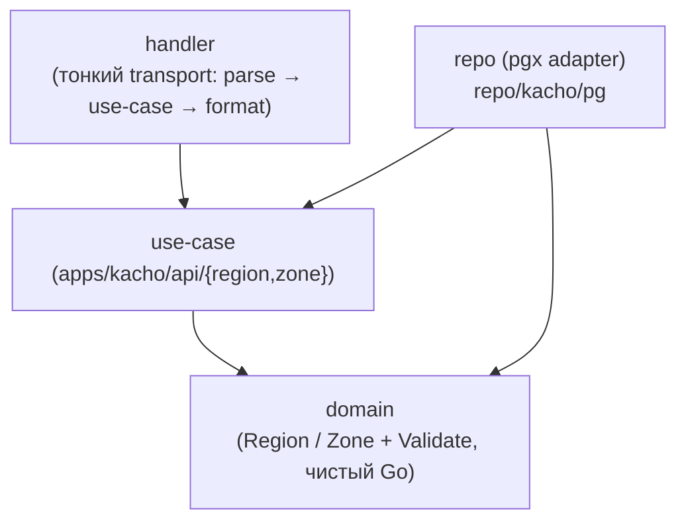
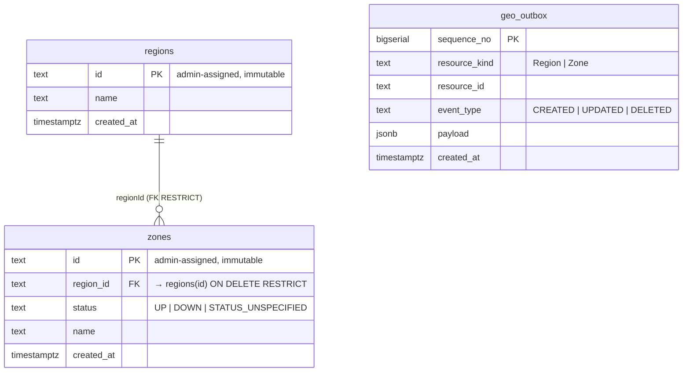
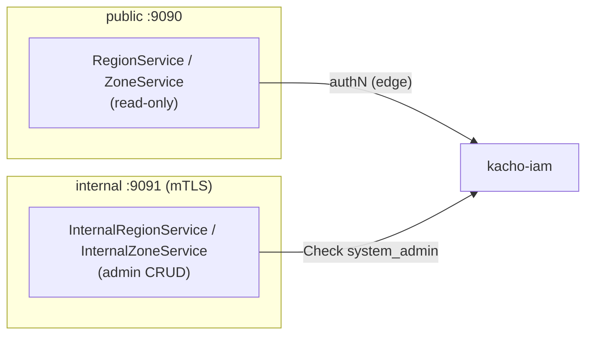
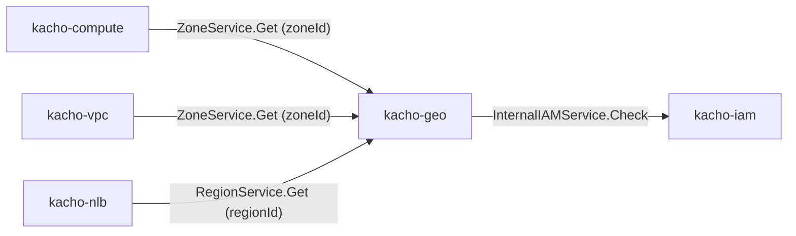

import CodeBlock from '@theme/CodeBlock'
import dedent from 'ts-dedent'

# Архитектура

Эта страница описывает внутреннее устройство Kachō Geo: слоистую (clean) архитектуру,
схему БД (database-per-service), авторизацию на обоих listener'ах, audit-outbox и место
сервиса в платформе как leaf-узла. Внешний контракт — на [страницах API](/api/overview).

## Чистая архитектура

Сервис следует строгому правилу зависимостей: транспорт зависит от бизнес-логики, бизнес-логика
зависит от домена, а домен не зависит ни от чего, кроме stdlib и сгенерённых стабов контракта
(`pkg/api/...`; сами `.proto` лежат в `proto/`).

<table>
  <thead><tr><th>Слой</th><th>Где</th><th>Ответственность</th></tr></thead>
  <tbody>
    <tr><td><strong>domain</strong></td><td><code>internal/domain/</code></td><td>Сущности Region / Zone + <code>Validate()</code>. Только stdlib + proto; без pgx/grpc</td></tr>
    <tr><td><strong>use-case</strong></td><td><code>internal/apps/kacho/api/&#123;region,zone&#125;/</code></td><td>Бизнес-логика; определяет port-интерфейс <code>Repo</code>. Не импортирует transport</td></tr>
    <tr><td><strong>repo (adapter)</strong></td><td><code>internal/repo/kacho/pg/</code></td><td>Реализация порта на handwritten pgx; SQLSTATE → sentinel; outbox-emit в TX</td></tr>
    <tr><td><strong>handler</strong></td><td><code>internal/handler/</code></td><td>Тонкий transport: parse → use-case → format (protoconv, map-err). Без бизнес-логики</td></tr>
    <tr><td><strong>check (authz)</strong></td><td><code>internal/check/</code></td><td>Authz-интерсептор + IAM Check-клиент + permission-map (<code>geo.*</code>)</td></tr>
    <tr><td><strong>config</strong></td><td><code>internal/apps/kacho/config/</code></td><td>YAML/ENV-конфиг (corelib <code>config.LoadPrefixed("KACHO_GEO")</code>)</td></tr>
    <tr><td><strong>composition root</strong></td><td><code>cmd/kacho-geo/</code></td><td>Единственное место wiring (serve.go); <code>cmd/migrator/</code> — миграции</td></tr>
  </tbody>
</table>

Переиспользуемое (pgx-пул, grpc-сервер/клиент, config, observability) приходит из
`pkg/` — не дублируется в сервисе.

## База данных — database-per-service

Kachō Geo владеет схемой `kacho_geo` в PostgreSQL и не делит её ни с кем. Within-service
инварианты выражены на уровне БД (FK / PK), а не software-проверками. Схема создаётся
baseline-миграцией `0001_initial` (goose).

<table>
  <thead><tr><th>Таблица</th><th>Назначение</th><th>Ключевые ограничения</th></tr></thead>
  <tbody>
    <tr><td><code>regions</code></td><td>Справочник регионов</td><td><code>id</code> — TEXT PK (admin-assigned)</td></tr>
    <tr><td><code>zones</code></td><td>Справочник зон доступности</td><td><code>region_id → regions(id) ON DELETE RESTRICT</code>; индекс по <code>region_id</code></td></tr>
    <tr><td><code>geo_outbox</code></td><td>Audit-журнал admin-мутаций</td><td><code>BIGSERIAL</code>; LISTEN/NOTIFY-триггер на INSERT</td></tr>
  </tbody>
</table>

:::note FK RESTRICT — within-service инвариант на уровне БД
Связь `zones.region_id → regions(id)` объявлена с `ON DELETE RESTRICT`. Удаление региона, к
которому привязана хотя бы одна зона, отклоняется самой БД (не software-check). Service-слой
лишь маппит SQLSTATE на gRPC-код: нарушение FK → `FAILED_PRECONDITION`. Текст pgx наружу не
утекает.
:::

## Авторизация — на обоих listener'ах

Сервис поднимает два gRPC-listener'а. **Аутентификация обязательна на обоих.** Авторизация —
per-RPC Check через kacho-iam везде, **кроме четырёх публичных чтений**,
вынесенных в задокументированное исключение (см. [ниже](#публичные-чтения--исключение-из-проверки-области-по-проекту)).
Internal-периметр **не считается доверенным** — defense-in-depth против lateral movement.

- **Public (`:9090`)** — цепочка интерсепторов: извлечение principal → authz-Check.
  Четыре read-RPC (`RegionService.Get/List`, `ZoneService.Get/List`) несут в proto
  `permission = "<exempt>"` — с них снята **проверка области по проекту**, и только она.
- **Internal (`:9091`)** — mTLS + извлечение identity из client-cert → trusted-principal
  (anti-spoof) → authz-Check. Admin-RPC требуют `system_admin`.
- **Production-режим** (`KACHO_GEO_AUTH_MODE=production`) обязывает проверенный транспорт на
  обоих listener'ах и на ребре к kacho-iam — иначе сервис не стартует. Ручки, снимающей
  проверку прав, не существует: цепочка без звена решения о доступе носителем не
  выражается.

### Публичные чтения — исключение из проверки области по проекту

Region и Zone — **admin-curated глобальный справочник оси размещения**. Любой размещаемый
ресурс платформы запускается по `zoneId` / `regionId`, взятым отсюда, поэтому читать каждую
строку обязан каждый аутентифицированный тенант. Единая проверка области по проекту отвергла бы
тенанта без единой привязки ещё до чтения — и он не смог бы создать вообще ничего.

Что именно снято, а что нет:

| | Состояние |
|---|---|
| Проверка области по проекту (per-RPC Check шлюза) | **снята** — это и есть исключение |
| Аутентификация | **остаётся обязательной**: неаутентифицированный вызывающий получает `UNAUTHENTICATED` |
| Инфра-чувствительная проекция | **не на этой поверхности** — сырой `status` и инфра-поля живут в `InternalRegion` / `InternalZone` на internal-listener'е |
| Admin-CRUD | **не затронут** — `InternalRegionService` / `InternalZoneService` требуют `system_admin` |

Раскрывать на публичной поверхности нечего: она отдаёт tenant-facing проекцию справочника, а
«как разложено по железу» остаётся на internal-listener'е (две проекции ресурса —
конвенция Kachō).

### Списки Region и Zone не сужаются — и это объявлено

Оба публичных `List` отдают **все** строки справочника: сужать не к чему — per-object грантов на
строки справочника не существует по построению, а тенант без привязок обязан их видеть.

Это записано **декларацией, которую читает CI-гейт** (`make -C services/geo audit-list-filter`),
а не подразумевается. Разница существенна: снаружи «сервис освобождён» и «на сервис никто не
смотрел» неотличимы — а до появления гейта имело место второе. Декларация **истекает вместе со
своим методом**: ретайрен RPC — и запись, которой больше нечего исключать, становится находкой.

Подробнее о ключах конфигурации — [Конфигурация](/install/configuration).

## Audit-outbox в одной транзакции

Admin-мутации (Create / Update / Delete Region/Zone) атомарно пишут строку в `geo_outbox` **в
той же writer-транзакции**, что и сама мутация. Так аудит не теряется: либо изменение и его
запись в журнал коммитятся вместе, либо откатываются вместе. Это конвенция Kachō
(`<domain>_outbox`).

Журнал — **внутренний**: он служит атрибуции admin-мутаций («кто это сделал») и наружу не
публикуется. Потока изменений Geo не предлагает и предлагать не будет — почему именно,
разобрано в `known-divergences.md` §9. Каталог регионов и зон меняется месяцами, поэтому
читать его следует обычным `List`, а не ждать событий.

## Место в платформе — leaf-сервис

Kachō Geo — **leaf-узел** платформы: по сборке он зависит только от `pkg/` и
`proto/`, ни от одного другого доменного сервиса (как IAM). В runtime у него ровно одно
исходящее ребро — `geo → iam` (authz-Check). Все остальные сервисы — **консумеры** Geo.

:::info Cross-domain ссылки — без cross-service FK
Через границу сервиса внешний ключ невозможен (database-per-service). Consumer-сервисы держат
`zoneId` / `regionId` как обычный текст (без FK) и валидируют их через API Kachō Geo на
request-path (`Get`). Не найдено → `INVALID_ARGUMENT` / `FAILED_PRECONDITION` у консумера; Geo
недоступен → `UNAVAILABLE` (fail-closed для мутаций). При удалении региона/зоны Geo **не**
спрашивает консумеров (нет cross-service cascade) — консумер обязан грациозно переживать
dangling-ссылку. Жёсткие гарантии целостности — только within-service (FK `RESTRICT`).
:::

Циклов в графе нет: рёбра `* → geo` и `geo → iam` однонаправлены, Geo не зовёт своих
консумеров обратно.
