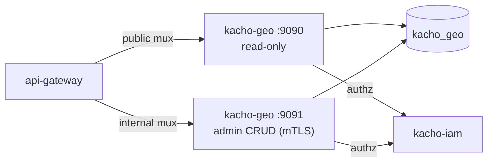

import CodeBlock from '@theme/CodeBlock'
import dedent from 'ts-dedent'

# Развёртывание

Эта страница описывает сборку Kachō Geo, применение миграций, два listener'а и контейнерный
образ. Ключи конфигурации (ENV `KACHO_GEO_*`) — на странице [Конфигурация](/install/configuration).

## Сборка

В репозитории две сборочные цели: API-сервер и отдельный бинарь миграций.

<CodeBlock language="bash">
  {dedent`
    # API-сервер → bin/kacho-geo
    make build

    # мигратор → bin/kacho-migrator
    make build-migrator
  `}
</CodeBlock>

Обе цели собирают статический бинарь (`CGO_ENABLED=0`).

## Миграции

Схема `kacho_geo` управляется goose-миграциями (встроены в бинарь через `embed.FS`).
Baseline-миграция `0001_initial` создаёт таблицы `regions`, `zones` (FK `RESTRICT`) и audit-
таблицу `geo_outbox` с LISTEN/NOTIFY-триггером. Применяются **отдельным** бинарём
`bin/kacho-migrator` (не самим сервисом на старте).

<CodeBlock language="bash">
  {dedent`
    # применить все миграции
    KACHO_GEO_DB_PASSWORD=secret bin/kacho-migrator up

    # статус
    KACHO_GEO_DB_PASSWORD=secret bin/kacho-migrator status

    # откат последней: возвращает ФОРМУ, не данные — см. «Откат выкатки»
    KACHO_GEO_DB_PASSWORD=secret bin/kacho-migrator down
  `}
</CodeBlock>

Те же шаги обёрнуты в Make-цели: `make migrate-up`, `make migrate-status`, `make migrate-down`.

:::warning Применённую миграцию не редактировать
Изменение топологии схемы — только новой миграцией. Уже применённый файл не редактируется
(конвенция Kachō). Подключение к БД задаётся ключами `KACHO_GEO_DB_*`.
:::

## Запуск — два listener'а

API-сервер поднимает два независимых gRPC-listener'а:

<table>
  <thead><tr><th>Listener</th><th>Порт (дефолт)</th><th>Поверхность</th></tr></thead>
  <tbody>
    <tr><td>public</td><td><code>:9090</code></td><td>Read-only: <code>RegionService</code> / <code>ZoneService</code></td></tr>
    <tr><td>internal</td><td><code>:9091</code></td><td>Admin CRUD: <code>InternalRegionService</code> / <code>InternalZoneService</code> (cluster-internal, mTLS)</td></tr>
  </tbody>
</table>

<CodeBlock language="bash">
  {dedent`
    KACHO_GEO_DB_PASSWORD=secret bin/kacho-geo serve
  `}
</CodeBlock>

Internal listener **не публикуется** на external endpoint — его REST-проекция в `api-gateway`
доступна только на cluster-internal mux. В production оба listener'а обязаны работать по mTLS,
а per-RPC authz-Check к kacho-iam — быть сконфигурированным (иначе сервис не стартует).



## Контейнерный образ

Сервис собирается в контейнер из **корня репозитория**: дерево одно, зависимости
резолвятся внутри него (`go.mod` без `replace`), поэтому Dockerfile копирует контекст
целиком (`COPY . .`) и собирает по путям от корня.

<CodeBlock language="bash">
  {dedent`
    # из корня репозитория
    docker build -f services/geo/Dockerfile -t kacho-geo:dev .
  `}
</CodeBlock>

При развёртывании в кластер мигратор обычно запускается отдельным job/init-контейнером
(`kacho-migrator up`) до старта сервиса, а сам сервис — как Deployment с двумя портами.

:::tip Дальше
Полный список ключей конфигурации, режимы `AUTH_MODE` и per-edge mTLS —
[Конфигурация](/install/configuration). Первые запросы к запущенному сервису —
[Быстрый старт](/getting-started).
:::

## Откат выкатки

Неудачная выкатка откатывается в **три шага, и порядок в них несущий**. Схему
возвращают ДО образа: down-миграция лежит в том образе, который её принёс, и
вернув образ первым, вы останетесь без файла, которым откатывать.

Отдельно про то, чего `helm rollback` не делает сам: миграции едут
initContainer'ом и прогоняются `up` **на каждом старте пода**, поэтому возврат
образа перекатывает под и снова накатывает схему до головы своей цепочки.
Возврат образа сам по себе схему не возвращает.

### Шаг 1. Решить, нужен ли откат СХЕМЫ

| что несла выкатка | нужен ли откат схемы |
|---|---|
| только образ, миграций нет | нет — сразу шаг 3 |
| миграции аддитивные (новая таблица, новая колонка) | как правило нет: прежний код их не читает, и это самый дешёвый путь |
| миграция несовместима с прежним кодом (переименование, сужение типа, снятие колонки) | да — шаг 2 |
| миграция снесла таблицу или колонку | схему вернуть можно, **данные — нет**; см. рамку ниже |

### Шаг 2. Откатить схему — образом, который эту миграцию несёт

```bash
# ДО helm rollback, пока в поде ещё НОВЫЙ образ: у него есть down-файл.
kubectl -n <namespace> exec deploy/<деплой kacho-geo> -- \
  /usr/local/bin/kacho-migrator status
kubectl -n <namespace> exec deploy/<деплой kacho-geo> -- \
  /usr/local/bin/kacho-migrator down --target <версия, до которой откатываем>
```

### Шаг 3. Вернуть образ

```bash
helm history <релиз>
helm rollback <релиз> <ревизия>
```

:::danger `down` возвращает форму, а не данные
Down-миграция воссоздаёт схему **пустой**. Строки, которые снёс `DROP`, она не
возвращает: «восстановимо» про снос означает «восстановима схема». Единственный
путь назад для снесённых строк — резервная копия базы.

Продукт защищает это на своей стороне: накат считает живые строки в каждой
таблице, которую уронит ещё не применённая миграция, и **отказывает**, пока снос
не одобрен явно — переменной `KACHO_MIGRATOR_DROP_APPROVED` с именем конкретного
сноса. Отказ на выкатке стоит одной выкатки; восстановление из копии — сильно
дороже, и узнаёте вы о нужде в нём уже после.
:::

### Чем проверить, что откат состоялся

Проверять надо **три** вещи, и «под Ready» само по себе ни одной из них не
доказывает:

| что | чем |
|---|---|
| ревизия релиза вернулась | `helm history <релиз>` — последняя запись со статусом `deployed` |
| под работает нужным образом | `kubectl -n <namespace> get pod -l app=<деплой kacho-geo> -o jsonpath='{..image}'` |
| схема на ожидаемой версии | `kacho-migrator status` — головная применённая версия |
| зависимости сервиса живы | `readinessProbe` спрашивает `/readyz`, поэтому `kubectl get pods` показывает готовность **по зависимостям**, а не по открытому сокету: под в `0/1` — это отказ зависимости, а не «ещё поднимается» |
