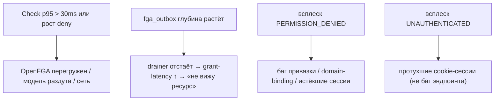

# Наблюдаемость

Kachō IAM — центральный авторизатор платформы, поэтому его наблюдаемость критична: сбой или
замедление `Check` затрагивает **все** сервисы. Эта страница описывает метрики, логи и трассировку
и что стоит мониторить.

## Метрики (Prometheus)

Сервис отдаёт метрики на cluster-internal listener (`/metrics`, по умолчанию `:9095` — никогда не
на публичной tenant-поверхности). Ключевые группы:

<table>
  <thead><tr><th>Область</th><th>Что смотреть</th></tr></thead>
  <tbody>
    <tr><td><strong>gRPC RPC</strong></td><td>Rate / latency / error по методам (p50/p95/p99); всплеск <code>PERMISSION_DENIED</code> / <code>UNAUTHENTICATED</code></td></tr>
    <tr><td><strong>Authz Check</strong></td><td>Латентность <code>Check</code> (бюджет ≤ 30 ms p95); доля deny; таймауты до OpenFGA</td></tr>
    <tr><td><strong>Tuple-outbox</strong></td><td>Глубина <code>fga_outbox</code>, лаг drainer'а, retry / poison-intent (grant-latency растёт при отставании)</td></tr>
    <tr><td><strong>Пул БД</strong></td><td>Занятость pgx-пула, длительность транзакций, contention</td></tr>
    <tr><td><strong>Операции (LRO)</strong></td><td>Длительность операций, доля ошибок worker'а</td></tr>
    <tr><td><strong>Ory-интеграции</strong></td><td>Латентность / ошибки вызовов Hydra (Issue/Revoke) и identity-хуков Kratos</td></tr>
  </tbody>
</table>

## Логи

Структурированные логи (slog). Наружу **не** утекает текст pgx/SQL — внутренние ошибки маппятся в
фиксированный `INTERNAL`, детали остаются в логах. Полезные корреляции:

- `PERMISSION_DENIED` с указанием subject / relation / object — диагностика отказов доступа;
- `authz_no_principal` — потеря principal в async-worker'е (см. ниже);
- drainer-ошибки материализации tuple'ов (domain-binding, poison-intent).

## Трассировка

OpenTelemetry-контекст пробрасывается сквозь RPC. Для async-мутаций principal и trace-контекст
сохраняются в outbox-emit и пробрасываются в дочерние операции (worker'ы corelib/operations
сохраняют `principal_*`).

## Что мониторить в первую очередь

## Повторяющиеся классы проблем

<table>
  <thead><tr><th>Симптом</th><th>Вероятная причина</th></tr></thead>
  <tbody>
    <tr><td>Мутация откатывается «internal database error» на cross-service вызове</td><td>Async-worker потерял principal (<code>authz_no_principal</code>) → анонимный peer-вызов → deny</td></tr>
    <tr><td>Ресурс создан, но не виден в authz-filtered List сразу</td><td>Grant-latency: tuple ещё не материализован (poll-retry, не мгновенный assert)</td></tr>
    <tr><td>Owner-tuple'ы отвергаются, ресурсы невидимы</td><td>FGA domain-binding: object-префикс ≠ имя сервиса — виден только под production-strict mTLS</td></tr>
    <tr><td>Универсальный 401/403 на всех эндпоинтах с cookie</td><td>Истёкшая сессия Kratos, не баг эндпоинта (изолируй cookie-vs-token до диагностики)</td></tr>
    <tr><td>Рантайм пишет в таблицу → <code>undefined_table</code></td><td>Migration-divergence: goose числит миграцию applied, а объекта нет (сверять <code>to_regclass</code>)</td></tr>
  </tbody>
</table>

:::warning Verify на живом стеке
Rollout, Running-поды и applied-миграции — **не** доказательство работоспособности. Класс багов
IAM (worker-principal, migration-divergence, domain-binding, cookie-expiry) невидим unit/mock и
ловится только E2E через gateway. После деплоя обязателен прогон реального сценария (логин →
аккаунт → роль → проверка видимости).
:::
