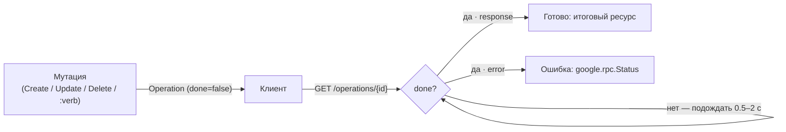

import { ApiOperation } from '@site/src/components/commonBlocks/ApiOperation'
import CodeBlock from '@theme/CodeBlock'
import dedent from 'ts-dedent'

# Операции

**Operation** — универсальная обёртка асинхронного результата в Kachō. Все мутации IAM
(`Create` / `Update` / `Delete`, а также `Invite`, `AddMember`, `Issue`, ...) не возвращают
итоговый ресурс синхронно — они возвращают `Operation` (long-running operation, LRO) и выполняют
работу асинхронно. Клиент **поллит** статус операции до `done=true`, затем забирает результат.
Это конвенция всей платформы: единый способ отслеживать любую мутацию, единый формат ошибки.

Идентификатор операции — с префиксом `iop`. Watch-стрима нет; отслеживание — поллингом.

## Форма Operation

<table>
  <thead><tr><th>Поле</th><th>Тип</th><th>Описание</th></tr></thead>
  <tbody>
    <tr><td><code>id</code></td><td>string</td><td>Идентификатор операции (префикс <code>iop</code>)</td></tr>
    <tr><td><code>description</code></td><td>string</td><td>Человекочитаемое описание («create account acme»)</td></tr>
    <tr><td><code>createdAt</code></td><td>timestamp</td><td>Момент старта (усечён до секунд)</td></tr>
    <tr><td><code>done</code></td><td>bool</td><td><code>false</code> — в процессе; <code>true</code> — завершена</td></tr>
    <tr><td><code>metadata</code></td><td>Any</td><td>Типизированные метаданные (<code>CreateAccountMetadata</code> с <code>accountId</code> и т.п.)</td></tr>
    <tr><td><code>result</code></td><td>oneof</td><td>При <code>done=true</code> — либо <code>error</code> (<code>google.rpc.Status</code>), либо <code>response</code> (итоговый ресурс)</td></tr>
  </tbody>
</table>

<CodeBlock language="json">
  {dedent`
    {
      "id": "iop_8b0c4d2e6f1a3",
      "description": "create account acme",
      "createdAt": "2026-06-24T10:00:00Z",
      "done": true,
      "metadata": { "accountId": "acc_2k9f3qw8x7m2n" },
      "response": {
        "id": "acc_2k9f3qw8x7m2n",
        "name": "acme",
        "createdAt": "2026-06-24T10:00:00Z"
      }
    }
  `}
</CodeBlock>

При ошибке `result` содержит `error` вместо `response`:

<CodeBlock language="json">
  {dedent`
    {
      "id": "iop_8b0c4d2e6f1a3",
      "done": true,
      "error": { "code": 9, "message": "account has non-empty projects", "details": [] }
    }
  `}
</CodeBlock>

## Методы

`OperationService` живёт на публичном listener'е и обслуживает поллинг любой операции IAM.

### Get — статус операции

<ApiOperation method="GET" endpoint="/operations/{operation_id}">

Возвращает текущее состояние операции. Клиент вызывает его периодически до `done=true`, затем
читает `response` (успех) или `error` (ошибка).

<CodeBlock language="bash">
  {dedent`
    curl 'http://localhost:18080/operations/iop_8b0c4d2e6f1a3' \\
      -H 'Authorization: Bearer <JWT>'
  `}
</CodeBlock>

</ApiOperation>

### Cancel — отменить операцию

<ApiOperation method="POST" endpoint="/operations/{operation_id}:cancel">

Запрашивает отмену операции, пока она в процессе. Отменяемость зависит от конкретной мутации.

</ApiOperation>

## Поллинг — рекомендуемый цикл

1. Вызвать мутацию — получить `Operation` с `done=false`.
2. Поллить `GET /operations/{id}` с бэкоффом (0.5–2 c) до `done=true`.
3. Прочитать `response` (успех) или `error` (ошибка).

## Журналы операций по ресурсу

Кроме поллинга одной операции, IAM даёт **журналы**: `ListOperations` на каждом ресурсе
(например `GET /iam/v1/accounts/{id}/operations`) и агрегированный
`AccountService.ListAllOperations` (`GET /iam/v1/accounts/{id}/operations:all`) — все операции,
чей владеющий ресурс принадлежит аккаунту. Это read-RPC для аудита истории изменений; см.
соответствующие страницы ресурсов.

:::tip Grant-latency ≠ Operation
`Operation` со статусом `done=true` означает, что запись в БД зафиксирована. Но материализация
tuple'ов в OpenFGA (после которой грант «виден» authz-Check и authz-filtered List) идёт через
transactional-outbox и добавляет ~0.6–2 c пропагации. Проверяйте видимость грантов poll-retry, а
не сразу после `done`.
:::
