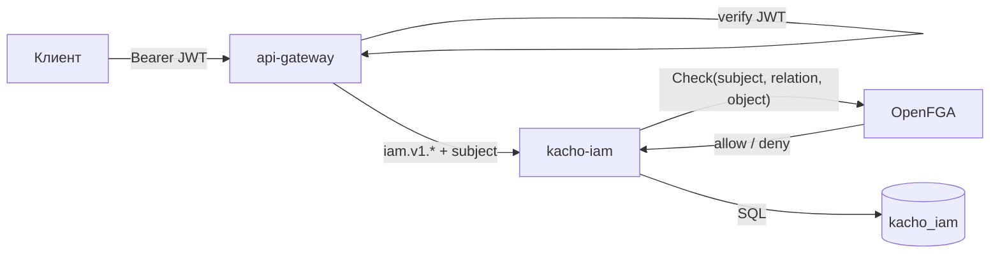

import CodeBlock from '@theme/CodeBlock'
import dedent from 'ts-dedent'

# Обзор API

Эта страница описывает **конвенции**, общие для всего API Kachō IAM: ресурсы, REST-пути,
формат JSON, аутентификацию и авторизацию, sync-чтение vs async-мутации, формат ошибок,
пагинацию, идентификаторы и точность временных меток. Конкретные поля и операции каждого
ресурса — на отдельных страницах ([Account](/api/account), [Role](/api/role),
[AccessBinding](/api/access-binding) и т.д.).

:::info Единый контракт — gRPC, REST — проекция
Источник истины — Protocol Buffers в `kacho-proto` (домен `kacho.cloud.iam.v1`). REST-поверхность
строится через **grpc-gateway**: каждый RPC аннотирован `google.api.http`. Семантика (коды
ошибок, валидация) одинакова для gRPC и REST; примеры ниже — в REST-форме (через `api-gateway`).
:::

:::tip Сначала — практика
Если вы только знакомитесь с сервисом, начните с [Быстрого старта](/getting-started): аккаунт,
приглашение пользователя, первая роль и привязка. Эта страница — справочник по конвенциям.
:::

## Ресурсы и их назначение

Kachō IAM управляет **семью типами tenant-facing ресурсов** плюс кредами доступа. Все ресурсы —
плоские (flat): domain-поля на верхнем уровне сообщения, без K8s-envelope.

<table>
  <thead><tr><th>Ресурс</th><th>Бизнес-назначение</th><th>Страница</th></tr></thead>
  <tbody>
    <tr><td><strong>Account</strong></td><td>Верхнеуровневый tenant-контейнер</td><td>[Account](/api/account)</td></tr>
    <tr><td><strong>Project</strong></td><td>Контейнер ресурсов внутри аккаунта</td><td>[Project](/api/project)</td></tr>
    <tr><td><strong>User</strong></td><td>Человек-субъект (invite-based, per-Account)</td><td>[User](/api/user)</td></tr>
    <tr><td><strong>ServiceAccount</strong></td><td>Машинный субъект</td><td>[ServiceAccount](/api/service-account)</td></tr>
    <tr><td><strong>Group</strong></td><td>Набор субъектов для bulk-грантов</td><td>[Group](/api/group)</td></tr>
    <tr><td><strong>Role</strong></td><td>Именованный набор правил доступа</td><td>[Role](/api/role)</td></tr>
    <tr><td><strong>AccessBinding</strong></td><td>Привязка субъекта к роли на scope</td><td>[AccessBinding](/api/access-binding)</td></tr>
    <tr><td><strong>SAKey / UserToken</strong></td><td>OAuth 2.0-креды для машин и людей</td><td>[Токены доступа](/api/tokens)</td></tr>
  </tbody>
</table>

Отдельно стоит **AuthorizeService** — публичная проекция слоя авторизации («может ли субъект
сделать X над Y»); см. [Авторизация и каталог](/api/authorize).

## REST-пути

Ресурсы доступны по единому шаблону `/iam/v1/<resource>`. Стандартные методы — `Get`/`List`
(чтение) + `Create`/`Update`/`Delete` (мутации); дополнительные действия — через `:verb`-суффикс
(`/iam/v1/users:invite`, `/iam/v1/groups/{id}:addMember`, `/iam/v1/accessBindings:listByScope`).

<table>
  <thead><tr><th>Операция</th><th>HTTP-метод</th><th>Пример пути</th><th>Тип</th></tr></thead>
  <tbody>
    <tr><td><code>Get</code></td><td><code>GET</code></td><td><code>/iam/v1/accounts/&#123;id&#125;</code></td><td>sync</td></tr>
    <tr><td><code>List</code></td><td><code>GET</code></td><td><code>/iam/v1/accounts</code></td><td>sync</td></tr>
    <tr><td><code>Create</code></td><td><code>POST</code></td><td><code>/iam/v1/accounts</code></td><td>async · Operation</td></tr>
    <tr><td><code>Update</code></td><td><code>PATCH</code></td><td><code>/iam/v1/accounts/&#123;id&#125;</code></td><td>async · Operation</td></tr>
    <tr><td><code>Delete</code></td><td><code>DELETE</code></td><td><code>/iam/v1/accounts/&#123;id&#125;</code></td><td>async · Operation</td></tr>
    <tr><td>action (`:verb`)</td><td><code>POST</code> / <code>GET</code></td><td><code>/iam/v1/users:invite</code></td><td>по методу</td></tr>
  </tbody>
</table>

## Sync-чтение, async-мутации

Ключевая конвенция Kachō: **чтение синхронно, мутации асинхронны**.

- **`Get` / `List`** и все `:list…`/`:expand…`-read-действия — синхронные: возвращают ресурс
  или список немедленно.
- **`Create` / `Update` / `Delete`** и мутирующие `:verb`-действия (`Invite`, `AddMember`,
  `Issue`, ...) — возвращают `Operation` (long-running operation). Клиент поллит статус
  операции до `done=true`.

`Operation` (`kacho.cloud.operation.v1`) несёт `id` (префикс `iop`), `description`, `createdAt`,
`done`, `metadata` (например `CreateAccountMetadata` с `accountId`) и `oneof result` —
`google.rpc.Status error` при ошибке или итоговый ресурс (`response`) при успехе. Поллинг —
через `OperationService.Get`; подробнее — [Операции](/api/operations).

:::note Watch RPC не существует
Изменения отслеживаются поллингом: `List` каждые 2–5 c или `OperationService.Get(id)` для
in-flight операции. Долгоживущего Watch-стрима в API нет.
:::

## Формат JSON

Тело запроса и ответа — **JSON с camelCase-ключами** (`accountId`, `ownerUserId`, `createdAt`,
`resourceType`). Это grpc-gateway-проекция proto-полей (в `.proto` — `snake_case`). Перечисления
(`status`, `inviteStatus`) сериализуются как строковые константы (`ACTIVE`, `PENDING`). Временные
метки — RFC 3339 (`2026-06-24T10:00:00Z`).

<CodeBlock language="json">
  {dedent`
    {
      "id": "acc_2k9f3qw8x7m2n",
      "name": "acme",
      "description": "ACME production account",
      "labels": { "env": "prod" },
      "ownerUserId": "usr_5m1p7rt4b9k3d",
      "createdAt": "2026-06-24T10:00:00Z"
    }
  `}
</CodeBlock>

## Аутентификация

Все внешние запросы проходят через **`api-gateway`**, который проверяет **JWT** в заголовке
`Authorization: Bearer <token>`. Токен выдаёт слой идентичности (интерактивный вход через Ory
Kratos → Hydra, либо OAuth 2.0 client_credentials для машин, см.
[Идентичность и токены](/architecture/identity)). Отсутствующий или невалидный токен →
`UNAUTHENTICATED` (HTTP `401`) — до того, как запрос дойдёт до IAM. Транспорт service→service —
**mTLS** (verified client-cert).

<CodeBlock language="bash">
  {dedent`
    curl 'http://localhost:18080/iam/v1/accounts' \\
      -H 'Authorization: Bearer <JWT>'
  `}
</CodeBlock>

:::warning Анонимный доступ запрещён везде
Даже RPC, «освобождённые» от per-RPC FGA-Check на gateway (`Account.List`, `Project.List`,
`Role.Get`, `WhoAmI`, ...), **не** пропускают анонима: IAM отклоняет запрос без principal
anti-anonymous интерсептором (`UNAUTHENTICATED`). Освобождение снимает только *авторизацию*, но
никогда — *аутентификацию*.
:::

## Авторизация

Авторизация — **per-RPC, ReBAC** через **OpenFGA**. На каждый RPC gateway (или сам IAM)
проверяет отношение субъекта к объекту scope:

- **verb-bearing чтение/мутации** ресурса гейтятся точным отношением: `Get` → `v_get`,
  `Update` → `v_update`, `Delete` → `v_delete`, per-resource `List`/`ListOperations` →
  `v_list`;
- **создание дочернего** ресурса в контейнере (Project/User/SA/Group/Role в Account) требует
  `editor` на аккаунте;
- **top-level `List`** (Account/Project/User/SA/Group/Role) — не гейтится через `Check`
  (иначе default-deny выдал бы 403 всем), а **фильтруется в handler'е**: возвращается 200 и
  только те ресурсы, что видит субъект (объединение `viewer ∪ v_list`); пустой список, если
  ничего не видно;
- большинство пользовательских RPC несут **step-up floor** `required_acr_min=2` (свежая
  аутентификация second-factor).

Если отношения нет → `PERMISSION_DENIED` (HTTP `403`). Недоступность OpenFGA на request-path →
fail-closed. Полная модель — [Авторизация](/architecture/authz).

## Формат ошибок

Ошибки возвращаются в формате **`google.rpc.Status`** — `{code, message, details[]}` —
единообразно для gRPC и REST. `code` — числовой gRPC-код (REST мапит его на HTTP-статус),
`message` — текст в стабильной формулировке Kachō, `details[]` — массив структурированных
деталей (обычно пустой).

<CodeBlock language="json">
  {dedent`
    {
      "code": 5,
      "message": "Account acc_missing not found",
      "details": []
    }
  `}
</CodeBlock>

<table>
  <thead><tr><th>gRPC-код</th><th>HTTP</th><th>Когда</th></tr></thead>
  <tbody>
    <tr><td><code>INVALID_ARGUMENT</code></td><td>400</td><td>Нарушение формата / валидации; malformed id; immutable-поле в update_mask</td></tr>
    <tr><td><code>NOT_FOUND</code></td><td>404</td><td>Корректный по формату, но несуществующий ресурс</td></tr>
    <tr><td><code>ALREADY_EXISTS</code></td><td>409</td><td>Нарушение UNIQUE (например, дублирующее имя роли)</td></tr>
    <tr><td><code>FAILED_PRECONDITION</code></td><td>409</td><td>Состояние не позволяет (удаление аккаунта с проектами; system-роль; deletion_protection)</td></tr>
    <tr><td><code>UNAVAILABLE</code></td><td>503</td><td>Peer (OpenFGA / Hydra) недоступен — fail-closed для мутаций</td></tr>
    <tr><td><code>UNAUTHENTICATED</code></td><td>401</td><td>Нет / невалиден JWT (или анонимный запрос)</td></tr>
    <tr><td><code>PERMISSION_DENIED</code></td><td>403</td><td>Нет нужного отношения в authz-Check</td></tr>
    <tr><td><code>INTERNAL</code></td><td>500</td><td>Внутренняя ошибка (фиксированный текст, без утечки SQL)</td></tr>
  </tbody>
</table>

Тон сообщений стабилен и является частью контракта: `"<Resource> %s not found"`,
`"<field> is immutable after <Resource>.Create"`, `"Illegal argument <thing>"`.

## Пагинация — cursor-based

`List`-RPC используют **курсорную** пагинацию. Запрос принимает `pageSize` (по умолчанию 100,
максимум 1000) и `pageToken`; ответ возвращает `nextPageToken` (пустая строка — последняя
страница). `pageToken` — opaque-значение; передавать его как есть, не парсить. Некоторые `List`
дополнительно принимают `filter` (например `name="acme"`) и scope-фильтры (`accountId`).

<CodeBlock language="bash">
  {dedent`
    # первая страница проектов аккаунта
    curl 'http://localhost:18080/iam/v1/projects?accountId=acc_2k9f3qw8x7m2n&pageSize=50' \\
      -H 'Authorization: Bearer <JWT>'
    # следующая страница — подставить nextPageToken из ответа
    curl 'http://localhost:18080/iam/v1/projects?accountId=acc_2k9f3qw8x7m2n&pageSize=50&pageToken=<nextPageToken>' \\
      -H 'Authorization: Bearer <JWT>'
  `}
</CodeBlock>

## Идентификаторы

Идентификаторы ресурсов IAM — **серверные**: `NewID(<prefix>)` = 3-символьный префикс + 17
символов Crockford-base32. Тип ресурса читается по префиксу. Malformed id → sync
`INVALID_ARGUMENT` первым стейтментом RPC; well-formed-но-нет → `NOT_FOUND`.

<table>
  <thead><tr><th>Ресурс</th><th>Префикс</th></tr></thead>
  <tbody>
    <tr><td>Account</td><td><code>acc</code></td></tr>
    <tr><td>Project</td><td><code>prj</code></td></tr>
    <tr><td>User</td><td><code>usr</code></td></tr>
    <tr><td>ServiceAccount</td><td><code>sva</code></td></tr>
    <tr><td>Group</td><td><code>grp</code></td></tr>
    <tr><td>Role</td><td><code>rol</code></td></tr>
    <tr><td>AccessBinding</td><td><code>acb</code></td></tr>
    <tr><td>Operation</td><td><code>iop</code></td></tr>
    <tr><td>UserOAuthClient (токен)</td><td><code>uoc</code></td></tr>
    <tr><td>ServiceAccountOAuthClient (ключ)</td><td><code>soc</code></td></tr>
  </tbody>
</table>

## Точность временных меток

Все `createdAt` / `updatedAt` в proto-ответе **усечены до секунд** (`Truncate(time.Second)`) —
это конвенция Kachō. БД хранит микросекунды, но клиент видит только секундную точность
(`2026-06-24T10:00:00Z`, без долей).

## Сводка сервисов

<table>
  <thead><tr><th>Сервис</th><th>Основные RPC</th><th>Страница</th></tr></thead>
  <tbody>
    <tr><td><code>AccountService</code></td><td>Get / List / Create / Update / Delete / ListOperations / ListAllOperations</td><td>[Account](/api/account)</td></tr>
    <tr><td><code>ProjectService</code></td><td>Get / List / Create / Update / Delete / ListOperations</td><td>[Project](/api/project)</td></tr>
    <tr><td><code>UserService</code></td><td>Get / List / Invite / Update / Delete / ListOperations</td><td>[User](/api/user)</td></tr>
    <tr><td><code>ServiceAccountService</code></td><td>Get / List / Create / Update / Delete / ListOperations</td><td>[ServiceAccount](/api/service-account)</td></tr>
    <tr><td><code>GroupService</code></td><td>Get / List / Create / Update / Delete / AddMember / RemoveMember / ListMembers / ListOperations</td><td>[Group](/api/group)</td></tr>
    <tr><td><code>RoleService</code></td><td>Get / List / Create / Update / Delete / ListOperations</td><td>[Role](/api/role)</td></tr>
    <tr><td><code>AccessBindingService</code></td><td>Get / Create / Update / Delete + 7 read-RPC (ListByScope / ListBySubject / ...)</td><td>[AccessBinding](/api/access-binding)</td></tr>
    <tr><td><code>SAKeyService / UserTokenService</code></td><td>Issue / List / Revoke</td><td>[Токены доступа](/api/tokens)</td></tr>
    <tr><td><code>AuthorizeService / PermissionCatalogService</code></td><td>Check / BatchCheck / ListObjects / ListSubjects / ExpandRelations / WhoAmI / ListPermissionCatalog</td><td>[Авторизация](/api/authorize)</td></tr>
    <tr><td><code>OperationService</code></td><td>Get / Cancel</td><td>[Операции](/api/operations)</td></tr>
  </tbody>
</table>
