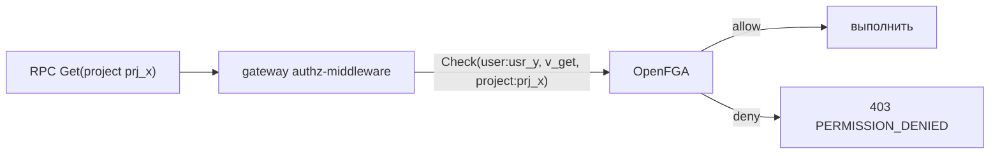
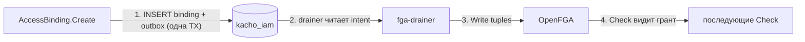

# Модель авторизации

Эта страница объясняет, **как Kachō решает, можно ли действие**. Модель — ReBAC
(relationship-based access control) поверх **OpenFGA**: доступ выражается не списком правил в
коде, а набором *отношений* между субъектами и объектами. Роль и привязка ([Role](/api/role),
[AccessBinding](/api/access-binding)) — это удобный tenant-facing способ *объявить* отношения; в
рантайме проверка — это резолюция графа отношений в OpenFGA.

## Ключевые понятия

<table>
  <thead><tr><th>Понятие</th><th>Смысл</th></tr></thead>
  <tbody>
    <tr><td><strong>Субъект</strong></td><td>Кто действует: <code>user:usr…</code> / <code>service_account:sva…</code> / <code>group:grp…#member</code></td></tr>
    <tr><td><strong>Объект</strong></td><td>Над чем: <code>account:acc…</code> / <code>project:prj…</code> / <code>vpc_network:enp…</code> / singleton <code>cluster:cluster_kacho_root</code></td></tr>
    <tr><td><strong>Отношение</strong></td><td>Связь субъект↔объект: <code>viewer</code> / <code>editor</code> / <code>admin</code> / verb-bearing <code>v_get</code>/<code>v_update</code>/… / <code>owner</code></td></tr>
    <tr><td><strong>Tuple</strong></td><td>Материализованная тройка <code>(объект, отношение, субъект)</code> в OpenFGA</td></tr>
    <tr><td><strong>Scope / tier</strong></td><td>Уровень иерархии привязки: CLUSTER ▶ ACCOUNT ▶ PROJECT</td></tr>
  </tbody>
</table>

## Явная per-object flat-модель

Модель Kachō — **явная и плоская**: доступ к объекту выражается прямыми отношениями на этом
объекте, без неявного каскада вниз по иерархии и без организационного уровня над аккаунтом.
Привязка на PROJECT-scope даёт доступ к ресурсам проекта; привязка на ACCOUNT-scope — к самому
аккаунту и его содержимому через явные tuple'ы, которые IAM материализует. «Иерархия» — это набор
явных отношений, а не рекурсивная функция резолюции.

## Verb-bearing отношения

Центральный механизм — **verb-bearing отношения**. На каждый метод чтения/мутации ресурса
gateway проверяет **точное** отношение, соответствующее глаголу, а не грубое tier-отношение:

<table>
  <thead><tr><th>Метод</th><th>Требуемое отношение</th></tr></thead>
  <tbody>
    <tr><td><code>Get</code></td><td><code>v_get</code></td></tr>
    <tr><td><code>Update</code> / мутирующие <code>:verb</code> (AddMember, ...)</td><td><code>v_update</code></td></tr>
    <tr><td><code>Delete</code></td><td><code>v_delete</code></td></tr>
    <tr><td>per-resource <code>List</code> / <code>ListOperations</code> / <code>ListMembers</code></td><td><code>v_list</code></td></tr>
    <tr><td>Создание дочернего (Project/User/SA/Group/Role в Account)</td><td><code>editor</code> на контейнере</td></tr>
  </tbody>
</table>

`v_*`-отношения **развязаны** с tier-ролями: наличие `editor` на объекте не означает автоматически
`v_get` — verb-bearing грант выдаётся явно правилом роли. Это исключает завышение прав, когда
широкая tier-роль «протекает» в мелкие действия. Роль с правилом `{module: iam, resources:
[projects], verbs: [get, list]}` материализует `v_get`/`v_list` на объектах-проектах в пределах
scope привязки — и ровно их.

## List — scope-filter, а не Check

Top-level `List` (Account / Project / User / ServiceAccount / Group / Role) **нельзя** гейтить
одним `Check`: у списка нет единого объекта, а `Check` на `project:*` выдал бы default-deny (403)
всем. Поэтому такие `List` **освобождены** от per-RPC Check на gateway и default-deny реализован
**scope-filter'ом в handler'е**: возвращается `200` и только те ресурсы, что видит субъект —
объединение `viewer ∪ v_list`. Пустой список, если ничего не видно — **никогда 403**. Handler —
авторитетный гейт видимости.

:::warning Освобождение снимает authz, но не authN
`<exempt>`-RPC (List'ы, `Role.Get`, `WhoAmI`, `Account.Create`, `AccessBinding.Create`,
`PermissionCatalog`) не проходят per-RPC Check, но **анонима всё равно отвергает**
anti-anonymous интерсептор IAM (`UNAUTHENTICATED`). Освобождается только *авторизация*.
:::

## Owner и cluster-admin

- **Owner** аккаунта (`ownerUserId`) получает полный доступ к содержимому аккаунта через
  cluster-role owner-механику; при создании аккаунта заводится защищённая owner-привязка
  (`deletionProtection=true`).
- **cluster-admin** (`systemAdmin` на singleton `cluster:cluster_kacho_root`) — short-circuit:
  проходит любой per-resource Check. Это платформенный администратор.
- **grant-authority** — право *выдавать* доступ (`AccessBinding.Create`): владелец
  аккаунта-владельца scope ИЛИ FGA `admin` на объекте scope. Проверяется в handler'е, т.к. тип
  объекта scope зависит от запроса.

## Step-up (ACR floor)

Большинство пользовательских RPC несут `required_acr_min=2` — **минимальный уровень свежести
аутентификации** (second-factor). Это защищает чувствительные действия от stale-сессий: если ACR
токена ниже требуемого, запрос отклоняется независимо от наличия отношения. Service→service-вызовы
(SA-principal) освобождены от ACR-floor.

## Условия ABAC

Привязка может нести **условие** (`conditionId` — кастомное, либо `builtinCondition` — из
well-known каталога, logical-oneof — не более одного). Условие — ABAC-overlay поверх ReBAC:
доступ разрешается, только если условие истинно для контекста запроса
(`AuthorizeCheckRequest.context`). Well-known каталог:

<table>
  <thead><tr><th>Условие</th><th>Семантика</th></tr></thead>
  <tbody>
    <tr><td><code>MFA_FRESH</code></td><td>acr=3 (passkey/FIDO2) + <code>webauthn</code> в amr + MFA не старше 15 минут</td></tr>
    <tr><td><code>NON_EXPIRED</code></td><td>Нет <code>expiresAt</code> ИЛИ <code>now() &lt; expiresAt</code></td></tr>
    <tr><td><code>SOURCE_IP_IN_RANGE</code></td><td>Source IP входит в один из настроенных CIDR</td></tr>
    <tr><td><code>JIT_WINDOW</code></td><td>Разрешено в течение <code>ttl_seconds</code> после self-elevation</td></tr>
    <tr><td><code>BUSINESS_HOURS</code></td><td>Пн–Пт в интервале <code>[start_h, end_h)</code> в настроенном TZ</td></tr>
    <tr><td><code>DEVICE_COMPLIANT</code></td><td>WebAuthn device-attestation в списке одобренных AAGUID</td></tr>
  </tbody>
</table>

Условия компилируются в OpenFGA Authorization Model на этапе установки. При отказе из-за условия
`AuthorizeCheckResponse.denyReasons` содержит причину (`["mfa_fresh: acr=2 (need 3)"]`).

## Материализация: tuple-outbox

Модель прав хранится в Postgres (роли, привязки), но исполняется в OpenFGA (tuple'ы). Согласование
двух хранилищ — через **transactional-outbox**: мутация привязки в той же TX пишет intent в
`fga_register_outbox`; drainer асинхронно применяет его в OpenFGA (at-least-once, идемпотентно,
переживает рестарты). Owner-tuple'ы ресурсов других сервисов (VPC/Compute) регистрируются через
`InternalIAMService.RegisterResource` — модули не пишут в OpenFGA напрямую.

:::tip Grant-latency
Между `Operation.done=true` (запись в Postgres зафиксирована) и «грант виден в Check» проходит
~0.6–2 c пропагации через outbox+OpenFGA. UI и тесты после создания привязки должны использовать
poll-retry, а не мгновенный assert.
:::

## Fail-closed

Недоступность OpenFGA на request-path → отказ (`UNAVAILABLE` для мутаций), не «разрешить по
умолчанию». Internal-периметр (`:9091`) mTLS-обязателен и всё равно гейтит каждый RPC. Анонимный
запрос отвергается везде. Модель — **secure-by-default**; см. также
[Особенности дизайна](/advanced/design-decisions).
