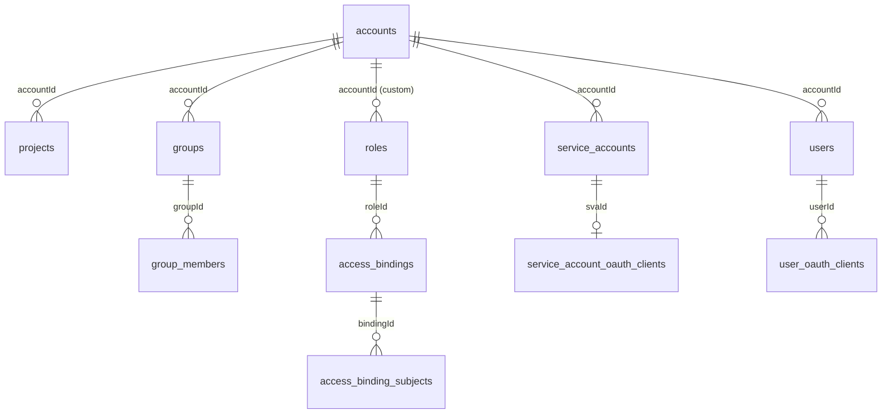

# Модель данных

Эта страница описывает, **как IAM хранит личности и права** в PostgreSQL. Схема `kacho_iam`
принадлежит только этому сервису (database-per-service); within-service инварианты выражены на
уровне БД — FK, UNIQUE, partial-UNIQUE, CHECK, атомарный CAS и OCC (`xmin`), — а не
software-проверками. Наружу утечки SQL нет: SQLSTATE маппится в стабильные gRPC-коды.

## Ключевые сущности

<table>
  <thead><tr><th>Таблица</th><th>Назначение</th><th>Ключевые ограничения</th></tr></thead>
  <tbody>
    <tr><td><code>accounts</code></td><td>Аккаунты (tenant-контейнеры)</td><td>UNIQUE <code>name</code>; <code>owner_user_id</code></td></tr>
    <tr><td><code>projects</code></td><td>Проекты внутри аккаунта</td><td>UNIQUE <code>(account_id, name)</code></td></tr>
    <tr><td><code>users</code></td><td>Пользователи (проекция Kratos-identity, per-Account)</td><td>UNIQUE email per-Account; <code>invite_status</code></td></tr>
    <tr><td><code>service_accounts</code></td><td>Машинные субъекты</td><td>UNIQUE имя per-Account; <code>enabled</code></td></tr>
    <tr><td><code>groups</code> · <code>group_members</code></td><td>Группы и их члены</td><td>UNIQUE имя per-Account; членство (type, id)</td></tr>
    <tr><td><code>roles</code> · <code>role_rule_selectors</code></td><td>Роли и правила (rules)</td><td>partial-UNIQUE имя per-scope; CHECK <code>roles_scope_xor</code>; OCC <code>xmin</code></td></tr>
    <tr><td><code>access_bindings</code> · <code>access_binding_subjects</code></td><td>Привязки доступа + мульти-субъекты</td><td>UNIQUE активного гранта; <code>status</code>; <code>deletion_protection</code></td></tr>
    <tr><td><code>service_account_oauth_clients</code></td><td>Маппинг SA → Hydra-клиент (ключ)</td><td>UNIQUE <code>sva_id</code>; FK <code>ON DELETE RESTRICT</code></td></tr>
    <tr><td><code>user_oauth_clients</code></td><td>Маппинг User → Hydra-клиент (токен)</td><td>N:1; FK <code>ON DELETE CASCADE</code></td></tr>
    <tr><td><code>operations</code></td><td>LRO-журнал (async-мутации)</td><td>corelib operations-таблица; denormalized <code>account_id</code></td></tr>
    <tr><td><code>audit_outbox</code></td><td>Audit-журнал мутаций (в одной TX)</td><td>эмитится атомарно с мутацией</td></tr>
    <tr><td><code>fga_outbox</code></td><td>Материализация FGA-tuple'ов (drainer)</td><td>at-least-once; идемпотентно</td></tr>
    <tr><td><code>resource_mirror</code></td><td>Зеркало иерархии ресурсов для authz-реконсиляции</td><td><code>parent_project_id</code> / labels</td></tr>
  </tbody>
</table>

## Инварианты на уровне БД

<table>
  <thead><tr><th>Инвариант</th><th>Механизм</th></tr></thead>
  <tbody>
    <tr><td>Имя уникально в scope</td><td>partial <code>UNIQUE … WHERE</code> (роль — per cluster/account/project)</td></tr>
    <tr><td>Роль — ровно один scope (account XOR project)</td><td>CHECK <code>roles_scope_xor</code></td></tr>
    <tr><td>Идемпотентность привязки</td><td>UNIQUE <code>(subject_type, subject_id, role_id, resource_type, resource_id)</code></td></tr>
    <tr><td>OCC при изменении rules роли</td><td><code>xmin</code>-snapshot (<code>resource_version</code>)</td></tr>
    <tr><td>Снятие defense (deletion_protection) перед Delete</td><td>атомарный CAS <code>DELETE … WHERE deletion_protection=false</code></td></tr>
    <tr><td>Audit не теряется</td><td>outbox-эмит в той же writer-транзакции</td></tr>
  </tbody>
</table>

## Согласование Postgres ↔ OpenFGA

Модель прав живёт в Postgres (роли, привязки), но **исполняется** в OpenFGA (tuple'ы). Два
хранилища согласуются через transactional-outbox: мутация в той же TX пишет intent в `fga_outbox`,
drainer асинхронно применяет его в OpenFGA. Это даёт at-least-once, идемпотентность и
переживаемость рестартов ценой небольшой grant-latency (~0.6–2 c). Механику см. в
[Модели авторизации](/architecture/authz#материализация-tuple-outbox).

:::note Миграции — только новые
Схема версионируется goose. Применённые миграции не редактируются — только новые (ban #5).
После hard-cut/renumbering сверяют **наличие объектов каждой миграции** (`to_regclass`, колонки,
constraints), а не только `max(version_id)` — goose-версия может числить миграцию applied, а
объекта не быть.
:::
