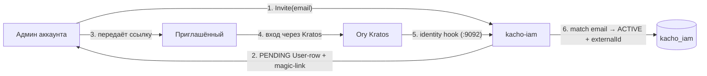
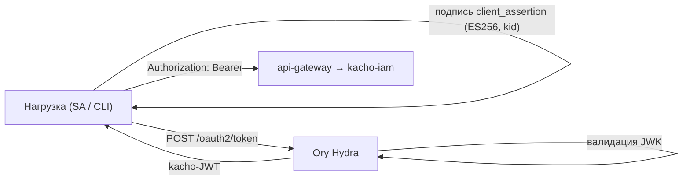

# Идентичность и токены

Эта страница объясняет, **как в Kachō появляется личность и как она аутентифицируется**. IAM не
хранит пароли и не обслуживает форму входа сам — это вынесено в Ory-стек: **Kratos** (личности и
интерактивный вход) и **Hydra** (OAuth 2.0 authorization server). IAM хранит *проекцию* личности
(ресурс User), маппинг на OAuth-клиентов (ключи и токены) и всю модель прав. Такое разделение даёт
зрелый, проверенный слой аутентификации и чистый control-plane сверху.

## Действующие лица

<table>
  <thead><tr><th>Компонент</th><th>Роль</th></tr></thead>
  <tbody>
    <tr><td><strong>Ory Kratos</strong></td><td>Хранилище личностей + интерактивный вход (пароль / passkey / recovery). Каждая identity — глобальная запись</td></tr>
    <tr><td><strong>Ory Hydra</strong></td><td>OAuth 2.0 / OIDC authorization server: чеканит kacho-JWT, хранит OAuth-клиентов (JWK)</td></tr>
    <tr><td><strong>kacho-iam</strong></td><td>Проекция identity → User (per-Account), маппинг OAuth-клиентов, модель прав</td></tr>
    <tr><td><strong>api-gateway</strong></td><td>Проверяет kacho-JWT на каждом внешнем запросе (Bearer)</td></tr>
  </tbody>
</table>

## User — проекция identity

Ресурс [User](/api/user) — это **локальная проекция** Kratos-identity в пределах одного аккаунта.
Одна identity Kratos может соответствовать нескольким User-строкам (по одной на каждый аккаунт,
куда человек приглашён). Поле `externalId` User хранит Kratos `sub`; `email` используется для
сопоставления при первом входе.

### Поток приглашения и активации

1. Админ вызывает `UserService.Invite(email)` — backend создаёт `PENDING`-строку.
2. `Operation.metadata` несёт `magicLinkUrl` (recovery/magic-link Kratos); админ передаёт ссылку
   вручную (автоотправка email не интегрирована).
3. Приглашённый входит через Kratos.
4. При успешном входе Kratos дёргает **identity-hook** IAM (listener `:9092`, mTLS): IAM
   сопоставляет email с `PENDING`-строкой, переводит её в `ACTIVE` и заполняет `externalId`.

`inviteStatus` отражает состояние: `PENDING` (приглашён, не входил) → `ACTIVE` (вошёл) → `BLOCKED`
(отключён администратором).

:::info Bootstrap-root
Первый администратор кластера задаётся через `KACHO_IAM_BOOTSTRAP_ROOT_EMAIL`: при первом входе
пользователя с этим email ему выдаётся cluster-admin, разрывая «курицу и яйцо» первичной настройки.
:::

## Токены — OAuth 2.0 через Hydra

Программная аутентификация (без интерактивного входа) — через OAuth 2.0-клиентов Hydra. Два вида
кредов, симметричных по устройству (см. [Токены доступа](/api/tokens)):

<table>
  <thead><tr><th>Кред</th><th>Субъект</th><th>Применение</th><th>ID-префикс маппинга</th></tr></thead>
  <tbody>
    <tr><td><strong>SAKey</strong></td><td>ServiceAccount</td><td>Рабочие нагрузки, CI, интеграции</td><td><code>soc</code></td></tr>
    <tr><td><strong>UserToken</strong></td><td>User</td><td>CLI и скрипты от имени человека</td><td><code>uoc</code></td></tr>
  </tbody>
</table>

При выпуске (`Issue`) kacho-iam генерирует пару ECDSA P-256, регистрирует публичный JWK в Hydra и
возвращает приватный ключ **ровно один раз**. Секрет нигде не хранится: Hydra держит только
публичный JWK, kacho-iam — маппинг `hydraClientId → субъект`.

### Обмен ключа на kacho-JWT

- **`private_key_jwt`** (по умолчанию): клиент подписывает `client_assertion` приватным ключом и
  обменивает его в Hydra `/oauth2/token` на kacho-JWT.
- **`jwt-bearer` (федерация)**: внешняя нагрузка (CI-runner, k8s-под, внешний OIDC IdP) предъявляет
  **свой** OIDC-JWT. Ключ регистрируется с `trustedSubjects[]` — парами `(issuer, subjectPattern)`,
  ограничивающими, какие внешние `iss`/`sub` вправе представлять этот SA. `audience[]` управляет
  `aud`-claim'ом kacho-JWT для внешних consumer'ов (STS, workload-identity-federation).

## Проверка на gateway

Все внешние запросы несут kacho-JWT в `Authorization: Bearer`. `api-gateway` валидирует токен
(подпись, срок, issuer) и извлекает принципала до того, как запрос дойдёт до доменного сервиса.
Отсутствующий/невалидный токен → `UNAUTHENTICATED` (401). Далее принципал участвует в per-RPC
authz-Check (см. [Модель авторизации](/architecture/authz)).

:::warning Сессия vs токен
Универсальный 401/403 на **всех** эндпоинтах (и read, и write) с cookie-сессией обычно означает
истёкшую сессию, а не баг эндпоинта: UI показывает кэшированные чтения, но записи падают
`AUTHN_REQUIRED`. Долгоживущие OAuth-токены (SAKey/UserToken) в такую ловушку не попадают.
:::
