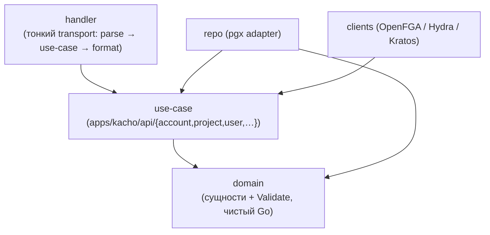
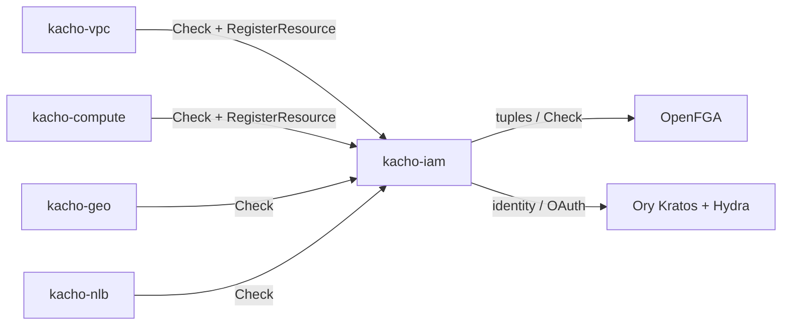

# Архитектура

Эта страница описывает внутреннее устройство Kachō IAM: слоистую (clean) архитектуру,
database-per-service, интеграцию с OpenFGA и провайдерами идентичности, набор listener'ов и место
сервиса в платформе как leaf-узла и центрального авторизатора. Внешний контракт — на
[страницах API](/api/overview); модель прав и потоки идентичности вынесены в отдельные разделы:
[Авторизация](/architecture/authz) и [Идентичность и токены](/architecture/identity).

## Чистая архитектура

Сервис следует строгому правилу зависимостей: транспорт зависит от бизнес-логики, бизнес-логика —
от домена, а домен не зависит ни от чего, кроме stdlib и контракта `kacho-proto`.

<table>
  <thead><tr><th>Слой</th><th>Где</th><th>Ответственность</th></tr></thead>
  <tbody>
    <tr><td><strong>domain</strong></td><td><code>internal/domain/</code></td><td>Сущности + <code>Validate()</code>; закрытые наборы (verbs, subject-types). Только stdlib + proto</td></tr>
    <tr><td><strong>use-case</strong></td><td><code>internal/apps/kacho/api/&lt;resource&gt;/</code></td><td>Бизнес-логика; определяет port-интерфейсы (Repo, Client). Не импортирует transport</td></tr>
    <tr><td><strong>repo (adapter)</strong></td><td><code>internal/repo/</code></td><td>Реализация портов на handwritten pgx; SQLSTATE → sentinel; outbox-emit в TX</td></tr>
    <tr><td><strong>clients (adapter)</strong></td><td><code>internal/clients/</code></td><td>OpenFGA (Check/Write), Hydra (OAuth-клиенты), Kratos (identity)</td></tr>
    <tr><td><strong>handler</strong></td><td><code>internal/handler/</code></td><td>Тонкий transport: parse → use-case → format. Без бизнес-логики</td></tr>
    <tr><td><strong>authz</strong></td><td><code>internal/authzguard</code>, <code>authzmap</code>, <code>authztypes</code></td><td>Интерсепторы, permission-map, verb→relation, объектные типы</td></tr>
    <tr><td><strong>composition root</strong></td><td><code>cmd/kacho-iam/</code></td><td>Единственное место wiring (serve.go); <code>cmd/migrator/</code> — миграции</td></tr>
  </tbody>
</table>

Переиспользуемое (pgx-пул, grpc-сервер/клиент, config, observability, LRO-operations, ids) приходит
из `kacho-corelib` — не дублируется в сервисе.

## База данных — database-per-service

Kachō IAM владеет схемой `kacho_iam` в PostgreSQL и не делит её ни с кем. Within-service
инварианты выражены на уровне БД (FK / UNIQUE / CHECK / partial-UNIQUE / CAS), а не
software-проверками. Ключевые группы таблиц: аккаунты / проекты / пользователи / сервис-аккаунты /
группы (+ `group_members`) / роли / привязки доступа, плюс audit-outbox и `fga_register_outbox`
(материализация tuple'ов в OpenFGA). Подробнее — [Модель данных](/architecture/data-model).

:::note Within-service инварианты — на уровне БД
Уникальность имён в scope — partial UNIQUE; идемпотентность привязок — UNIQUE
(subject_type, subject_id, role_id, resource_type, resource_id); XOR-scope роли — CHECK
`roles_scope_xor`; OCC роли — `xmin`-snapshot. Service-слой лишь маппит SQLSTATE на gRPC-код
(`23505`→ALREADY_EXISTS, `23514`→INVALID_ARGUMENT, ...). Текст pgx наружу не утекает
(фиксированный INTERNAL).
:::

## Авторизация — OpenFGA (ReBAC)

IAM — не только владелец модели прав, но и **точка её исполнения**. Он держит клиент к OpenFGA и
на каждый RPC (свой и чужой — через `InternalIAMService.Check`) резолвит отношение субъекта к
объекту. Модель авторизации (`fga_model.fga`) описывает типы объектов
(`account` / `project` / `iam_user` / `vpc_network` / ...) и отношения
(`viewer` / `editor` / `admin` / verb-bearing `v_get`/`v_update`/... / `owner`). Изменения модели
прав (роль, привязка) материализуются в tuple'ы через transactional-outbox (`fga_register_outbox`
+ drainer), обеспечивая at-least-once и переживаемость рестартов. Полная модель —
[Авторизация](/architecture/authz).

## Идентичность — Ory Kratos + Ory Hydra

Аутентификация вынесена в Ory-стек: **Kratos** хранит личности и обслуживает интерактивный вход
(пароль / passkey), **Hydra** — OAuth 2.0 authorization server, чеканящий kacho-JWT. IAM
интегрируется с ними через hook-listener (активация User при первом входе) и клиент Hydra
(регистрация OAuth-клиентов для ключей и токенов). User — проекция Kratos-identity; SAKey /
UserToken — маппинг на Hydra-клиентов. Детали и потоки — [Идентичность и токены](/architecture/identity).

## Listener'ы

Сервис поднимает несколько gRPC-listener'ов с разной поверхностью и границей доверия:

<table>
  <thead><tr><th>Порт</th><th>Listener</th><th>Кто ходит · транспорт</th><th>Что обслуживает</th></tr></thead>
  <tbody>
    <tr><td><code>:9090</code></td><td>public</td><td>Tenant через <code>api-gateway</code> (TLS+JWT); peer-сервисы (mTLS)</td><td>Публичные RPC ресурсов + AuthorizeService + OperationService</td></tr>
    <tr><td><code>:9091</code></td><td>internal</td><td>Peer-сервисы (mTLS)</td><td><code>InternalIAMService</code> (<code>Check</code> / <code>RegisterResource</code> / ...) — authz-gate платформы</td></tr>
    <tr><td><code>:9092</code></td><td>hooks</td><td>Ory Kratos (mTLS)</td><td>Identity-хуки (активация User при первом входе)</td></tr>
    <tr><td><code>:9095</code></td><td>metrics</td><td>Prometheus (cluster-internal)</td><td><code>/metrics</code></td></tr>
  </tbody>
</table>

- **Production-режим** обязывает mTLS на публичном (`:9090`) и internal (`:9091`) listener'ах —
  иначе сервис не стартует (fail-closed, «refusing to start with insecure :9090/:9091», без
  «insecure downgrade»).
- **Internal (`:9091`) не считается доверенным**: он гейтит, кто может звать каждый RPC
  (defense-in-depth против lateral movement), а не «trusted, mTLS достаточно».

Подробнее о ключах — [Конфигурация](/install/configuration).

## Место в платформе — leaf + центральный авторизатор

По сборке IAM — **leaf-узел**: он не зависит ни от одного доменного сервиса (как kacho-geo). По
runtime — **центральный магнит вызовов**: каждый сервис зовёт `InternalIAMService.Check` на каждом
RPC, а vpc/compute дополнительно регистрируют owner-tuple'ы своих ресурсов через
`RegisterResource` / `UnregisterResource` (модули не ходят в OpenFGA напрямую — только через IAM).

:::info Циклов нет
Рёбра `* → iam` однонаправлены — IAM не зовёт своих консументов обратно. Единственные исходящие
рёбра IAM — к инфраструктуре (OpenFGA, Kratos, Hydra, Postgres), не к доменным сервисам.
:::
