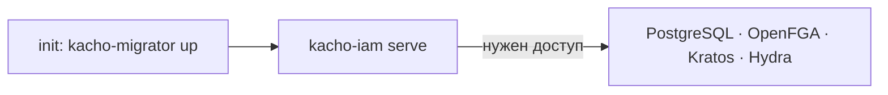

import CodeBlock from '@theme/CodeBlock'
import dedent from 'ts-dedent'

# Развёртывание

Kachō IAM — Go-сервис, поставляемый Docker-образом и разворачиваемый в Kubernetes через
Helm-чарт (часть umbrella-стенда платформы). Эта страница описывает сборку образа, зависимости
рантайма и порядок запуска. Полный набор ключей конфигурации — на странице
[Конфигурация](/install/configuration).

## Зависимости рантайма

<table>
  <thead><tr><th>Зависимость</th><th>Роль · обязательность</th></tr></thead>
  <tbody>
    <tr><td><strong>PostgreSQL</strong></td><td>Хранилище <code>kacho_iam</code> — обязательно</td></tr>
    <tr><td><strong>OpenFGA</strong></td><td>ReBAC-движок авторизации — обязательно</td></tr>
    <tr><td><strong>Ory Kratos</strong></td><td>Личности и интерактивный вход — для user-флоу</td></tr>
    <tr><td><strong>Ory Hydra</strong></td><td>OAuth 2.0 authorization server — для токенов (SAKey / UserToken)</td></tr>
    <tr><td><strong>api-gateway</strong></td><td>Edge для tenant-трафика (TLS + JWT) — для внешнего доступа</td></tr>
  </tbody>
</table>

## Сборка образа

Двухстадийная сборка: компиляция Go-бинарей (`kacho-iam` + `kacho-migrator`), затем минимальный
рантайм-образ.

<CodeBlock language="bash">
  {dedent`
    # локальная сборка бинарей
    make build
    make build-migrator

    # docker-образ
    docker build -t kacho-iam:dev .
  `}
</CodeBlock>

## Порядок запуска

1. **Миграции** — `kacho-migrator up` накатывает схему `kacho_iam` (обычно init-container перед
   основным подом).
2. **Сервис** — `kacho-iam serve` поднимает listener'ы (`:9090` public, `:9091` internal,
   `:9092` hooks, `:9095` metrics).
3. **Модель авторизации** — при установке в OpenFGA пишется authorization model + seed
   system-ролей и cluster-объекта; `KACHO_IAM_OPENFGA_MODEL_ID` пиннит используемую версию.

## Проверка здоровья

- **Readiness / liveness** — сервис отдаёт готовность после успешного подключения к БД и OpenFGA.
- **Метрики** — Prometheus `/metrics` на cluster-internal listener (`:9095`).

:::warning «Задеплоено» ≠ «работает»
Running-под и applied-миграции — не доказательство работоспособности. Реальные баги
(worker-principal, migration-divergence, domain-binding) видны только на живом стеке через
gateway. После деплоя обязателен E2E-прогон: логин, создание аккаунта/проекта, выдача роли и
проверка видимости — не полагайтесь на pod-health. См.
[Особенности дизайна](/advanced/design-decisions).
:::

## Production-профиль

В production-профиле включены mTLS на всех listener'ах, production-strict AuthN и `sslmode=require`
для БД. Сервис откажется стартовать без mTLS на публичном/internal listener'ах (fail-closed).
Детали ключей — [Конфигурация](/install/configuration).
