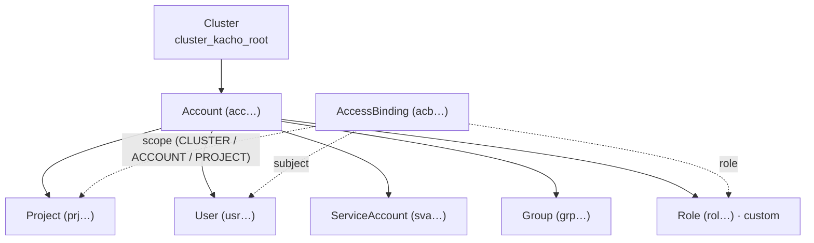
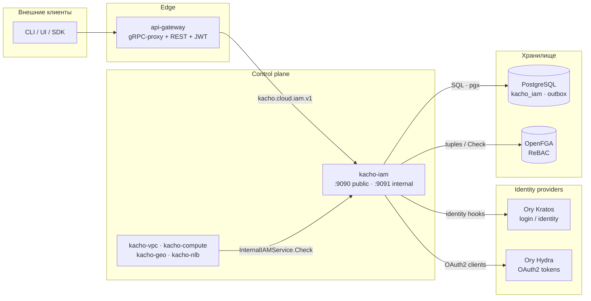

import hero from '@site/src/css/hero.module.css'

<header className={hero.hero}>
   Control-plane · Identity & Access

  <h1 className={hero.title}>
    Личности и доступ 
    Kachō
  </h1>

  

    gRPC + REST API, описывающий <strong>кто есть кто</strong> и <strong>кому что можно</strong>
    в облаке: аккаунты, проекты, пользователи, сервис-аккаунты, группы, роли и привязки доступа.
    Центральный источник аутентификации и авторизации для всех сервисов платформы.
  

  

    <a className={hero.btnPrimary} href="/getting-started">Быстрый старт →</a>
    <a className={hero.btnGhost} href="/api/overview">Обзор API</a>
    <a className={hero.btnGhost} href="/architecture/authz">Авторизация</a>
    <a className={hero.btnGhost} href="https://github.com/PRO-Robotech/kacho-iam">GitHub</a>
  

</header>

## Что это и зачем

**Kachō IAM** — control-plane сервис домена **Identity & Access Management**. Он отвечает на
два фундаментальных вопроса платформы: *кто выполняет запрос* (аутентификация) и *имеет ли он
право* его выполнить (авторизация). IAM — единственный владелец субъектов (пользователей,
сервис-аккаунтов, групп) и модели прав (ролей и привязок доступа); все остальные сервисы —
VPC, Compute, Geo, Network Load Balancer — обращаются к нему за проверкой доступа на **каждом**
RPC.

Бизнес-ценность в том, что **личности и права вынесены в единый домен с одним владельцем**.
Не нужно повторять модель прав в каждом сервисе, не расходятся списки пользователей, а решение
«разрешить/запретить» принимается в одном месте по единой модели ReBAC (relationship-based
access control) поверх OpenFGA. Разработчик описывает роль в терминах *«какие глаголы над
какими ресурсами»* и привязывает её к субъекту на нужном уровне иерархии — платформа сама
разворачивает это в проверяемые отношения.

API следует **конвенциям Kachō**: плоские (flat) ресурсы, camelCase JSON, REST-пути
`/iam/v1/<resource>`, единый формат ошибок `{code, message, details[]}`. Чтение — синхронное;
мутации — асинхронные через `Operation` с поллингом.

:::info Control-plane only
Kachō IAM управляет **описанием личностей и прав**. Хранение паролей / passkey и интерактивный
вход вынесены в интеграцию с Ory Kratos, а выпуск и валидация OAuth 2.0-токенов — в Ory Hydra
(см. [Идентичность и токены](/architecture/identity)). IAM хранит *проекцию* личности
(User-row) и модель авторизации.
:::

:::tip С чего начать
Новому читателю — [**Быстрый старт**](/getting-started): пошагово от сборки и миграций до
создания аккаунта, приглашения пользователя и выдачи первой роли. Готовы к деталям —
[Обзор API](/api/overview) и [Модель авторизации](/architecture/authz).
:::

## Доменная модель

Kachō IAM управляет **семью типами tenant-facing ресурсов** плюс кредами доступа. Все ресурсы —
«плоские» (flat): domain-поля на верхнем уровне сообщения, без K8s-envelope. Иерархия
владения: **Account → Project**; субъекты (User / ServiceAccount / Group) и роли живут в
пределах аккаунта, а привязки доступа (AccessBinding) соединяют субъект, роль и уровень
иерархии.

<table>
  <thead>
    <tr><th>Ресурс</th><th>Назначение</th><th>ID-префикс</th></tr>
  </thead>
  <tbody>
    <tr><td><strong>Account</strong></td><td>Верхнеуровневый tenant-контейнер: владеет проектами, ролями, группами, сервис-аккаунтами</td><td><code>acc</code></td></tr>
    <tr><td><strong>Project</strong></td><td>Среднеуровневый контейнер внутри аккаунта; к нему привязываются ресурсы других сервисов</td><td><code>prj</code></td></tr>
    <tr><td><strong>User</strong></td><td>Человек-субъект (проекция личности из Kratos), per-Account</td><td><code>usr</code></td></tr>
    <tr><td><strong>ServiceAccount</strong></td><td>Машинный (non-human) субъект — рабочие нагрузки, CI, интеграции</td><td><code>sva</code></td></tr>
    <tr><td><strong>Group</strong></td><td>Набор субъектов, которым роль выдаётся оптом</td><td><code>grp</code></td></tr>
    <tr><td><strong>Role</strong></td><td>Именованный набор правил «глаголы × ресурсы» (system или custom)</td><td><code>rol</code></td></tr>
    <tr><td><strong>AccessBinding</strong></td><td>Привязка: (субъекты) + (роль) на (уровень иерархии)</td><td><code>acb</code></td></tr>
  </tbody>
</table>

Кроме tenant-ресурсов IAM выдаёт **креды доступа**: статические ключи сервис-аккаунтов
(`SAKey`) и персональные токены пользователя (`UserToken`) — оба через OAuth 2.0-клиенты Hydra.

### Иерархия и привязки

AccessBinding — центральный ресурс модели: он связывает один или несколько **субъектов**
(User / ServiceAccount / Group) с **ролью** на выбранном **уровне иерархии** (`scope`:
CLUSTER ▶ ACCOUNT ▶ PROJECT). Роль описывает *что можно делать*; привязка — *кому и где*.

## Как с сервисом общаться

Kachō IAM — **leaf-узел** платформы: по сборке он не зависит ни от одного другого доменного
сервиса. При этом он — **центральный магнит вызовов**: любой сервис на каждом RPC зовёт
`InternalIAMService.Check` для авторизации, а tenant-запросы приходят через `api-gateway`.

Система построена по принципу **database-per-service**: kacho-iam владеет схемой `kacho_iam` и
общается с другими доменами только по API. Модель авторизации материализуется в OpenFGA как
набор tuple'ов; проверка `Check` резолвит отношение субъекта к объекту. Подробнее —
[Модель авторизации](/architecture/authz).

## Ключевые возможности

  

    ⇄
    gRPC + REST API
    Единый контракт на Protocol Buffers (<code>kacho-proto</code>), REST-проекция через grpc-gateway.
  

  

    🔑
    ReBAC-авторизация
    Per-RPC <code>Check</code> поверх OpenFGA; verb-bearing отношения <code>v_get</code>/<code>v_update</code>/<code>v_delete</code>/<code>v_list</code>.
  

  

    ▤
    Роли из правил
    Custom-роль — набор <code>rules[]</code> «глаголы × ресурсы», опц. суженный по id или меткам.
  

  

    ◎
    Иерархия scope
    Привязка доступа на уровне CLUSTER ▶ ACCOUNT ▶ PROJECT; multi-subject в одной привязке.
  

  

    🎫
    OAuth 2.0-креды
    Ключи сервис-аккаунтов и токены пользователей через Ory Hydra (private_key_jwt + jwt-bearer федерация).
  

  

    📓
    Async-мутации + audit
    Create/Update/Delete возвращают <code>Operation</code>; изменения материализуются в FGA через transactional-outbox.
  

## Технологический стек

<table>
  <thead><tr><th>Технология</th><th>Применение</th></tr></thead>
  <tbody>
    <tr><td>Go</td><td>Язык реализации (чистая архитектура: handler → use-case → domain)</td></tr>
    <tr><td>Protocol Buffers / Buf</td><td>Контракт API (<code>kacho-proto</code>, домен <code>kacho.cloud.iam.v1</code>)</td></tr>
    <tr><td>PostgreSQL / pgx v5</td><td>Хранилище <code>kacho_iam</code> (без ORM — sqlc + handwritten pgx)</td></tr>
    <tr><td>OpenFGA</td><td>ReBAC-движок авторизации (tuple-store + Check / ListObjects)</td></tr>
    <tr><td>Ory Kratos</td><td>Аутентификация и хранение личностей (login / passkey); User — проекция identity</td></tr>
    <tr><td>Ory Hydra</td><td>OAuth 2.0 authorization server: токены сервис-аккаунтов и пользователей</td></tr>
    <tr><td>Goose</td><td>Версионирование схемы (набор миграций <code>0001…</code>)</td></tr>
    <tr><td>grpc-gateway</td><td>REST-проекция gRPC</td></tr>
  </tbody>
</table>

## Структура репозиториев

<table>
  <thead><tr><th>Репозиторий</th><th>Назначение</th></tr></thead>
  <tbody>
    <tr><td><strong>kacho-iam</strong></td><td>Этот сервис: control-plane IAM (Account / Project / User / SA / Group / Role / AccessBinding)</td></tr>
    <tr><td><strong>kacho-proto</strong></td><td>Центральные <code>.proto</code> + сгенерированные Go-stubs + FGA-модель авторизации</td></tr>
    <tr><td><strong>kacho-corelib</strong></td><td>Общие пакеты (db, grpcsrv, grpcclient, config, observability, operations, ids, ...)</td></tr>
    <tr><td><strong>kacho-api-gateway</strong></td><td>Edge: gRPC-proxy + REST mux + проверка JWT + per-RPC authz-middleware</td></tr>
    <tr><td><strong>kacho-vpc / kacho-compute / kacho-geo / kacho-nlb</strong></td><td>Консументы IAM: вызывают <code>InternalIAMService.Check</code> на каждом RPC</td></tr>
  </tbody>
</table>
