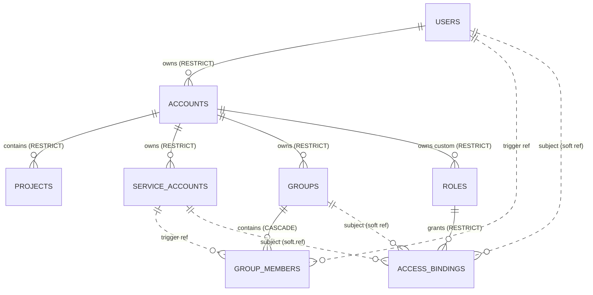

# kacho-iam — ER-диаграмма (schema `kacho_iam`)

Все FK / UNIQUE / CHECK / партиальные индексы / триггеры определены в миграциях
`internal/migrations/` (базовая — `0001_initial.sql`); они — источник истины
схемы. Здесь — обзорная диаграмма и заметки по нетривиальным связям.

## Notes

- `group_members.member_id` — без FK на `users.id`/`service_accounts.id`
  (Postgres FK не поддерживает альтернативную ссылку). Целостность —
  через триггер `group_members_member_exists_trg`
  (BEFORE INSERT/UPDATE → EXISTS-check в соответствующей таблице).

- `access_bindings.subject_id` / `resource_id` — без FK (subject полиморфен;
  resource — cross-service / cross-DB, database-per-service — FK через границу
  сервиса невозможен). Целостность — soft (use-case sync-validate + graceful
  dangling-ref на чтении).

- `accounts.owner_user_id` → `users.id` ON DELETE **RESTRICT** — User'а,
  владеющего Account'ами, удалить нельзя.

- `operations` (corelib pattern + IAM-extension principal_* полей) — для
  всех LRO мутаций (Create/Update/Delete/Move/AddMember/RemoveMember).
