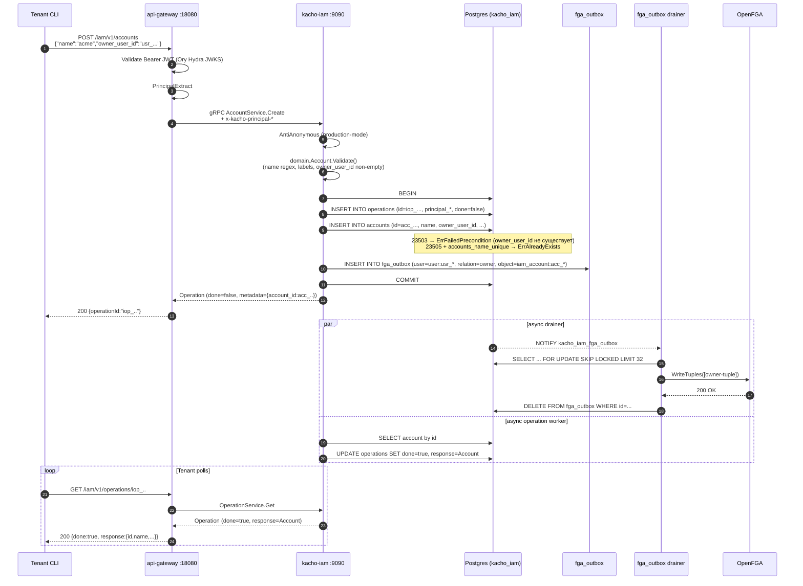

# 01. Account

## Назначение

**Account** — это **top-level tenant** в Kachō: «организация» как товар IAM.
Аккаунт изолирует ресурсы (Project, ServiceAccount, Group, Role, AccessBinding)
от других аккаунтов и привязан к ровно одному **owner-user**.

Account замещает связку `Organization` + `Cloud` из устаревшего
`kacho-resource-manager`: это единственный top-level контейнер, без
промежуточной сущности Organization.

**Use-cases:**
- Создание новой организации при signup-callback от Ory Kratos (через
  `InternalUserService.UpsertFromIdentity`).
- Перенос ресурсов между Account запрещен — каждый ресурс намертво привязан
  к Account через FK ON DELETE RESTRICT.
- Tenant-isolation основан на Account (`owner_user_id` определяет, кто
  доверенный admin данного аккаунта).

**Ограничения:**
- **Имя глобально уникально** (`UNIQUE accounts_name_unique`). Tenant'у
  показывается понятное сообщение `"Account with name <name> already exists"`.
- Удаление RESTRICT: нельзя удалить Account, пока существует хотя бы один
  Project / ServiceAccount / Group / custom-Role / AccessBinding в нем
  (`23503 foreign_key_violation` → `FailedPrecondition`).
- Изменить `owner_user_id` через обычный Update нельзя — это отдельный flow
  (не реализован публично; admin-only).

## Доменная модель

| Поле           | Тип                     | Обязательное | Immutable | Описание / валидация                                                  |
|----------------|-------------------------|--------------|-----------|-----------------------------------------------------------------------|
| `id`           | `AccountID` (`acc_...`) | да           | да        | `acc<17-char>` (`ids.NewID("acc")`). Длина 20.                        |
| `name`         | `AccountName`           | да           | нет       | `^[a-z][-a-z0-9]{2,62}$` (kebab-case).                                |
| `description`  | `Description`           | нет          | нет       | `len ≤ 256`.                                                           |
| `labels`       | `Labels`                | нет          | нет       | map<key,val>, cardinality ≤64, key `^[a-z][-_./@a-z0-9]{0,62}$`, val ≤63. |
| `owner_user_id`| `UserID`                | да           | **да**    | FK → `users(id) ON DELETE RESTRICT`. Hard-immutable.                  |
| `created_at`   | `time.Time`             | да (server)  | да        | UTC, server-stamped.                                                  |

**ID prefix:** `acc` (см. `internal/domain/constants.go::PrefixAccount`).

**DB table:** `kacho_iam.accounts` (миграция `0001_initial.sql:379`).

**Sentinel errors → gRPC:**

| Sentinel                             | gRPC code           | Когда                                                  |
|--------------------------------------|---------------------|--------------------------------------------------------|
| `ErrNotFound`                        | `NOT_FOUND`         | `Get/Update/Delete` несуществующего id                 |
| `ErrAlreadyExists`                   | `ALREADY_EXISTS`    | Create с уже занятым `name`                            |
| `ErrFailedPrecondition`              | `FAILED_PRECONDITION` | Delete при наличии зависимых ресурсов / Owner-FK     |
| `ErrInvalidArg`                      | `INVALID_ARGUMENT`  | domain.Validate / immutable-field в UpdateMask         |

**FK contract:**

```
users(id) ──RESTRICT── accounts.owner_user_id
accounts(id) ──RESTRICT── projects.account_id
                       ── service_accounts.account_id
                       ── groups.account_id
                       ── roles.account_id (custom-role)
```

## Sequence diagram — Create



## API surface

### Public gRPC (порт 9090 TLS)

| RPC      | Sync/Async | Описание                                              |
|----------|------------|-------------------------------------------------------|
| `Create` | async      | Создает аккаунт. Возвращает Operation.                |
| `Get`    | sync       | Получает Account по id.                               |
| `List`   | sync       | Список аккаунтов (filter by `owner_user_id`, paging). |
| `Update` | async      | UpdateMask: `name`, `description`, `labels`.          |
| `Delete` | async      | Удаление. RESTRICT-FK если есть Project/SA/...        |

### REST mapping (через api-gateway)

| HTTP   | Path                              | gRPC mapping                |
|--------|-----------------------------------|------------------------------|
| POST   | `/iam/v1/accounts`                | `AccountService.Create`      |
| GET    | `/iam/v1/accounts/{accountId}`    | `AccountService.Get`         |
| GET    | `/iam/v1/accounts`                | `AccountService.List`        |
| PATCH  | `/iam/v1/accounts/{accountId}`    | `AccountService.Update`      |
| DELETE | `/iam/v1/accounts/{accountId}`    | `AccountService.Delete`      |

## Конфигурация

Account как ресурс не имеет отдельных env-vars — конфигурируется через
общие настройки сервиса (`repository.*`, `authn.*`). См. [`31-deployment.md`](31-deployment.md).

## Как пользоваться

### REST (curl)

```bash
# 1. Получить JWT через Ory Hydra client_credentials (OAuth2 token endpoint).
TOKEN=$(curl -s -X POST "$HYDRA_TOKEN_URL" \
  -d "grant_type=client_credentials" \
  -d "client_id=$HYDRA_CLIENT_ID" \
  -d "client_secret=$HYDRA_CLIENT_SECRET" \
  -d "scope=openid profile" | jq -r .access_token)

# 2. Create Account.
RESP=$(curl -s -X POST http://localhost:18080/iam/v1/accounts \
  -H "Authorization: Bearer $TOKEN" \
  -H "Content-Type: application/json" \
  -d '{"name":"acme","description":"Acme Corp","labels":{"env":"prod"},"owner_user_id":"usr_xxx"}')
OP_ID=$(echo "$RESP" | jq -r .id)

# 3. Poll Operation.
while true; do
  R=$(curl -s "http://localhost:18080/iam/v1/operations/$OP_ID" -H "Authorization: Bearer $TOKEN")
  [ "$(echo "$R" | jq -r .done)" = "true" ] && break
  sleep 1
done
ACC_ID=$(echo "$R" | jq -r .response.id)
echo "Account created: $ACC_ID"

# 4. Get.
curl -s "http://localhost:18080/iam/v1/accounts/$ACC_ID" -H "Authorization: Bearer $TOKEN" | jq

# 5. List.
curl -s "http://localhost:18080/iam/v1/accounts?owner_user_id=usr_xxx" -H "Authorization: Bearer $TOKEN" | jq
```

### gRPC (grpcurl)

```bash
grpcurl -plaintext \
  -H "Authorization: Bearer $TOKEN" \
  -d '{"name":"acme","owner_user_id":"usr_xxx"}' \
  localhost:9090 kacho.cloud.iam.v1.AccountService/Create
```

### Идемпотентность

Account.Create **не** идемпотентен — повторный вызов с тем же `name` вернет
`ALREADY_EXISTS`. Идемпотентность только у `AccessBinding.Create` (см.
[`08-access-binding.md`](08-access-binding.md)).

### Типичные ошибки

| Сценарий                                              | gRPC code             | HTTP | Текст                                              |
|-------------------------------------------------------|-----------------------|------|----------------------------------------------------|
| Имя занято                                            | `ALREADY_EXISTS`      | 409  | `Account with name acme already exists`            |
| `owner_user_id` не существует                         | `FAILED_PRECONDITION` | 412  | `owner_user_id usr_xxx not found`                  |
| Удаление при наличии Project                          | `FAILED_PRECONDITION` | 412  | `account is not empty (projects/...)`              |
| Невалидное имя                                        | `INVALID_ARGUMENT`    | 400  | `Illegal argument name: must match ^[a-z]...`      |
| Update с `owner_user_id` в mask                       | `INVALID_ARGUMENT`    | 400  | `owner_user_id is immutable after Account.Create`  |
| Account не найден                                     | `NOT_FOUND`           | 404  | `Account acc_xxx not found`                        |

## Как воспроизвести локально

```bash
# 1. Поднять стенд (kind + helm umbrella).
cd kacho-deploy && make dev-up

# 2. Port-forward api-gateway.
kubectl -n kacho port-forward svc/api-gateway 18080:8080 &

# 3. Newman regression для Account.
cd kacho-iam && SERVICE=iam-account ./tests/newman/scripts/run.sh

# 4. psql.
cd kacho-deploy && make psql SVC=iam
# > SELECT id, name, owner_user_id, created_at FROM kacho_iam.accounts LIMIT 10;

# 5. Integration tests.
cd kacho-iam && GOWORK=off go test -short -count=1 -timeout 120s \
  ./internal/repo/kacho/pg/account_integration_test.go ./internal/repo/kacho/pg/

# 6. Логи сервиса.
cd kacho-deploy && make logs-svc SVC=iam
```

## Подробности реализации

- **Use-cases:** `internal/apps/kacho/api/account/{create,get,list,update,delete}.go`.
- **Handler:** `internal/apps/kacho/api/account/handler.go` — тонкий transport.
- **Repo iface:** `internal/repo/kacho/account/iface.go` (Reader/Writer split).
- **Repo impl:** `internal/repo/kacho/pg/account_repo.go` (pgx + dto-mapping).
- **DB:** таблица `accounts` со столбцами `id, name, description, labels JSONB, owner_user_id, created_at`.
- **Indexes:** PK `accounts_pkey(id)`, UNIQUE `accounts_name_unique(name)`, INDEX `accounts_owner_user_id_idx`.
- **FK:** `accounts_owner_user_id_fkey(owner_user_id) → users(id) ON DELETE RESTRICT`.
- **CHECK:** `accounts_labels_valid CHECK (kacho_labels_valid(labels))`.
- **OpenFGA tuple emit:** Create-use-case вызывает
  `CreateAccountUseCase.WithOpenFGA(fga, logger)` — выпускает owner-tuple
  `(user:usr_xxx, owner, iam_account:acc_xxx)` в **тот же writer-tx** через
  `fga_outbox`. Drainer (`clients/fga_applier.go`) асинхронно применяет в OpenFGA.
- **Transactional semantics:** INSERT account + INSERT operations + INSERT
  fga_outbox — одна транзакция; rollback → ни одной orphan-строки.

## Gotchas / известные ограничения

- **Глобально-уникальное имя** — namespace конфликтует между tenant'ами. В
  multi-tenant prod рекомендуется добавлять префикс tenant'а к `name`.
- **owner_user_id immutable** — для смены владельца нужен отдельный admin-flow
  (не реализован публично; план — `TransferAccountOwnership` RPC).
- **Delete cascade** — НЕТ. Все child-ресурсы (Project, SA, Group, ...) надо
  удалить вручную, иначе RESTRICT-блок. Каскадное удаление через границу
  сервиса не выполняется (только same-DB FK cascade).
- **Bootstrap path** — при первом signup-е User'а от Ory Kratos,
  `InternalUserService.UpsertFromIdentity` создает User + Account + Project +
  default-AccessBindings в одной транзакции; обходит per-resource Create
  use-case (см. [`21-internal-iam.md`](21-internal-iam.md)).

## Связанные компоненты

- [`02-project.md`](02-project.md) — Project (child Account-а).
- [`03-user.md`](03-user.md) — User (`owner_user_id`).
- [`07-role.md`](07-role.md) — Role (custom-роли account-scoped).
- [`21-internal-iam.md`](21-internal-iam.md) — `UpsertFromIdentity` bootstrap path.
- [`29-openfga-check.md`](29-openfga-check.md) — owner-tuple propagation.

## Ссылки на код

- `internal/domain/account.go` — entity + Validate.
- `internal/domain/types.go::AccountID, AccountName, validateKebabName` — newtypes.
- `internal/apps/kacho/api/account/` — use-cases.
- `internal/repo/kacho/pg/account_repo.go` — pg-impl.
- `internal/migrations/0001_initial.sql:379-396` — DDL `accounts`.
- `tests/newman/cases/iam-account-*.py` — black-box scenarios.
