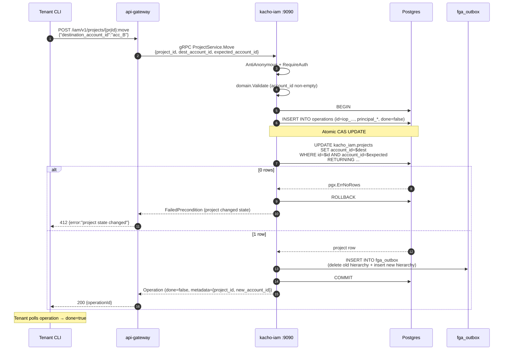
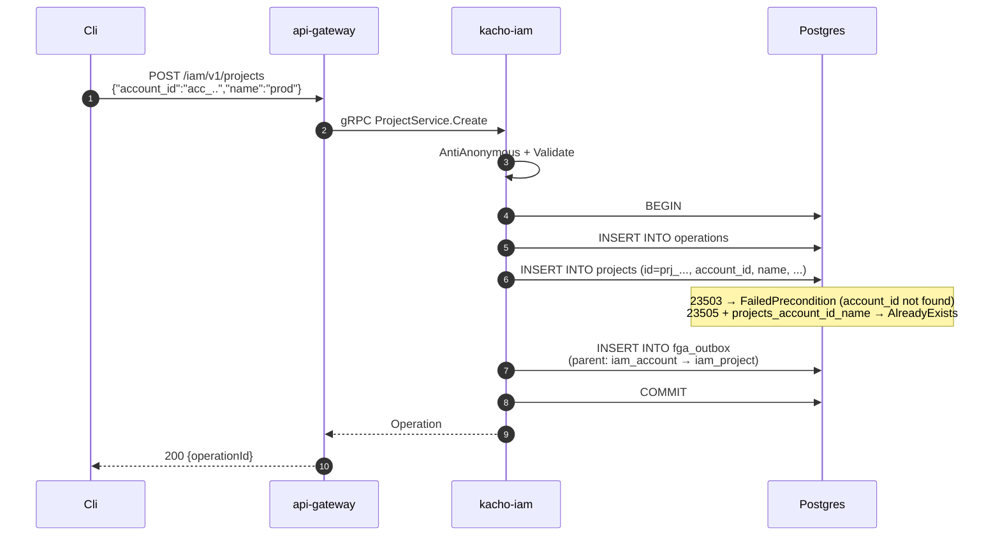

# 02. Project

## Назначение

**Project** — это ресурс, который группирует workload-сущности (Compute
instances, VPC networks, NLBs) внутри Account. Project — второй (и последний)
уровень иерархии владения Kachō: **Account → Project**, без промежуточных
сущностей. Он обеспечивает второй уровень изоляции внутри Account (например,
prod / staging / dev — это три Project одного Account).

Project поддерживает уникальную операцию **Move** — атомарный перенос Project из
одного Account в другой через CAS.

**Use-cases:**
- Управление группами ресурсов внутри Account (Compute/VPC/LB-ресурсы
  ссылаются на `project_id` как scope).
- AccessBinding на `project` resource_type грантит права на все
  ресурсы внутри Project (через FGA hierarchy).
- Move — миграция Project между Account'ами (требует владельца обоих
  Account'ов).

**Ограничения:**
- **Имя уникально per-Account** (`UNIQUE projects_account_id_name`).
- Удаление RESTRICT — нельзя удалить Project, пока в нем есть workload
  (это проверяется на стороне Compute/VPC через peer-API; на DB-уровне
  Project — leaf-ресурс в `kacho_iam`).
- `account_id` immutable через обычный Update — менять только через **Move**.

## Доменная модель

| Поле          | Тип                       | Обязательное | Immutable | Описание / валидация                                  |
|---------------|---------------------------|--------------|-----------|--------------------------------------------------------|
| `id`          | `ProjectID` (`prj_...`)   | да           | да        | `prj<17-char>`. Длина 20.                              |
| `account_id`  | `AccountID`               | да           | через Move| FK → `accounts(id) ON DELETE RESTRICT`.                |
| `name`        | `ProjectName`             | да           | нет       | `^[a-z][-a-z0-9]{2,62}$`.                              |
| `description` | `Description`             | нет          | нет       | `len ≤ 256`.                                            |
| `labels`      | `Labels`                  | нет          | нет       | ≤64 пар, ключ regex, val ≤63.                          |
| `created_at`  | `time.Time`               | да (server)  | да        | UTC.                                                   |

**ID prefix:** `prj` (`domain.PrefixProject`).
**DB table:** `kacho_iam.projects` (миграция `0001_initial.sql:983`).

**Sentinel errors:**

| Sentinel                | gRPC code              | Когда                                              |
|-------------------------|-------------------------|----------------------------------------------------|
| `ErrNotFound`           | `NOT_FOUND`             | id не найден                                       |
| `ErrAlreadyExists`      | `ALREADY_EXISTS`        | name занят в данном Account                        |
| `ErrFailedPrecondition` | `FAILED_PRECONDITION`   | Delete с зависимыми ресурсами; Move CAS-mismatch   |
| `ErrInvalidArg`         | `INVALID_ARGUMENT`      | domain.Validate / immutable-field в UpdateMask     |

**FK contract:**

```
accounts(id) ──RESTRICT── projects.account_id
projects(id) ──RESTRICT── (cross-service: vpc_network.project_id,
                           compute_instance.project_id, nlb.project_id)
```

## Sequence diagram — Move (атомарный CAS)

Перенос Project из Account A в Account B — самый интересный flow, потому
что требует **атомарного** UPDATE с проверкой ожидаемого state (CAS).



## Sequence diagram — Create



## API surface

### Public gRPC (порт 9090)

| RPC      | Sync/Async | Описание                                                  |
|----------|------------|-----------------------------------------------------------|
| `Create` | async      | Создает Project в Account.                                |
| `Get`    | sync       | Получает по id.                                           |
| `List`   | sync       | Список (filter by `account_id`, paging).                  |
| `Update` | async      | UpdateMask: `name`, `description`, `labels`.              |
| `Delete` | async      | Удаление (RESTRICT-FK на cross-service ссылки — мягко).   |
| `Move`   | async      | Атомарный CAS-перенос между Account.                      |

### REST mapping

| HTTP    | Path                                  | gRPC mapping             |
|---------|---------------------------------------|---------------------------|
| POST    | `/iam/v1/projects`                    | `ProjectService.Create`   |
| GET     | `/iam/v1/projects/{projectId}`        | `ProjectService.Get`      |
| GET     | `/iam/v1/projects?account_id=...`     | `ProjectService.List`     |
| PATCH   | `/iam/v1/projects/{projectId}`        | `ProjectService.Update`   |
| DELETE  | `/iam/v1/projects/{projectId}`        | `ProjectService.Delete`   |
| POST    | `/iam/v1/projects/{projectId}:move`   | `ProjectService.Move`     |

## Конфигурация

Project как ресурс не имеет отдельных env-vars.

## Как пользоваться

### REST (curl)

```bash
# Create.
RESP=$(curl -s -X POST http://localhost:18080/iam/v1/projects \
  -H "Authorization: Bearer $TOKEN" \
  -H "Content-Type: application/json" \
  -d '{"account_id":"acc_xxx","name":"prod","description":"Production env","labels":{"env":"prod"}}')
OP_ID=$(echo "$RESP" | jq -r .id)
# poll операцию ...
PRJ_ID=$(echo "$R" | jq -r .response.id)

# Move в другой Account (требует expected_account_id для CAS).
curl -X POST "http://localhost:18080/iam/v1/projects/$PRJ_ID:move" \
  -H "Authorization: Bearer $TOKEN" \
  -H "Content-Type: application/json" \
  -d '{"destination_account_id":"acc_YYY","expected_account_id":"acc_xxx"}'

# List в Account.
curl "http://localhost:18080/iam/v1/projects?account_id=acc_xxx" \
  -H "Authorization: Bearer $TOKEN" | jq
```

### gRPC (grpcurl)

```bash
grpcurl -plaintext -H "Authorization: Bearer $TOKEN" \
  -d '{"account_id":"acc_xxx","name":"prod"}' \
  localhost:9090 kacho.cloud.iam.v1.ProjectService/Create
```

### Идемпотентность

Project.Create — не идемпотентен (повторный вызов с тем же name → AlreadyExists).
Move идемпотентен в особом смысле: повторный Move с тем же
`expected_account_id` после успешного первого Move вернет `FailedPrecondition`
(state уже изменен).

### Типичные ошибки

| Сценарий                                  | gRPC code             | HTTP | Текст                                                            |
|-------------------------------------------|------------------------|------|------------------------------------------------------------------|
| Имя занято в Account                      | `ALREADY_EXISTS`       | 409  | `Project with name prod already exists in account acc_xxx`       |
| `account_id` не существует                | `FAILED_PRECONDITION`  | 412  | `account_id acc_xxx not found`                                   |
| Move CAS mismatch                         | `FAILED_PRECONDITION`  | 412  | `project current account_id differs from expected`               |
| Update с `account_id` в mask              | `INVALID_ARGUMENT`     | 400  | `account_id is immutable after Project.Create (use Move)`        |
| Project не найден                         | `NOT_FOUND`            | 404  | `Project prj_xxx not found`                                      |

## Как воспроизвести локально

```bash
cd kacho-deploy && make dev-up
kubectl -n kacho port-forward svc/api-gateway 18080:8080 &

# Newman.
cd kacho-iam && SERVICE=iam-project ./tests/newman/scripts/run.sh

# psql.
cd kacho-deploy && make psql SVC=iam
# > SELECT id, account_id, name FROM kacho_iam.projects;

# Integration tests + Move CAS race test.
cd kacho-iam && GOWORK=off go test -short -count=1 -timeout 120s -run TestProject \
  ./internal/repo/kacho/pg/...
```

## Подробности реализации

- **Use-cases:** `internal/apps/kacho/api/project/{create,get,list,update,delete,move}.go`.
- **Handler:** `internal/apps/kacho/api/project/handler.go`.
- **Repo iface:** `internal/repo/kacho/project/iface.go`.
- **Repo impl:** `internal/repo/kacho/pg/project_repo.go`. Метод
  `MoveAtomicCAS` использует single-statement `UPDATE ... WHERE id=$1 AND account_id=$expected RETURNING ...` —
  zero TOCTOU (within-service инвариант на DB-уровне).
- **DB:** таблица `projects` со столбцами `id, account_id, name, description, labels JSONB, created_at`.
- **Indexes:** PK, UNIQUE `projects_account_id_name`, INDEX `projects_account_id_idx`.
- **FK:** `projects_account_id_fkey → accounts(id) ON DELETE RESTRICT`.
- **CHECK:** `projects_labels_valid`.
- **FGA hierarchy:** при Create — tuple `(iam_account:acc_*, parent, iam_project:prj_*)`;
  при Move — удаление старого parent + INSERT нового parent в одном fga_outbox batch.

## Gotchas / известные ограничения

- **Move concurrency**: при параллельном Move того же Project одна транзакция
  получит `pgx.ErrNoRows` (CAS mismatch). Это **корректное** поведение —
  retry с обновленным `expected_account_id` от Get.
- **Delete не cascade'ит cross-service** — Compute / VPC / LB будут сообщать
  «project имеет workload»; на стороне kacho-iam Delete пройдет без проблем,
  но workload останется orphan-ed (consumer-сервис обязан грациозно переживать
  dangling-ref — деградированный статус, не паника).
- **FGA migration during Move** — старая иерархия и новая попадают в один
  fga_outbox batch (atomic emit-in-tx). До drain'а Check может вернуть allowed для
  обоих parent'ов; обычно это окно < 1с.

## Связанные компоненты

- [`01-account.md`](01-account.md) — owner Account-а.
- [`08-access-binding.md`](08-access-binding.md) — bindings на `project` resource_type.
- [`07-role.md`](07-role.md) — project-scoped custom roles.
- [`29-openfga-check.md`](29-openfga-check.md) — FGA hierarchy propagation.

## Ссылки на код

- `internal/domain/project.go`
- `internal/apps/kacho/api/project/`
- `internal/repo/kacho/pg/project_repo.go`
- `internal/migrations/0001_initial.sql:983-1000`
