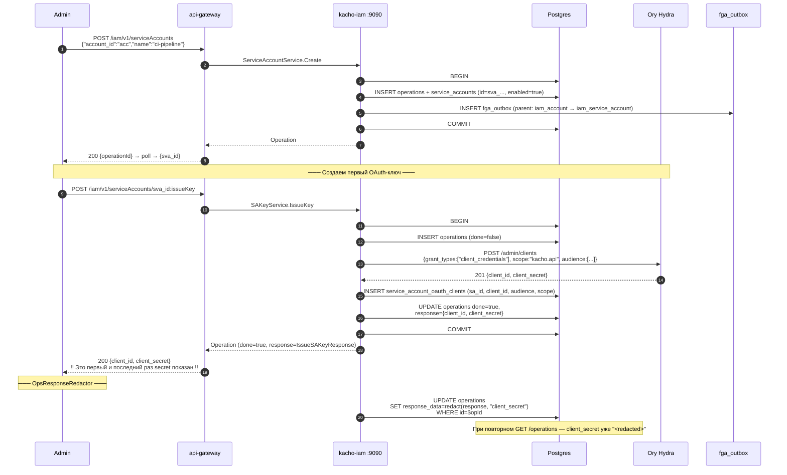

# 04. ServiceAccount

## Назначение

**ServiceAccount** (SA) — это machine identity внутри Account / Project. SA
получает токены не через интерактивный OIDC login, а через **OAuth2
client_credentials** (Ory Hydra) по выпущенным SA-ключам (private_key_jwt,
см. [`05-sa-keys.md`](05-sa-keys.md)).

Каждый SA backed Hydra OAuth client'ом (хранится в Hydra, не в kacho-iam).
kacho-iam держит только запись с id, именем, account_id и project_id.

**Use-cases:**
- Сервисная учетка для CI/CD pipeline (терраформ применяет ресурсы как SA).
- Машинная учетка для нагрузки в кластере (Pod аутентифицируется выданным SA-ключом).
- Backend-к-backend RPC (один из сервисов Kachō зовет другой как SA).

**Ограничения:**
- `account_id` immutable.
- Имя уникально per-Account.
- SA-ключи (`sa_keys`) — отдельный sub-resource (см. [`05-sa-keys.md`](05-sa-keys.md)).
- `enabled=false` блокирует выпуск новых ключей и инвалидирует существующие
  (Hydra refuses token-issue).

## Доменная модель

| Поле          | Тип                       | Обязательное | Immutable | Описание                                          |
|---------------|---------------------------|--------------|-----------|---------------------------------------------------|
| `id`          | `ServiceAccountID`        | да           | да        | `sva<17-char>`. Длина 20.                         |
| `account_id`  | `AccountID`               | да           | **да**    | FK → `accounts(id) ON DELETE RESTRICT`.           |
| `project_id`  | `ProjectID`               | нет          | через Move| FK → `projects(id) ON DELETE RESTRICT`.           |
| `name`        | `SvcAccountName`          | да           | нет       | `^[a-z][-a-z0-9]{2,62}$`.                         |
| `description` | `Description`             | нет          | нет       | len ≤256.                                          |
| `enabled`     | `bool`                    | да           | нет       | default `true`. Disabled SA не выпускает токены.  |
| `created_at`  | `time.Time`               | да (server)  | да        | UTC.                                              |

**ID prefix:** `sva`.
**DB table:** `kacho_iam.service_accounts` (миграция 0001:1124).

**FK contract:**

```
accounts(id) ──RESTRICT── service_accounts.account_id
projects(id) ──RESTRICT── service_accounts.project_id (nullable)
service_accounts(id) ──CASCADE── service_account_oauth_clients.service_account_id
service_accounts(id) ──RESTRICT── access_bindings.subject_id (когда subject_type='service_account')
```

## Sequence diagram — Create + первый Issue ключа



## API surface

### Public gRPC (порт 9090)

| RPC       | Sync/Async | Описание                                        |
|-----------|------------|-------------------------------------------------|
| `Create`  | async      | Создает SA в Account (опционально в Project).   |
| `Get`     | sync       | Получает SA по id.                              |
| `List`    | sync       | Список (filter by `account_id`, `project_id`).  |
| `Update`  | async      | UpdateMask: `name`, `description`, `enabled`.   |
| `Delete`  | async      | RESTRICT-FK если есть active bindings/ключи.    |

SA-ключи — отдельный service (см. [`05-sa-keys.md`](05-sa-keys.md)).

### REST mapping

| HTTP    | Path                                          | gRPC mapping                       |
|---------|-----------------------------------------------|------------------------------------|
| POST    | `/iam/v1/serviceAccounts`                     | `ServiceAccountService.Create`     |
| GET     | `/iam/v1/serviceAccounts/{saId}`              | `ServiceAccountService.Get`        |
| GET     | `/iam/v1/serviceAccounts`                     | `ServiceAccountService.List`       |
| PATCH   | `/iam/v1/serviceAccounts/{saId}`              | `ServiceAccountService.Update`     |
| DELETE  | `/iam/v1/serviceAccounts/{saId}`              | `ServiceAccountService.Delete`     |

## Конфигурация

| Env var                              | YAML key                              | Default | Описание                                |
|--------------------------------------|---------------------------------------|---------|-----------------------------------------|
| `KACHO_IAM_HYDRA_ADMIN_URL`          | `extapi.hydra.admin-url`              | —       | URL Hydra admin API.                    |
| `KACHO_IAM_HYDRA_ADMIN_TOKEN`        | `extapi.hydra.admin-token`            | —       | Bearer token для Hydra admin.           |
| `KACHO_IAM_HYDRA_ISSUER`             | `authn.hydra-issuer`                  | `https://hydra.<domain>` | Hydra issuer URL.    |

## Как пользоваться

### REST (curl)

```bash
# Create.
RESP=$(curl -s -X POST http://localhost:18080/iam/v1/serviceAccounts \
  -H "Authorization: Bearer $TOKEN" \
  -H "Content-Type: application/json" \
  -d '{"account_id":"acc_xxx","project_id":"prj_yyy","name":"ci-pipeline"}')
SA_ID=...

# Get.
curl http://localhost:18080/iam/v1/serviceAccounts/$SA_ID -H "Authorization: Bearer $TOKEN"

# Disable (revoke токены).
curl -X PATCH http://localhost:18080/iam/v1/serviceAccounts/$SA_ID \
  -H "Authorization: Bearer $TOKEN" \
  -d '{"enabled":false,"update_mask":"enabled"}'
```

### gRPC

```bash
grpcurl -plaintext -H "Authorization: Bearer $TOKEN" \
  -d '{"account_id":"acc_xxx","name":"ci-pipeline"}' \
  localhost:9090 kacho.cloud.iam.v1.ServiceAccountService/Create
```

### Идемпотентность

Не идемпотентен (имя занято → AlreadyExists).

### Типичные ошибки

| Сценарий                                          | gRPC code             | HTTP | Текст                                                    |
|---------------------------------------------------|------------------------|------|----------------------------------------------------------|
| Имя занято в Account                              | `ALREADY_EXISTS`       | 409  | `ServiceAccount with name ci-pipeline already exists`    |
| `project_id` принадлежит другому Account          | `FAILED_PRECONDITION`  | 412  | `project_id belongs to a different account`              |
| Delete при active key                             | `FAILED_PRECONDITION`  | 412  | `service_account has active oauth clients`               |
| Delete при active AccessBinding                   | `FAILED_PRECONDITION`  | 412  | `service_account is referenced by access_bindings`       |

## Как воспроизвести локально

```bash
cd kacho-deploy && make dev-up
kubectl -n kacho port-forward svc/api-gateway 18080:8080 &

# Newman:
cd kacho-iam && SERVICE=iam-service-account ./tests/newman/scripts/run.sh

# psql:
cd kacho-deploy && make psql SVC=iam
# > SELECT id, account_id, project_id, name, enabled FROM kacho_iam.service_accounts;

# Integration:
cd kacho-iam && GOWORK=off go test -short -count=1 -timeout 120s -run TestServiceAccount \
  ./internal/repo/kacho/pg/...
```

## Подробности реализации

- **Use-cases:** `internal/apps/kacho/api/service_account/{create,get,list,update,delete}.go`.
- **Handler:** `internal/apps/kacho/api/service_account/handler.go`.
- **Repo:** `internal/repo/kacho/pg/service_account_repo.go`.
- **Hydra integration:** SA сам по себе не делает запросы в Hydra — только
  IssueSAKey (см. [`05-sa-keys.md`](05-sa-keys.md)). Сам SA — просто запись в БД.
- **DB:** `service_accounts(id, account_id, project_id, name, description, enabled, created_at)`.
- **Indexes:** PK, UNIQUE `service_accounts_account_name_unique`, INDEX по account/project.
- **CHECK:** имя через `kacho_labels_valid`-style helper.

## Gotchas / известные ограничения

- **`enabled=false` НЕ revokes уже выданные access_tokens** — они валидны до
  expires_at (обычно 1h). Только новые requests блокируются. Для немедленного
  отзыва — Delete сервис-аккаунта или revoke его OAuth-clients в Hydra.
- **project_id nullable** — SA может жить только в Account (cross-project SA).
- **Delete cascade на oauth_clients** — при Delete SA удаляются и записи в
  `service_account_oauth_clients` (через CASCADE FK), но **в Hydra** OAuth
  clients остаются — sa_keys.RevokeUseCase должен очистить их явно (см.
  [`05-sa-keys.md`](05-sa-keys.md)).

## Связанные компоненты

- [`05-sa-keys.md`](05-sa-keys.md) — выпуск/отзыв OAuth-ключей.
- [`08-access-binding.md`](08-access-binding.md) — bindings на subject_type=service_account.

## Ссылки на код

- `internal/domain/service_account.go`
- `internal/apps/kacho/api/service_account/`
- `internal/repo/kacho/pg/service_account_repo.go`
- `internal/migrations/0001_initial.sql:1104-1140`
