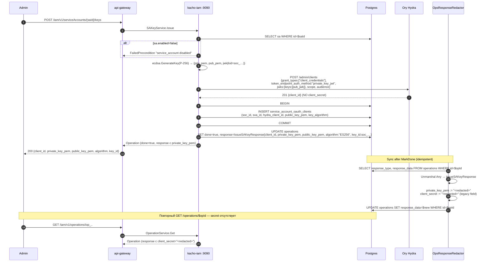
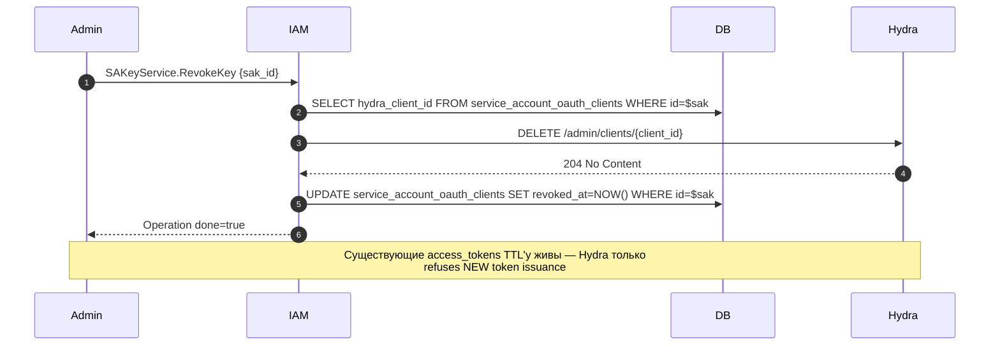

# 05. ServiceAccount Keys (OAuth-credentials: private_key_jwt)

## Назначение

**SA Keys** — асимметричные ключи (ECDSA P-256), через которые ServiceAccount
получает access_token у Ory Hydra по grant'у `client_credentials` с
`token_endpoint_auth_method = private_key_jwt` (RFC 7521/7523).

Каждый ключ — это **kacho-выпущенная** пара (`private_key`, `public_jwk`):

- **`private_key_pem`** — отдается клиенту ОДИН РАЗ в ответе `IssueSAKey`,
  никогда не хранится в kacho-iam.
- **`public_key`** — регистрируется в Hydra как JWK при создании OAuth-клиента
  (`jwks={keys:[...]}`); kacho-iam держит SPKI-PEM-копию в
  `service_account_oauth_clients.public_key_pem` для диагностики ротаций.

Hydra **не получает** `client_secret` — его в системе больше нет. Запрос
access_token: клиент сам подписывает JWT-assertion приватным ключом, кладет
в `client_assertion`, POST'ит к `/oauth2/token`. Hydra валидирует подпись
против зарегистрированного public JWK.

**Защита приватного ключа:** `private_key_pem` показывается **один раз** в
ответе `IssueSAKey`. После этого `OpsResponseRedactor`
(`internal/repo/kacho/pg/ops_response_redactor.go`) выполняет single-statement
UPDATE на `operations.response_data`, замещая поле `private_key_pem` на
`"<redacted>"` (а также legacy `client_secret`, который теперь всегда пустой).
Повторный `GET /operations/{id}` после redaction даст response без ключа.
Это защищает от replay через operation-id.

**Преимущества над client_secret_basic (legacy):**

- ✅ private_key никогда не покидает client после issuance.
- ✅ Hydra DB не хранит секрета (только public_jwk).
- ✅ Strong crypto (asymmetric ES256 vs shared secret).
- ✅ Стандартный паттерн асимметричной аутентификации service-аккаунтов.

**Use-cases:**

- Issue первого ключа при provision'е SA.
- Ротация: Issue новый ключ → обновить CI/secrets → Revoke старый.
- Revoke компрометированного ключа.

**Ограничения:**

- Только Hydra-backed (production без Hydra → Issue падает Unavailable).
- `private_key_pem` не восстановим после первого ответа (no "show key again").
- `enabled=false` SA → Issue блокируется.
- Алгоритм фиксирован на `ES256` (RS256 / EdDSA — будущее расширение).

## Доменная модель — `service_account_oauth_clients`

| Поле                  | Тип                  | Обязательное | Immutable | Описание                                  |
|-----------------------|----------------------|--------------|-----------|-------------------------------------------|
| `id`                  | TEXT (`soc_...`)     | да           | да        | id записи (не Hydra-client-id).           |
| `sva_id`              | `ServiceAccountID`   | да           | да        | FK → `service_accounts(id)`.              |
| `hydra_client_id`     | TEXT                 | да           | да        | client_id в Hydra. UNIQUE.                |
| `description`         | TEXT                 | нет          | —         | Free-form, ≤256 chars.                    |
| `created_by_user_id`  | TEXT                 | да           | да        | Admin, выпустивший ключ (audit).          |
| `created_at`          | TIMESTAMPTZ          | да (server)  | да        | UTC.                                      |
| `expires_at`          | TIMESTAMPTZ          | нет          | —         | TTL-reminder (опц.).                      |
| `last_used_at`        | TIMESTAMPTZ          | нет          | —         | Best-effort touch.                        |
| `public_key_pem`      | TEXT (SPKI PEM)      | да           | да        | SPKI ECDSA P-256 public key.              |
| `key_algorithm`       | TEXT                 | да           | да        | `ES256` (`RS256`/`EdDSA` future).         |

**ID prefix:** `soc` (запись в БД, формат `soc_[crockford-17]`); Hydra сам
генерирует `hydra_client_id`.

**DB table:** `kacho_iam.service_account_oauth_clients` (squashed baseline
`internal/migrations/0001_initial.sql`).

**FK contract:** CASCADE delete при удалении SA (в БД); но Hydra clients
надо явно удалять через `RevokeSAKey` (см. Gotchas).

## Sequence diagram — Issue



## Sequence diagram — Revoke



## API surface

### Public gRPC (порт 9090)

| RPC          | Sync/Async | Описание                                              |
|--------------|------------|-------------------------------------------------------|
| `IssueSAKey` | async      | Выпускает OAuth-ключ. Secret в response (один раз).   |
| `RevokeSAKey`| async      | Помечает ключ revoked + удаляет Hydra client.         |
| `ListSAKeys` | sync       | Список ключей для SA (без секретов).                  |

### REST mapping

| HTTP    | Path                                                | gRPC mapping                |
|---------|-----------------------------------------------------|-----------------------------|
| POST    | `/iam/v1/serviceAccounts/{saId}/keys`               | `SAKeyService.IssueSAKey`   |
| DELETE  | `/iam/v1/serviceAccounts/{saId}/keys/{keyId}`       | `SAKeyService.RevokeSAKey`  |
| GET     | `/iam/v1/serviceAccounts/{saId}/keys`               | `SAKeyService.ListSAKeys`   |

## Конфигурация

| Env var                                | YAML key                                  | Default | Описание                          |
|----------------------------------------|-------------------------------------------|---------|-----------------------------------|
| `KACHO_IAM_HYDRA_ADMIN_URL`            | `extapi.hydra.admin-url`                  | —       | URL Hydra admin API.              |
| `KACHO_IAM_HYDRA_ADMIN_TOKEN`          | `extapi.hydra.admin-token`                | —       | Bearer для Hydra admin.           |

## Как пользоваться

### Issue

```bash
RESP=$(curl -s -X POST http://localhost:18080/iam/v1/serviceAccounts/$SA_ID/keys \
  -H "Authorization: Bearer $TOKEN" \
  -d '{"description":"CI runner key"}')
OP_ID=$(echo "$RESP" | jq -r .id)
# poll до done=true
RESULT=$(curl -s http://localhost:18080/iam/v1/operations/$OP_ID -H "Authorization: Bearer $TOKEN")
CLIENT_ID=$(echo "$RESULT" | jq -r .response.client_id)
KEY_ID=$(echo    "$RESULT" | jq -r .response.key_id)
echo "$RESULT" | jq -r .response.private_key_pem > sa.key  # ← сохранить;
                                                            #   потом <redacted>
echo "$RESULT" | jq -r .response.public_key_pem  > sa.pub
echo "CLIENT_ID=$CLIENT_ID  KEY_ID=$KEY_ID  ALG=ES256"
```

### Получить SA access_token у Hydra (private_key_jwt, RFC 7521/7523)

```bash
# 1. Подписываем JWT-assertion sa.key'ом. Пример на python-jose:
python3 <<'PY' > assertion.txt
import time, json, uuid
from jose import jwt
priv = open('sa.key').read()
claims = {
  "iss": "$CLIENT_ID", "sub": "$CLIENT_ID",
  "aud": "$HYDRA_PUBLIC_URL/oauth2/token",
  "exp": int(time.time()) + 60, "jti": uuid.uuid4().hex,
}
print(jwt.encode(claims, priv, algorithm="ES256",
                 headers={"kid": "$KEY_ID"}))
PY

# 2. POST к Hydra с client_assertion (НЕТ basic-auth, нет client_secret).
curl -X POST "$HYDRA_PUBLIC_URL/oauth2/token" \
  -d "grant_type=client_credentials" \
  -d "client_id=$CLIENT_ID" \
  -d "client_assertion_type=urn:ietf:params:oauth:client-assertion-type:jwt-bearer" \
  -d "client_assertion=$(cat assertion.txt)" \
  -d "audience=$AUDIENCE" \
  -d "scope=kacho.api"
```

### Revoke

```bash
curl -X DELETE http://localhost:18080/iam/v1/serviceAccounts/$SA_ID/keys/$KEY_ID \
  -H "Authorization: Bearer $TOKEN"
```

### List

```bash
curl http://localhost:18080/iam/v1/serviceAccounts/$SA_ID/keys -H "Authorization: Bearer $TOKEN" | jq
# → [{id, hydra_client_id, scope, audience, created_at, revoked_at}]
```

### Идемпотентность

`IssueSAKey` НЕ идемпотентен — каждый вызов создает новый client в Hydra.
`RevokeSAKey` идемпотентен (повторный Revoke на уже revoked → 204 / NotFound graceful).

### Типичные ошибки

| Сценарий                             | gRPC code             | HTTP | Текст                                          |
|--------------------------------------|------------------------|------|------------------------------------------------|
| SA disabled                          | `FAILED_PRECONDITION`  | 412  | `service_account disabled`                     |
| SA не найден                         | `NOT_FOUND`            | 404  | `ServiceAccount sva_xxx not found`             |
| Hydra недоступен                     | `UNAVAILABLE`          | 503  | `hydra admin api unreachable`                  |
| Anonymous IssueSAKey                 | `UNAUTHENTICATED`      | 401  | `anonymous principal rejected`                 |
| Anonymous Get operation с redacted   | `NOT_FOUND`            | 404  | (anti-replay guard — operation/anon)           |

## Как воспроизвести локально

```bash
cd kacho-deploy && make dev-up        # включает Hydra
kubectl -n kacho port-forward svc/api-gateway 18080:8080 &

# Newman:
cd kacho-iam && SERVICE=iam-sa-keys ./tests/newman/scripts/run.sh

# Integration (testcontainers + Hydra stub):
cd kacho-iam && GOWORK=off go test -short -count=1 -timeout 120s \
  -run "TestSAKey|TestOpsResponseRedactor|TestIssueSAKey" \
  ./internal/clients/ ./internal/apps/kacho/api/sa_keys/
```

## Подробности реализации

- **Use-cases:** `internal/apps/kacho/api/sa_keys/usecases.go` — `IssueSAKey`, `RevokeSAKey`, `ListSAKeys`.
- **Handler:** `internal/apps/kacho/api/sa_keys/handler.go`.
- **Hydra клиент:** `internal/clients/hydra_admin_client.go` + `hydra_oauth_clients.go`.
- **Repo:** SA-OAuth-clients-репо в `internal/repo/kacho/pg/` (через `NewSAOAuthClientRepo`).
- **Redactor:** `internal/repo/kacho/pg/ops_response_redactor.go`. SELECT
  `(response_type, response_data)` из `operations`, unmarshal `Any` →
  `IssueSAKeyResponse`, reflect-clear поле `private_key_pem` (+ legacy
  `client_secret`), UPDATE обратно. Idempotent (повторный clear no-op).
  Реализация без `jsonb_set` — operations хранит proto-bytes, не JSON.
- **AntiAnonymous integration:** `OperationHandler.Get` has anti-leak gate:
  если operation содержит secret-поле и principal anonymous — возвращает
  NotFound (даже если operation существует). См.
  `internal/handler/operation_handler_anti_leak_test.go`.

## Gotchas / известные ограничения

- **Hydra DELETE не cascade'ит из БД** — если оператор сделал DELETE
  service_account напрямую SQL'ем, в БД через CASCADE удалятся записи
  `service_account_oauth_clients`, но в Hydra clients останутся! ВСЕГДА
  использовать API Revoke перед Delete SA.
- **Private-key видимость окно** — между MarkDone и UPDATE redaction есть
  окно миллисекунд, когда первый GET вернет `private_key_pem`. Это
  by-design — это и есть единственная допустимая видимость ключа.
- **Replay через operation-id** — даже после redaction оператор знает
  `operation_id`, но `response.private_key_pem` уже `<redacted>`. Legacy
  `response.client_secret` всегда пуст и тоже редактируется
  для wire-compat.
- **Hydra restart loses clients?** — нет, Hydra хранит в собственной БД;
  kacho-iam держит `hydra_client_id` для ссылки + `public_key_pem` для
  диагностики ротаций.
- **Алгоритм фиксирован `ES256`** — domain.Validate допускает RS256/EdDSA
  для будущих расширений, но текущая ECDSA P-256-only генерация
  (`internal/apps/kacho/api/sa_keys/keys.go`) выставляет только `ES256`.
- **Legacy `client_secret` rows** — миграция в `0001_initial.sql` ставит
  DEFAULT '' для `public_key_pem` / `key_algorithm`, поэтому rows,
  выпущенные до перехода на private_key_jwt (если такие существуют в
  продуктивных стендах), не валятся при выборке; но через эти
  `hydra_client_id` все еще работает legacy `client_secret_basic`-flow на
  стороне Hydra. План миграции — отдельный rotation-эпик.

## Связанные компоненты

- [`04-service-account.md`](04-service-account.md) — родительский ресурс.
- [`10-operations.md`](10-operations.md) — operations + redactor.

## Ссылки на код

- `internal/apps/kacho/api/sa_keys/usecases.go` — `IssueSAKeyUseCase` /
  `RevokeSAKeyUseCase` / `ListSAKeysUseCase`.
- `internal/apps/kacho/api/sa_keys/keys.go` — `generateES256Key` (ECDSA P-256
  keypair → PKCS#8 / SPKI PEM + JWK).
- `internal/apps/kacho/api/sa_keys/handler.go`.
- `internal/clients/hydra_admin_client.go`,
  `hydra_oauth_clients.go` — `CreateOAuthClient` с `jwks` /
  `token_endpoint_auth_method=private_key_jwt`.
- `internal/clients/ops_response_redactor.go`.
- `internal/migrations/0001_initial.sql` — таблица
  `service_account_oauth_clients` (`public_key_pem`, `key_algorithm`).
- `internal/handler/operation_handler_anti_leak_test.go`.
- `internal/service/token_enrichment_service.go` — SA-claims path
  (`kacho_principal_type=service_account`, `kacho_principal_id`,
  `kacho_account_id`).
- `cmd/kacho-iam/hooks_mux.go` — `tokenEnrichSAAdapter` wiring.
