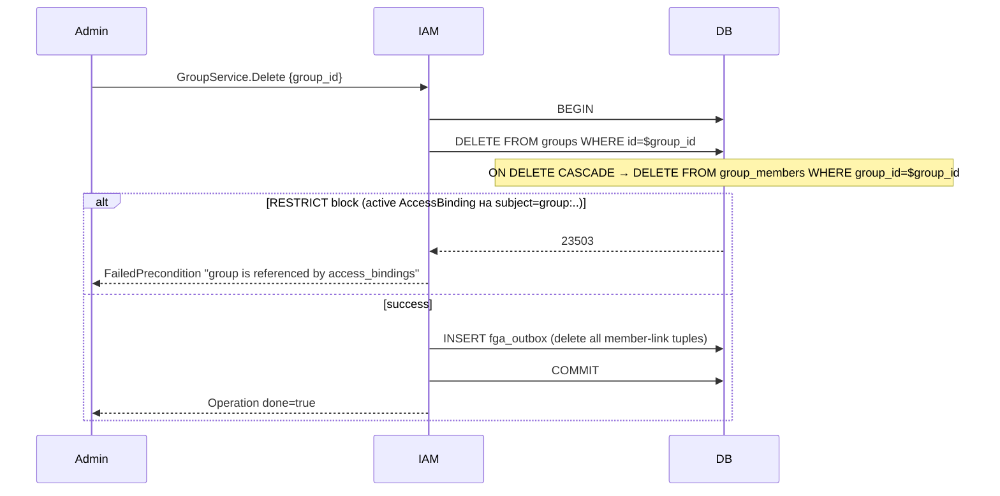

# 06. Group + GroupMember

## Назначение

**Group** — Account-scoped коллекция subjects (User или ServiceAccount).
Используется, чтобы одной AccessBinding раздать роль группе людей вместо
N бесконтрольных bindings.

**GroupMember** — связка `(group_id, member_type, member_id, added_at)`.
`member_type` — `user` или `service_account` (Group в GroupMember
запрещен — нет nested groups).

**Use-cases:**
- «Все DevOps» — Group, в которой состоят все User'ы с ролью cluster-ops.
- «CI/CD pipelines» — Group с ServiceAccount'ами всех конвейеров.
- AccessBinding на `subject_type=group` — раздает права всем членам.

**Ограничения:**
- `account_id` immutable.
- Имя уникально per-Account.
- Member integrity — через **PL/pgSQL trigger** (нет полиморфного FK в Postgres).
- Удаление Group cascade'ит GroupMember (внутри одной БД).

## Доменная модель

### Group

| Поле          | Тип           | Обязательное | Immutable | Описание                              |
|---------------|---------------|--------------|-----------|---------------------------------------|
| `id`          | `GroupID`     | да           | да        | `grp<17-char>`. Длина 20.             |
| `account_id`  | `AccountID`   | да           | **да**    | FK → `accounts(id) ON DELETE RESTRICT`. |
| `name`        | `GroupName`   | да           | нет       | kebab `^[a-z][-a-z0-9]{2,62}$`.       |
| `description` | `Description` | нет          | нет       | ≤256.                                  |
| `labels`      | `Labels`      | нет          | нет       | ≤64 пар.                               |
| `created_at`  | `time.Time`   | да (server)  | да        | UTC.                                  |

### GroupMember

| Поле          | Тип            | Обязательное | Immutable | Описание                                                |
|---------------|----------------|--------------|-----------|---------------------------------------------------------|
| `group_id`    | `GroupID`      | да           | да        | FK → `groups(id) ON DELETE CASCADE`.                    |
| `member_type` | `SubjectType`  | да           | да        | `user | service_account`. **`group` запрещен** (DB CHECK).|
| `member_id`   | `SubjectID`    | да           | да        | id User/SA. Существование — через trigger.              |
| `added_at`    | `time.Time`    | да (server)  | да        | UTC.                                                    |

**PK:** `(group_id, member_type, member_id)`.

**ID prefix:** `grp`.
**DB tables:** `kacho_iam.groups`, `kacho_iam.group_members` (миграция 0001:840+853).

### Trigger `group_members_member_exists_trg`

```sql
CREATE OR REPLACE FUNCTION kacho_iam.group_members_member_exists() RETURNS TRIGGER AS $$
BEGIN
  IF NEW.member_type = 'user' THEN
    IF NOT EXISTS (SELECT 1 FROM kacho_iam.users WHERE id = NEW.member_id) THEN
      RAISE foreign_key_violation USING MESSAGE = 'user not found';
    END IF;
  ELSIF NEW.member_type = 'service_account' THEN
    IF NOT EXISTS (SELECT 1 FROM kacho_iam.service_accounts WHERE id = NEW.member_id) THEN
      RAISE foreign_key_violation USING MESSAGE = 'service_account not found';
    END IF;
  END IF;
  RETURN NEW;
END $$ LANGUAGE plpgsql;
```

Срабатывает на BEFORE INSERT/UPDATE `group_members`. Альтернатива
полиморфному FK (Postgres его не поддерживает).

**FK contract:**

```
accounts(id) ──RESTRICT── groups.account_id
groups(id) ──CASCADE── group_members.group_id
groups(id) ──RESTRICT── access_bindings.subject_id (когда subject_type='group')
trigger: users(id) | service_accounts(id) ←── group_members.member_id (member_type)
```

## Sequence diagram — Create Group + AddMember

```mermaid
sequenceDiagram
    autonumber
    participant Admin
    participant IAM as kacho-iam :9090
    participant DB as Postgres

    Admin->>IAM: GroupService.Create {account_id, name:"devops"}
    IAM->>DB: BEGIN; INSERT operations; INSERT groups; INSERT fga_outbox (parent: iam_account → iam_group); COMMIT
    IAM-->>Admin: Operation done=true, group_id=grp_..

    Admin->>IAM: GroupService.AddMember {group_id, member_type:"user", member_id:"usr_alice"}
    IAM->>DB: BEGIN
    IAM->>DB: INSERT INTO group_members (group_id, member_type, member_id)
    Note over DB: BEFORE-INSERT trigger:<br/>SELECT FROM users WHERE id='usr_alice'<br/>NOT EXISTS → RAISE foreign_key_violation
    alt member existence OK
        DB-->>IAM: 1 row
        IAM->>DB: INSERT operations (done=true)
        IAM->>DB: INSERT fga_outbox (member-link tuple)
        IAM->>DB: COMMIT
        IAM-->>Admin: Operation done=true
    else member not found
        DB-->>IAM: 23503 (trigger raised)
        IAM->>DB: ROLLBACK
        IAM-->>Admin: FailedPrecondition "user not found"
    end
```

## Sequence diagram — Delete Group (CASCADE GroupMember)



## API surface

### Public gRPC (порт 9090)

| RPC              | Sync/Async | Описание                                       |
|------------------|------------|------------------------------------------------|
| `Create`         | async      | Создает Group в Account.                       |
| `Get`            | sync       | Получает Group по id.                          |
| `List`           | sync       | Список (filter by `account_id`).               |
| `Update`         | async      | UpdateMask: `name`, `description`, `labels`.   |
| `Delete`         | async      | Удаляет Group (cascade GroupMember).           |
| `AddMember`      | async      | Добавляет User/SA в Group.                     |
| `RemoveMember`   | async      | Удаляет члена.                                 |
| `ListMembers`    | sync       | Список членов Group (с paging).                |

### REST mapping

| HTTP    | Path                                                                  | gRPC mapping                  |
|---------|-----------------------------------------------------------------------|-------------------------------|
| POST    | `/iam/v1/groups`                                                      | `GroupService.Create`         |
| GET     | `/iam/v1/groups/{groupId}`                                            | `GroupService.Get`            |
| GET     | `/iam/v1/groups?account_id=...`                                       | `GroupService.List`           |
| PATCH   | `/iam/v1/groups/{groupId}`                                            | `GroupService.Update`         |
| DELETE  | `/iam/v1/groups/{groupId}`                                            | `GroupService.Delete`         |
| POST    | `/iam/v1/groups/{groupId}/members`                                    | `GroupService.AddMember`      |
| DELETE  | `/iam/v1/groups/{groupId}/members/{memberType}/{memberId}`            | `GroupService.RemoveMember`   |
| GET     | `/iam/v1/groups/{groupId}/members`                                    | `GroupService.ListMembers`    |

## Конфигурация

Group как ресурс не имеет отдельных env-vars.

## Как пользоваться

### REST (curl)

```bash
# Create Group.
RESP=$(curl -s -X POST http://localhost:18080/iam/v1/groups \
  -H "Authorization: Bearer $TOKEN" \
  -d '{"account_id":"acc_xxx","name":"devops"}')
GRP=...

# Add user member.
curl -X POST "http://localhost:18080/iam/v1/groups/$GRP/members" \
  -H "Authorization: Bearer $TOKEN" \
  -d '{"member_type":"user","member_id":"usr_alice"}'

# Add SA member.
curl -X POST "http://localhost:18080/iam/v1/groups/$GRP/members" \
  -H "Authorization: Bearer $TOKEN" \
  -d '{"member_type":"service_account","member_id":"sva_ci"}'

# List members.
curl "http://localhost:18080/iam/v1/groups/$GRP/members" -H "Authorization: Bearer $TOKEN" | jq

# Grant role group'у через AccessBinding.
curl -X POST http://localhost:18080/iam/v1/accessBindings \
  -H "Authorization: Bearer $TOKEN" \
  -d "{\"subject_type\":\"group\",\"subject_id\":\"$GRP\",\"role_id\":\"rol_..\",\"resource_type\":\"project\",\"resource_id\":\"prj_yyy\"}"
```

### Идемпотентность

`AddMember` — идемпотентен (повторный INSERT тех же (group_id, member_type,
member_id) → `23505` → GREEN handling, возвращает existing).

### Типичные ошибки

| Сценарий                                  | gRPC code             | HTTP | Текст                                          |
|-------------------------------------------|------------------------|------|------------------------------------------------|
| Group name занят                          | `ALREADY_EXISTS`       | 409  | `Group with name devops already exists`        |
| AddMember для не-существующего user/SA    | `FAILED_PRECONDITION`  | 412  | `member not found (user usr_zzz)`              |
| AddMember с `member_type=group`           | `INVALID_ARGUMENT`     | 400  | `member_type 'group' is not allowed`           |
| Delete Group при active AccessBinding     | `FAILED_PRECONDITION`  | 412  | `group is referenced by access_bindings`       |

## Как воспроизвести локально

```bash
cd kacho-deploy && make dev-up
kubectl -n kacho port-forward svc/api-gateway 18080:8080 &

cd kacho-iam && SERVICE=iam-group ./tests/newman/scripts/run.sh

# psql:
cd kacho-deploy && make psql SVC=iam
# > SELECT g.id, g.name, gm.member_type, gm.member_id FROM kacho_iam.groups g LEFT JOIN kacho_iam.group_members gm USING (...);

# Integration:
cd kacho-iam && GOWORK=off go test -short -count=1 -timeout 120s \
  -run "TestGroup|TestGroupMember|TestGroupIsMember" \
  ./internal/repo/kacho/pg/...
```

## Подробности реализации

- **Use-cases:** `internal/apps/kacho/api/group/{create,get,list,update,delete,add_member,remove_member,list_members}.go`.
- **Handler:** `internal/apps/kacho/api/group/handler.go`.
- **Repo:** `internal/repo/kacho/pg/group_repo.go`.
- **Trigger function:** `kacho_iam.group_members_member_exists()` — PL/pgSQL, см. `0001_initial.sql`.
- **DB:** `groups(id, account_id, name, description, labels JSONB, created_at)`;
  `group_members(group_id, member_type, member_id, added_at)`.
- **Indexes:** PK groups; UNIQUE `groups_account_name_unique`; PK group_members
  по `(group_id, member_type, member_id)`; INDEX `group_members_member_idx (member_type, member_id)`.
- **FGA:** `(iam_group:grp_*, parent, iam_account:acc_*)` + per-member
  `(user:usr_*, member, iam_group:grp_*)` или
  `(iam_service_account:sva_*, member, iam_group:grp_*)`.

## Gotchas / известные ограничения

- **Нет nested groups** — `member_type='group'` запрещен DB CHECK + domain.Validate.
- **Trigger overhead** — каждый AddMember лазит в `users` или `service_accounts`;
  не bulk-friendly (для bulk-import напрямую через SQL обходить trigger
  опасно — не делать).
- **Delete cascade GroupMember** — но **не cascade ссылок** на subject_id в
  AccessBinding (там RESTRICT через app-level check).

## Связанные компоненты

- [`03-user.md`](03-user.md) / [`04-service-account.md`](04-service-account.md) — members.
- [`08-access-binding.md`](08-access-binding.md) — bindings на subject_type=group.
- [`29-openfga-check.md`](29-openfga-check.md) — FGA member-tuple propagation.

## Ссылки на код

- `internal/domain/group.go`
- `internal/apps/kacho/api/group/`
- `internal/repo/kacho/pg/group_repo.go`
- `internal/repo/kacho/pg/group_ismember_integration_test.go`
- `internal/migrations/0001_initial.sql:840-869`
