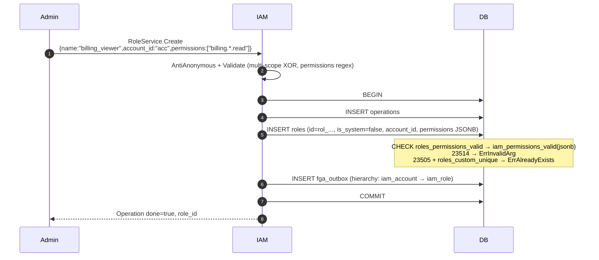
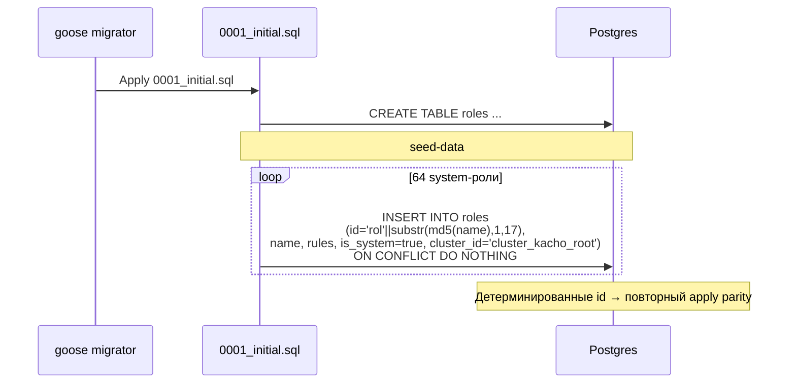

# 07. Role

## Назначение

**Role** — это именованная единица авторизации, состоящая из **rules** (правил):
каждое правило — `{module, resources[], verbs[], selector}`, где селектор —
`all` / `names` / `labels`. Роль **scoped** — назначена либо целому кластеру
(system-role), либо Account / Project (custom-role). Сущностей `folder` /
`organization` в модели scope нет.

> `permissions` (строки `<module>.<resource>.<verb>` с wildcard `*`) — это
> deprecated-проекция; авторизационный смысл роли несут `rules[]`. Как rules
> разворачиваются в доступ — см.
> [`../architecture/explicit-rbac-model.md`](../architecture/explicit-rbac-model.md).

В `kacho-iam` 64 system-роли (58 catalog + 5 module-SA + net-new `owner`)
seed'ятся миграциями с детерминированными id формата `rol<md5(name)[0..17]>` —
так, что повторное применение миграции дает те же id (parity для
cross-environment ссылок).

Custom-roles создаются tenant-admin'ами под нужды Account / Project (например,
`viewer-for-billing-team`).

**Use-cases:**
- Раздача стандартных permission-наборов (системные роли: `viewer`, `editor`,
  `admin` для каждого модуля).
- Tenant-кастомизация (custom-role с урезанным набором permissions для
  конкретной команды).

**Ограничения:**
- `is_system=true` — read-only (Update запрещен, Delete запрещен).
- `account_id` и `is_system` immutable.
- Имя system-role: `^roles/<module>.<role>$`; custom-role: `^[a-z][a-z0-9_]{0,40}$`.
- Permissions cardinality 1..256; формат каждой
  `<module>.<resource>.<verb>` или `*` на месте элемента.

## Доменная модель

Scope XOR (DB CHECK `roles_scope_xor`):

```
is_system=true  + cluster_id NOT NULL → system role
is_system=false + (account_id XOR project_id) NOT NULL → custom role
```

| Поле              | Тип              | Обязательное | Immutable | Описание                                          |
|-------------------|------------------|--------------|-----------|---------------------------------------------------|
| `id`              | `RoleID`         | да           | да        | `rol<17-char>`. Для system — детерминированный.   |
| `cluster_id`      | `ClusterID`      | для system   | да        | FK → `clusters(id)`. System-only.                 |
| `account_id`      | `AccountID`      | для acc-scoped| да       | FK → `accounts(id)`. Custom-only.                 |
| `project_id`      | `ProjectID`      | для prj-scoped| да       | FK → `projects(id)`. Custom-only.                 |
| `rules`           | `Rules`          | да           | нет       | JSONB массив правил `{module, resources, verbs, selector}`. |
| `name`            | `RoleName`       | да           | для system да| Custom regex / system regex.                    |
| `description`     | `Description`    | нет          | нет       | ≤256.                                              |
| `permissions`     | `Permissions`    | да           | нет       | JSONB array, 1..256 элементов. CHECK validator.   |
| `is_system`       | `bool`           | да           | да        | true → seed'ed, read-only.                        |
| `created_at`      | `time.Time`      | да           | да        | UTC.                                              |

**ID prefix:** `rol`. System-role IDs: `rol` + `substr(md5(name), 1, 17)`.

**DB table:** `kacho_iam.roles` (миграция 0001:1015 + seed-блок).

**Permissions validation:** через PL/pgSQL функцию
`kacho_iam.iam_permissions_valid(jsonb)`:

```
ALL ELEMENTS должны соответствовать ^([a-z][a-z0-9]*|\*)\.([a-z][a-z0-9_]*|\*)\.([a-zA-Z][a-zA-Z0-9]*|\*)$
```

Примеры: `compute.instance.create`, `vpc.*.read`, `iam.account.*`, `*` (full admin).

**Sentinel errors:**

| Sentinel                | gRPC code              | Когда                                              |
|-------------------------|-------------------------|----------------------------------------------------|
| `ErrNotFound`           | `NOT_FOUND`             | id не найден.                                      |
| `ErrAlreadyExists`      | `ALREADY_EXISTS`        | name занят в данном scope.                         |
| `ErrFailedPrecondition` | `FAILED_PRECONDITION`   | Delete при active AccessBinding; Update system-role.|
| `ErrInvalidArg`         | `INVALID_ARGUMENT`      | domain.Validate / immutable / permissions invalid. |

**FK contract:**

```
clusters(id) ──RESTRICT── roles.cluster_id
accounts(id) ──RESTRICT── roles.account_id
projects(id) ──RESTRICT── roles.project_id
roles(id) ──RESTRICT── access_bindings.role_id
```

## Sequence diagram — Create custom Role



## Sequence diagram — Seed system-roles (migration boot)



## API surface

### Public gRPC (порт 9090)

| RPC      | Sync/Async | Описание                                       |
|----------|------------|------------------------------------------------|
| `Create` | async      | Только custom-role (не system).                |
| `Get`    | sync       | Получает Role.                                 |
| `List`   | sync       | Filter by `account_id`, `is_system`.           |
| `Update` | async      | UpdateMask: `description`, `permissions`. System-role read-only. |
| `Delete` | async      | Только custom. RESTRICT если есть binding.     |

### REST mapping

| HTTP    | Path                              | gRPC mapping            |
|---------|-----------------------------------|--------------------------|
| POST    | `/iam/v1/roles`                   | `RoleService.Create`    |
| GET     | `/iam/v1/roles/{roleId}`          | `RoleService.Get`       |
| GET     | `/iam/v1/roles`                   | `RoleService.List`      |
| PATCH   | `/iam/v1/roles/{roleId}`          | `RoleService.Update`    |
| DELETE  | `/iam/v1/roles/{roleId}`          | `RoleService.Delete`    |

## Конфигурация

Role не имеет отдельных env-vars.

## Как пользоваться

### Create custom role

```bash
curl -X POST http://localhost:18080/iam/v1/roles \
  -H "Authorization: Bearer $TOKEN" \
  -d '{
    "name":"billing_viewer",
    "account_id":"acc_xxx",
    "description":"View billing only",
    "permissions":["billing.*.read","billing.invoice.list"]
  }'
```

### List system roles

```bash
curl "http://localhost:18080/iam/v1/roles?is_system=true" -H "Authorization: Bearer $TOKEN" | jq '.roles[].name'
# → "roles/iam.viewer", "roles/iam.editor", "roles/compute.admin", ...
```

### Get конкретной системной роли по детерминированному id

```bash
# echo -n "roles/iam.viewer" | md5sum даст хэш; id будет rol<первые 17 chars>
curl http://localhost:18080/iam/v1/roles/rol00000000000000abc -H "Authorization: Bearer $TOKEN"
```

### Update custom role (расширить permissions)

```bash
curl -X PATCH http://localhost:18080/iam/v1/roles/rol_custom_xxx \
  -H "Authorization: Bearer $TOKEN" \
  -d '{"permissions":["billing.*.read","billing.*.list"],"update_mask":"permissions"}'
```

### Идемпотентность

Не идемпотентен (name занят → AlreadyExists).

### Типичные ошибки

| Сценарий                                  | gRPC code             | HTTP | Текст                                          |
|-------------------------------------------|------------------------|------|------------------------------------------------|
| Update / Delete system-role               | `FAILED_PRECONDITION`  | 412  | `system role is read-only`                     |
| Invalid permission format                 | `INVALID_ARGUMENT`     | 400  | `Illegal argument permissions: invalid format` |
| name занят в scope                        | `ALREADY_EXISTS`       | 409  | `Role with name billing_viewer already exists` |
| Delete при active AccessBinding           | `FAILED_PRECONDITION`  | 412  | `role is referenced by access_bindings`        |
| Permissions empty                         | `INVALID_ARGUMENT`     | 400  | `permissions: must contain at least 1`         |

## Как воспроизвести локально

```bash
cd kacho-deploy && make dev-up
kubectl -n kacho port-forward svc/api-gateway 18080:8080 &

cd kacho-iam && SERVICE=iam-role ./tests/newman/scripts/run.sh

# psql — посмотреть system-роли:
cd kacho-deploy && make psql SVC=iam
# > SELECT id, name, jsonb_array_length(permissions) FROM kacho_iam.roles WHERE is_system=true ORDER BY name;

# Integration: seed determinism + permissions CHECK.
cd kacho-iam && GOWORK=off go test -short -count=1 -timeout 120s \
  -run "TestRole|TestSeedRoleIds|TestSeedNlbRoles|TestRolesPermissionsValid" \
  ./internal/repo/kacho/pg/...
```

## Подробности реализации

- **Use-cases:** `internal/apps/kacho/api/role/{create,get,list,update,delete}.go`.
- **Handler:** `internal/apps/kacho/api/role/handler.go`.
- **Repo:** `internal/repo/kacho/pg/role_repo.go` + `role_read_port.go` (read-only
  port для FGA-side `authzmap.PermissionsToRelations`).
- **DB:** `roles(id, cluster_id, account_id, project_id,
  name, description, permissions JSONB, rules JSONB, is_system, created_at)`.
- **Indexes:** PK; partial UNIQUE `roles_custom_unique` ON `(scope_id, name) WHERE is_system=false`;
  partial UNIQUE для каждого scope.
- **CHECK:** `roles_scope_xor` (scope XOR account/project); `roles_permissions_valid`
  (через PL/pgSQL `iam_permissions_valid`).
- **Seed:** 64 system-роли (58 catalog в `0001_initial.sql` seed-блоке + 5 module-SA +
  net-new `owner`), ON CONFLICT DO NOTHING. Id вычисляется по
  `'rol' || substr(md5(name), 1, 17)`.
- **authzmap:** `internal/authzmap/permissions_to_relations.go` — маппит
  permissions ролей в FGA relations (`admin`/`editor`/`viewer` per-resource-type).
  Используется AccessBinding.Create.

## Gotchas / известные ограничения

- **System-role permissions менять нельзя** — для расширения создать
  custom-role с нужными permissions + новый AccessBinding.
- **Permissions validation — PL/pgSQL функция**, NOT regex string в CHECK —
  при ошибке выдается `Illegal argument permissions: invalid format` без
  указания, какая именно permission невалидна. Для debug — psql проверка
  `SELECT kacho_iam.iam_permissions_valid('["foo.bar"]'::jsonb)`.
- **Deterministic seed-ids** — НЕ менять `name` системной роли, иначе id
  пересчитается и все существующие AccessBinding'и сломаются. Если нужно
  переименование — отдельная роль + миграция AccessBinding'ов.
- **Custom-role не cross-Account** — role_id ссылается на конкретный scope
  (Account или Project). Кросс-account shared-роль — это системная (cluster-scoped)
  роль; tenant-кастомные роли создаются под конкретный Account/Project.

## Связанные компоненты

- [`../architecture/explicit-rbac-model.md`](../architecture/explicit-rbac-model.md) — как rules грантов разворачиваются в доступ.
- [`08-access-binding.md`](08-access-binding.md) — bindings ссылаются на role_id.
- [`29-openfga-check.md`](29-openfga-check.md) — FGA relations выводятся из rules.
- [`19-authorize.md`](19-authorize.md) — runtime check.

## Ссылки на код

- `internal/domain/role.go`
- `internal/apps/kacho/api/role/`
- `internal/repo/kacho/pg/role_repo.go`, `role_read_port.go`, `seed_role_ids_test.go`, `seed_nlb_roles_integration_test.go`
- `internal/authzmap/permissions_to_relations.go`
- `internal/migrations/0001_initial.sql:1015-1037` + seed-блок
