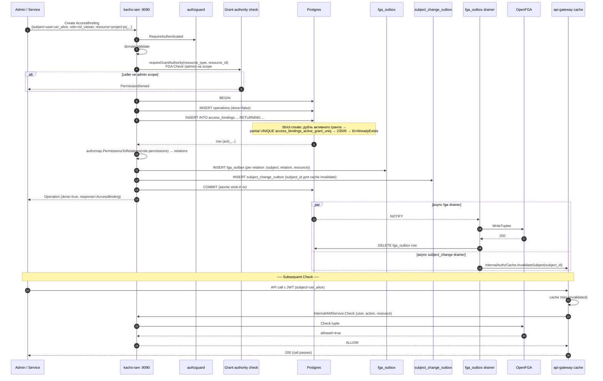
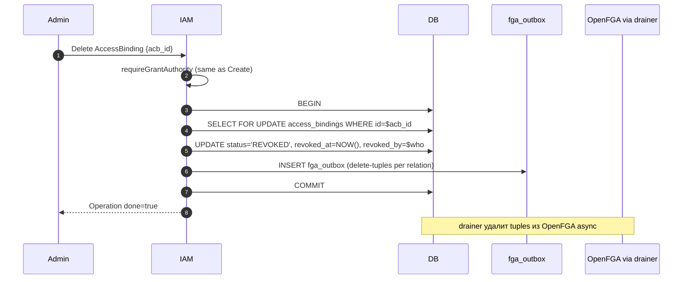

# 08. AccessBinding

## Назначение

**AccessBinding** — это связь `(subject_type, subject_id) ↔ role_id ↔
(resource_type, resource_id)`. Она и есть тот «грант», который превращает
запись в `roles` в **активное** право пользователя/SA/группы делать что-то с
ресурсом.

Grant-идентичность AccessBinding (5-tuple subject↔role↔resource) **immutable**:
чтобы ее сменить — Delete + Create, поэтому audit-trail прозрачен и каждый
«грант» отслеживается по времени. Mutable остаются только метаданные ресурса
(`labels`, `deletion_protection`) — они меняются через `Update`.

Создание — **strict-create**: дубль активного гранта (та же 5-tuple
`(subject_type, subject_id, role_id, resource_type, resource_id)` при
`revoked_at IS NULL`) ловится partial UNIQUE `access_bindings_active_grant_uniq`
и возвращает `ALREADY_EXISTS`. Прежний silent `ON CONFLICT DO UPDATE`-upsert
удален — он маскировал реальные дубль-гранты и засорял audit-trail.

**Use-cases:**
- Грант роли пользователю на проект (`subject=user:usr_*, role=viewer, resource=project:prj_*`).
- Грант SA на VPC-сеть.
- Грант группе на cluster-admin.
- Bootstrap при signup (Account owner gets `account-admin` binding).

**Ограничения:**
- Grant-идентичность (5-tuple) immutable; для смены — Delete+Create.
  Mutable метаданные (`labels`, `deletion_protection`) — через `Update`.
- `resource_id` — opaque (cross-service id, не валидируется на kacho-iam стороне).
- `status`: `PENDING` (reserved) / `ACTIVE` (steady) / `REVOKED` (terminal);
  обычный Create сразу дает `ACTIVE`.

## Доменная модель

| Поле                | Тип                          | Обязательное | Immutable | Описание                                            |
|---------------------|------------------------------|--------------|-----------|-----------------------------------------------------|
| `id`                | `AccessBindingID`            | да           | да        | `acb<17-char>`.                                      |
| `subject_type`      | `SubjectType`                | да           | да        | `user | service_account | group`.                    |
| `subject_id`        | `SubjectID`                  | да           | да        | id User/SA/Group.                                    |
| `role_id`           | `RoleID`                     | да           | да        | FK → `roles(id) ON DELETE RESTRICT`.                 |
| `resource_type`     | `ResourceType`               | да           | да        | Whitelist (см. ниже).                                |
| `resource_id`       | `string`                     | да           | да        | opaque (cross-service id).                           |
| `status`            | `AccessBindingStatus`        | да           | нет (CAS) | `PENDING | ACTIVE | REVOKED`. Default `ACTIVE`.    |
| `condition_id`      | `AccessBindingConditionID`   | нет          | нет       | FK → `access_binding_conditions(id)`. nullable. Logical-oneof с `builtin_condition`. |
| `builtin_condition` | `BuiltinCondition` (enum)    | нет          | нет       | Built-in condition overlay (oneof с `condition_id`). |
| `expires_at`        | `*time.Time`                 | нет          | нет       | TTL.                                                |
| `granted_by_user_id`| `UserID`                     | нет (audit)  | да        | Кто грантнул.                                       |
| `revoked_at`        | `*time.Time`                 | нет          | нет       | Stamp на REVOKED.                                   |
| `revoked_by_user_id`| `*UserID`                    | нет          | нет       | Кто revoked.                                        |
| `deletion_protection`| `bool`                      | нет          | нет (Update)| Защита от Delete; owner-binding ставит `true`.     |
| `labels`            | `map<str,str>`               | нет          | нет (Update)| Tenant-метки ресурса (label-selectable).           |
| `created_at`        | `time.Time`                  | да (server)  | да        | UTC.                                                |

**ID prefix:** `acb`.
**DB table:** `kacho_iam.access_bindings` (миграция 0001:235).

**UNIQUE constraint:** partial UNIQUE `access_bindings_active_grant_uniq ON
(subject_type, subject_id, role_id, resource_type, resource_id) WHERE
revoked_at IS NULL` — основа strict-create (дубль активного гранта → 23505).

**ResourceType whitelist** (см. `internal/domain/types.go`):

```
account, project, vpc_network, vpc_subnet, vpc_address, vpc_route_table,
vpc_security_group, vpc_gateway, vpc_network_interface,
compute_instance, compute_disk, compute_image, compute_snapshot,
loadbalancer_nlb, loadbalancer_target_group,
iam_account, iam_project, iam_user, iam_service_account, iam_group, iam_role,
*  (wildcard)
```

**State machine:** `PENDING → ACTIVE → REVOKED` (terminal). Transitions —
atomic CAS UPDATE с `WHERE status IN ('PENDING','ACTIVE')`. REVOKED irreversible.

## Sequence diagram — Create (strict-create + atomic emit-in-tx)



## Sequence diagram — Delete



## API surface

### Public gRPC (порт 9090)

| RPC               | Sync/Async | Описание                                                            |
|-------------------|------------|---------------------------------------------------------------------|
| `Create`          | async      | Strict-create — дубль активного гранта → `ALREADY_EXISTS`.          |
| `Update`          | async      | UpdateMask: `labels`, `deletion_protection` (5-tuple immutable).    |
| `Delete`          | async      | Soft (status=REVOKED). После revoke re-grant дает новый id.         |
| `Get`             | sync       | По id.                                                              |
| `ListByScope`     | sync       | Все bindings на scope (resource_type, resource_id).                 |
| `ListBySubject`   | sync       | Все bindings, где subject=(type, id).                               |

### REST mapping

| HTTP    | Path                                                                            | gRPC mapping                            |
|---------|---------------------------------------------------------------------------------|------------------------------------------|
| POST    | `/iam/v1/accessBindings`                                                        | `AccessBindingService.Create`           |
| GET     | `/iam/v1/accessBindings/{accessBindingId}`                                      | `AccessBindingService.Get`              |
| PATCH   | `/iam/v1/accessBindings/{accessBindingId}`                                      | `AccessBindingService.Update`           |
| DELETE  | `/iam/v1/accessBindings/{accessBindingId}`                                      | `AccessBindingService.Delete`           |
| GET     | `/iam/v1/accessBindings:listByScope?resource_type=...&resource_id=...`          | `AccessBindingService.ListByScope`      |
| GET     | `/iam/v1/accessBindings:listBySubject?subject_type=...&subject_id=...`          | `AccessBindingService.ListBySubject`    |

## Конфигурация

| Env var                              | YAML                              | Default | Описание                       |
|--------------------------------------|-----------------------------------|---------|--------------------------------|
| `KACHO_IAM_OPENFGA_STORE_ID`         | `extapi.openfga.store-id`         | —       | OpenFGA store id (required для FGA-emit). |
| `KACHO_IAM_OPENFGA_ENDPOINT`         | `extapi.openfga.endpoint`         | `kacho-umbrella-openfga:8080` | OpenFGA HTTP endpoint. |

Если store_id не задан — Create продолжает работать, но FGA-tuples
накапливаются в `fga_outbox` до restart'а с FGA configured.

## Как пользоваться

```bash
# Grant user 'usr_alice' роль 'rol_viewer' на project 'prj_yyy'.
curl -X POST http://localhost:18080/iam/v1/accessBindings \
  -H "Authorization: Bearer $TOKEN" \
  -d '{
    "subject_type":"user",
    "subject_id":"usr_alice",
    "role_id":"rol_viewer",
    "resource_type":"project",
    "resource_id":"prj_yyy"
  }'
# → Operation, после poll → AccessBinding с acb_id

# Strict re-create активного гранта — ALREADY_EXISTS (дубль не маскируется).
curl -X POST http://localhost:18080/iam/v1/accessBindings \
  -H "Authorization: Bearer $TOKEN" \
  -d '<тот же payload>'
# → 409 ALREADY_EXISTS (re-grant возможен только после Delete/revoke).

# List по scope.
curl "http://localhost:18080/iam/v1/accessBindings:listByScope?resource_type=project&resource_id=prj_yyy" \
  -H "Authorization: Bearer $TOKEN" | jq

# Revoke.
curl -X DELETE http://localhost:18080/iam/v1/accessBindings/$ACB_ID \
  -H "Authorization: Bearer $TOKEN"
```

### Типичные ошибки

| Сценарий                                  | gRPC code             | HTTP | Текст                                                |
|-------------------------------------------|------------------------|------|------------------------------------------------------|
| role_id не существует                     | `FAILED_PRECONDITION`  | 412  | `role_id rol_zzz not found`                          |
| Caller не имеет grant authority           | `PERMISSION_DENIED`    | 403  | `caller cannot grant on this scope`                  |
| Anonymous                                 | `UNAUTHENTICATED`      | 401  | `anonymous principal rejected`                       |
| resource_type вне whitelist               | `INVALID_ARGUMENT`     | 400  | `Illegal argument resource_type "foobar"`            |
| subject_type 'group' с member_id user'а   | `INVALID_ARGUMENT`     | 400  | `subject_id usr_xxx does not match subject_type group` |
| Delete на REVOKED binding                 | `FAILED_PRECONDITION`  | 412  | `access_binding already revoked`                     |

## Как воспроизвести локально

```bash
cd kacho-deploy && make dev-up
kubectl -n kacho port-forward svc/api-gateway 18080:8080 &

cd kacho-iam && SERVICE=iam-access-binding ./tests/newman/scripts/run.sh

# psql:
cd kacho-deploy && make psql SVC=iam
# > SELECT subject_type, subject_id, role_id, resource_type, resource_id, status FROM kacho_iam.access_bindings LIMIT 20;
# > SELECT * FROM kacho_iam.fga_outbox LIMIT 10;     -- pending tuples
# > SELECT * FROM kacho_iam.subject_change_outbox LIMIT 10;

# Integration: idempotency + atomic emit-in-tx + subject_change emit + FGA symmetric.
cd kacho-iam && GOWORK=off go test -short -count=1 -timeout 120s \
  -run "TestAccessBinding|TestAccessBindingFGAOutbox|TestAccessBindingSubjectChange|TestAccessBindingIdempotent|TestAccessBindingFGASymmetric" \
  ./internal/apps/kacho/api/access_binding/ ./internal/repo/kacho/pg/
```

## Подробности реализации

- **Use-cases:** `internal/apps/kacho/api/access_binding/{create,delete,get,list_by_resource,list_by_subject}.go`.
- **Handler:** `internal/apps/kacho/api/access_binding/handler.go`.
- **Repo:** `internal/repo/kacho/pg/access_binding_repo.go` — strict INSERT
  (без `ON CONFLICT`); дубль активной 5-tuple → 23505 → `ErrAlreadyExists`.
- **DB:** `access_bindings(id, subject_type, subject_id, role_id, resource_type,
  resource_id, status, condition_id, builtin_condition, expires_at, granted_by,
  revoked_at, revoked_by, deletion_protection, labels, created_at)`.
- **Indexes:** PK; partial UNIQUE `access_bindings_active_grant_uniq` ON 5-tuple
  `WHERE revoked_at IS NULL`; INDEX по subject; INDEX по resource.
- **CHECK:** `access_bindings_status_check`; `access_bindings_resource_type_check` (whitelist).
- **Grant authority:** `requireGrantAuthority` → FGA Check (admin) на scope.
  Bootstrap-bypass через owner_user_id check на Account (см. `create.go`).
- **FGA emit-in-tx:** через `EmitFGAWrite(ctx, tuples)` внутри writer-tx;
  tuples приходят из `authzmap.PermissionsToRelations(role.permissions)`.
- **Subject-change emit:** `subject_change_outbox` row для invalidate
  api-gateway authz cache на subject_id (см. [`29-openfga-check.md`](29-openfga-check.md)).
- **Anti-leak guards:** ListBySubject анонимно → ничего не вернет; см.
  `list_by_subject_anti_leak_test.go`.

## Gotchas / известные ограничения

- **Strict-create — контракт**: повторный Create активного гранта → `ALREADY_EXISTS`
  (не silent no-op). Идемпотентность grant-retry — на стороне caller'а
  (повтор видит `ALREADY_EXISTS`, не скрытый upsert).
- **resource_id не валидируется** — kacho-iam не знает про конкретные id
  VPC/Compute ресурсов. Dangling-ref переживается (Check на удаленном
  ресурсе вернет `allowed=false` если ресурса нет в OpenFGA).
- **Re-grant после revoke** — partial UNIQUE `access_bindings_active_grant_uniq`
  скоупится `WHERE revoked_at IS NULL`, поэтому после Delete (status=REVOKED,
  `revoked_at` set) повторный Create той же 5-tuple проходит и дает НОВЫЙ id.
  Активный дубль (`revoked_at IS NULL`) → 23505 → `ErrAlreadyExists`.
- **Grant cascade через FGA** — не моментальный: между Create commit и
  drain'ом fga_outbox есть окно ~ms-секунда, в течение которого Check
  может вернуть `allowed=false`. SLA пропагации — sub-second.

## Связанные компоненты

- [`07-role.md`](07-role.md) — role_id ссылается сюда.
- [`09-conditions.md`](09-conditions.md) — overlay-условия на binding.
- [`29-openfga-check.md`](29-openfga-check.md) — FGA propagation chain.

## Ссылки на код

- `internal/domain/access_binding.go`
- `internal/apps/kacho/api/access_binding/`
- `internal/repo/kacho/pg/access_binding_repo.go`, `access_binding_fga_outbox_integration_test.go`, `access_binding_subject_change_integration_test.go`
- `internal/authzmap/`
- `internal/migrations/0001_initial.sql:235-263`
