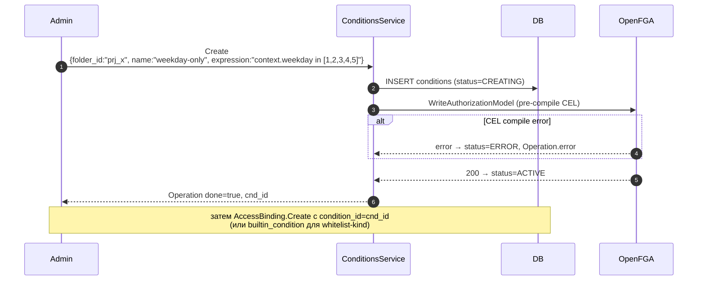
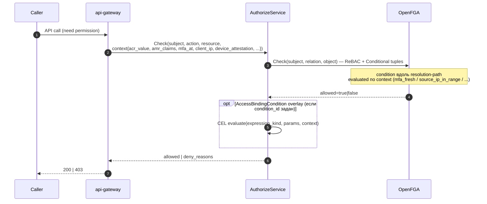

# 09. Access Binding Conditions (ABAC overlay)

## Назначение

`kacho-iam` поддерживает ABAC-условия двух уровней:

1. **`AccessBindingCondition`** — overlay 1:1 на AccessBinding. Хранит
   `expression_kind` (whitelist) + `params_json` (JSONB). Привязывается в
   момент `AccessBinding.Create` через `condition_id` / `builtin_condition`
   (logical-oneof) и проверяется на каждом `Check`.
2. **`Condition`** (отдельный folder-scoped resource) — переиспользуемое
   CEL-выражение + JSON-schema для параметров. AccessBinding ссылается на
   него через `condition_ref.condition_id`. Выражение pre-компилируется в
   OpenFGA Authorization Model на `WriteAuthorizationModel` и evaluated
   OpenFGA Conditions при каждом Check.

Оба типа дают **ABAC**-слой поверх REBAC-bindings: «binding активен только
если у subject MFA fresh» или «только из подсети 10.0.0.0/16».

**Use-cases:**
- Require MFA freshness для cluster-admin доступа.
- IP-allowlist для critical operations.
- TTL: binding активен только пока `now() < expires_at`.
- Business-hours: только в рабочие часы.
- Device-attestation: только с одобренных устройств.

**Ограничения:**
- `AccessBindingCondition.expression_kind` — из whitelist (нельзя произвольный CEL).
- `Condition` (standalone) — произвольный CEL, но требует pre-compile-проверки
  на `WriteAuthorizationModel`.

## ConditionKind whitelist (AccessBindingCondition)

| Kind                    | Назначение                                              | Params пример                                  |
|-------------------------|---------------------------------------------------------|-------------------------------------------------|
| `mfa_fresh`             | acr=3 (passkey/FIDO2) + `webauthn` в amr + MFA не старше 15m | `{"max_age_seconds":900,"required_amr":["webauthn"]}` |
| `non_expired`           | Сейчас < `expires_at` (binding-level)                   | `{}` (использует binding.expires_at)           |
| `source_ip_in_range`    | client IP в CIDR-списке                                  | `{"cidrs":["10.0.0.0/8","192.168.1.0/24"]}`    |
| `business_hours`        | Рабочие часы Mon-Fri `[start_h, end_h)` в указанном TZ  | `{"tz":"Europe/Moscow"}`                       |
| `device_compliant`      | `device_attestation`-claim запроса в approved-списке     | `{"allowed_attestations":["aaguid-..."]}`      |

`expression_kind` хранится в lowercase-форме; DB CHECK
`access_binding_conditions_expression_whitelist_ck` энфорсит whitelist на уровне
storage.

## Доменная модель — AccessBindingCondition

| Поле              | Тип                       | Обязательное | Immutable | Описание                                  |
|-------------------|---------------------------|--------------|-----------|-------------------------------------------|
| `id`              | `AccessBindingConditionID`| да           | да        | `cond_<…>`.                               |
| `binding_id`      | `AccessBindingID`         | да           | да        | FK → `access_bindings(id) ON DELETE CASCADE`. 1:1. |
| `expression_kind` | `Kind` (enum, whitelist)  | да           | да        | Whitelist (см. таблицу выше).             |
| `params_json`     | `bytes` (JSONB)           | нет          | нет       | Per-kind схема; валидируется по `expression_kind`. |
| `created_at`      | `time.Time`               | да           | да        | UTC.                                      |

**DB table:** `access_binding_conditions` (миграция 0001:217).

## Доменная модель — Condition (standalone)

| Поле                | Тип                          | Обязательное | Immutable | Описание                                  |
|---------------------|------------------------------|--------------|-----------|-------------------------------------------|
| `id`                | `ConditionID` (`cnd_…`)      | да           | да        | `cnd_<…>`.                                 |
| `folder_id`         | string (≤20)                 | да           | да        | Owning project (имя поля legacy).         |
| `name`              | string (`^[a-z][-a-z0-9]*$`) | да           | да        | `len≤63`, UNIQUE within folder.           |
| `description`       | string                       | нет          | нет       | `len≤256`.                                |
| `labels`            | map<str,str>                 | нет          | нет       | k/v.                                       |
| `expression`        | string CEL                   | да           | нет       | ≤2048.                                    |
| `parameters_schema` | `Struct` (JSON-schema)       | нет          | нет       | Validates params on bind-time.            |
| `status`            | `ConditionStatus`            | да (server)  | нет       | `CREATING|ACTIVE|DELETING|ERROR`.         |
| `resource_version`  | int64                        | да (server)  | нет       | OCC (на Update).                          |
| `created_at`        | `time.Time`                  | да           | да        | UTC.                                      |

**DB table:** `conditions` (миграция 0001:633).

## Sequence diagram — Create standalone Condition + reference из binding



## Sequence diagram — Evaluation на Check



## API surface

### Public gRPC (порт 9090) — ConditionsService

| RPC        | Sync/Async | Описание                                                       |
|------------|------------|----------------------------------------------------------------|
| `Get`      | sync       | Получить Condition по id.                                       |
| `List`     | sync       | Filter by `folder_id` (+ label/name).                          |
| `Create`   | async      | Standalone Condition. CEL валидируется FGA-движком.            |
| `Update`   | async      | UpdateMask: `description`, `labels`, `expression`, `parameters_schema`. `name`/`folder_id` immutable. OCC по `resource_version`. |
| `Delete`   | async      | FailedPrecondition если binding'и еще ссылаются.              |
| `Evaluate` | sync       | Admin/diagnostic: прогнать CEL против input-context без FGA.   |

`AccessBindingCondition` (overlay 1:1) привязывается **не** через ConditionsService,
а на `AccessBindingService.Create` через `condition_id` / `builtin_condition`.

### REST mapping

| HTTP    | Path                                                  | gRPC mapping                    |
|---------|-------------------------------------------------------|---------------------------------|
| GET     | `/iam/v1/conditions/{conditionId}`                    | `ConditionsService.Get`         |
| GET     | `/iam/v1/conditions`                                  | `ConditionsService.List`        |
| POST    | `/iam/v1/conditions`                                  | `ConditionsService.Create`      |
| PATCH   | `/iam/v1/conditions/{conditionId}`                    | `ConditionsService.Update`      |
| DELETE  | `/iam/v1/conditions/{conditionId}`                    | `ConditionsService.Delete`      |
| POST    | `/iam/v1/conditions/{conditionId}:evaluate`           | `ConditionsService.Evaluate`    |

## Конфигурация

Отдельных env-vars у Condition нет: CEL-evaluation идет внутри FGA Check-пайплайна.
OpenFGA endpoint и Check/Write-timeouts — см. [`19-authorize.md`](19-authorize.md).

## Как пользоваться

```bash
# Standalone Condition.
curl -X POST http://localhost:18080/iam/v1/conditions \
  -H "Authorization: Bearer $TOKEN" \
  -d '{"folder_id":"prj_xxx","name":"weekday-only","expression":"context.weekday in [1,2,3,4,5]"}'
# → Operation, после poll → cnd_id.

# AccessBinding с reference на standalone Condition.
curl -X POST http://localhost:18080/iam/v1/accessBindings \
  -H "Authorization: Bearer $TOKEN" \
  -d '{"subject_type":"user","subject_id":"usr_alice","role_id":"rol_viewer",
       "resource_type":"project","resource_id":"prj_yyy","condition_id":"cnd_xxx"}'

# AccessBinding с built-in mfa_fresh (whitelist-kind, без отдельной Condition-строки).
curl -X POST http://localhost:18080/iam/v1/accessBindings \
  -H "Authorization: Bearer $TOKEN" \
  -d '{"subject_type":"user","subject_id":"usr_alice","role_id":"rol_admin",
       "resource_type":"project","resource_id":"prj_yyy","builtin_condition":"BUILTIN_CONDITION_MFA_FRESH"}'

# Diagnostic: прогнать CEL без FGA.
curl -X POST "http://localhost:18080/iam/v1/conditions/cnd_xxx:evaluate" \
  -H "Authorization: Bearer $TOKEN" \
  -d '{"context":{"weekday":3}}'
```

### Типичные ошибки

| Сценарий                              | gRPC code             | HTTP | Текст                                          |
|---------------------------------------|------------------------|------|------------------------------------------------|
| Invalid kind                          | `INVALID_ARGUMENT`     | 400  | `Illegal argument expression_kind (not in whitelist)` |
| Params не соответствуют schema        | `INVALID_ARGUMENT`     | 400  | `params: required field "cidrs" missing`       |
| Standalone Condition: CEL не компилится | `INVALID_ARGUMENT`   | 400  | `expression: CEL compile error: ...`           |
| Delete standalone Condition с bindings | `FAILED_PRECONDITION` | 412  | `condition is referenced by bindings`          |

## Как воспроизвести локально

```bash
cd kacho-iam && SERVICE=iam-conditions ./tests/newman/scripts/run.sh
# Integration:
go test -short -timeout 120s -run "TestConditions" ./internal/repo/kacho/pg/...
```

## Подробности реализации

- **Handler:** `internal/apps/kacho/api/conditions/handler.go`.
- **Service:** `internal/service/conditions_crud_service.go` (CRUD) +
  `conditions_evaluator.go` (builtin evaluator) + `conditions_audit.go`.
- **Repo:** `internal/repo/kacho/pg/conditions_repo.go`.
- **DB:** `access_binding_conditions(id, binding_id, expression_kind, params_json, created_at)`;
  `conditions(id, folder_id, name, description, labels JSONB, expression, parameters_schema JSONB, status, resource_version, created_at)`.
- **CASCADE:** `access_binding_conditions.binding_id → access_bindings(id) ON DELETE CASCADE`.

## Gotchas / известные ограничения

- **CEL для standalone Conditions** — pre-compile на Create (через FGA
  `WriteAuthorizationModel`), runtime evaluate per Check; ошибки в expression
  → status=`ERROR`, condition fails closed.
- **`device_compliant`** проверяет `device_attestation`-claim из запроса
  (никакого внешнего callout на Check) — claim сверяется со списком
  одобренных attestation'ов.
- **`AccessBindingCondition` whitelist** — DB CHECK ограничивает `expression_kind`
  фиксированным набором предикатов; произвольный CEL — только через standalone
  `Condition`.

## Связанные компоненты

- [`08-access-binding.md`](08-access-binding.md) — owner.
- [`19-authorize.md`](19-authorize.md) — evaluation entry-point.

## Ссылки на код

- `internal/domain/access_binding_condition.go`, `condition.go`
- `internal/apps/kacho/api/conditions/handler.go`
- `internal/service/conditions_crud_service.go`, `conditions_evaluator.go`, `conditions_audit.go`
- `internal/repo/kacho/pg/conditions_repo.go`
- `internal/migrations/0001_initial.sql:217-234, 633-656`
