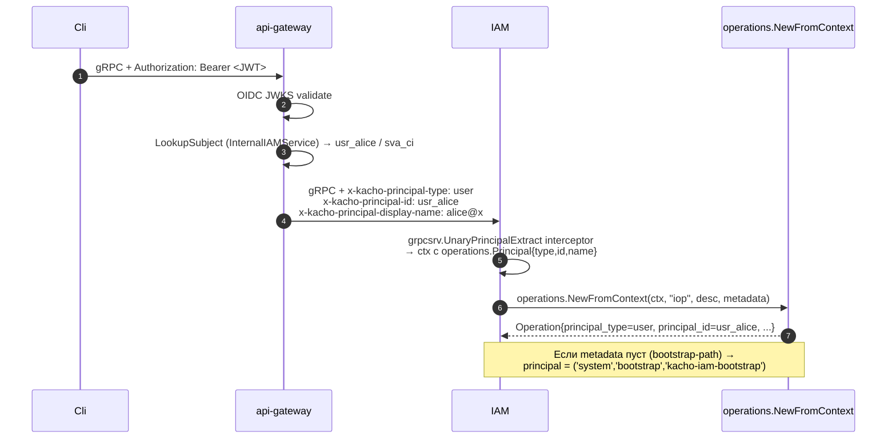

# 10. LRO Operations (`iop_...`)

## Назначение

**Operation** — это envelope над long-running async-операцией. Все мутирующие
RPC в kacho-iam возвращают `*operation.Operation` (никогда не сам ресурс) —
это API-contract `flat-resources + Operations`: мутации возвращают
`Operation` (async), не ресурс синхронно.

Реализация — общая `kacho-corelib/operations`-таблица + **IAM-extension**
(три поля принципала: `principal_type`, `principal_id`, `principal_display_name`).

**Use-cases:**
- Async-tracking прогресса (Create Account → Operation → poll → done).
- Audit-trail (operation хранит, КТО вызвал RPC).
- Anti-replay (анонимный Get operation с redacted secret → 404).

**Ограничения:**
- Префикс `iop` (а НЕ `acc` или `opr`!) — чтобы api-gateway маршрутизация
  `OperationService.Get` не конфликтовала с AccountService.
- Operation immutable после `done=true`.
- `Cancel` для большинства IAM operations no-op (они sync-ish и быстро завершаются).

## Доменная модель

| Поле                       | Тип                  | Обязательное | Immutable | Описание                                       |
|----------------------------|----------------------|--------------|-----------|------------------------------------------------|
| `id`                       | string (`iop_...`)   | да           | да        | `iop<17-char>`.                                |
| `description`              | string               | да           | да        | Человечески читаемый label.                    |
| `created_at`               | TIMESTAMPTZ          | да (server)  | да        | UTC.                                           |
| `modified_at`              | TIMESTAMPTZ          | да (server)  | нет       | На каждое UPDATE.                              |
| `done`                     | bool                 | да           | нет       | false→true (one-way).                          |
| `metadata_type`            | TEXT (proto type URL)| —            | —         | `kacho.cloud.iam.v1.CreateAccountMetadata`.    |
| `metadata`                 | BYTEA (proto-Any)    | нет          | —         | `{account_id:"acc_..."}` etc.                  |
| `response_type` / `_data`  | TEXT / BYTEA         | нет          | редактируется секрет-redactor| Любая proto-message.       |
| `error_code` / `_message`  | int / TEXT           | нет          | —         | gRPC code + текст.                             |
| `principal_type`           | TEXT (IAM-extension) | да           | да        | `user | service_account | system`.             |
| `principal_id`             | TEXT (IAM-extension) | да           | да        | id или `bootstrap`.                            |
| `principal_display_name`   | TEXT (IAM-extension) | да           | да        | Email / SA-name / `kacho-iam-bootstrap`.       |

**DB table:** `kacho_iam.operations` (миграция 0001:892).

## Sequence diagram — типичный async RPC

```mermaid
sequenceDiagram
    autonumber
    participant Cli
    participant GW as api-gateway
    participant IAM as kacho-iam
    participant DB as Postgres
    participant Worker as Operations worker

    Cli->>GW: POST /iam/v1/accounts (mutation)
    GW->>IAM: gRPC Create + x-kacho-principal-* metadata
    IAM->>IAM: PrincipalExtract interceptor → ctx
    IAM->>IAM: operations.NewFromContext(ctx, "iop", description, metadata)<br/>(заполняет principal_*)
    IAM->>DB: BEGIN; INSERT operations (done=false, principal_*); INSERT accounts; COMMIT
    IAM-->>GW: Operation (done=false)
    GW-->>Cli: 200 {operationId:"iop_..."}

    Note over Worker,DB: Async: worker дорабатывает result
    Worker->>DB: SELECT operation; finalize state
    Worker->>DB: UPDATE operations SET done=true, response=... WHERE id=$opId

    loop Tenant poll
        Cli->>GW: GET /iam/v1/operations/iop_...
        GW->>IAM: gRPC OperationService.Get
        IAM->>DB: SELECT FROM operations WHERE id=$opId
        IAM-->>GW: Operation (done=true|false)
        GW-->>Cli: 200 {done, response | error}
    end
```

## Sequence diagram — PrincipalExtract chain



## API surface (`OperationService` через corelib)

| RPC      | Sync/Async | Описание                                          |
|----------|------------|---------------------------------------------------|
| `Get`    | sync       | Получает Operation по id.                          |
| `List`   | sync       | Список (filter by principal_id, done, age).        |
| `Cancel` | sync       | Для большинства IAM no-op (быстрые операции).     |

### REST mapping (от corelib)

| HTTP    | Path                                  | gRPC mapping                |
|---------|---------------------------------------|------------------------------|
| GET     | `/iam/v1/operations/{operationId}`    | `OperationService.Get`       |
| GET     | `/iam/v1/operations`                  | `OperationService.List`      |
| POST    | `/iam/v1/operations/{opId}:cancel`    | `OperationService.Cancel`    |

## Конфигурация

| Env var                              | YAML                                          | Default | Описание                                  |
|--------------------------------------|-----------------------------------------------|---------|-------------------------------------------|
| `KACHO_IAM_OPS_WORKER_COUNT`         | corelib `operations.worker-count`             | 4       | Число параллельных worker'ов.              |
| `KACHO_IAM_OPS_WORKER_INTERVAL_MS`   | corelib `operations.worker-interval-ms`       | 500     | Tick interval.                            |
| `KACHO_IAM_OPS_RETENTION_DAYS`       | corelib `operations.retention-days`           | 30      | Сколько дней хранить done operations.      |

## Как пользоваться

```bash
# Любой mutating RPC возвращает Operation.
OP=$(curl -s -X POST http://localhost:18080/iam/v1/accounts \
  -H "Authorization: Bearer $TOKEN" \
  -d '{"name":"foo","owner_user_id":"usr_x"}' | jq -r .id)
echo "Operation: $OP"

# Poll до done.
while true; do
  R=$(curl -s http://localhost:18080/iam/v1/operations/$OP -H "Authorization: Bearer $TOKEN")
  if [ "$(echo "$R" | jq -r .done)" = "true" ]; then
    echo "$R" | jq
    break
  fi
  sleep 0.5
done

# List recent ops для principal.
curl "http://localhost:18080/iam/v1/operations?principal_id=usr_alice&done=true&page_size=20" \
  -H "Authorization: Bearer $TOKEN"
```

### Anti-replay для secret-носящих operations

`OperationHandler.Get` имеет anti-leak guard:

- Если operation содержит проторесповс с secret-field (`IssueSAKeyResponse`),
- И principal anonymous (`system` / unauth),
- Возвращается `NOT_FOUND` (даже если operation существует).

См. тест `internal/handler/operation_handler_anti_leak_test.go`.

### Типичные ошибки

| Сценарий                              | gRPC code             | HTTP | Текст                                          |
|---------------------------------------|------------------------|------|------------------------------------------------|
| operation_id не найден                | `NOT_FOUND`            | 404  | `Operation iop_xxx not found`                  |
| Anonymous Get на secret-operation     | `NOT_FOUND`            | 404  | (anti-leak — выглядит как not-found)           |
| Operation.done=false, Cancel          | `OK`                   | 200  | no-op (IAM operations sync)                    |

## Как воспроизвести локально

```bash
# psql:
cd kacho-deploy && make psql SVC=iam
# > SELECT id, description, done, principal_type, principal_id, principal_display_name FROM kacho_iam.operations LIMIT 20;
# > SELECT count(*) FROM kacho_iam.operations WHERE done=false;     -- in-flight

# Integration: anti-leak.
cd kacho-iam && GOWORK=off go test -short -count=1 -timeout 60s \
  -run "TestOperationHandlerAntiLeak" \
  ./internal/handler/...
```

## Подробности реализации

- **Repo:** `internal/repo/kacho/pg/operations_repo.go` (extends corelib с principal_*).
- **Handler:** `internal/handler/operation_handler.go` + `operation_handler_anti_leak_test.go`.
- **Wiring:** `cmd/kacho-iam/serve.go::operations.NewRepo(pool, "kacho_iam")`.
- **Worker:** запускается через `operations.NewWorker` (corelib) → drain in-flight.
  IAM operations в основном инициируются и сразу завершаются в одной writer-tx
  (sync-ish), worker рисует `done=true` если еще не помечено.
- **Migration extension:** `migrations_iam_extensions_integration_test.go`
  гарантирует, что `principal_*` колонки добавлены поверх corelib baseline.
- **Principal sources:**
  - Public-API: api-gateway interceptor → metadata headers → `UnaryPrincipalExtract`.
  - Internal-API: caller передает metadata напрямую (admin tooling); либо
    bootstrap (`system/bootstrap`).

## Gotchas / известные ограничения

- **`iop`-prefix НЕ `opr`/`acc`** — иначе api-gateway routing коллизия.
- **Operation reuse** — нельзя reuse id; каждое RPC создает новый.
- **Retention** — после 30 дней операции удаляются worker-cleanup loop'ом;
  audit-trail продолжает жить в `audit_outbox`.
- **Anonymous bootstrap path** — при первом `UpsertFromIdentity` у Account
  еще нет owner'а, principal = `('system','bootstrap','kacho-iam-bootstrap')`.

## Связанные компоненты

- [`05-sa-keys.md`](05-sa-keys.md) — secret-redactor работает поверх operations.
- [`32-observability.md`](32-observability.md) — metrics на in-flight count + done latency.
- corelib `kacho-corelib/operations` — базовая реализация.

## Ссылки на код

- `internal/handler/operation_handler.go`
- `internal/repo/kacho/pg/operations_repo.go`
- `internal/migrations/0001_initial.sql:892-917` (IAM extension)
- `cmd/kacho-iam/serve.go` (worker wiring)
- corelib: `kacho-corelib/operations/`
