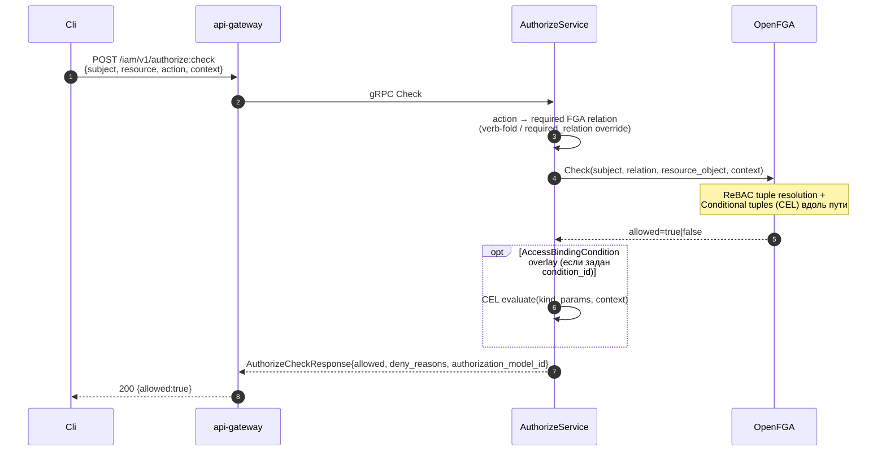

# 19. AuthorizeService (Public Check)

## Назначение

**Public AuthorizeService** — synchronous, high-throughput, cache-friendly
endpoint, через который любой клиент (UI / CLI / другие сервисы) может
проверить «может ли subject X выполнить action A над resource R?».

Это **request-time** authorization (policy-simulation API: проверка решения
без выполнения действия). Реальные kacho-vpc / kacho-compute /
kacho-loadbalancer вызывают на per-RPC gate НЕ его, а
`InternalIAMService.Check` (см. [`21-internal-iam.md`](21-internal-iam.md));
AuthorizeService — для явных tenant-facing запросов (UI permission-preview,
SDK `auth_simulate`-хелперы).

Под капотом — pipeline:

1. **action → relation** — verb-fold (`get`/`list` → `viewer`,
   `create`/`update` → `editor`, `delete` → `admin`) либо явный
   `required_relation`-override (`authzmap`).
2. **OpenFGA Check** — REBAC tuple resolution + Conditional tuples (CEL)
   вдоль resolution-path (см. [`09-conditions.md`](09-conditions.md)).

FGA — единственный policy-gate; deny возвращает `deny_reasons` (какие
conditions не прошли).

**Use-cases:**
- UI: «show only resources, на которых caller может Read».
- Сторонняя интеграция: «может ли SA `sva_ci` Deploy на этот project?».
- Pre-flight check перед более дорогой операцией.

**Ограничения:**
- Sync (нет Operation envelope) — read-only RPC.
- Fail-closed: OpenFGA недоступен → Unavailable.
- ListObjects опционально (gate `KACHO_AUTHZ_LISTOBJECTS=on`).

## API surface

### Public gRPC (порт 9090) — AuthorizeService

| RPC               | Sync/Async | Описание                                                          |
|-------------------|------------|-------------------------------------------------------------------|
| `Check`           | sync       | Bool allow/deny + `deny_reasons`.                                |
| `BatchCheck`      | sync       | До 100 проверок в одном RPC; per-item результат в порядке запроса. |
| `ListObjects`     | sync       | Все объекты типа T, на которых subject имеет relation R. Гейт `KACHO_AUTHZ_LISTOBJECTS=on`. |
| `ListSubjects`    | sync       | Inverse: все subjects с action на ресурсе (admin-UI «who can access»). |
| `ExpandRelations` | sync       | Zanzibar userset-tree для (resource, relation) — audit/explain.   |
| `WhoAmI`          | sync       | Identity + permission-snapshot caller'а (UI bootstrap).           |

### Request shape

```protobuf
message AuthorizeCheckRequest {
  string subject = 1;                  // "user:usr_alice"
  ResourceRef resource = 2;            // {type:"project", id:"prj_yyy"}
  string action = 3;                   // "compute.instance.create"
  google.protobuf.Struct context = 4;  // {acr_value, amr_claims, mfa_at, client_ip, device_attestation, ...}
  string trace_id = 5;                 // correlation id
  string required_relation = 6;        // explicit FGA relation override
}
message AuthorizeCheckResponse {
  bool allowed = 1;
  repeated string deny_reasons = 2;    // ["mfa_fresh: acr=2 (need 3)"] | ["no path"]
  string authorization_model_id = 3;   // pinned model id (forensics)
  google.protobuf.Timestamp checked_at = 4;
}
```

### REST mapping

| HTTP | Path                                | gRPC mapping                       |
|------|-------------------------------------|------------------------------------|
| POST | `/iam/v1/authorize:check`           | `AuthorizeService.Check`           |
| POST | `/iam/v1/authorize:batchCheck`      | `AuthorizeService.BatchCheck`      |
| POST | `/iam/v1/authorize:listObjects`     | `AuthorizeService.ListObjects`     |
| POST | `/iam/v1/authorize:listSubjects`    | `AuthorizeService.ListSubjects`    |
| POST | `/iam/v1/authorize:expandRelations` | `AuthorizeService.ExpandRelations` |
| GET  | `/iam/v1/me`                        | `AuthorizeService.WhoAmI`          |

## Sequence diagram — Check pipeline



## Конфигурация

| Env var                                 | Default                       | Описание                                  |
|-----------------------------------------|-------------------------------|-------------------------------------------|
| `KACHO_IAM_OPENFGA_ENDPOINT`            | `kacho-umbrella-openfga:8080` | URL OpenFGA HTTP.                         |
| `KACHO_IAM_OPENFGA_STORE_ID`            | —                             | Store id. Без него Check → Unavailable.   |
| `KACHO_IAM_OPENFGA_MODEL_ID`            | —                             | Model id (опционально pin).               |
| `KACHO_IAM_FGA_CHECK_TIMEOUT_MS`        | 200                           | Per-Check timeout.                        |
| `KACHO_IAM_FGA_LIST_OBJECTS_TIMEOUT_MS` | 1000                          | ListObjects timeout.                      |
| `KACHO_AUTHZ_LISTOBJECTS`               | `off`                         | `on` → enable ListObjects RPC.            |

## Как пользоваться

```bash
# Check.
curl -X POST http://localhost:18080/iam/v1/authorize:check \
  -H "Authorization: Bearer $TOKEN" \
  -d '{
    "subject":"user:usr_alice",
    "resource":{"type":"project","id":"prj_yyy"},
    "action":"compute.instance.create",
    "context":{"mfa_at":"2026-05-25T10:00:00Z","client_ip":"10.0.0.1"}
  }'
# → {allowed:true, deny_reasons:[], authorization_model_id:"01HXXXX..."}

# ListObjects (если включено).
curl -X POST http://localhost:18080/iam/v1/authorize:listObjects \
  -H "Authorization: Bearer $TOKEN" \
  -d '{
    "subject":"user:usr_alice",
    "resource_type":"project",
    "action":"iam.project.get"
  }'
# → {resource_ids:["prj_a","prj_b",...]}
```

### Типичные ошибки

| Сценарий                          | gRPC code             | HTTP | Текст                                          |
|-----------------------------------|------------------------|------|------------------------------------------------|
| OpenFGA недоступен                | `UNAVAILABLE`          | 503  | `openfga client error: connection refused`     |
| Action не найден в map            | `INVALID_ARGUMENT`     | 400  | `Illegal argument action: unknown`             |
| Subject пустой                    | `INVALID_ARGUMENT`     | 400  | `Illegal argument subject: required`           |
| ListObjects отключен              | `UNIMPLEMENTED`        | 501  | `ListObjects not enabled`                      |

## Подробности реализации

- **Service:** `internal/service/authorize_service.go`.
- **Handler:** `internal/apps/kacho/api/authorize/handler.go`.
- **OpenFGA client:** `internal/clients/openfga_client.go` + extensions
  (`openfga_check.go`, `openfga_list.go`).
- **authzmap:** `internal/authzmap/permissions_to_relations.go` +
  verb-fold relation resolution.

## Связанные компоненты

- [`20-internal-authorize.md`](20-internal-authorize.md) — peer-call FGA writer.
- [`21-internal-iam.md`](21-internal-iam.md) — backend сервисы зовут internal-вариант.
- [`09-conditions.md`](09-conditions.md) — Conditions overlay.
- [`29-openfga-check.md`](29-openfga-check.md) — propagation chain.

## Ссылки на код

- `internal/service/authorize_service.go`
- `internal/apps/kacho/api/authorize/handler.go`
- `internal/clients/openfga_*.go`
- `internal/authzmap/`
