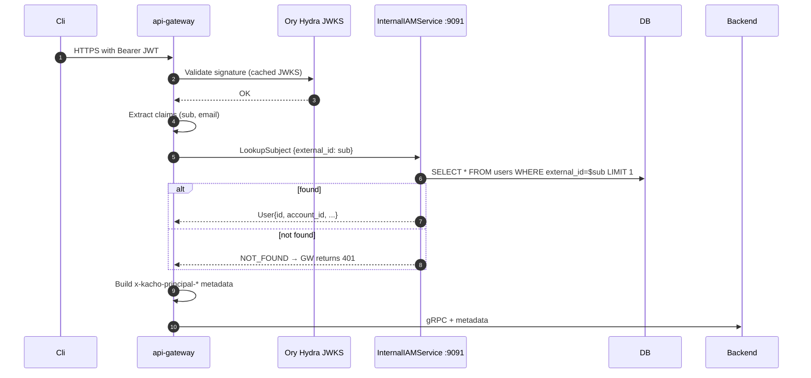
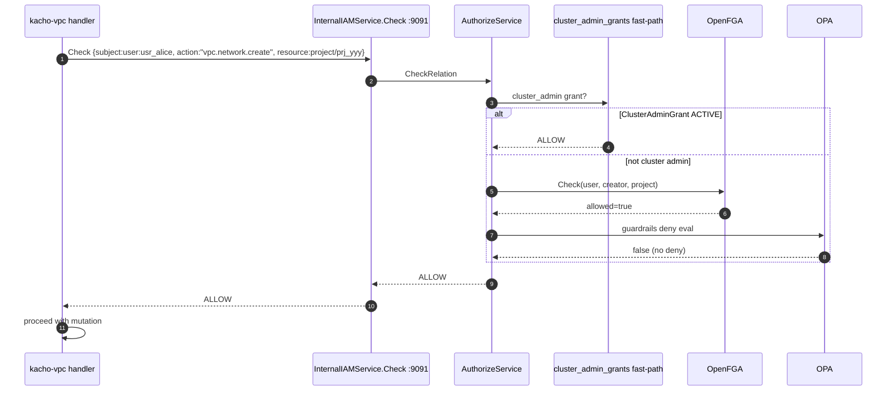
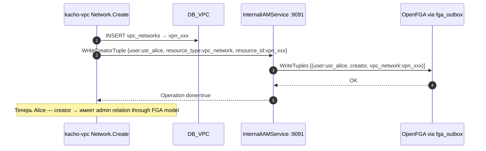

# 21. InternalIAMService

## Назначение

**InternalIAMService** — основной internal-only RPC, через который **все
остальные** Kachō-сервисы (api-gateway, kacho-vpc, kacho-compute,
kacho-loadbalancer) общаются с kacho-iam:

- `LookupSubject(by external_id | id | email)` — api-gateway auth-interceptor
  ищет User/SA по subject из JWT.
- `UpsertFromIdentity(external_id, email, ...)` — OIDC-callback создает /
  обновляет User row.
- `Check(subject, action, resource)` — per-RPC authorization gate (как и
  AuthorizeService.Check, но с Cascade fast-path и principal-prop).
- `ListPermissions` — catalog-mode listing (все permissions из IAM-domain).
- `PollSubjectChanges(since_id, limit)` — для api-gateway authz-cache
  invalidation poll (см. [`29-openfga-check.md`](29-openfga-check.md)).
- `WriteCreatorTuple(user, resource_type, resource_id)` — post-creation
  FGA-tuple emit для vpc/compute/nlb.

**Use-cases:**
- api-gateway: validate JWT → LookupSubject → resolve principal → propagate to backend.
- kacho-vpc: per-RPC authz gate через Check.
- kacho-compute: after-Create → WriteCreatorTuple для нового instance.

**Ограничения:**
- Internal-only (запрет #6).
- gRPC-direct (не через api-gateway restmux — loop-prevention).
- `Check` делегирует AuthorizeService (тот же FGA + OPA pipeline).

## API surface (internal, порт 9091)

| RPC                     | Sync/Async       | Описание                                        |
|-------------------------|------------------|-------------------------------------------------|
| `LookupSubject`         | sync             | Find User/SA by external_id | id | email.        |
| `UpsertFromIdentity`    | async (sync-LRO) | Create/update User (+ bootstrap Account/Project)|
| `Get`                   | sync             | Admin Get User.                                 |
| `Check`                 | sync             | per-RPC authz gate (Cascade + FGA + OPA).       |
| `ListPermissions`       | sync             | Catalog all permissions (debug).                |
| `PollSubjectChanges`    | sync             | Drain subject_change_outbox (since_id ledger).  |
| `WriteCreatorTuple`     | async (sync-LRO) | Post-create hierarchy tuple emit (kacho-vpc/compute peer-call). |

## Sequence diagram — LookupSubject (api-gateway flow)



## Sequence diagram — Check (peer-call от kacho-vpc)



## Sequence diagram — WriteCreatorTuple (kacho-vpc post-create)



## Конфигурация

Использует те же OpenFGA env vars, что и AuthorizeService
(см. [`19-authorize.md`](19-authorize.md)).

## Как пользоваться

```bash
kubectl -n kacho port-forward svc/kacho-iam 9091:9091 &

# LookupSubject by external_id (OIDC sub from Ory).
grpcurl -plaintext -d '{"external_id":"ory-sub-xyz"}' localhost:9091 \
  kacho.cloud.iam.v1.InternalIAMService/LookupSubject

# Check.
grpcurl -plaintext -d '{
  "subject":"user:usr_alice","action":"vpc.network.create","resource":{"type":"project","id":"prj_yyy"}
}' localhost:9091 kacho.cloud.iam.v1.InternalIAMService/Check

# UpsertFromIdentity (api-gateway после OIDC).
grpcurl -plaintext -d '{
  "external_id":"ory-sub-xyz","email":"alice@example.com","display_name":"Alice"
}' localhost:9091 kacho.cloud.iam.v1.InternalIAMService/UpsertFromIdentity

# WriteCreatorTuple (peer-call от vpc).
grpcurl -plaintext -d '{
  "user_id":"usr_alice","resource_type":"vpc_network","resource_id":"vpn_xxx"
}' localhost:9091 kacho.cloud.iam.v1.InternalIAMService/WriteCreatorTuple

# PollSubjectChanges (api-gateway cache invalidation poll).
grpcurl -plaintext -d '{"since_id":0,"limit":100}' localhost:9091 \
  kacho.cloud.iam.v1.InternalIAMService/PollSubjectChanges
```

## Подробности реализации

- **Handler:** `internal/apps/kacho/api/internal_iam/handler.go`.
- **LookupSubject:** `lookup_subject.go`.
- **ListPermissions:** `list_permissions.go` (читает из embedded permissions
  catalog).
- **Check delegation:** narrow port `authorizer` over `*service.AuthorizeService`.
- **PollSubjectChanges:** narrow port `subjectChanger` over `*service.SubjectChangeService`.
- **WriteCreatorTuple:** narrow port `fgaWriter` over `*clients.OpenFGAHTTPClient`.
- **Auth-interceptor:** реализован на стороне api-gateway (валидация JWT +
  propagation principal в backend).

## Gotchas / известные ограничения

- **gRPC-direct, не restmux** — иначе loop через api-gateway.
- **LookupSubject — hot-path** — рекомендуется api-gateway cache на ~30s.
- **WriteCreatorTuple — best-effort** — failure НЕ rollback'ит Create в
  vpc/compute (peer-call после COMMIT); потеря tuple восстанавливается
  через fgahook backfill (см. [`28-fgahook.md`](28-fgahook.md)).
- **Check без principal context** — caller обязан передать subject параметром.

## Связанные компоненты

- [`03-user.md`](03-user.md) — User mirror.
- [`19-authorize.md`](19-authorize.md) — Public Check.
- [`28-fgahook.md`](28-fgahook.md) — sister mechanism для post-commit.
- [`29-openfga-check.md`](29-openfga-check.md) — subject_change push chain.

## Ссылки на код

- `internal/apps/kacho/api/internal_iam/handler.go`, `lookup_subject.go`, `list_permissions.go`
- `internal/service/authorize_service.go`, `subject_change_service.go`
- `internal/clients/openfga_client.go`
