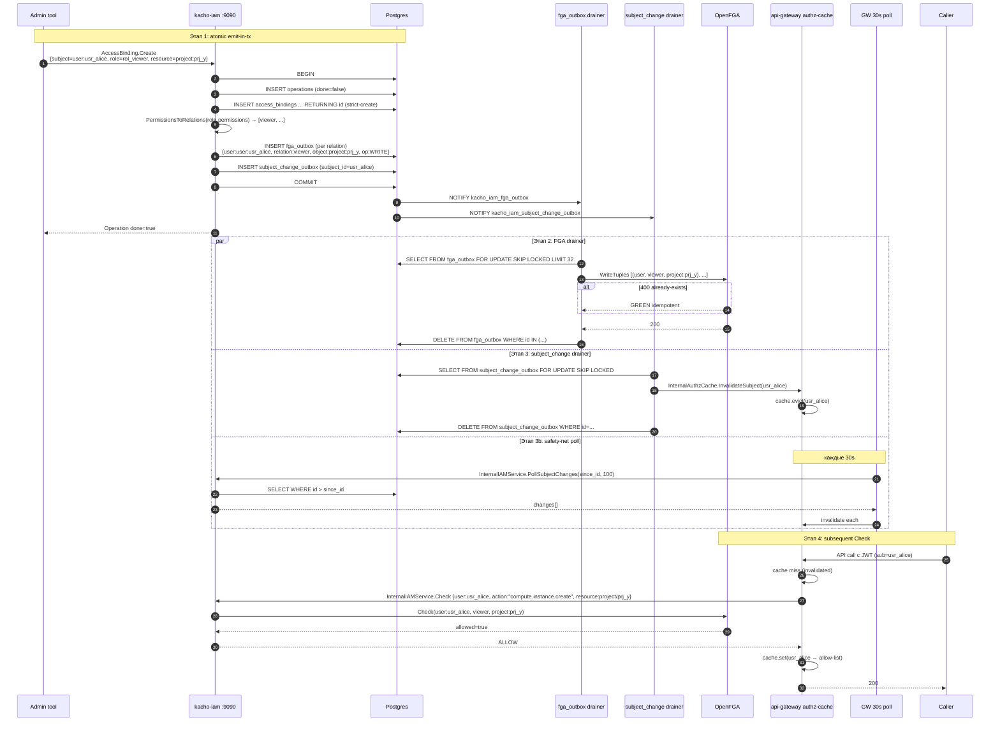

# 29. OpenFGA Check + fga_outbox + Atomic Propagation Chain

## Назначение

Это самый важный cross-cutting flow: **как именно** AccessBinding.Create
превращается в `allowed=true` для последующего Check'а на затронутый scope.
Полный pipeline — 4 этапа, latency budget — **sub-second**:

1. **AccessBinding.Create — atomic emit-in-tx**: INSERT binding + INSERT
   fga_outbox + INSERT subject_change_outbox в одной writer-tx.
2. **fga_outbox drainer**: применяет tuples к OpenFGA через corelib generic
   `outbox/drainer` (LISTEN/NOTIFY + poll-fallback).
3. **subject_change_outbox drainer**: пушит invalidate в api-gateway
   `InternalAuthzCacheService.InvalidateSubject` (или 30s safety-net poll).
4. **Subsequent Check**: cache miss → OpenFGA Check (с новыми tuples) →
   ALLOW.

**Use-cases:**
- AccessBinding.Create → user сразу может делать API calls (через sub-second).
- Cluster-admin grant → виден всеми сервисами немедленно.

**Ограничения:**
- Sub-second latency не гарантируется при network partition / OpenFGA down.
- Worst-case 30s convergence через poll-fallback.
- При FGA outage tuples накапливаются в fga_outbox до restart.

## DB tables

- `kacho_iam.fga_outbox(id, user, relation, object, op, created_at)` — миграция 0001:769.
- `kacho_iam.subject_change_outbox(id, subject_id, change_type, created_at, ledger_id)` — миграция 0001:1159.
- Каждая со своим `NOTIFY` channel: `kacho_iam_fga_outbox`, `kacho_iam_subject_change_outbox`.

## Sequence diagram — полный propagation chain



## Sequence diagram — degraded mode (OpenFGA недоступен)

```mermaid
sequenceDiagram
    participant IAM
    participant DB
    participant Drainer
    participant FGA as OpenFGA (down)

    IAM->>DB: BEGIN; INSERT binding; INSERT fga_outbox; COMMIT
    Note over IAM,DB: Binding committed успешно
    Drainer->>FGA: WriteTuples → 5xx / connection refused
    Drainer->>Drainer: backoff exponential (1s → 2s → 4s → ... → 30s)
    Note over Drainer: rows остаются в fga_outbox<br/>(до восстановления)
    Note over IAM,DB: Subsequent Check без FGA → Unavailable
    Note over Drainer,FGA: FGA recovers → drainer applies queued
```

## Конфигурация drainer'ов

| Env var (corelib drainer)              | Default | Описание                                    |
|----------------------------------------|---------|---------------------------------------------|
| (`drainer.Config.BatchSize`)           | 32      | Batch на iteration.                         |
| (`drainer.Config.PollFallback`)        | 30s     | Если NOTIFY не приходит — poll.            |
| (`drainer.Config.MaxAttempts`)         | 10      | Retry на row.                               |
| (`drainer.Config.BackoffMin/Max`)      | 1s/30s  | Exponential backoff.                        |
| (`drainer.Config.ApplyTimeout`)        | 5s      | Per-apply timeout.                          |

OpenFGA-specific timeouts:

| Env var                                | Default | Описание                                    |
|----------------------------------------|---------|---------------------------------------------|
| `KACHO_IAM_FGA_CHECK_TIMEOUT_MS`       | 200     | На каждый Check.                            |
| `KACHO_IAM_FGA_LIST_OBJECTS_TIMEOUT_MS`| 1000    | ListObjects.                                |
| `KACHO_IAM_FGA_WRITE_TIMEOUT_MS`       | 1000    | Write tuples (write + delete).              |

## Latency budget

| Этап                               | Target    | Worst-case          |
|------------------------------------|-----------|---------------------|
| 1. emit-in-tx commit               | < 10ms    | < 100ms             |
| 2. fga_outbox drain → OpenFGA      | < 100ms   | 30s (poll fallback) |
| 3. subject_change drain → GW       | < 50ms    | 30s (safety-net poll)|
| 4. GW cache miss → FGA Check       | < 50ms    | < 500ms             |
| **Total Create → effective Check** | **< 200ms** | **30s (degraded)** |

## Подробности реализации

### Этап 1 (atomic emit-in-tx)

`access_binding/create.go` использует
`writerSession.AccessBindingsW().EmitFGAWrite(ctx, tuples)` внутри
writer-tx — это INSERT в `fga_outbox`. Аналогично `EmitSubjectChange()`.

### Этап 2 (fga_outbox drainer)

`cmd/kacho-iam/serve.go`:

```go
fgaDrainer, _ := drainer.New[clients.FGAOutboxEvent](
    pool,
    drainer.Config{Table:"kacho_iam.fga_outbox", Channel:"kacho_iam_fga_outbox", ...},
    clients.DecodeFGAOutboxEvent,
    clients.NewFGAApplier(svcs.fgaClient),
    logger,
)
```

`clients.FGAApplier` применяет write / delete tuple-операции per row;
idempotent на 400 already-exists / 400 cannot-delete.

### Этап 3 (subject_change drainer)

`cmd/kacho-iam/subject_change_wiring.go`:

```go
buildSubjectChangeDrainer(ctx, pool, logger) → task
```

Реализация: `internal/clients/cache_invalidation_applier.go` —
HTTP/gRPC call в api-gateway `InternalAuthzCacheService.InvalidateSubject`.

### Этап 3b (safety-net poll)

`InternalIAMService.PollSubjectChanges(since_id, limit)` возвращает
events с `id > since_id` — api-gateway держит ledger.

## Gotchas / известные ограничения

- **Outbox tables можно засрать** при долгом FGA outage — мониторить
  `count(*) FROM fga_outbox WHERE created_at < now() - interval '5min'`.
- **subject_change_outbox не каскадит на удаление user'а** — «осиротевшие»
  invalidate-события безвредны (invalidate несуществующего subject — no-op).
- **fga_outbox failure → tuples not applied** — но binding закоммичен;
  Check на этом ресурсе вернет deny до восстановления.
- **drainer concurrency** — `FOR UPDATE SKIP LOCKED` гарантирует, что
  два worker'а не возьмут один row; параллельный scale-out безопасен.

## Связанные компоненты

- [`08-access-binding.md`](08-access-binding.md) — emit producer.
- [`19-authorize.md`](19-authorize.md) — Public Check consumer.
- [`21-internal-iam.md`](21-internal-iam.md) — InternalIAMService.Check + PollSubjectChanges.
- [`32-observability.md`](32-observability.md) — metrics fga-drainer-lag, etc.

## Ссылки на код

- `internal/clients/fga_applier.go`, `fga_outbox/` package
- `internal/clients/cache_invalidation_applier.go`
- `internal/repo/kacho/pg/subject_change_emitter.go`, `subject_change_repo.go`, `fga_outbox_emitter.go`
- `cmd/kacho-iam/serve.go` (fga drainer wiring)
- `cmd/kacho-iam/subject_change_wiring.go`
- `internal/migrations/0001_initial.sql:769-803, 1159-1198`
- `kacho-corelib/outbox/drainer/`
