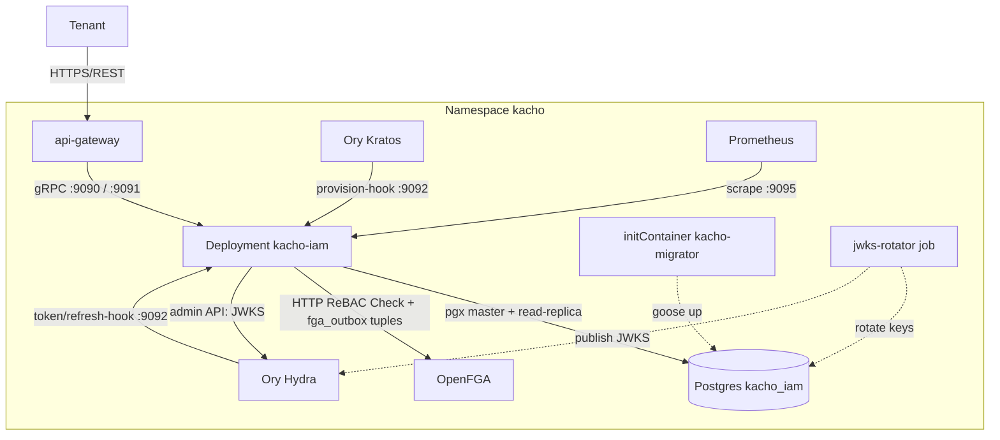
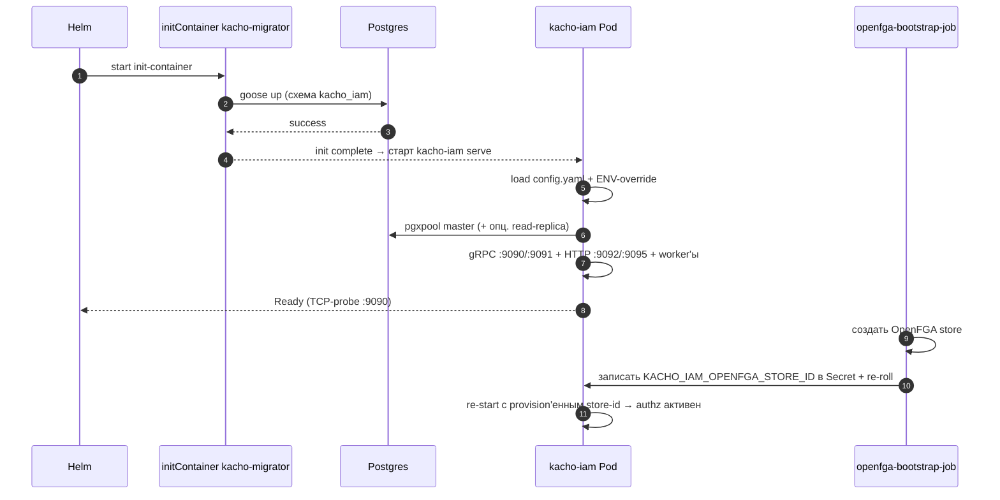

# 31. Deployment Guide

## Назначение

Гайд по развертыванию `kacho-iam`: образ и бинарники, listener-порты,
helm-chart, config + секреты, миграции и порядок запуска. Все факты сверены
с `deploy/` и `cmd/kacho-iam/`.

## Состав образа

Один контейнерный образ несет три бинарника:

| Бинарник | Назначение |
|---|---|
| `kacho-iam` | gRPC API-сервер (`serve`) — основной процесс Deployment'а |
| `kacho-migrator` | CLI миграций БД (`up`/`down`/`status`/`create`), запускается init-контейнером |
| `jwks-rotator` | ротация OIDC JWKS-ключей подписи (`once`/`daemon`), отдельный scheduled-job |

`kacho-iam` обслуживает только `serve` — миграции вынесены в отдельный
`kacho-migrator` (cmd-binary не смешивает обязанности). Попытка
`kacho-iam migrate ...` падает с подсказкой использовать `kacho-migrator`.

## Listener-порты

`kacho-iam serve` поднимает четыре независимых listener'а:

| Порт | Протокол | Назначение | TLS |
|---|---|---|---|
| `:9090` | gRPC | публичный API (tenant-facing, через api-gateway) | per-edge TLS; обязателен в production |
| `:9091` | gRPC | cluster-internal API (`Internal*`, service→service) | `RequireAndVerifyClientCert`; обязателен в production |
| `:9092` | HTTP | webhooks Ory (Hydra `token`/`refresh`, Kratos `provision`) + `/healthz`, `/readyz` | per-edge, server-TLS опционально |
| `:9095` | HTTP | Prometheus `/metrics` | per-edge, server-TLS опционально |

Порты конфигурируемы (`api-server.endpoint`, `api-server.internal-endpoint`,
`authn.hooks-http-endpoint`, `api-server.metrics-endpoint`); значения в таблице —
дефолты. `/metrics` живет на отдельном cluster-internal порту, а не на публичной
gRPC-поверхности — иначе утекла бы внутренняя кардинальность метрик.

### Сервисы по listener'ам

**Публичный `:9090`** (`registerPublicServices`): `OperationService`,
`AccountService`, `ProjectService`, `UserService`, `ServiceAccountService`,
`GroupService`, `RoleService`, `AccessBindingService`, `AuthorizeService`
(PDP: `Check`/`ListObjects`/`ListSubjects`), `ConditionsService` (CEL ABAC
overlay), `PermissionCatalogService` (grantable `<module>.<resource>.<verb>`
taxonomy), `SAKeyService` (SA OAuth-ключи через Ory Hydra).

**Internal `:9091`** (`registerInternalServices`, только cluster-internal —
запрет #6): `InternalIAMService` (`Check` + `RegisterResource`/`UnregisterResource`
fgaproxy owner-tuples), `InternalAuthorizeService`, `InternalClusterService`
(cluster-admin gранты — time-bombed/permanent), `InternalUserService`
(`UpsertFromIdentity`), `InternalOperationsService`,
`InternalSessionRevocationsService`. `AuthorizeService` дополнительно
регистрируется и здесь — чтобы consumer'ы (vpc/compute/nlb) звали `ListObjects`
по уже доверенному mTLS-ребру `:9091`, не открывая отдельный публичный коннект.

**HTTP `:9092`** (`iamhooks`): `POST /iam/v1/hooks/token`,
`POST /iam/v1/hooks/refresh` (Hydra OAuth2-хуки), `POST /iam/v1/hooks/provision`
(Kratos registration/login → `UpsertFromIdentity`), `GET /healthz` (liveness),
`GET /readyz` (readiness — ping БД + готовность LRO-worker'а).

## Архитектура deployment'а

`kacho-iam` — Deployment в namespace `kacho` (одна реплика на dev-стенде,
несколько на production).



## Helm-chart

Chart лежит в `deploy/` (под-chart umbrella-релиза `kacho-deploy`). Шаблоны:
`templates/deployment.yaml`, `templates/configmap.yaml`, `templates/service.yaml`.

```bash
helm upgrade --install iam ./deploy -n kacho --create-namespace \
  --values deploy/values.yaml \
  --values deploy/values.dev.yaml      # dev-overlay для kind-стенда
```

`deploy/values.yaml` (база):

```yaml
name: iam
replicas: 1
image: kacho-iam:dev
imagePullPolicy: IfNotPresent
ports:
  grpc: 9090
  internalGrpc: 9091
  metrics: 9095
db:
  host: kacho-umbrella-pg-iam
  port: "5432"
  user: iam
  name: kacho_iam
  passwordSecretName: kacho-umbrella-pg-iam
  passwordSecretKey: password
logger:
  level: INFO
apiServer:
  gracefulShutdown: 10s
metrics:
  enable: true
healthcheck:
  enable: true
repository:
  postgres:
    maxConns: 50
    sslMode: disable
authn:
  mode: dev
```

`templates/deployment.yaml` запускает init-контейнер `migrate`
(`kacho-migrator up`) перед основным контейнером `iam` (`kacho-iam serve`).
Pod hardened: `runAsNonRoot` (uid 65532), `readOnlyRootFilesystem`,
`drop: ["ALL"]`, `seccompProfile: RuntimeDefault`. Readiness/liveness — TCP-probe
на gRPC-порт. `Service` публикует `grpc` (9090) и `grpc-internal` (9091).

База chart'а — dev-профиль для локального kind-стенда (`authn.mode: dev`,
`sslMode: disable`, mTLS выключен). Production-деплой обязан переопределить:
`authn.mode: production` (или `production-strict`), включить server-side mTLS
обоих gRPC-listener'ов (иначе `kacho-iam` fail-fast'ит на старте и отказывается
подниматься на незащищенных `:9090`/`:9091`), задать `sslMode: require` (или
`verify-full`) и подключить OpenFGA.

## Config + ENV-override

`kacho-iam` читает YAML-config из `/etc/kacho-iam/config.yaml` (рендерится
`templates/configmap.yaml`). Любой ключ переопределяется ENV по схеме
`KACHO_IAM_<SECTION>__<KEY>` (двойное подчеркивание между секцией и ключом).
Отрендеренный config:

```yaml
logger:
  level: INFO

api-server:
  endpoint: "tcp://0.0.0.0:9090"
  internal-endpoint: "tcp://0.0.0.0:9091"
  metrics-endpoint: "tcp://0.0.0.0:9095"   # дефолт; через configmap не рендерится
  graceful-shutdown: "10s"

metrics:
  enable: true
healthcheck:
  enable: true

repository:
  type: POSTGRES
  postgres:
    url: "postgres://iam@kacho-umbrella-pg-iam:5432/kacho_iam"
    slave-url: ""                  # опц. read-replica; пусто → Reader-TX на master
    max-conns: 50
    ssl-mode: disable
    password-from-env: KACHO_IAM_DB_PASSWORD

authn:
  mode: dev                        # dev | production | production-strict
  domain: api.kacho.cloud
  hydra-issuer: ""                 # пусто → выводится из domain
  hook-shared-secret-env: KACHO_IAM_HOOK_TOKEN
  jwks-encryption-key-hex-env: KACHO_IAM_JWKS_ENC_KEY
  jwks-rotation-days: 90
  session-revocations-cache-ttl-seconds: 5
  hooks-http-endpoint: "tcp://0.0.0.0:9092"
```

`authn.mode` безопасен по умолчанию (`production` в дефолтах кода —
anonymous fail-closed); dev-стенд явно опускает его до `dev` через
`values.dev.yaml`. DSN автоматически дополняется `sslmode=<mode>` и
`options=-c search_path=kacho_iam,public`.

### Секреты и env-переменные

Секреты не кладутся в YAML/ConfigMap — только через `secretKeyRef` и
`password-from-env`-мост:

| ENV | Назначение |
|---|---|
| `KACHO_IAM_DB_PASSWORD` | пароль Postgres (`password-from-env`) |
| `KACHO_IAM_OPENFGA_STORE_ID` | OpenFGA store-id (provision'ится bootstrap-job'ом; пусто → authz fail-closed) |
| `KACHO_IAM_OPENFGA_MODEL_ID` | опц. pinned authorization-model id |
| `KACHO_IAM_OPENFGA_ENDPOINT` | адрес OpenFGA (дефолт `kacho-umbrella-openfga:8080`) |
| `KACHO_IAM_AUTHZ_PROVIDER` | бэкенд authz (дефолт `openfga`; неизвестный → fail-closed) |
| `KACHO_IAM_HOOK_TOKEN` | shared secret HMAC для Ory-webhooks |
| `KACHO_IAM_JWKS_ENC_KEY` | 32-байтный AES-GCM ключ (hex) для шифрования private JWKS в БД |
| `KACHO_IAM_HYDRA_ADMIN_TOKEN` | Bearer для Hydra admin API (опц.) |
| `KACHO_IAM_BOOTSTRAP_ROOT_EMAIL` | если задан — bootstrap-admin reconciler выдает `system_admin@cluster` этому юзеру (опц.) |

OpenFGA-параметры читаются напрямую из `KACHO_IAM_OPENFGA_*` в composition root
(`cmd/kacho-iam/env.go`). Per-операционные таймауты FGA — `KACHO_IAM_FGA_CHECK_TIMEOUT_MS`
/ `KACHO_IAM_FGA_LIST_OBJECTS_TIMEOUT_MS` / `KACHO_IAM_FGA_WRITE_TIMEOUT_MS`.

## Внешние зависимости

- **Postgres** (`kacho_iam`) — master-pool обязателен; read-replica (`slave-url`)
  опциональна (CQRS Reader-TX, иначе fallback на master).
- **OpenFGA** — ReBAC `Check` + sync owner/grant-tuple'ов через `fga_outbox`
  drainer. Store-id provision'ится отдельным openfga-bootstrap-job'ом, который
  пишет id в Secret и пере-роллит Deployment; до этого момента клиент честно
  fail-closed'ит (deny).
- **Ory Kratos** — identity-provider; `provision`-хук создает/активирует
  Account/Project/AccessBinding для нового identity (`UpsertFromIdentity`).
- **Ory Hydra** — OAuth2/OIDC; `token`/`refresh`-хуки обогащают claims и проверяют
  ревокации; admin API публикует ротируемые JWKS.

## In-process worker'ы

`kacho-iam serve` поднимает фоновые задачи параллельно с listener'ами; падение
критичной задачи триггерит graceful-shutdown всего пода:

- **LRO worker** (`operations`-таблица из corelib) — async-исполнение мутаций +
  orphan-reconciler, добивающий осиротевшие `done=false` операции умершего процесса.
- **`fga_outbox` drainer** — LISTEN/NOTIFY по `kacho_iam_fga_outbox`; применяет
  записанные в writer-tx tuple'ы в OpenFGA (идемпотентно, retry на 5xx).
- **`subject_change_outbox` drainer** — push `InvalidateSubject` на internal-порт
  api-gateway, убирая окно сходимости poll-инвалидации кэша.
- **bootstrap-admin reconciler** — повторяет выдачу `system_admin@cluster`, пока
  user-mirror не появится (best-effort, non-fatal; no-op без env).
- **resource-scoped AccessBinding reconciler** — membership label-selector'ов +
  containment + истечение TTL-грантов.

## Миграции

Миграции исполняет отдельный `kacho-migrator` (init-контейнер
`templates/deployment.yaml`), а не основной бинарник. Схема — `kacho_iam`,
набор goose-миграций (`internal/migrations/0001_initial.sql` и далее по
возрастанию).

```bash
# Применить до latest.
kacho-migrator up

# Статус (applied / pending).
kacho-migrator status

# Откат на одну версию назад.
kacho-migrator down

# Источник DSN: --dsn > ENV KACHO_MIGRATOR_DSN > viper-config kacho-iam.
KACHO_IAM_DB_PASSWORD=secret kacho-migrator up
```

## JWKS-ротация

`jwks-rotator` — отдельный бинарник для ротации ключей подписи OIDC JWKS
(хранятся зашифрованными в БД, публичная часть публикуется в Hydra). Запускается
как scheduled-job:

```bash
jwks-rotator once      # один цикл ротации (для CronJob-тика)
jwks-rotator daemon    # long-running, daily-tick с jitter
```

Конфигурируется теми же ENV, что `kacho-iam serve`
(`KACHO_IAM_DB_URL`/`KACHO_IAM_DB_PASSWORD`/`KACHO_IAM_JWKS_ENC_KEY`/
`KACHO_IAM_HYDRA_ADMIN_TOKEN`/`KACHO_IAM_JWKS_ROTATION_DAYS`). HA-safe:
внутри `Rotate` — per-alg advisory-lock, параллельные поды безопасны.

## Порядок запуска



## Smoke-проверки

```bash
# 1. Pod готов.
kubectl -n kacho rollout status deployment/iam --timeout=60s

# 2. Liveness / readiness на hooks-порту.
kubectl -n kacho exec deploy/iam -- wget -qO- http://localhost:9092/healthz
kubectl -n kacho exec deploy/iam -- wget -qO- http://localhost:9092/readyz

# 3. gRPC reflection публичного API (через api-gateway).
kubectl -n kacho port-forward svc/api-gateway 18080:8080 &
grpcurl -plaintext localhost:18080 list | grep kacho.cloud.iam.v1

# 4. Bootstrap-юзер через UpsertFromIdentity (internal-порт).
kubectl -n kacho port-forward svc/iam 9091:9091 &
grpcurl -plaintext -d '{"external_id":"bootstrap-admin","email":"admin@kacho.cloud","display_name":"bootstrap"}' \
  localhost:9091 kacho.cloud.iam.v1.InternalUserService/UpsertFromIdentity
```

## Связанные компоненты

- [`32-observability.md`](32-observability.md) — метрики (`:9095`), логи, алерты.
- [`33-runbook.md`](33-runbook.md) — реакция на инциденты.
- `deploy/` — helm-chart (`values.yaml`, `templates/`).

## Ссылки на код

- `cmd/kacho-iam/{main,serve,wiring,env,grpc_register,hooks_mux,subject_change_wiring}.go`
- `cmd/migrator/main.go`, `cmd/jwks-rotator/main.go`
- `internal/apps/kacho/config/`
- `internal/migrations/0001_initial.sql`
- `deploy/Chart.yaml`, `deploy/values.yaml`, `deploy/templates/`
- `Dockerfile`, `Makefile`
