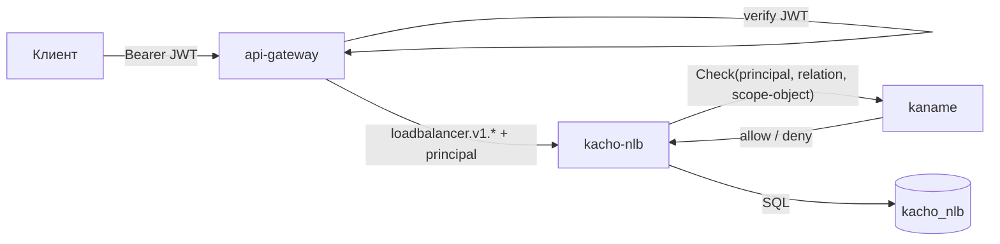

# Авторизация

Эта страница описывает модель доступа Kachō NLB: per-RPC authz-Check через kaname на **обоих**
listener'ах, verb-bearing отношения, scope-filtered List и регистрацию владения в kaname.
Общий обзор устройства сервиса — на странице [Архитектура](/architecture/overview).

## AuthN + AuthZ на каждом запросе

Инвариант платформы: **никаких неаутентифицированных и неавторизованных запросов** — ни на
public, ни на internal порту.

- **AuthN** — на edge через `api-gateway` проверяется **JWT** (`Authorization: Bearer`);
  service→service транспорт — **mTLS** (verified client-cert). Internal `:9091` не освобождён:
  mTLS обязателен.
- **AuthZ** — каждый RPC (public и internal) проходит per-RPC `InternalIAMService.Check` в
  kaname. Internal-периметр **не считается доверенным**
  (defense-in-depth против lateral movement).

## Verb-bearing отношения

Каждый RPC в proto несёт аннотации `permission`, `required_relation` и `scope_extractor` (по
какому объекту и его типу проверять доступ). Отношения — **verb-bearing** (развязаны с общим
tier'ом): доступ к конкретному действию проверяется точечно.

| Действие | required_relation | scope-объект |
|---|---|---|
| `Get`, `GetTargetStates` | `v_get` | сам ресурс (`nlb_network_load_balancer` / `nlb_listener` / `nlb_target_group`) |
| `ListOperations` | `v_list` | сам ресурс |
| `Update`, `Start`, `Stop`, `Move`, `Attach…`/`Detach…`, `Add…`/`Remove…` | `v_update` | сам ресурс |
| `Delete` | `v_delete` | сам ресурс |
| `Create` | `editor` | родитель: `project` (NLB, TargetGroup) или `nlb_network_load_balancer` (Listener) |

Для `Create` листенера scope — **родительский балансировщик**, а не проект: `nlb_listener`
наследует доступ от `nlb_network_load_balancer` (иерархия tuple
`nlb_listener#load_balancer@nlb_network_load_balancer:<lb_id>`).

Нет нужного отношения → `PERMISSION_DENIED` (HTTP 403). Недоступность kaname на request-path
→ `UNAVAILABLE` (fail-closed).

## Scope-filtered List

`List`-RPC всех трёх ресурсов освобождены (`<exempt>`) от единого project-scope Check: он
отверг бы законного вызывающего, у которого грант есть на конкретные объекты, а не на проект
целиком. Вместо него решение принимается **пообъектно, на странице**. AuthN (JWT) при этом
остаётся обязательным.

**Членство в странице равно отношению чтения.** Строка попадает в выдачу `List` тогда и только
тогда, когда вызывающий вправе прочитать этот объект одиночным `Get` — предикат страницы и
per-RPC Check для `Get` называют **одно и то же** отношение `v_get`.

Почему именно так, а не «список шире чтения»: `List` возвращает **то же сообщение ресурса**,
что и `Get` (плоский flat-resource со всеми доменными полями). Значит членство в странице
раскрывает не факт существования, а содержимое целиком — «показать в перечне, не показав
содержимого» на такой выдаче нереализуемо. Поэтому к чтению приводится **список**; обратное
(расширить чтение под список) раздавало бы доступ и запрещено.

:::note Что было до этого решения
Предикат страницы был союзом `viewer ∪ v_list`, а `Get` гейтился `v_get`. В модели прав это
**разные множества**: ярусные отношения (`viewer`/`editor`/`admin`) и глагольные (`v_*`)
развязаны намеренно, как анти-over-grant guard, и ни одно не выводится из другого. Расхождение
работало в **обе** стороны: страница могла отдать больше, чем разрешает чтение, и могла спрятать
от владельца его собственный читаемый ресурс. Приведено к паритету; обе стороны расхождения
закреплены репо-широким гейтом, который берёт отношение чтения из сгенерированного каталога прав,
а не из выписанного рукой значения.
:::

Как задаётся вопрос: страница читается **курсором из своей БД**, затем модель спрашивается про
идентификаторы **этой** страницы — батчами ≤ 100, параллельно, под бюджетом **запроса**. Размер
страницы — часть контракта и ради бюджета не сужается. Перечисления «покажи всё, что субъекту
можно» на этом пути нет вовсе: до стадии S6 такой запрос у внешнего движка прав нёс жёсткий
серверный предел без продолжения, и ресурсы сверх предела становились владельцу невидимы
навсегда; сегодня перечислительного RPC нет на контракте, а вопрос про страницу остаётся
правильным и по стоимости — она пропорциональна странице, а не населению типа.

Отказы:

| Ситуация | Ответ |
|---|---|
| Вызывающий не назван (нет принципала) | `UNAUTHENTICATED` — **безусловно**, независимо от того, подключён ли фильтр |
| kaname недоступен | `UNAVAILABLE` (fail-closed, никогда не нефильтрованная страница) |
| Ничего не видно | пустая страница (no-leak) |

`v_list` при этом **остаётся** отношением модели и продолжает гейтить списки, вложенные **в**
объект (`ListOperations` на самом ресурсе): там вопрос задаётся о родителе, и это другой вопрос,
не членство страницы.

## Регистрация владения в kaname

Объектные типы домена в модели прав: `nlb_network_load_balancer`, `nlb_listener`,
`nlb_target_group`. При создании ресурса сервис через `InternalIAMService.RegisterResource`
регистрирует владение и место ресурса в цепи областей (project / owner) — модули не пишут в
модель прав напрямую, только через kaname.

Доставка идемпотентна и at-least-once через **transactional outbox**: намерение зарегистрировать
ресурс пишется в
`kacho_nlb.fga_register_outbox` в той же транзакции, что и ресурс; corelib-drainer (канал
`kacho_nlb_fga_register_outbox`) досылает его в kaname с ретраями.

:::note Domain-binding: object-префикс ≠ имя сервиса
Сервис `kacho-nlb` владеет FGA-доменом с префиксом **`lb_`** (не `nlb_`). kaname при
валидации proxy-tuple биндит caller-домен (из mTLS SAN) к object-префиксу через явный mapping
(`nlb` → `lb`). Это важно под production-strict mTLS: без корректного mapping'а owner-tuples
были бы отклонены и ресурсы стали бы невидимы в authz-filtered List.
:::

:::warning Least-privilege proxy-tuples
Через `RegisterResource` модуль вправе писать **только** hierarchy-отношения
(`project`/`owner`), но не `admin`/`editor`/`viewer` — это защита от privilege-escalation,
энфорсится в kaname. Модель ресурса обязана иметь `owner`-relation, иначе creator-tuple
застрянет неотправленным в outbox.
:::
