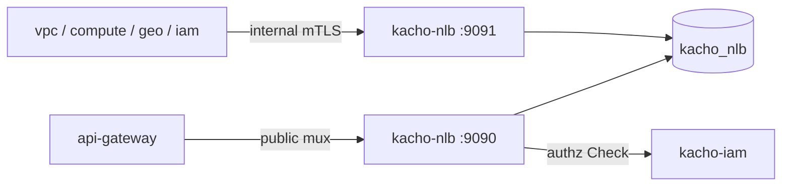

import CodeBlock from '@theme/CodeBlock'
import dedent from 'ts-dedent'

# Развёртывание

Эта страница описывает сборку Kachō NLB, применение миграций, два listener'а, фоновые worker'ы и
контейнерный образ. Ключи конфигурации — на странице [Конфигурация](/install/configuration).

## Сборка

В репозитории две сборочные цели: API-сервер и отдельный бинарь миграций.

<CodeBlock language="bash">
  {dedent`
    # API-сервер → bin/kacho-loadbalancer
    make build-api

    # мигратор → bin/kacho-migrator
    make build-migrator

    # обе цели
    make build
  `}
</CodeBlock>

## Миграции

Схема `kacho_nlb` управляется goose-миграциями (`internal/migrations`, встроены в бинарь).
Применяются **отдельным** бинарём `bin/kacho-migrator` (не самим сервисом на старте). DSN
берётся по приоритету `--dsn` > ENV `KACHO_NLB_REPOSITORY__POSTGRES__URL` > свой YAML-файл конфигурации (путь передаётся флагом `--config`; имя выбирает оператор, в дереве такого файла нет — есть образец `deploy/configmap-sample.yaml`).

<CodeBlock language="bash">
  {dedent`
    export KACHO_NLB_REPOSITORY__POSTGRES__URL='postgres://kacho:secret@pg:5432/kacho_nlb?sslmode=disable&search_path=kacho_nlb,public'

    make migrate-up        # bin/kacho-migrator up
    make migrate-status    # bin/kacho-migrator status
    make migrate-down      # откат последней: возвращает ФОРМУ, не данные
  `}
</CodeBlock>

:::warning Применённую миграцию не редактировать
Изменение схемы — только новой миграцией. Уже применённый файл не редактируется (конвенция
Kachō).
:::

## Запуск — два listener'а

API-сервер поднимает два независимых gRPC-listener'а:

<table>
  <thead><tr><th>Listener</th><th>Endpoint (дефолт)</th><th>Назначение</th></tr></thead>
  <tbody>
    <tr><td>public</td><td><code>tcp://0.0.0.0:9090</code></td><td>Клиенты + UI через api-gateway: CRUD + lifecycle</td></tr>
    <tr><td>internal</td><td><code>tcp://0.0.0.0:9091</code></td><td>Cluster-internal (mTLS): peer-сервисы, lifecycle-стрим синхронизации прав</td></tr>
  </tbody>
</table>

Дополнительно поднимаются метрики (`/metrics`, порт `:9101`) и gRPC health-check. В production
оба listener'а обязаны работать по mTLS, а адрес kacho-iam для per-RPC authz — быть
сконфигурированным (иначе валидация конфига не пройдёт).

## Фоновые worker'ы

Кроме обработки RPC сервис держит фоновые job'ы:

<table>
  <thead><tr><th>Worker</th><th>Что делает</th><th>Период (дефолт)</th></tr></thead>
  <tbody>
    <tr><td>target-drain runner</td><td>Двухфазный drain: удаляет истёкшие DRAINING-таргеты, эмитит lifecycle-событие группы</td><td>10s</td></tr>
    <tr><td>free-ip reconciler</td><td>Реконсайл застрявших балансировщиков/листенеров (create-orphan CREATING, незавершённый DELETING)</td><td>30s (порог возраста 5m)</td></tr>
    <tr><td>FGA register-drainer</td><td>Досылает owner/hierarchy-tuples в kacho-iam из <code>fga_register_outbox</code></td><td>по NOTIFY</td></tr>
  </tbody>
</table>

## Boot-gate REQUIRE_IAM

Fail-closed boot-gate: при `KACHO_NLB_REQUIRE_IAM=true` мутирующий `Create` отклоняется, а
readiness остаётся `NotReady`, пока сервис не убедился, что kacho-iam достижим (соединение
установлено). Так сервис не принимает мутации, для которых не сможет записать owner-tuples.
Production-профиль включает этот флаг.

## Контейнерный образ

<CodeBlock language="bash">
  {dedent`
    make docker    # собрать образ kacho-nlb
  `}
</CodeBlock>

При развёртывании в кластер мигратор обычно запускается отдельным job/init-контейнером
(`kacho-migrator up`) до старта сервиса, а сам сервис — как Deployment с портами public/internal
и метриками.



:::tip Дальше
Полный список ключей конфигурации, режимы и per-edge mTLS — [Конфигурация](/install/configuration).
Первые запросы к запущенному сервису — [Быстрый старт](/getting-started).
:::

## Откат выкатки

Неудачная выкатка откатывается в **три шага, и порядок в них несущий**. Схему
возвращают ДО образа: down-миграция лежит в том образе, который её принёс, и
вернув образ первым, вы останетесь без файла, которым откатывать.

Отдельно про то, чего `helm rollback` не делает сам: миграции едут
initContainer'ом и прогоняются `up` **на каждом старте пода**, поэтому возврат
образа перекатывает под и снова накатывает схему до головы своей цепочки.
Возврат образа сам по себе схему не возвращает.

### Шаг 1. Решить, нужен ли откат СХЕМЫ

| что несла выкатка | нужен ли откат схемы |
|---|---|
| только образ, миграций нет | нет — сразу шаг 3 |
| миграции аддитивные (новая таблица, новая колонка) | как правило нет: прежний код их не читает, и это самый дешёвый путь |
| миграция несовместима с прежним кодом (переименование, сужение типа, снятие колонки) | да — шаг 2 |
| миграция снесла таблицу или колонку | схему вернуть можно, **данные — нет**; см. рамку ниже |

### Шаг 2. Откатить схему — образом, который эту миграцию несёт

```bash
# ДО helm rollback, пока в поде ещё НОВЫЙ образ: у него есть down-файл.
kubectl -n <namespace> exec deploy/<деплой kacho-nlb> -- \
  /usr/local/bin/kacho-migrator status
kubectl -n <namespace> exec deploy/<деплой kacho-nlb> -- \
  /usr/local/bin/kacho-migrator down --target <версия, до которой откатываем>
```

### Шаг 3. Вернуть образ

```bash
helm history <релиз>
helm rollback <релиз> <ревизия>
```

:::danger `down` возвращает форму, а не данные
Down-миграция воссоздаёт схему **пустой**. Строки, которые снёс `DROP`, она не
возвращает: «восстановимо» про снос означает «восстановима схема». Единственный
путь назад для снесённых строк — резервная копия базы.

Продукт защищает это на своей стороне: накат считает живые строки в каждой
таблице, которую уронит ещё не применённая миграция, и **отказывает**, пока снос
не одобрен явно — переменной `KACHO_MIGRATOR_DROP_APPROVED` с именем конкретного
сноса. Отказ на выкатке стоит одной выкатки; восстановление из копии — сильно
дороже, и узнаёте вы о нужде в нём уже после.
:::

### Чем проверить, что откат состоялся

Проверять надо **три** вещи, и «под Ready» само по себе ни одной из них не
доказывает:

| что | чем |
|---|---|
| ревизия релиза вернулась | `helm history <релиз>` — последняя запись со статусом `deployed` |
| под работает нужным образом | `kubectl -n <namespace> get pod -l app=<деплой kacho-nlb> -o jsonpath='{..image}'` |
| схема на ожидаемой версии | `kacho-migrator status` — головная применённая версия |
| зависимости сервиса живы | `readinessProbe` спрашивает `/readyz`, поэтому `kubectl get pods` показывает готовность **по зависимостям**, а не по открытому сокету: под в `0/1` — это отказ зависимости, а не «ещё поднимается» |
