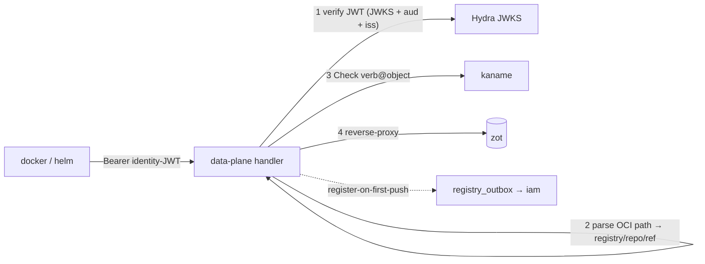
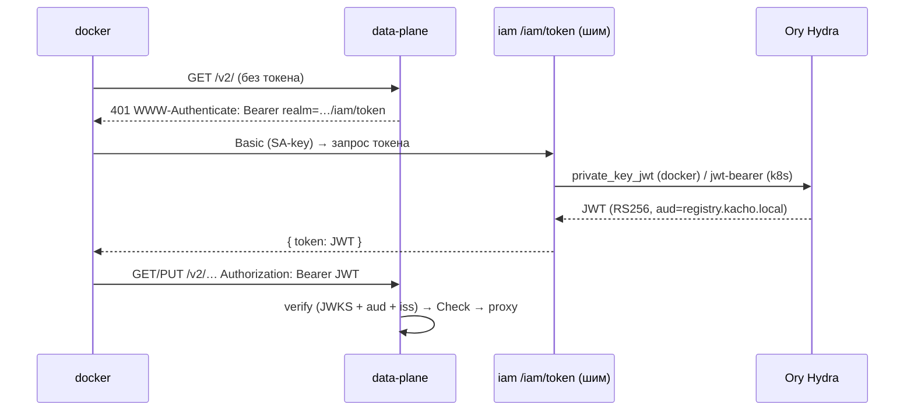

import CodeBlock from '@theme/CodeBlock'
import dedent from 'ts-dedent'

# Data-plane — OCI push/pull

Data-plane — это поверхность, с которой работает `docker` и `helm`. Она реализует **Docker Registry v2
/ OCI Distribution** на host `registry.kacho.local` и решает задачу «дать привычный push/pull, но с
авторизацией по правам платформы». Внутри это **тонкий auth-proxy**: он аутентифицирует клиента по
identity-JWT, авторизует каждый запрос через IAM и проксирует его в бэкенд хранилища (zot).

Data-plane — отдельный HTTP-листенер (не gRPC), поднимается на своём адресе (`KACHO_REGISTRY_DATAPLANE_ADDR`,
дефолт `:8080`) за внешней TLS-терминацией (ingress). Если адрес пуст — data-plane не поднимается
(control-plane при этом работает).

## Поток запроса

1. **AuthN** — `Authorization: Bearer <JWT>` верифицируется по JWKS Ory Hydra (подпись RS256/ES256),
   с проверкой audience (`registry.kacho.local`) и issuer (pinned в production). Токен без нужного
   `aud` отвергается (federation-out на другие RP доступа не даёт).
2. **Парсинг пути** — OCI-путь `/v2/<registry>/<repo>/...` разбирается в `(registryId, repo, ref)`.
   Сегментация — до url-decode (split-then-decode), с отбраковкой path-traversal (`..`, encoded-slash)
   `400` ещё до обращения к zot. `registryId` обязан нести префикс `reg` — иначе `404`.
3. **AuthZ** — per-request Check verb@object в IAM (см. verb-map ниже).
4. **Проксирование** — запрос как есть форвардится в zot (namespace адресуется storage-path-префиксом
   `<registryId>/<repo>`).

## Токен-обмен (docker login)

Docker сам получает Bearer-токен по протоколу Registry token-auth: при `401` с заголовком
`WWW-Authenticate: Bearer realm="…/iam/token",service="registry.kacho.local"` он идёт в realm за
токеном. Realm указывает на **token-шим kaname** (`/iam/token`), который брокерит настоящий токен у
Ory Hydra (федерация — Variant H).

<table>
  <thead><tr><th>Клиент</th><th>Grant у Hydra</th><th>Как логинится</th></tr></thead>
  <tbody>
    <tr><td><code>docker</code> / <code>helm</code> (CI)</td><td>выпуск шимом <code>/iam/token</code></td><td><code>docker login</code> базовым токеном доступа (одна строка в поле пароля)</td></tr>
    <tr><td>Kubernetes workload</td><td><code>jwt-bearer</code> (projected token)</td><td>FEDERATED SA-key (trusted_subjects, без приватного ключа)</td></tr>
  </tbody>
</table>

Отзыв удостоверения немедленно закрывает последующий обмен (docker и k8s) — токен больше не
выдаётся.

Ключевой материал в поле пароля докер-полоса **не принимает**: приватная половина пары не должна
ходить по сети и оседать в конфигурации клиента. Пара ключей остаётся видом удостоверения для
полосы провайдера (`client_assertion` → `/oauth2/token`) и для federated-потока Kubernetes.

## Verb-map push/pull

Каждый OCI-запрос отображается в verb-relation на объекте авторизации. Ключевое различие — push в
**новый** vs **существующий** репозиторий.

«Существующий» здесь означает **существующий как ресурс**: у репозитория есть строка наложения
(заявлен через `CreateRepository`) либо строка регистрации (заявлен первым push'ем). Наличие тегов в
движке предикатом **не является** — тег это содержимое, а не ресурс. Разница наблюдаема: заявленный
и ещё пустой репозиторий тегов не имеет, но гейтится правом на себя (`v_update`), а не общим для
реестра правом создавать репозитории, — иначе любой сосед по реестру писал бы в него и забирал
владение.

<table>
  <thead><tr><th>Действие</th><th>OCI</th><th>verb @ object</th></tr></thead>
  <tbody>
    <tr><td>pull (blob/manifest GET)</td><td>GET <code>/v2/&lt;reg&gt;/&lt;repo&gt;/…</code></td><td><code>v_get</code> @ <code>registry_repository</code></td></tr>
    <tr><td>push в существующий repo</td><td>PUT / POST</td><td><code>v_update</code> @ <code>registry_repository</code></td></tr>
    <tr><td>push в <strong>новый</strong> repo</td><td>PUT manifest / blob-upload</td><td><code>v_create</code> @ <code>registry_registry</code> (право создать repo в namespace)</td></tr>
    <tr><td>cross-repo mount (dst)</td><td>POST <code>?mount=…&from=…</code></td><td>dst-verb зеркалит push; src-repo проверяется на доступ (exfil-guard)</td></tr>
  </tbody>
</table>

:::note Register-on-first-push
При первом manifest-PUT нового репозитория data-plane одной транзакцией пишет durable-признак его
существования и intent регистрации его authz-объекта `registry_repository` (parent — реестр) в
`registry_outbox` — так репозиторий становится адресуемым per-repo authz и видимым в control-plane
`ListRepositories`.

Работа выполняется **до** отдачи ответа (ответ движка буферизуется), и её сбой — **отказ**: клиент
получает `503`, а не `2xx`. Повтор клиента сходится: признака существования не появилось ⇒
репозиторий по-прежнему новый ⇒ снова полоса создания и то же право, которым клиент авторизовался.
Register идемпотентен (advisory-lock + dedup в iam), повторный PUT движок принимает.

Прежняя редакция этого раздела описывала эмиссию как post-response side-effect, «клиент сохраняет
свой 2xx», а недостигнутую регистрацию — как само-восстанавливающуюся на следующем push. Последнее
было неверно и стоило репозиторию прав насовсем: строки в очереди при сбое нет вовсе, поэтому
переигрывать нечего, а следующий push видел теги в движке, переключался на `v_update` и упирался в
отказ — tuple'ов у репозитория так и не появлялось.
:::

## Каталог репозиториев (`GET /v2/_catalog`)

OCI-каталог отдаёт список репозиториев реестра. Страница сужается **пообъектно**: имя остаётся в
выдаче, только если у вызывающего есть `v_list` на `registry_repository:<reg>/<repo>`. Ошибка
Check → отказ (не нефильтрованный список), недоступных репозиториев в выдаче просто нет.

Курсор `last=` — **опаковый** offset позиции в отсортированном каталоге, а не сырое имя
репозитория. Иначе окно пагинации само называло бы вызывающему имя чужого репозитория —
`last=` возвращается клиенту, и эхо последнего имени окна раскрыло бы то, что фильтр только что
скрыл. Опаковый offset ничего не именует и при этом доводит пагинацию до всех разрешённых
репозиториев даже через полностью отфильтрованные окна.

:::note Каталог сужается по `v_list`, а чтение образа гейтится `v_get` — и это осознанное решение
На платформе действует правило: **членство в странице списка равно праву на чтение** — строка
попадает в выдачу тогда и только тогда, когда вызывающий вправе прочитать этот объект одиночным
`Get`. Правило существует потому, что `List` обычно возвращает **то же сообщение ресурса**, что и
`Get`: там членство в странице раскрывает не факт существования, а содержимое целиком, и
«показать в перечне, не показав содержимого» нереализуемо.

**OCI-каталог — записанное исключение**, и оно законно ровно по обратной причине: его страница —
это **голые имена**, а не сообщение ресурса. Содержимое (манифест, блоб) отдаётся отдельным
запросом и гейтится `v_get`. Поэтому «видно в перечне без содержимого» здесь **реализуемо** и
является осмысленным уровнем доступа: субъект с `v_list` знает, что репозиторий существует, но
не может ни скачать образ, ни прочитать его манифест.

Границы исключения: имя раскрывается только тем, кому `v_list` на этот репозиторий **выдан
явно** (не наследуется автоматически от namespace-viewer'а), а курсор опакован. Исключение
привязано к форме выдачи: **начнёт каталог отдавать что-либо помимо имени — решение подлежит
пересмотру вместе с предикатом.**

Control-plane `ListRepositories` — не этот случай: он возвращает сообщение `Repository` с
содержимым (число тегов, суммарный размер, момент последнего push, типы артефактов) и сужается
своим per-repo фильтром в хендлере.
:::

## Exfil-guard (cross-repo mount)

OCI позволяет «примонтировать» блоб из другого репозитория (`POST …/blobs/uploads?mount=<digest>&from=<src>`)
без перезаливки. Data-plane не даёт так вытащить чужой блоб: помимо verb на dst-репозитории проверяется
доступ к **src**-репозиторию. Нет доступа к source — mount не проходит (иначе — обход авторизации на
чтение чужого содержимого).

## Existence-hiding и fail-closed

- **Existence-hiding.** Аутентифицированный, но не авторизованный запрос получает `NOT_FOUND`
  (`404 NAME_UNKNOWN`), а не `403` — сервис не подтверждает существование чужого реестра/репозитория.
- **Fail-closed.** Недоступность IAM (Check) или zot на request-path — отказ (не «пропустить»), для
  мутаций — retriable ошибка, а не деструктивное действие. В production data-plane отказывается
  стартовать без https-JWKS, pinned issuer и подтверждённой внешней TLS-терминации (bearer-токены не
  должны транзитить открытым текстом).

:::warning Удаление образов — только control-plane
Data-plane `DELETE` манифеста отвергается `405`. Единственный destructive-путь для образов —
control-plane [DeleteTag](/api/tag), чтобы удаление проходило authz-проверку `v_delete` и корректно
снимало repo-tuple при опустошении репозитория.
:::
