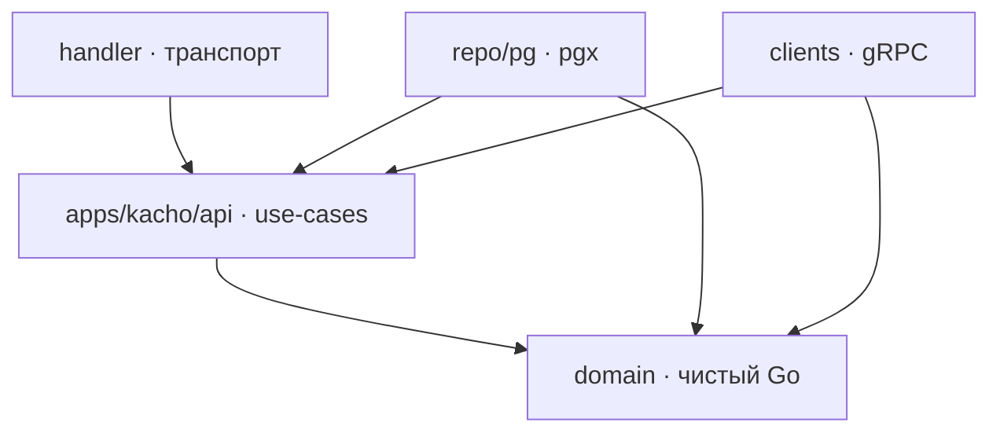

# Обзор архитектуры

`kacho-storage` — владелец блочного хранения платформы. Сервис отвечает за учёт томов,
снимков, образов и каталога типов диска, за состояние привязок к машинам и за права на
всё перечисленное. Данные он не переносит: это control plane.

## Слои

Раскладка строгая, зависимости направлены внутрь:

| Слой | Что внутри |
|---|---|
| `internal/domain` | Самовалидирующиеся сущности. Только стандартная библиотека — ни pgx, ни gRPC |
| `internal/apps/kacho/api/<res>` | Бизнес-логика по ресурсам: `volume`, `snapshot`, `image`, `disktype`. Здесь же объявляются порты, которыми пользуется этот use-case |
| `internal/repo/pg` | Адаптер к Postgres, реализует порты чтения и записи |
| `internal/clients` | Адаптеры к соседям: kacho-iam, kacho-geo |
| `internal/handler` | Тонкий транспорт: разобрать запрос → вызвать use-case → отформатировать ответ |
| `cmd/storage` | Единственное место сборки зависимостей |
| `cmd/migrator` | Отдельный бинарь миграций |

Вспомогательное: `internal/errors` — семейство sentinel-ошибок без зависимости от pgx;
`internal/apps/kacho/shared/serviceerr` — перевод sentinel в gRPC-статус;
`internal/authzfilter` — сужение страницы по правам; `internal/fgaregister` — очередь
регистрации владельца ресурса.

Отдельного пакета «порты» нет намеренно: порт объявляет тот use-case, который им
пользуется, — так видно, кому он нужен, и не заводится общая свалка интерфейсов.

## Два листенера

| Листенер | Порт | Что на нём |
|---|---|---|
| Публичный | 9090 | `VolumeService`, `SnapshotService`, `ImageService`, `DiskTypeService` |
| Внутренний | 9091 | `InternalVolumeService`, `InternalImageService`, `InternalDiskTypeService` |
| Диагностика | 9095 | `/healthz`, метрики |

Правила для обоих листенеров **одинаковые**: mTLS на транспорте и проверка прав на
каждом запросе. Внутренний листенер не освобождён ни от того, ни от другого —
«внутреннее значит доверенное» здесь не действует.

Разделение проходит по тому, что метод раскрывает. Инфраструктурная проекция ресурса
(раскладка по железу) и администрирование каталога живут только на внутреннем листенере
и на внешнюю поверхность не публикуются.

## Границы сервиса

Storage зовёт двух соседей и **никого больше**:

| Ребро | Зачем | Когда |
|---|---|---|
| `storage → kacho-iam` | Существование проекта; проверка прав на каждом запросе; регистрация владельца ресурса | На пути запроса |
| `storage → kacho-geo` | Существование зоны и региона; резолв «зона → её регион» | На пути запроса |

Оба вызова — с собственным сроком на вызов и закрытым отказом: недоступен сосед —
мутация не выполняется (`UNAVAILABLE`), а не проходит на авось.

**Обратных вызовов нет.** Вычислительный сервис зовёт storage (привязка тома, резолв
источника загрузки), но storage **никогда не зовёт его в ответ**: всё нужное приходит в
самой полезной нагрузке. Проверяется механически — ноль импортов вычислительного API в
дереве сервиса. Разбор — [Привязка тома к машине](/architecture/attachments).

## Инварианты живут в схеме

Ссылочная целостность и состояния внутри одной БД выражены конструкциями Postgres, а не
последовательностью «прочитал → проверил → записал». Последняя форма не переживает
параллельных запросов: оба проходят проверку и оба пишут.

| Инвариант | Механизм |
|---|---|
| Том держит свой тип диска | `FK … ON DELETE RESTRICT` |
| Имя уникально в проекте, когда непусто | partial `UNIQUE … WHERE name<>''` |
| Одна привязка на том | первичный ключ таблицы привязок |
| Привязанный том не удаляется | `FK … ON DELETE RESTRICT` |
| Имя устройства уникально в машине | `UNIQUE (instance_id, device_name)` |
| Не более одного загрузочного тома на машину | `EXCLUDE USING gist … WHERE (is_boot)` |
| Источник образа — снимок ЛИБО том | `CHECK` |
| Привязка при гонке | атомарная вставка с условием |

Ссылки через границу сервиса (`project_id`, `zone_id`, `region_id`, `instance_id`) —
TEXT **без FK**: их владельцы живут в других базах. Существование проверяется вызовом
владельца, а исчезнувшую ссылку сервис переживает мягко, а не падением.

## Что синхронно, что асинхронно

- `Volume`, `Snapshot`, `Image`: `Get` и `List` — синхронно; `Create`, `Update`,
  `Delete` возвращают `Operation`, клиент поллит её до `done`.
- `DiskType`: публичные `Get` и `List` — синхронно. Администрирование каталога
  (`InternalDiskTypeService`) — **тоже синхронно**: оно возвращает сам ресурс, а не
  операцию. Каталог правит администратор, долгой работы за этим нет, и заворачивать её
  в операцию значило бы платить поллингом без предмета.

Подробнее — [Операции](/architecture/operations).

## Дальше

- [Модель данных](/architecture/data-model) — таблицы, ключи, связи.
- [Когерентность размещения](/architecture/placement-coherence) — зоны и регионы.
- [Права и полосы доступа](/architecture/authz) — три формы вопроса о доступе.
