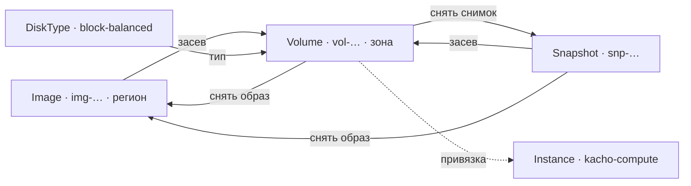

# Kachō Storage

**Kachō Storage** — сервис блочного хранения платформы. Он владеет четырьмя ресурсами:
постоянными томами (`Volume`), их снимками (`Snapshot`), загрузочными образами (`Image`)
и каталогом типов диска (`DiskType`). Здесь же живёт таблица привязок тома к машине —
именно storage, а не потребитель, отвечает на вопрос «к какой машине примонтирован этот
том».

Сервис относится к control plane: он ведёт учёт, инварианты и права, а не переносит
блоки данных. Всё, что описано ниже, — это контракт управления ресурсами.

## Ресурсы и идентификаторы

| Ресурс | Префикс id | Размещение | Что это |
|---|---|---|---|
| `Volume` | `vol` | зональный | Постоянный блочный том. Живёт независимо от машин: может сколь угодно долго оставаться без единой привязки |
| `Snapshot` | `snp` | наследует от тома | Снимок тома. Переживает исходный том |
| `Image` | `img` | региональный (anycast) | Загрузочный образ, из которого засевается том |
| `DiskType` | человекочитаемый slug | каталог | Тип диска — класс надёжности и производительности |
| `Operation` | `sop` | — | Долгая операция: результат любой мутации |

Идентификатор ресурса — префикс плюс 17 символов crockford-base32, например
`vol-a1b2c3d4e5f6g7h8j`. Он присваивается на создании и **неизменен всю жизнь ресурса**:
именно `id` попадает в ссылки, в область выдачи прав и в адресацию. Имя (`name`) —
косметическая метка проекта, её можно менять свободно, и она никогда не участвует в
адресации.

`DiskType` — исключение по форме: его идентификатор не генерируется, а назначается
администратором как читаемый slug (`block-balanced`), потому что это позиция каталога, а
не созданный тенантом ресурс.

## Жизненный цикл в одном взгляде

Том создаётся пустым либо засевается ровно из одного источника — снимка или образа.
Обратно: с тома снимается снимок, а образ снимается с тома или со снимка. Привязка тома к
машине — отдельное состояние, оно не меняет владения томом.

## Что сервис даёт и чего не делает

**Даёт.** Полный CRUD над томами, снимками и образами с проверкой прав на каждый объект;
каталог типов диска; авторитетное состояние привязок; когерентность размещения (том и
машина в одной зоне, том и образ — в одном регионе); все инварианты на уровне БД, а не
проверками в коде.

**Не делает.** Не переносит и не шифрует блоки — data plane отсутствует в этой фазе.
Инфраструктурная проекция тома (`GetInternal`) объявлена контрактом, но отвечает
`UNIMPLEMENTED`: её предмет — раскладка по железу — появится вместе с data plane. Это
осознанный вынос за рамки, а не незакрытый долг: раскрывать нечего.

## Владелец блочного хранения

Блочное хранение выделено в отдельный сервис из вычислительного домена. **На стороне
storage раскол завершён**: он единственный владелец томов, снимков, образов и типов
диска, и связующая таблица привязок живёт у него. Дубликаты этих ресурсов из
вычислительного сервиса сняты миграциями `0021_drop_block_storage_duplicates.sql` и
`0022_drop_disk_types.sql`.

Почему привязку инициирует сосед, а таблица лежит здесь — и почему при этом обратного
вызова не возникает — разобрано в разделе
[Привязка тома к машине](/architecture/attachments).

## Куда дальше

- [Быстрый старт](/getting-started) — создать том, снять снимок, привязать.
- [Архитектура](/architecture/overview) — слои, инварианты, границы сервиса.
- [API](/api/overview) — поверхность, коды ошибок, пагинация.
- [Решения дизайна](/advanced/design-decisions) — что и почему решено именно так.
