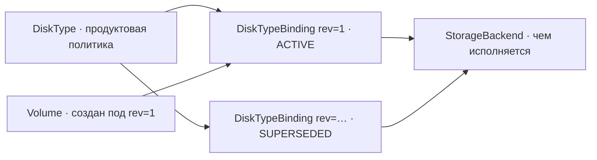

import { DICTIONARY } from '@site/src/constants/dictionary'
import { TYPES } from '@site/src/constants/types'
import { RESTRICTIONS } from '@site/src/constants/restrictions'
import { Restrictions } from '@site/src/components/commonBlocks/Restrictions'
import { Codes } from '@site/src/components/commonBlocks/Codes'
import { ApiOperation } from '@site/src/components/commonBlocks/ApiOperation'
import CodeBlock from '@theme/CodeBlock'
import dedent from 'ts-dedent'

# Внутренний API

Пять сервисов живут **только на внутреннем листенере** (порт 9091) и на внешнюю
поверхность не публикуются:

| Сервис | Предмет |
|---|---|
| `InternalDiskTypeService` | Регистрация и правка классов диска |
| `InternalStorageBackendService` | Реестр бэкендов: чем исполняется хранение и где |
| `InternalDiskTypeBindingService` | Неизменяемые ревизии политики класса в зоне |
| `InternalVolumeService` | Привязка тома к машине и инфраструктурная проекция тома |
| `InternalImageService` | Инфраструктурная проекция образа и регистрация внесённого образа |

Разделение проходит по тому, что метод раскрывает или кому он адресован: администрирование
каталога, устройство плоскости данных и служебные вызовы между сервисами не предназначены
внешним клиентам.

:::caution «Внутреннее» не означает «доверенное»
Правила на внутреннем листенере **те же**, что на публичном: mTLS на транспорте и проверка
прав на каждом запросе. Ни один метод здесь не освобождён от аутентификации, и ни один не
проходит без проверки прав. Внутренний периметр доверенным не считается.
:::

:::info Как держится изоляция: по принадлежности метода, а не по форме пути
REST-привязки есть у всех, кроме `InternalVolumeService` и `InternalImageService`, — у тех
их нет вовсе, и край отдаёт им маршрут по умолчанию, выведенный из полного имени метода.

Ни один из этих путей **не обслуживается на внешнем слушателе**: диспетчер края
классифицирует запрос по принадлежности метода `Internal*`-сервису, а не по форме пути.
Это принципиально — административные мутации каталога классов стоят на **том же** пути,
что публичное чтение, и различает их только HTTP-метод. Классификатор, смотрящий на один
путь, увёл бы их на публичный мультиплексор.

Следствие: новый метод такого сервиса изолируется **автоматически**, ничего не добавляя в
списки. Не наоборот — не «путь выглядит административным, значит закрыт».
:::

## Две записи, из-за которых правка справочника не переписывает прошлое

Класс диска (`DiskType`) — **продуктовая** политика: ярус, состояние обращения, границы.
Чем эта политика исполняется физически, класс не знает и знать не должен: бэкенды
меняются, а класс обязан пережить их смену.

Поэтому между классом и бэкендом стоит **ревизия привязки** — снимок политики для пары
«класс, зона»:

**Ревизии append-only и неизменяемы.** Ни один метод их не правит: `Update` у ревизии нет
и быть не должно. Механизм — именно в отсутствии правки. Ресурс ссылается на ревизию, под
которой создан, поэтому правка класса **физически не может** задним числом изменить его
свойства: том, созданный под ревизией с `multiAttach: false`, остаётся с ней даже после
того, как администратор объявил классу другую политику.

Будь у ревизии `Update`, та же ссылка означала бы «политика на момент чтения», и правка
справочника молча меняла бы свойства уже созданных ресурсов — включая те, что проверялись
при их создании.

Отсюда же запрет удаления: строка живёт, пока на неё ссылается хоть один ресурс (внешний
ключ `RESTRICT`). Ревизия без ссылок — тоже не мусор: она объясняет, на каких условиях
создавались ресурсы, которых уже нет.

## InternalStorageBackendService

Реестр бэкендов — утверждение «вот чем мы умеем исполнять хранение и где». Запись
**инфра-чувствительна целиком**: координата, охват зон и ссылка на учётные данные вместе
картируют плоскость данных, поэтому на публичную поверхность она не проецируется ни одним
полем — ни на `Volume`, ни на `DiskType`.

<table>
  <thead><tr><th>Поле</th><th>Тип</th><th>Описание</th></tr></thead>
  <tbody>
    <tr><td><code>id</code></td><td><code>{TYPES.string}</code></td><td>Префикс <code>sb-</code>, присваивается на Create, immutable</td></tr>
    <tr><td><code>name</code></td><td><code>{TYPES.string}</code></td><td>Косметический ярлык: уникален в реестре, адресацию не несёт</td></tr>
    <tr><td><code>kind</code></td><td><code>{TYPES.backendKind}</code></td><td>{DICTIONARY.backendKind.short}</td></tr>
    <tr><td><code>description</code></td><td><code>{TYPES.string}</code></td><td>{DICTIONARY.description.short}</td></tr>
    <tr><td><code>zoneIds</code></td><td><code>{TYPES.stringArray}</code></td><td>{DICTIONARY.backendZoneIds.short}</td></tr>
    <tr><td><code>endpoint</code></td><td><code>{TYPES.string}</code></td><td>{DICTIONARY.endpoint.short}</td></tr>
    <tr><td><code>credentialsRef</code></td><td><code>{TYPES.string}</code></td><td>{DICTIONARY.credentialsRef.short}</td></tr>
    <tr><td><code>status</code></td><td><code>{TYPES.backendStatus}</code></td><td>{DICTIONARY.backendStatus.short}</td></tr>
    <tr><td><code>createdAt</code> / <code>updatedAt</code></td><td><code>{TYPES.timestamp}</code></td><td>{DICTIONARY.createdAt.short}</td></tr>
  </tbody>
</table>

<CodeBlock language="json">
  {dedent`
    {
      "name": "block-central-1",
      "kind": "<род из закрытого перечня>",
      "zoneIds": ["zone-1-a", "zone-1-b"],
      "endpoint": "cfg://block/central-1",
      "credentialsRef": "vault://kacho/storage/block-central-1",
      "status": "ACTIVE"
    }
  `}
</CodeBlock>

:::caution Секрет не проходит через API и не ложится в базу
`credentialsRef` — **ссылка**, а не значение: процесс разрешает её у хранилища секретов
при старте. Причина прямая: то, что прошло через запрос, попадает в журналы, трассировки
и ответы, а то, чего у нас нет, нельзя выдать ни ошибкой, ни утечкой проекции.

Значение, не похожее на ссылку (в том числе сам секрет), отвергается `INVALID_ARGUMENT` —
так материал секрета не доезжает ни до журнала, ни до колонки.

По той же причине `endpoint` обязан иметь форму `<схема>://<путь>`: голый `host:port` под
неё не подходит, а именно он и был бы адресом узла, просочившимся в контракт.
:::

### Create · Get · List · Update · Delete

<ApiOperation method="POST" endpoint="/storage/v1/storageBackends (только внутренний мукс)">

Регистрирует бэкенд. Идентификатор присваивает сервис (префикс `sb-`): внешняя адресация
идёт по неизменяемому id, а не по имени — имя администратор вправе сменить, и ревизии
привязок не должны от этого разъехаться.

<Codes codes={['invalidArgument', 'alreadyExists', 'unauthenticated', 'permissionDenied', 'unavailable', 'internal']} />

</ApiOperation>

<ApiOperation method="PATCH" endpoint="/storage/v1/storageBackends/{storageBackendId} (только внутренний мукс)">

Правит регистрацию по `updateMask`. `kind` в маску не входит **никогда**: род бэкенда
выбирает адаптер, и смена рода на месте подменила бы исполнителя под живыми привязками —
объекты остались бы у прежнего, а ходить мы стали бы к новому.

<Codes codes={['invalidArgument', 'notFound', 'unauthenticated', 'permissionDenied', 'internal']} />

</ApiOperation>

<ApiOperation method="DELETE" endpoint="/storage/v1/storageBackends/{storageBackendId} (только внутренний мукс)">

Снимает регистрацию. Бэкенд, на который ссылается хоть одна ревизия привязки, **не
удаляется**: иначе оборвалась бы ссылка у строк, которые обязаны быть неизменяемыми, и
том потерял бы политику, под которой создан.

Штатный вывод бэкенда — это `DRAINING`, а не удаление: он перестаёт принимать новые
привязки, а существующие продолжают исполняться.

<Codes codes={['invalidArgument', 'notFound', 'failedPrecondition', 'unauthenticated', 'permissionDenied', 'internal']} />

</ApiOperation>

## InternalDiskTypeBindingService

Ревизия привязки отвечает на вопрос: каким бэкендом класс исполняется **в этой зоне**, где
именно лежат объекты, что бэкенд умеет и какую производительность обещает.

<table>
  <thead><tr><th>Поле</th><th>Тип</th><th>Описание</th></tr></thead>
  <tbody>
    <tr><td><code>id</code></td><td><code>{TYPES.string}</code></td><td>Префикс <code>dtb-</code>, присваивается на Create, immutable</td></tr>
    <tr><td><code>diskTypeId</code></td><td><code>{TYPES.string}</code></td><td>Класс, для которого заведена ревизия</td></tr>
    <tr><td><code>zoneId</code></td><td><code>{TYPES.string}</code></td><td>{DICTIONARY.zoneId.short}</td></tr>
    <tr><td><code>backendId</code></td><td><code>{TYPES.string}</code></td><td>{DICTIONARY.backendId.short}</td></tr>
    <tr><td><code>revision</code></td><td><code>{TYPES.int32}</code></td><td>{DICTIONARY.revision.short}</td></tr>
    <tr><td><code>locator</code></td><td><code>{TYPES.backendLocator}</code></td><td>{DICTIONARY.locator.short}</td></tr>
    <tr><td><code>capabilities</code></td><td><code>{TYPES.bindingCapabilities}</code></td><td>{DICTIONARY.bindingCapabilities.short}</td></tr>
    <tr><td><code>qos</code></td><td><code>{TYPES.bindingQos}</code></td><td>{DICTIONARY.qos.short}</td></tr>
    <tr><td><code>status</code></td><td><code>{TYPES.bindingStatus}</code></td><td>{DICTIONARY.bindingStatus.short}</td></tr>
    <tr><td><code>createdAt</code></td><td><code>{TYPES.timestamp}</code></td><td>{DICTIONARY.createdAt.short}</td></tr>
  </tbody>
</table>

Отметки изменения у ревизии нет и быть не может: строка не меняется.

<CodeBlock language="json">
  {dedent`
    {
      "diskTypeId": "nvme-general",
      "zoneId": "zone-1-a",
      "backendId": "sb-7k2m9p4r1t8w3y6zb",
      "locator": { "pool": "kacho-block-general", "namespaceTemplate": "prj-{projectId}" },
      "capabilities": {
        "snapshots": true,
        "cloneFromSnapshot": true,
        "cloneFromImage": true,
        "cloneKeepsParent": true,
        "onlineGrow": true,
        "multiAttach": false,
        "encryptionAtRest": true,
        "trashTtlSeconds": 86400
      },
      "qos": {
        "baselineIops": 3000, "iopsPerGib": 30, "maxIops": 80000,
        "baselineThroughputMibps": 125, "throughputPerGibMibps": 0.5,
        "maxThroughputMibps": 1000
      }
    }
  `}
</CodeBlock>

### Что из ревизии видно арендатору, а что нет

| Элемент ревизии | На публичной поверхности |
|---|---|
| `locator` (пул, шаблон изоляции) | **никогда** |
| `backendId`, `endpoint` бэкенда | **никогда** |
| `revision` | **никогда** |
| `capabilities.snapshots` и прочие применимые способности | Да — как булевы `DiskType.capabilities`, пересечением по действующим ревизиям |
| `capabilities.cloneKeepsParent`, `trashTtlSeconds` | Нет: называют устройство плоскости данных, а не доступное арендатору действие |
| `qos` | Только если бэкенд его действительно энфорсит — число, которого никто не держит, есть обещание без исполнителя |

`qos` — **формула**, а не константа: действующее значение равно `baseline + за_ГиБ ×
размер`, ограниченное сверху `max`. Константа лгала бы на краях диапазона: один и тот же
класс на 10 ГиБ и на 10 ТиБ не даёт одинаковых чисел, и опубликованная константа стала бы
либо недостижимым обещанием на малом томе, либо занижением на большом.

### Create · Get · List

У ревизии **три метода, и других нет**. Ни правки, ни удаления, ни отдельного глагола
снятия с действия у неё не существует — вытеснение прежней ревизии есть **следствие**
заведения новой, а не самостоятельная операция.

<ApiOperation method="POST" endpoint="/storage/v1/diskTypeBindings (только внутренний мукс)">

Заводит новую ревизию политики на пару «класс, зона». Прежняя действующая ревизия этой
пары переводится в `SUPERSEDED` в той же транзакции.

`revision` присваивает сервис, а не вызывающий: номер, названный клиентом, — это
потерянное обновление, когда два администратора называют один и тот же. «Ровно одна
действующая на пару» держится частичным уникальным индексом, а не проверкой «прочитал →
записал»: при двух конкурентных `Create` одна проходит, вторая получает `ALREADY_EXISTS`
от базы, и исход не зависит от планировщика.

<Codes codes={['invalidArgument', 'alreadyExists', 'failedPrecondition', 'unauthenticated', 'permissionDenied', 'unavailable', 'internal']} />

</ApiOperation>

<ApiOperation method="GET" endpoint="/storage/v1/diskTypeBindings/{diskTypeBindingId} (только внутренний мукс)">

Возвращает ревизию по идентификатору — **включая вытесненную**: ресурсы ссылаются на неё
и после вытеснения, значит прочитать её обязано быть можно.

<Codes codes={['invalidArgument', 'notFound', 'unauthenticated', 'permissionDenied', 'internal']} />

</ApiOperation>

<ApiOperation method="GET" endpoint="/storage/v1/diskTypeBindings (только внутренний мукс)">

Перечисляет ревизии, включая вытесненные: история политики и есть предмет этого ресурса.

<Codes codes={['invalidArgument', 'unauthenticated', 'permissionDenied', 'internal']} />

</ApiOperation>

:::info Вытеснение — следствие, а не глагол
`SUPERSEDED` не возвращается в `ACTIVE`, и отдельного метода, снимающего ревизию с
действия, нет. Единственный способ сменить политику пары «класс, зона» — завести
**новую** ревизию: тогда у ресурсов, созданных под прежней, остаётся своя политика, а не
подменённая задним числом.

Из этого следует граница, которую стоит знать заранее: **перестать предлагать класс в
отдельно взятой зоне через ревизию нельзя** — снять с действия можно только заменой.
Вывод класса из обращения целиком делается на самом классе (`SetLifecycle` →
`DEPRECATED`/`RETIRED`), а вывод бэкенда — его полосой `DRAINING`.
:::

## InternalVolumeService

### Attach

<ApiOperation method="gRPC" endpoint="InternalVolumeService/Attach">

Привязывает том к машине. Атомарная вставка с условием; повтор безопасен — уже наша
привязка отвечает успехом.

Полезная нагрузка **самоописывающаяся**: она несёт зону машины, проект и имя машины,
поэтому storage проверяет свою строку и обратно вычислительный сервис не зовёт. Разбор —
[Привязка тома к машине](/architecture/attachments).

Число одновременных привязок решает **способность ревизии**, под которой создан том: при
`multiAttach: false` вторая привязка отвергается `Volume <id> is in use`, при `true` —
проходит. Предикат читается прямо во вставке, а не проверкой «прочитал → записал».

Авторизуется по **двум** объектам: отношение `editor` на самом томе (извлекается из
`volume_id`) плюс отдельный вопрос модели прав про названную машину. Права на том без
прав на машину привязку не дают, и наоборот.

<Codes codes={['invalidArgument', 'notFound', 'failedPrecondition', 'unauthenticated', 'permissionDenied', 'unavailable', 'internal']} />

</ApiOperation>

### Detach

<ApiOperation method="gRPC" endpoint="InternalVolumeService/Detach">

Отвязывает том. Идемпотентно: ноль удалённых строк означает, что том уже отвязан, — это
успех.

Авторизуется отношением `editor` на томе.

<Codes codes={['invalidArgument', 'notFound', 'unauthenticated', 'permissionDenied', 'unavailable', 'internal']} />

</ApiOperation>

### ListAttachments

<ApiOperation method="gRPC" endpoint="InternalVolumeService/ListAttachments">

Возвращает привязки для перечисленных машин — одним запросом, чтобы потребитель строил
своё зеркало пакетно, а не по запросу на машину.

**Авторизуется на уровне данных.** Единого объекта для проверки заранее у этого метода
нет: машины называет вызывающий, а тома в ответе принадлежат разным владельцам. Поэтому
прочитанная страница сужается по каждому тому тем же отношением, на котором гейтится
`Volume.Get`, партиями не более 100. В каталоге метод помечен как `scope_filtered`, и
проверка конфигурации при загрузке не даёт сервису стартовать с выключенным фильтром.

<Codes codes={['invalidArgument', 'unauthenticated', 'permissionDenied', 'unavailable', 'internal']} />

</ApiOperation>

### GetInternal

<ApiOperation method="gRPC" endpoint="InternalVolumeService/GetInternal">

Полная инфраструктурная проекция тома: ревизия привязки, имя объекта у бэкенда, единица
изоляции арендатора и наблюдённое состояние.

**Сегодня отвечает `UNIMPLEMENTED`.** Номера её инфраструктурных полей в контракте
зарезервированы и ещё не заняты — заполнять проекцию нечем, и заглушка, отдающая пустую
структуру, была бы хуже отказа: пустой ответ можно принять за настоящий.

<Codes codes={['unimplemented', 'unauthenticated', 'permissionDenied']} />

</ApiOperation>

:::info Почему инфраструктурные поля вообще не на публичной поверхности
Сведения о том, где лежит ресурс — координата бэкенда, пул, единица изоляции, имя объекта,
ревизия привязки, — помогают картировать физику платформы. Такие данные живут исключительно
во внутреннем API. Публичная поверхность ресурса показывает намерение и результат: кто
владелец, где размещён, какого размера, в каком состоянии — но не то, как это разложено по
оборудованию.

Отсюда две проекции одного ресурса: публичная и внутренняя.
:::

## InternalImageService

### GetInternal

<ApiOperation method="gRPC" endpoint="InternalImageService/GetInternal">

Внутренняя проекция образа: публичный образ плюс то, чего на публичной поверхности нет и
не будет.

<table>
  <thead><tr><th>Поле</th><th>Тип</th><th>Описание</th></tr></thead>
  <tbody>
    <tr><td><code>image</code></td><td><code>Image</code></td><td>Публичная проекция образа</td></tr>
    <tr><td><code>bindingId</code></td><td><code>{TYPES.string}</code></td><td>{DICTIONARY.bindingId.short}</td></tr>
    <tr><td><code>backendObject</code></td><td><code>{TYPES.string}</code></td><td>{DICTIONARY.backendObject.short}</td></tr>
    <tr><td><code>observedState</code></td><td><code>{TYPES.observedState}</code></td><td>{DICTIONARY.observedState.short}</td></tr>
    <tr><td><code>observedAt</code></td><td><code>{TYPES.timestamp}</code></td><td>{DICTIONARY.observedAt.short}</td></tr>
    <tr><td><code>statusReason</code></td><td><code>{TYPES.statusReason}</code></td><td>Чем закончилась последняя сверка (для оператора)</td></tr>
  </tbody>
</table>

`observedState` объявлен **отдельно** от `Image.status` намеренно: пока желаемое и
наблюдаемое — две величины, дрейф между нашей строкой и хранилищем находим. Свести их в
одну колонку значит сделать расхождение невидимым by construction. По той же причине
`OBSERVED_STATE_UNSPECIFIED` («сверки ещё не было») отличается от `ABSENT` («смотрели и не
нашли»): эти два состояния требуют разных действий оператора.

Локатор из ревизии здесь **не дублируется**: `bindingId` указывает на строку, которая его
несёт, и она неизменяема — поэтому правка справочника не может задним числом переселить
уже внесённый объект.

<Codes codes={['invalidArgument', 'notFound', 'unauthenticated', 'permissionDenied', 'internal']} />

</ApiOperation>

### Register

<ApiOperation method="gRPC" endpoint="InternalImageService/Register">

Регистрирует образ, внесённый в хранилище командой провайдера. Синхронный, возвращает сам
`Image`.

<table>
  <thead><tr><th>Поле</th><th>Тип</th><th>Описание</th></tr></thead>
  <tbody>
    <tr><td><code>projectId</code></td><td><code>{TYPES.string}</code></td><td>обязателен; проверяется через kaname</td></tr>
    <tr><td><code>regionId</code></td><td><code>{TYPES.string}</code></td><td>обязателен; проверяется через kacho-geo</td></tr>
    <tr><td><code>name</code> / <code>description</code> / <code>labels</code></td><td>—</td><td>те же границы, что у публичного Create</td></tr>
    <tr><td><code>backendObject</code></td><td><code>{TYPES.string}</code></td><td>обязателен: handle уже лежащего объекта</td></tr>
    <tr><td><code>sizeBytes</code></td><td><code>{TYPES.int64}</code></td><td>обязателен, &gt; 0 — выводить не из чего</td></tr>
    <tr><td><code>minDiskBytes</code></td><td><code>{TYPES.int64}</code></td><td>обязателен, &gt; 0 — том меньше этого числа образом не засевается</td></tr>
  </tbody>
</table>

<CodeBlock language="json">
  {dedent`
    {
      "projectId": "prj-…",
      "regionId": "region-1",
      "name": "ubuntu-24-04-lts",
      "backendObject": "kc7f-img-ubuntu-2404-20260812",
      "sizeBytes": 21474836480,
      "minDiskBytes": 21474836480
    }
  `}
</CodeBlock>

:::info Почему метод обязан существовать
Единственный источник операционной системы для машины — образ storage, а публичный
`Image.Create` делает образ **только** из тома или снимка. На чистой установке нет ни
того, ни другого — значит без регистрации первая машина не запускается by construction.

Байты вносит команда провайдера вне облака; облако регистрирует handle. Блоб-конвейера у
нас нет и он не проектируется.
:::

:::caution Единственное место контракта, где имя объекта приходит извне
На всех прочих путях адаптер **выводит** имя объекта сам (префикс установки плюс наш
идентификатор) и из запроса не принимает: принимая, он позволил бы вызывающему адресовать
чужой объект.

Здесь выводить не из чего — объект внесён **до** того, как у облака появилась строка, и
его имя это факт, а не наше решение. Отсюда же и отношение уровня кластера: предмет
регистрации появляется раньше, чем объект, про который можно было бы спросить право.
:::

<Codes codes={['invalidArgument', 'alreadyExists', 'failedPrecondition', 'unauthenticated', 'permissionDenied', 'unavailable', 'internal']} />

</ApiOperation>

## InternalDiskTypeService

Регистрация классов диска. Публичного создания классов не существует — каталог ведёт
администратор через этот сервис.

:::note Эти методы синхронны
`Create`, `Update`, `Delete` и `SetLifecycle` возвращают **сам ресурс**, а не `Operation`.
Это осознанное отступление от общего правила «мутации асинхронны»: за правкой позиции
справочника не стоит долгой работы, и заворачивать её в операцию значило бы заставить
администратора поллить то, что уже готово.
:::

:::caution Путь делится с публичным чтением — различает только HTTP-метод
Мутации каталога стоят на **том же** пути, что публичное чтение
(`GET /storage/v1/diskTypes[/{id}]`): `POST`, `PATCH` и `DELETE` идут в
`InternalDiskTypeService`, `GET` — в публичный `DiskTypeService`.

Это самый наглядный случай, ради которого край классифицирует по принадлежности метода, а
не по форме пути (см. врезку в начале страницы).
:::

### Create

<ApiOperation method="POST" endpoint="/storage/v1/diskTypes (только внутренний мукс)">

Регистрирует класс. Возвращает `DiskType`.

Принимаются: `id` (slug), `name`, `description`, `zoneIds`, `tier`, `lifecycle`, `limits`.

**Способностей на входе нет намеренно**: их источник истины — действующие ревизии
привязки, а класс выводит их пересечением. Принять их значило бы завести второй источник
одного факта; принять и не сохранить — молча выбросить параметр, который вызывающий
считает применённым.

Опущенный `lifecycle` означает `ACTIVE` — умолчание проставляет край в одном названном
месте; домен незаполненное состояние отвергает, чтобы не принять опечатку за намерение.

<Codes codes={['invalidArgument', 'alreadyExists', 'unauthenticated', 'permissionDenied', 'internal']} />

</ApiOperation>

### Update

<ApiOperation method="PATCH" endpoint="/storage/v1/diskTypes/{diskTypeId} (только внутренний мукс)">

Изменяет класс **по маске**. Возвращает `DiskType`.

Маска заведена не для симметрии. Без неё правка была полной заменой: тело без `zoneIds`
обнуляло список у справочника, от которого зависит размещение данных, — и запрос, менявший
одно имя, снимал класс со всех зон, ничего об этом не сказав.

Состояния обращения в маске нет: оно меняется глаголом `SetLifecycle`. При пустой маске
полная замена изменяемых полей вернула бы выведенный класс в обращение правкой описания —
исход, которого вызывающий не заявлял.

<Codes codes={['invalidArgument', 'notFound', 'unauthenticated', 'permissionDenied', 'internal']} />

</ApiOperation>

### SetLifecycle

<ApiOperation method="PATCH" endpoint="/storage/v1/diskTypes/{diskTypeId}:setLifecycle (только внутренний мукс)">

Переводит класс между `ACTIVE`, `DEPRECATED` и `RETIRED`. Возвращает `DiskType`.

Новое состояние обязательно и называется явно: умолчания у этого запроса нет — «не
указано» здесь неотличимо от «верни в обращение», а такой исход обязан быть выбран, а не
получен по недосмотру.

<Codes codes={['invalidArgument', 'notFound', 'unauthenticated', 'permissionDenied', 'internal']} />

</ApiOperation>

### Delete

<ApiOperation method="DELETE" endpoint="/storage/v1/diskTypes/{diskTypeId} (только внутренний мукс)">

Снимает класс с регистрации.

Класс, на который ссылается хотя бы один том, удалить нельзя — это держит внешний ключ с
поведением `RESTRICT`, а не проверка в коде.

<Codes codes={['invalidArgument', 'notFound', 'failedPrecondition', 'unauthenticated', 'permissionDenied', 'internal']} />

</ApiOperation>

## Ограничения

<Restrictions items={[
  { label: 'DiskType', rules: RESTRICTIONS.diskTypeCatalog },
  { label: 'StorageBackend', rules: RESTRICTIONS.storageBackend },
  { label: 'DiskTypeBinding', rules: RESTRICTIONS.diskTypeBinding },
  { label: 'updateMask', rules: RESTRICTIONS.updateMask },
  { label: 'pageSize / pageToken', rules: RESTRICTIONS.pagination },
]} />
