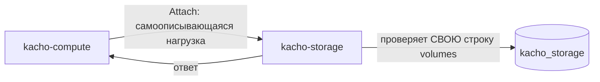

# Привязка тома к машине

Привязка (`VolumeAttachment`) — это состояние «том примонтирован к машине». Она выглядит
просто, но проходит через границу двух сервисов: том принадлежит storage, машина —
вычислительному сервису. Ниже разобрано, **почему** привязка устроена именно так, а не
только как она работает: та же задача решается несколькими способами, и большинство из
них заводят цикл между сервисами.

## Кто чем владеет

Таблица привязок `volume_attachments` живёт **в базе storage**, рядом с таблицей томов.
Это не деталь размещения, а следствие правила: у типа ресурса ровно один владелец, и
привязка — это состояние **тома**, а не машины. Из него выводится публичное поле
`Volume.attachments` и статус тома `IN_USE`.

Соседняя сторона держит у себя только read-only зеркало: машина показывает свои тома,
но источником истины не является и мягко переживает исчезнувшую ссылку.

## Кто инициирует

Привязку **инициирует вычислительный сервис** — это он знает, что машина запускается или
что пользователь просит примонтировать том. Он вызывает внутренний метод
`InternalVolumeService.Attach` на закрытом листенере storage.

Возникает естественный вопрос: если storage обязан проверить, что машина существует, в
той же зоне и в том же проекте, — не должен ли он позвать соседа обратно? Именно этот
обратный вызов и создал бы цикл: сосед зовёт storage, storage зовёт соседа.

## Решение: самоописывающаяся полезная нагрузка

Цикл снимается тем, что **вызывающий приносит с собой всё, что нужно для проверки**.
Запрос несёт не только `volumeId` и `instanceId`, но и зону машины, проект, имя машины,
имя устройства и режим:

```protobuf
message AttachVolumeRequest {
  string volume_id        = 1;
  string instance_id      = 2;
  string instance_name    = 3;  // снимок значения на момент привязки
  string instance_zone_id = 4;  // для проверки когерентности зоны
  string project_id       = 5;  // для проверки когерентности проекта
  string device_name      = 6;
  bool   is_boot          = 7;
  VolumeAttachment.Mode mode = 8;
  bool   auto_delete      = 9;
}
```

Получив это, storage валидирует **свою собственную строку** — том — против принесённых
значений и **никогда не звонит вычислительному сервису**. Ацикличность держится по
построению, а не по договорённости: в дереве сервиса storage **ноль** импортов
вычислительного API.



:::info Почему это честный размен, а не срезанный угол
Принесённые значения не проверяются у их владельца — значит, вызывающий теоретически
может назвать чужую зону. Это закрыто не доверием, а правами: `Attach` авторизуется
per-RPC против **самого тома** (отношение `editor` на `storage_volume:<id>`), а право
назвать машину проверяется отдельным гейтом на инстанс. Тот, у кого нет прав на том, не
привяжет его никуда, какую бы нагрузку ни принёс.
:::

## Что именно проверяется — и всё внутри одного стейтмента

Привязка выполняется **одной атомарной вставкой с условием** (CAS), а не
последовательностью «прочитать → проверить → записать». Последняя форма гонок не
переживает: два параллельных запроса пройдут проверку и оба запишут.

Предикат вставки требует, чтобы строка тома удовлетворяла всем условиям сразу:

| Условие | Что означает |
|---|---|
| `volumes.state = 'READY'` | том готов; иначе — `Volume <id> is not ready` |
| `volumes.zone_id = $instance_zone_id` | том и машина в одной зоне |
| `volumes.project_id = $project_id` | том и машина в одном проекте |
| ревизия тома допускает множественную привязку **либо** привязок ещё нет | иначе — `Volume <id> is in use` |

Последнее условие читает **способность ревизии привязки**, под которой создан том, — тем
же стейтментом, а не отдельным запросом. Так число одновременных привязок определяется
тем, что умеет бэкенд, и остаётся тем же на всю жизнь тома: ревизия неизменяема.

Ноль вставленных строк — отказ. Но «ноль строк» само по себе не говорит, **какое** из
условий не сошлось, поэтому после неуспеха выполняется разбор, и каждое расхождение
получает **свой** текст:

- расходится зона → `Volume and Instance must be in the same zone`;
- расходится проект → `Volume and Instance must be in the same project`.

Тексты раздельные намеренно. Один общий текст на два разных нарушения заставляет
вызывающего гадать, что чинить.

## Инварианты, выраженные схемой

Три свойства привязки держатся конструкциями БД, а не проверками в коде — их нельзя
обойти ни гонкой, ни другим путём записи:

| Свойство | Механизм |
|---|---|
| Одна машина не привязывает один том дважды | составной первичный ключ `(volume_id, instance_id)` |
| Сколько машин допускает том | предикат вставки читает способность ревизии |
| Привязанный том нельзя удалить | FK `volume_id → volumes(id) ON DELETE RESTRICT` |
| Имя устройства уникально в машине | `UNIQUE (instance_id, device_name)` |
| Не более одного загрузочного тома на машину | `EXCLUDE USING gist (instance_id WITH =) WHERE (is_boot)` |

:::info Почему ключ стал составным
Прежде первичным ключом был один `volume_id`, и «не более одной привязки на том» держала
сама **форма ключа**. Это удобно ровно до того дня, когда бэкенд объявляет, что умеет
множественную привязку: при таком ключе она невозможна by construction, каким бы способным
исполнитель ни оказался.

Инвариант переехал в предикат вставки, который читает способность ревизии, а ключ стал
составным: `(volume_id, instance_id)` запрещает то, что запрещать надо всегда, — дважды
привязать один том к **одной и той же** машине.

Смена ключа — миграция на живой таблице, поэтому она сделана **сейчас**, а не когда
множественная привязка понадобится.
:::

Статус тома `AVAILABLE` / `IN_USE` **не хранится колонкой** — он выводится из наличия
строки привязки. Хранить его отдельно значило бы завести второй источник истины, который
рано или поздно разойдётся с первым.

`IN_USE` при этом означает «привязка объявлена в control plane», а **не** «устройство
появилось в гостевой системе». Второе — предмет узлового агента плоскости данных,
отдельного компонента; утверждение о невозможности дрейфа относится к первому и остаётся
верным.

## Подбор имени устройства

Если вызывающий не назвал `deviceName`, сервис подбирает первое свободное из диапазона
`sdb..sdz`. Между выбором имени и вставкой может вклиниться конкурент — тогда вставка
упирается в `UNIQUE (instance_id, device_name)`, сервис пересчитывает следующее свободное
имя и повторяет (ограниченное число раз).

Важная деталь контракта: на **автоподборе** конфликт уникальности наружу не всплывает —
он для того и обрабатывается. А вот **явно названное** занятое имя — это ошибка
вызывающего, и она называется прямо: `device <name> is already in use on Instance <id>`.
Исчерпание диапазона — `no free device name on Instance <id>`.

## Отвязка

`Detach` идемпотентен: он удаляет строку привязки, и ноль удалённых строк означает, что
том уже отвязан — это успех, а не ошибка. Повтор запроса при обрыве связи безопасен.

## Чтение привязок соседом

`ListAttachments` отдаёт привязки для перечисленных машин одним запросом — чтобы сосед
строил своё зеркало пакетно, а не по одному запросу на машину.

У этого метода нет единого объекта, права на который можно проверить заранее: машины
называет вызывающий, а тома в ответе принадлежат разным владельцам. Поэтому метод
авторизуется **на уровне данных** — storage сужает прочитанную страницу по каждому тому
тем же отношением, на котором гейтится `Volume.Get`. Подробнее — в разделе
[Права и полосы доступа](/architecture/authz).
